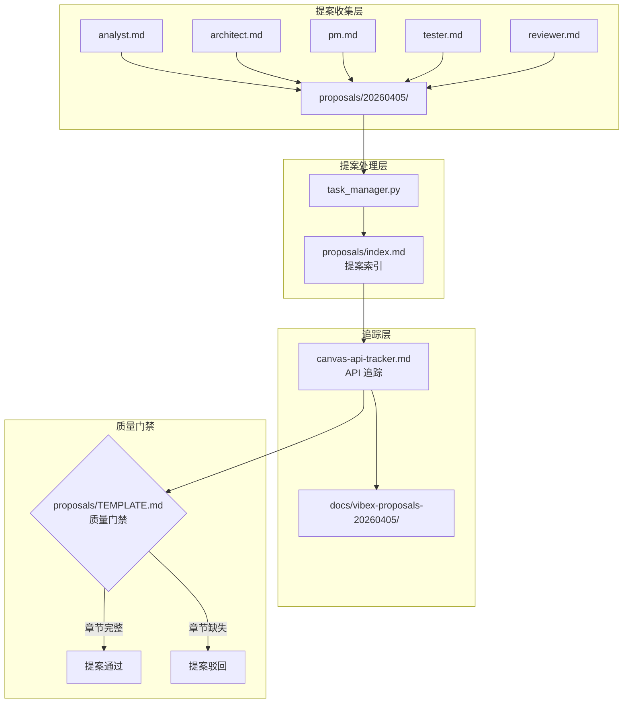
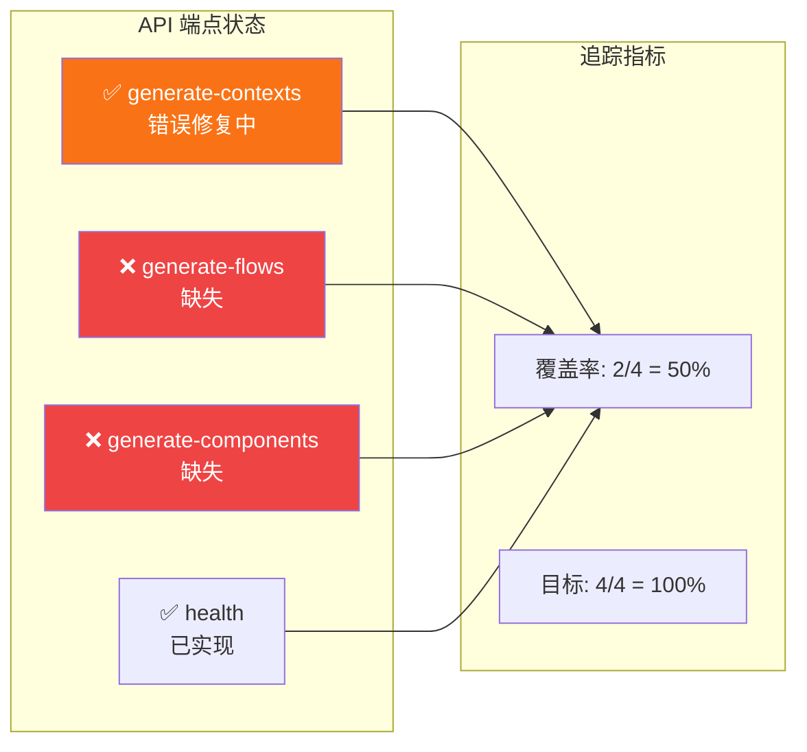

# Architecture — vibex-proposals-20260405-final

**项目**: vibex-proposals-20260405-final
**Architect**: Architect Agent
**日期**: 2026-04-05
**仓库**: /root/.openclaw/vibex

---

## 1. 执行摘要

今日提案最终轮（Round 3），聚焦流程改进和执行追踪，3 个 Epic 全部为文档/流程类轻量任务。

| Epic | 名称 | 工时 | 优先级 |
|------|------|------|--------|
| E1 | Canvas API 追踪机制 | 0.5h | P0 |
| E2 | Sprint 5 执行追踪 | 1h | P1 |
| E3 | 提案质量门禁 | 1h | P1 |

**总工时**: 2.5h

---

## 2. 系统架构图

### 2.1 提案流程架构



### 2.2 Canvas API 追踪状态



---

## 3. 技术方案

### 3.1 E1: Canvas API 追踪机制

```markdown
<!-- proposals/canvas-api-tracker.md -->
## Canvas API 追踪

| 端点 | 方法 | 状态 | 最后更新 | 负责人 |
|------|------|------|---------|---------|
| /api/v1/canvas/generate-contexts | POST | ✅ 错误修复中 | 2026-04-05 | dev |
| /api/v1/canvas/generate-flows | POST | ❌ 缺失 | 2026-04-05 | 待分配 |
| /api/v1/canvas/generate-components | POST | ❌ 缺失 | 2026-04-05 | 待分配 |
| /api/v1/canvas/health | GET | ✅ 已实现 | 2026-04-05 | dev |

**覆盖率**: 2/4 (50%)
**目标**: 4/4 (100%)
```

### 3.2 E2: Sprint 5 执行追踪

```markdown
<!-- proposals/index.md 更新 -->

## Sprint 5 执行追踪 (2026-04-05)

| Epic | 提案 | 状态 | 派发时间 | 完成时间 |
|------|------|------|---------|---------|
| vibex-proposals-20260405 | A-P0-1 Schema一致性 | ✅ done | 2026-04-05 | - |
| vibex-proposals-20260405 | A-P0-2 SSR-Safe规范 | ✅ done | 2026-04-05 | - |
| vibex-proposals-20260405 | A-P1-1 API追踪机制 | 🔄 ready | - | - |
| vibex-proposals-20260405 | A-P1-2 Mock边界可视化 | 🔄 ready | - | - |
| canvas-api-500-fix | E1 错误处理 | ✅ done | 2026-04-04 | 2026-04-05 |
| react-hydration-fix | E1 P0修复 | ✅ done | 2026-04-04 | 2026-04-04 |
```

### 3.3 E3: 提案质量门禁

```python
# proposals/quality_gate.py
REQUIRED_SECTIONS = [
    '问题描述',
    '根因分析',
    '影响范围',
    '建议方案',
    '验收标准',
]

def validate_proposal(file_path: str) -> tuple[bool, list[str]]:
    """检查提案是否包含所有强制章节"""
    with open(file_path) as f:
        content = f.read()
    missing = [s for s in REQUIRED_SECTIONS if s not in content]
    return (len(missing) == 0, missing)
```

---

## 4. 接口定义

### 4.1 proposals/index.md 格式

```markdown
## 提案索引格式

| 列 | 内容 |
|----|------|
| Epic | 提案名称 |
| 提案 | 提案ID（如 A-P0-1） |
| 状态 | 🔄 ready / 🔧 in-progress / ✅ done / ❌ rejected |
| 派发时间 | YYYY-MM-DD HH:MM |
| 完成时间 | YYYY-MM-DD HH:MM 或 "-" |
```

---

## 5. 测试策略

| Epic | 测试方式 | 验收 |
|------|---------|------|
| E1 | 静态检查 | `canvas-api-tracker.md` 存在且格式正确 |
| E2 | 内容检查 | `index.md` 包含今天 6 条提案 |
| E3 | pytest | `quality_gate.py` 对缺失章节正确报错 |

---

## 6. 性能影响评估

无性能影响（纯文档任务）。

---

*本文档由 Architect Agent 生成于 2026-04-05 03:30 GMT+8*
