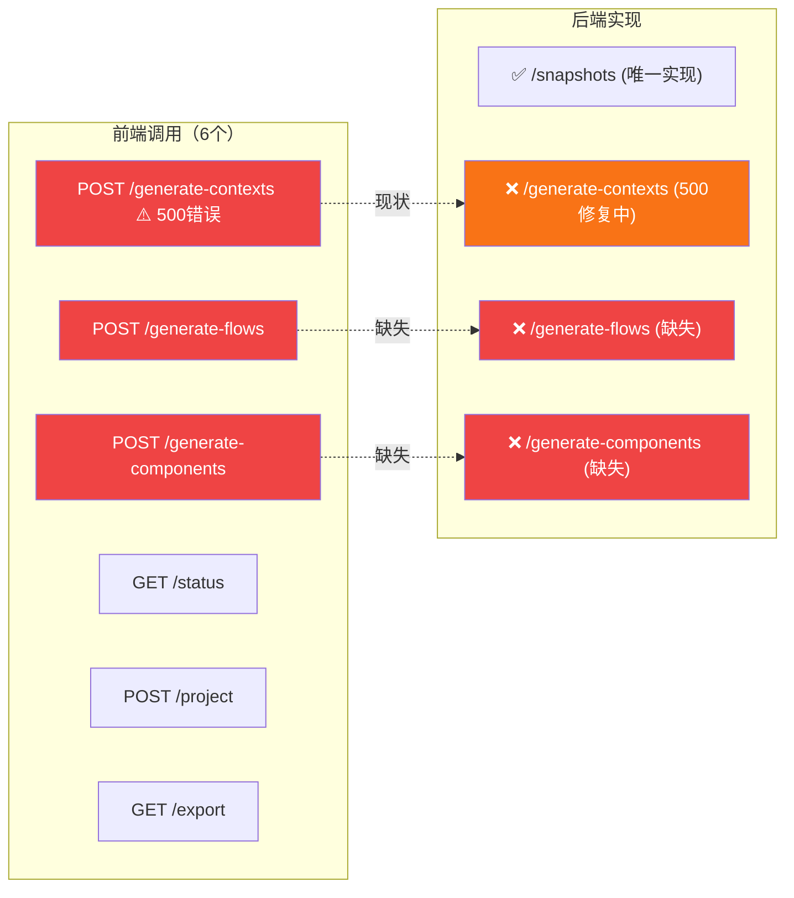
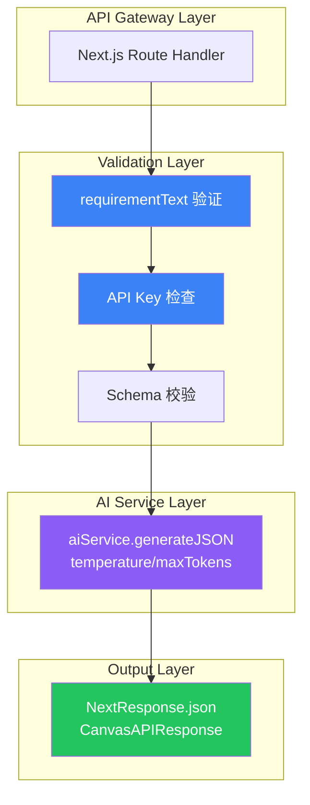
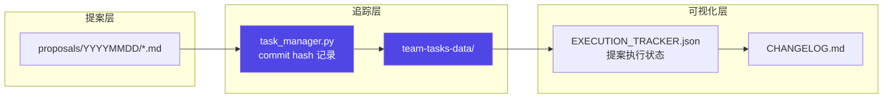

# Architecture — vibex-proposals-20260405

**项目**: vibex-proposals-20260405
**Architect**: Architect Agent
**日期**: 2026-04-05
**仓库**: /root/.openclaw/vibex

---

## 1. 执行摘要

本项目基于 2026-04-05 每日提案收集，覆盖 4 个 Epic，重点解决 Canvas API 端点缺失和提案执行追踪机制。

| Epic | 名称 | 工时 | 优先级 |
|------|------|------|--------|
| E1 | Canvas API 端点完整实现 | 12-18h | P0 |
| E2 | Sprint 提案执行追踪 | 2h | P0 |
| E3 | Canvas UX 增强 | 3h | P1 |
| E4 | 虚假完成检测自动化 | 3h | P0 |

**总工时**: 20-26h（3-4 Sprint 天）

---

## 2. 系统架构图

### 2.1 Canvas API 端点覆盖度



### 2.2 Canvas API 端点实现架构



### 2.3 提案执行追踪架构



---

## 3. 技术方案

### 3.1 E1: Canvas API 端点实现

#### 统一响应格式

```typescript
// 所有 Canvas API 使用统一响应结构
interface CanvasAPIResponse<T> {
  success: boolean;
  data?: T;
  error?: string;
  generationId?: string;
}

// 使用示例
return NextResponse.json(
  { success: false, data: [], error: 'requirementText 不能为空' },
  { status: 400 }
);
```

#### generate-flows 端点实现

```typescript
// src/app/api/v1/canvas/generate-flows/route.ts
export async function POST(request: NextRequest): Promise<NextResponse> {
  try {
    const body = await request.json().catch(() => null);
    if (!body || typeof body.requirementText !== 'string' || !body.requirementText.trim()) {
      return NextResponse.json(
        { success: false, data: [], error: 'requirementText 不能为空' },
        { status: 400 }
      );
    }
    if (!process.env.MINIMAX_API_KEY) {
      return NextResponse.json(
        { success: false, data: [], error: 'AI 服务未配置' },
        { status: 500 }
      );
    }
    const result = await aiService
      .generateJSON<FlowNode[]>(prompt, flowSchema, { temperature: 0.3, maxTokens: 3072 })
      .catch(err => ({ success: false, error: err.message, data: null }));
    if (!result.success) {
      return NextResponse.json(
        { success: false, data: [], error: result.error },
        { status: 500 }
      );
    }
    return NextResponse.json({ success: true, data: result.data });
  } catch (err) {
    return NextResponse.json(
      { success: false, data: [], error: '服务器内部错误' },
      { status: 500 }
    );
  }
}
```

### 3.2 E2: 提案执行追踪

```python
# task_manager.py 扩展：提案追踪字段
interface ProposalTracking:
    proposal_id: str          # P001, P002, ...
    epic: str                 # E1, E2, ...
    stage: str               # design-architecture, impl, ...
    agent: str
    status: str             # pending | ready | in-progress | done | rejected
    startedAt: str           # ISO timestamp
    completedAt: str        # ISO timestamp
    commit: str              # SHA-1 hash（E1 已在实施）
    linked_proposals: list[str]  # 相关提案（如 P001 依赖 A-P0-1）
```

### 3.3 E4: 虚假完成检测

```python
# task_manager.py 新增检测逻辑
def validate_task_completion(project: str, stage: str, info: dict) -> bool:
    """
    检测任务是否虚假完成
    返回 True = 真实完成，False = 虚假完成
    """
    repo = os.environ.get('GIT_REPO', '/root/.openclaw')
    commit = subprocess.check_output(
        ['git', 'rev-parse', 'HEAD'], cwd=repo
    ).decode().strip()

    # 检查1: 有新 commit
    if info.get('commit') == commit:
        return False  # 虚假完成：commit 未变

    # 检查2: Dev 任务有测试文件变更
    if 'dev' in stage:
        diff = subprocess.check_output(
            ['git', 'diff', '--name-only', 'HEAD~1'], cwd=repo
        ).decode()
        test_files = [f for f in diff.split('\n') if '.test.' in f]
        if not test_files:
            return False  # 虚假完成：Dev 任务无测试文件

    return True
```

---

## 4. 接口定义

### 4.1 Canvas API 统一响应

```typescript
// 200 成功
{ "success": true, "data": [...], "generationId": "xxx", "error": null }

// 400 参数错误
{ "success": false, "data": [], "generationId": "", "error": "requirementText 不能为空" }

// 500 服务器错误
{ "success": false, "data": [], "generationId": "", "error": "AI 服务错误" }
```

### 4.2 健康检查端点

```typescript
// GET /api/v1/canvas/health
interface HealthResponse {
  status: 'healthy' | 'degraded';
  endpoints: Record<string, { implemented: boolean; lastError?: string }>;
  timestamp: string;
}
```

---

## 5. 测试策略

| Epic | 测试方式 | 覆盖率目标 |
|------|---------|-----------|
| E1 | API 单元测试（Vitest） | > 80% |
| E2 | 追踪数据验证 | 手动检查 |
| E3 | Playwright E2E | > 70% |
| E4 | pytest 集成测试 | > 80% |

---

## 6. 性能影响评估

| Epic | 性能影响 |
|------|---------|
| E1 | 无负面影响（API 响应本身需要时间） |
| E2 | task_manager 延迟 < 100ms |
| E3 | 无负面影响（UX 增强） |
| E4 | git diff 检查 < 50ms |

---

*本文档由 Architect Agent 生成于 2026-04-05 00:15 GMT+8*
