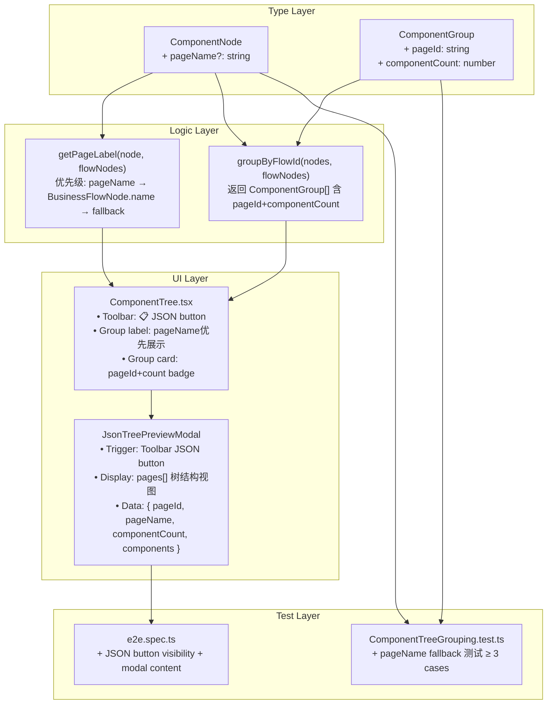

# Architecture: 组件树页面结构增强

**Project**: vibex-proposals-20260411-page-structure
**Stage**: design-architecture
**Architect**: Architect
**Date**: 2026-04-07
**Status**: Proposed

---

## 1. Executive Summary

在现有组件树单维度(flowId)分组基础上，引入 `pageName` 可选字段支持用户覆盖默认页面展示名称，并在组件树顶部增加「📋 JSON」按钮展示组件树整体 JSON 结构视图。核心改动集中于 `types.ts` 类型扩展 + `ComponentTree.tsx` 分组逻辑增强 + 新增 `JsonTreePreviewModal` 弹窗组件。

---

## 2. Tech Stack

| 技术 | 版本 | 选型理由 |
|------|------|----------|
| TypeScript | strict mode | 必须保持零 TS 错误，增量修改 |
| Vitest | latest | 现有单元测试框架，已有 `ComponentTreeGrouping.test.ts` |
| Playwright | latest | 现有 E2E 框架，已有 `e2e.spec.ts` |
| React 19 | existing | 无变更，继续使用 |
| @json-render/core | existing | 已有集成，复用 JSON 渲染能力 |
| Zustand | existing | 现有状态管理，无变更需求 |

---

## 3. Architecture Diagram



---

## 4. Data Model

### 4.1 Type Extensions

**`ComponentNode` 新增字段** (`types.ts`):

```typescript
export interface ComponentNode {
  // ... existing fields
  /** E1-F1: 可选页面名称，允许用户覆盖 BusinessFlowNode.name */
  pageName?: string;
}
```

**`ComponentGroup` 新增字段** (`ComponentTree.tsx`):

```typescript
export interface ComponentGroup {
  groupId: string;
  label: string;
  color: string;
  nodes: ComponentNode[];
  isCommon?: boolean;
  /** E1-F2: 页面 ID（从 groupId 提取）*/
  pageId: string;
  /** E1-F2: 组件数量 */
  componentCount: number;
}
```

### 4.2 JSON Preview Data Structure

```typescript
interface PageSection {
  pageId: string;
  pageName: string;
  componentCount: number;
  isCommon: boolean;
  components: Array<{
    nodeId: string;
    name: string;
    type: ComponentType;
    flowId: string;
    status: NodeStatus;
    previewUrl?: string;
  }>;
}

interface ComponentTreeJson {
  pages: PageSection[];
  totalComponents: number;
  generatedAt: string; // ISO timestamp
}
```

---

## 5. Module Design

### 5.1 Module 1: Type Extensions

**文件**: `vibex-fronted/src/lib/canvas/types.ts`

| 修改 | 说明 |
|------|------|
| `ComponentNode.pageName?: string` | 可选字段，允许覆盖 BusinessFlowNode.name |

### 5.2 Module 2: Logic Utilities

**文件**: `vibex-fronted/src/components/canvas/ComponentTree.tsx`

| 函数 | 修改 |
|------|------|
| `getPageLabel(node, flowNodes)` | 增加 `pageName` 优先逻辑：node.pageName → BusinessFlowNode.name → fallback |
| `groupByFlowId(nodes, flowNodes)` | ComponentGroup 增加 `pageId` + `componentCount` 字段 |
| `ComponentGroup` 接口 | 增加 `pageId: string` + `componentCount: number` |

### 5.3 Module 3: UI Components

#### 5.3.1 JSON Toolbar Button

**文件**: `ComponentTree.tsx` 内新增工具栏按钮

```tsx
// 在 contextTreeControls 中添加
<button
  type="button"
  className={styles.secondaryButton}
  onClick={() => setShowJsonPreview(true)}
  aria-label="JSON 树视图"
  data-testid="json-preview-button"
>
  📋 JSON
</button>
```

#### 5.3.2 JsonTreePreviewModal

**新文件**: `vibex-fronted/src/components/canvas/json-tree/JsonTreePreviewModal.tsx`

| 职责 | 说明 |
|------|------|
| 触发器 | Toolbar 「📋 JSON」按钮 |
| 数据转换 | `componentNodes` → `ComponentTreeJson` |
| 展示 | 全屏弹窗，JSON 树结构（可折叠/展开） |
| 复用 | `JsonRenderPreview` 组件已有 JSON 渲染能力 |

**Props**:

```typescript
interface JsonTreePreviewModalProps {
  isOpen: boolean;
  onClose: () => void;
  componentNodes: ComponentNode[];
  flowNodes: BusinessFlowNode[];
}
```

### 5.4 Module 4: Tests

#### 5.4.1 Unit Tests

**文件**: `vibex-fronted/src/__tests__/canvas/ComponentTreeGrouping.test.ts`

新增测试用例：

```typescript
describe('getPageLabel pageName fallback', () => {
  test('pageName 存在 → 返回 pageName', () => {
    const node = makeNode({ pageName: '自定义页面名' });
    expect(getPageLabel(node.flowId, flowNodes, node.pageName)).toBe('自定义页面名');
  });
  test('pageName 不存在 → fallback 到 BusinessFlowNode.name', () => {
    const node = makeNode({ pageName: undefined });
    expect(getPageLabel(node.flowId, flowNodes, node.pageName)).toBe('📄 订单流程');
  });
  test('pageName + 无 flowId 匹配 → pageName 优先', () => {
    const node = makeNode({ flowId: 'unknown', pageName: '自定义' });
    expect(getPageLabel(node.flowId, flowNodes, node.pageName)).toBe('自定义');
  });
});

describe('groupByFlowId componentCount', () => {
  test('ComponentGroup 包含 componentCount', () => {
    const groups = groupByFlowId(nodes, flowNodes);
    groups.forEach(g => {
      expect(g).toHaveProperty('pageId');
      expect(g).toHaveProperty('componentCount');
      expect(g.componentCount).toBe(g.nodes.length);
    });
  });
});
```

#### 5.4.2 E2E Tests

**文件**: `vibex-fronted/tests/e2e/component-tree.spec.ts`

```typescript
test('JSON 预览按钮可见且功能正确', async ({ page }) => {
  await page.goto('/canvas');
  // 等待组件树渲染
  await page.waitForSelector('[data-testid="component-tree"]');
  
  // AC6: JSON 按钮可见
  const jsonButton = page.getByTestId('json-preview-button');
  await expect(jsonButton).toBeVisible();
  
  // AC7: 点击后弹窗显示
  await jsonButton.click();
  const modal = page.getByTestId('json-preview-modal');
  await expect(modal).toBeVisible();
  
  // AC8: JSON 数据结构正确
  await expect(page.getByText(/pageId/)).toBeVisible();
  await expect(page.getByText(/pageName/)).toBeVisible();
});
```

---

## 6. API Definitions

> **注**: 本次改动无后端 API 变更，纯前端增量修改。

### 6.1 Internal Data Flow

```
componentStore.componentNodes (Zustand)
    ↓
groupByFlowId() → ComponentGroup[] (with pageId + componentCount)
    ↓
getPageLabel() → pageName优先显示
    ↓
ComponentTree UI render
    ↓
JsonTreePreviewModal → ComponentTreeJson → JSON tree render
```

---

## 7. Performance Impact

| 指标 | 当前值 | 预估增量 | 目标值 | 风险 |
|------|--------|----------|--------|------|
| 组件树加载时间 | ≤ 500ms | +5ms (group 计算) | ≤ 500ms | 低 |
| JSON 弹窗首次打开 | N/A | +20ms (数据转换) | ≤ 50ms | 低 |
| 内存占用 | baseline | +0.1KB (pageName 字段) | 无感知 | 无 |
| TypeScript 编译 | 0 errors | 0 新增 errors | 0 errors | 无 |

**评估**: 改动影响极小，属增量优化而非重构。

---

## 8. Risk Assessment

| # | 风险 | 概率 | 影响 | 缓解措施 |
|---|------|------|------|----------|
| R1 | pageName 与 BusinessFlowNode.name 不同步导致用户困惑 | 低 | 低 | pageName 为可选字段，默认行为不变 |
| R2 | JSON 预览数据结构与现有 catalog 不兼容 | 低 | 低 | JSON 预览是独立视图，不依赖 catalog |
| R3 | TypeScript 严格模式导致新字段类型错误 | 低 | 低 | 字段为可选(`?`)，向后兼容 |
| R4 | 通用组件组 pageId='__common__' 与现有分组逻辑冲突 | 极低 | 低 | 已在 `COMMON_FLOW_IDS` 中处理 |

---

## 9. Testing Strategy

### 9.1 Test Framework

| 层级 | 框架 | 覆盖率目标 |
|------|------|------------|
| 单元测试 | Vitest | `getPageLabel` + `groupByFlowId` ≥ 90% |
| E2E 测试 | Playwright | JSON 预览功能 100% pass |

### 9.2 Core Test Cases

| ID | 测试场景 | 预期结果 |
|----|----------|----------|
| TC1 | pageName 存在时 getPageLabel | 返回 pageName |
| TC2 | pageName 不存在时 getPageLabel | fallback 到 BusinessFlowNode.name |
| TC3 | pageName + 无 flowId 匹配 | pageName 优先 |
| TC4 | ComponentGroup 包含 pageId | 从 groupId 提取正确 |
| TC5 | ComponentGroup 包含 componentCount | 等于 nodes.length |
| TC6 | 通用组件组 pageId='__common__' | pageId 正确 |
| TC7 | JSON 按钮可见 | 工具栏可见 |
| TC8 | JSON 弹窗数据结构 | 包含 pageId + pageName + componentCount + components |

---

## 10. Implementation Phases

| Phase | 内容 | 工时 | 输出文件 |
|-------|------|------|----------|
| Phase 1 | 类型定义增强 | 0.5h | `types.ts` |
| Phase 2 | 分组逻辑增强 | 1.0h | `ComponentTree.tsx` |
| Phase 3 | JSON 预览弹窗 | 0.5h | `JsonTreePreviewModal.tsx` |
| Phase 4 | 测试覆盖 | 0.5h | `*.test.ts` + E2E |
| **Total** | | **2.5h** | |

> 注: Phase 2 含 `getPageLabel` 逻辑修改 + `ComponentGroup` 接口扩展。

---

## 11. File Changes Summary

| 操作 | 文件路径 | 说明 |
|------|----------|------|
| 修改 | `vibex-fronted/src/lib/canvas/types.ts` | ComponentNode 增加 pageName 字段 |
| 修改 | `vibex-fronted/src/components/canvas/ComponentTree.tsx` | pageName fallback + ComponentGroup 扩展 + JSON 按钮 |
| 新增 | `vibex-fronted/src/components/canvas/json-tree/JsonTreePreviewModal.tsx` | JSON 预览弹窗组件 |
| 修改 | `vibex-fronted/src/__tests__/canvas/ComponentTreeGrouping.test.ts` | pageName fallback + componentCount 测试用例 |
| 新增 | `vibex-fronted/tests/e2e/component-tree-json.spec.ts` | JSON 预览 E2E 测试 |

---

## 执行决策

- **决策**: 已采纳
- **执行项目**: vibex-proposals-20260411-page-structure
- **执行日期**: 2026-04-07

