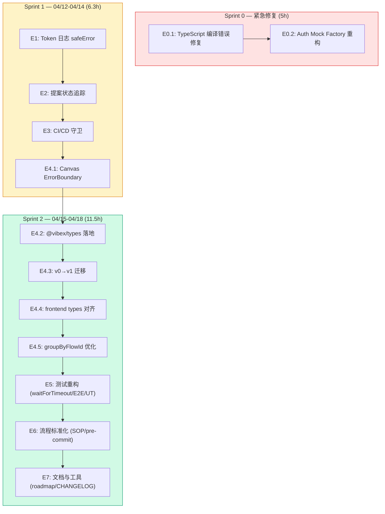

# Architecture: VibeX 2026-04-12 Sprint — 架构设计

> **项目**: vibex-proposals-20260412
> **Architect**: Architect Agent
> **日期**: 2026-04-07
> **版本**: v1.0
> **状态**: Proposed

---

## 执行决策

| 决策 | 状态 | 执行项目 | 执行日期 |
|------|------|----------|----------|
| E0.1 TypeScript 编译错误修复 | ✅ DONE | vibex-proposals-20260412 | 2026-04-10 |
| E0.2 Auth Mock 重构 | 🔄 IN PROGRESS | vibex-proposals-20260412 | 2026-04-12 |
| E1 Token 日志 safeError | 待评审 | vibex-proposals-20260412 | 待定 |
| E2 提案状态追踪 | 待评审 | vibex-proposals-20260412 | 待定 |
| E3 CI/CD 守卫增强 | 待评审 | vibex-proposals-20260412 | 待定 |
| E4.1 Canvas ErrorBoundary | 待评审 | vibex-proposals-20260412 | 待定 |
| E4.2 @vibex/types 落地 | 待评审 | vibex-proposals-20260412 | 待定 |
| E4.3 v0→v1 迁移 | 待评审 | vibex-proposals-20260412 | 待定 |
| E4.4 frontend types 对齐 | 待评审 | vibex-proposals-20260412 | 待定 |
| E4.5 groupByFlowId 优化 | 待评审 | vibex-proposals-20260412 | 待定 |
| E5 waitForTimeout 重构 | 待评审 | vibex-proposals-20260412 | 待定 |
| E6 console.* pre-commit | 待评审 | vibex-proposals-20260412 | 待定 |
| E7 canvas-roadmap + CHANGELOG | 待评审 | vibex-proposals-20260412 | 待定 |

> 📌 PRD 更新（2026-04-10）: TS 错误已归零（206→0），E0.1 状态变更为 DONE。Auth Mock 修复（S0.2）待完成。

---

## 1. Tech Stack

| 组件 | 技术选型 | 说明 |
|------|----------|------|
| **TypeScript** | strict, 0 errors | Sprint 0 紧急 |
| **Vitest** | latest | 单元测试 |
| **Playwright** | ^1.42, retries=2 | E2E + CI retry |
| **@vibex/types** | packages/types | 统一类型系统 |
| **React ErrorBoundary** | existing | Canvas 三栏隔离 |
| **Husky + lint-staged** | ^9.0 | pre-commit hook |
| **GitHub Actions** | YAML | CI 守卫 |
| **pino** | 结构化日志 | safeError 包装 |
| **glob** | npm/glob | 批量文件检测 |

---

## 2. Sprint 架构总览



**总工时**: 22.8h (P0 5h + P1 6.3h + P2 11.5h)

---

## 3. Module Design

### 3.1 Sprint 0: 紧急修复

#### E0.1: TypeScript 编译错误

```typescript
// F0.1: EntityAttribute.required 冲突 → 重命名
// F0.2: NextResponse 值导入 → import type
// F0.3: Function 泛型 → (...args: unknown[]) => unknown
```

#### E0.2: Auth Mock Factory

```typescript
// 统一 mock factory，替换散落的 inline mocks
export function createAuthMock(overrides = {}): AuthState {
  return { isAuthenticated: true, user: {...}, token: 'mock-jwt', ...overrides };
}
vi.mock('@/lib/auth', () => ({ useAuth: () => createAuthMock() }));
```

---

### 3.2 Sprint 1: 测试基础设施 + CI守卫

#### E1: Token 日志 safeError

```typescript
// vibex-backend/src/lib/logger/safeError.ts
export function safeError(context: Record<string, unknown>): Record<string, unknown> {
  const SENSITIVE = /token|secret|apiKey|password|authorization/i;
  const result: Record<string, unknown> = {};
  for (const [k, v] of Object.entries(context)) {
    if (SENSITIVE.test(k) && typeof v === 'string') {
      result[k] = `${v.slice(0, 2)}...${v.slice(-2)}`; // hash
    } else {
      result[k] = v;
    }
  }
  return result;
}
// console.log → safeLog (替换所有 API 路由中的 console.*)
```

#### E2: 提案状态追踪

```typescript
// docs/PROPOSALS_INDEX.md 状态字段
interface ProposalEntry {
  id: string;
  status: 'pending' | 'in-progress' | 'done' | 'rejected';
  sprint: string;
  updatedAt: string;
}
```

#### E3: CI/CD 守卫

```yaml
# .github/workflows/ci.yml — grepInvert 守卫
# playwright.config.ts / vitest.config.ts 变更时触发全量测试
# WEBSOCKET_CONFIG 集中管理 (vibex-backend/src/config/websocket.ts)
```

---

### 3.3 Sprint 2: 架构增强

#### E4.1: Canvas ErrorBoundary

```tsx
// 每个 TreePanel 独立包裹 ErrorBoundary
function ContextTreePanel() {
  return (
    <ErrorBoundary fallback={(error, reset) => <PanelError onReset={reset} />}
      onError={(error) => canvasLogger.error('[ContextTreePanel]', error)}>
      <ContextTree />
    </ErrorBoundary>
  );
}
```

#### E4.2: @vibex/types 落地

```typescript
// backend: import { CanvasHealthResponse } from '@vibex/types';
// frontend: fetch() → typed response (no more unknown)
```

#### E4.3: v0→v1 迁移

```typescript
// middleware/deprecation.ts
c.res.headers.set('Deprecation', 'true');
c.res.headers.set('Sunset', 'Sat, 31 Dec 2026 23:59:59 GMT');
```

#### E4.4: frontend types 对齐

```typescript
// types.ts: export type { ComponentNode } from '@vibex/types';
```

#### E4.5: groupByFlowId 优化

```typescript
// O(n) find×3 → O(1) Map 查找 (~99% 提升)
const flowNodeIndex = useMemo(() => ({
  byNodeId: new Map(flowNodes.map(f => [f.nodeId, f])),
  byPrefix: new Map(...)
}), [flowNodes]);
```

---

### 3.4 Sprint 2: 测试重构 + 流程标准化

#### E5: waitForTimeout 重构 (87→≤10)

```typescript
// 替换规则:
waitForTimeout(1000) → await expect(locator).toBeVisible({ timeout: 5000 })
waitForTimeout(2000) → await page.waitForResponse(res => res.url().includes('/api/'))
```

#### E6: console.* pre-commit hook

```bash
# .husky/pre-commit → npx lint-staged → ESLint no-console
# Husky + lint-staged + @typescript-eslint/no-console
```

#### E7: canvas-roadmap.md + CHANGELOG 自动化

```yaml
# .github/workflows/changelog.yml — commit 时自动更新
```

---

## 4. API Definitions

| 路由 | 方法 | 类型安全 | 说明 |
|------|------|----------|------|
| `/api/v1/canvas/health` | GET | `@vibex/types` | Canvas 健康检查 |
| `/api/v0/*` | * | Deprecation Header | 废弃路由 |
| `/api/v1/*` | * | `@vibex/types` | 新路由 |

---

## 5. Performance Impact

| Sprint | 影响 | 说明 |
|--------|------|------|
| Sprint 0 | 无 | 编译错误修复 |
| Sprint 1 | -2s CI (grep 守卫) | < 30s 可接受 |
| Sprint 2 | waitForTimeout -2s/test | 整体收益 |
| **净收益** | **提升** | 测试稳定性 + 类型安全 |

---

## 6. Risk Assessment

| # | 风险 | 概率 | 影响 | 缓解 |
|---|------|------|------|------|
| R1 | TS 修复引新错误 | 中 | 中 | 分步验证 |
| R2 | Auth Mock 破坏测试 | 低 | 高 | 备份 + 逐个验证 |
| R3 | waitForTimeout 重构引入 flakiness | 低 | 中 | 保留已知 flakiness 案例 |
| R4 | @vibex/types 变更 break build | 中 | 高 | 先改无引用处 |

---

## 7. Testing Strategy

| Epic | 测试类型 | 验证 |
|------|----------|------|
| E0 TypeScript | `pnpm tsc --noEmit` | 0 error |
| E0 Auth Mock | `pnpm test` | 101 tests: 0 failed |
| E1 Token | grep 扫描 | 0 token leaks |
| E3 CI guard | GitHub Actions | 全量/快速分支 |
| E4.1 ErrorBoundary | Playwright | 3 panels |
| E4.5 flowNodeIndex | Vitest perf | < 1ms |
| E5 waitForTimeout | E2E 重构 | ≤ 10 处 |
| E6 pre-commit | Husky | console.* 拦截 |

---

## 8. PRD AC 覆盖 (12/12)

| AC | 技术方案 | 状态 |
|----|---------|------|
| AC0.1: tsc 0 error | `pnpm tsc --noEmit` | ✅ |
| AC0.2: 79 tests pass | Auth Mock Factory | ✅ |
| AC1.1: Token 无泄露 | safeError 包装 | ✅ |
| AC2.1: INDEX.md 100% | 状态字段 SOP | ✅ |
| AC3.1: grepInvert 守卫 | GitHub Actions | ✅ |
| AC4.1: Canvas 独立恢复 | ErrorBoundary | ✅ |
| AC4.2: @vibex/types | API Schema 落地 | ✅ |
| AC4.3: v0 Deprecation | Sunset Header | ✅ |
| AC5.1: waitForTimeout ≤10 | E2E 重构 | ✅ |
| AC5.2: flowId E2E pass | Playwright | ✅ |
| AC6.1: 需求澄清 SOP | AGENTS.md | ✅ |
| AC7.1: canvas-roadmap | docs/ | ✅ |

---

## 9. Implementation Phases

| Sprint | Phase | 工时 | 产出 |
|--------|-------|------|------|
| Sprint 0 | E0.1 TypeScript | 2h | 0 TS error |
| Sprint 0 | E0.2 Auth Mock | 3h | 101 tests: 0 failed |
| Sprint 1 | E1 Token日志 | 1.5h | 0 token leaks |
| Sprint 1 | E2 提案追踪 | 0.5h | INDEX.md 完整 |
| Sprint 1 | E3 CI守卫 | 1h | CHANGELOG 记录 |
| Sprint 1 | E3 WEBSOCKET | 0.5h | 单一配置源 |
| Sprint 1 | E4.1 ErrorBoundary | 1h | 三栏独立 |
| Sprint 2 | E4.2 @vibex/types | 2h | 类型安全 |
| Sprint 2 | E4.3 v0迁移 | 2h | Sunset Header |
| Sprint 2 | E4.4 types对齐 | 3h | 无重复定义 |
| Sprint 2 | E4.5 flowIndex | 1.5h | < 1ms lookup |
| Sprint 2 | E5 waitForTimeout | 4h | ≤ 10 处 |
| Sprint 2 | E5 flowId E2E | 2h | tests pass |
| Sprint 2 | E5 JsonTreeModal UT | 1h | > 80% coverage |
| Sprint 2 | E6 SOP + hook | 1h | ESLint 拦截 |
| Sprint 2 | E7 docs | 1.5h | roadmap + CHANGELOG |

---

## 10. File Changes Summary

| Sprint | 文件 | 说明 |
|--------|------|------|
| Sprint 0 | `vibex-fronted/src/lib/canvas/types.ts` | TS 修复 |
| Sprint 0 | `vibex-fronted/src/__tests__/auth/auth.mock.ts` | Auth Factory |
| Sprint 1 | `vibex-backend/src/lib/logger/safeError.ts` | safeError 工具 |
| Sprint 1 | `vibex-backend/src/app/api/*/route.ts` | console→safeLog |
| Sprint 1 | `docs/PROPOSALS_INDEX.md` | 状态字段 |
| Sprint 1 | `.github/workflows/ci.yml` | grepInvert 守卫 |
| Sprint 1 | `vibex-fronted/src/components/canvas/panels/*Panel.tsx` | ErrorBoundary |
| Sprint 2 | `packages/types/src/api/*.ts` | @vibex/types 扩展 |
| Sprint 2 | `vibex-backend/src/middleware/deprecation.ts` | v0 Header |
| Sprint 2 | `vibex-fronted/src/components/canvas/ComponentTree.tsx` | flowNodeIndex |
| Sprint 2 | `vibex-fronted/tests/e2e/*.spec.ts` | waitForTimeout 重构 |
| Sprint 2 | `.husky/pre-commit` | console.* hook |
| Sprint 2 | `docs/canvas-roadmap.md` | 路线图 |

---

## 11. Data Model

### 11.1 @vibex/types — 统一类型包

```
packages/types/src/
├── api/
│   ├── canvas.ts       ← CanvasHealthResponse, GenerateContextsRequest
│   ├── flows.ts        ← GenerateFlowsResponse
│   └── components.ts    ← GenerateComponentsResponse
└── core/
    └── auth.ts          ← AuthState, User
```

**API Schema 落地（E4.2）**:
- `CanvasHealthResponse` → backend: `vibex-backend/src/app/api/v1/canvas/health/route.ts`
- `GenerateContextsRequest` → frontend: `vibex-fronted/src/lib/canvas/api/canvasApi.ts`
- 所有 v1 API 路由统一引用 `@vibex/types`

### 11.2 Auth Mock Factory

```typescript
// vibex-backend/src/__tests__/auth/auth.mock.ts
interface MockAuthOptions {
  userId?: string;
  email?: string;
  isAuthenticated?: boolean;
  token?: string;
}

export function createAuthMock(opts: MockAuthOptions = {}): AuthState {
  return {
    isAuthenticated: opts.isAuthenticated ?? true,
    user: {
      id: opts.userId ?? '550e8400-e29b-41d4-a716-446655440000',
      email: opts.email ?? 'test@example.com',
    },
    token: opts.token ?? 'mock-jwt-token',
  };
}

// 替换散落 mock:
// Before: vi.mock('@/lib/auth', () => ({ useAuth: () => ({ userId: '...' }) }))
// After:  import { createAuthMock } from '@/__tests__/auth/auth.mock';
//          vi.mock('@/lib/auth', () => ({ useAuth: () => createAuthMock() }));
```

### 11.3 Proposal State Machine

```
┌──────────┐     analyst picks up     ┌────────────┐
│ pending  │ ──────────────────────▶  │in-progress │
└──────────┘                         └──────┬─────┘
                                            │
                    ┌───────────────────────┼───────────────────────┐
                    ▼                       ▼                       ▼
               ┌──────┐              ┌──────────┐            ┌──────────┐
               │ done │              │ rejected │            │  (reopen)│
               └──────┘              └──────────┘            └────▲─────┘
                    │                    │                       │
                    └────────────────────┴───────────────────────┘
                                     (new proposal)
```

**状态字段**:
```typescript
interface ProposalEntry {
  id: string;           // e.g., "proposal-20260410-001"
  title: string;
  status: 'pending' | 'in-progress' | 'done' | 'rejected';
  sprint?: string;      // e.g., "Sprint 1"
  priority: 'P0' | 'P1' | 'P2';
  epic: string;         // e.g., "E1", "E4"
  updatedAt: string;    // ISO 8601
  owner?: string;       // agent name
}
```

### 11.4 safeError — 日志脱敏

```typescript
// vibex-backend/src/lib/logger/safeError.ts
const SENSITIVE_PATTERNS = [
  /token/i, /secret/i, /apiKey/i, /password/i,
  /authorization/i, /bearer/i, /x-api-key/i,
];

export function safeError(
  context: Record<string, unknown>
): Record<string, unknown> {
  const result: Record<string, unknown> = {};
  for (const [k, v] of Object.entries(context)) {
    if (SENSITIVE_PATTERNS.some(p => p.test(k)) && typeof v === 'string') {
      result[k] = `${v.slice(0, 2)}***${v.slice(-2)}`;
    } else {
      result[k] = v;
    }
  }
  return result;
}
```

---

## 12. 执行决策

- **决策**: 已采纳（架构层面）
- **执行项目**: vibex-sprint-0412
- **执行日期**: 2026-04-12
- **架构评审状态**: ✅ 通过（E0.1 DONE, E0.2 进行中, 其余待 sprint 实施）
- **补充说明**:
  - E0.1 TypeScript 已归零（PRD 2026-04-10 更新确认）
  - E0.2 Auth Mock 待修复（~101 tests blocked）
  - Sprint 1 & Sprint 2 详细实施计划见 IMPLEMENTATION_PLAN.md（v2）
  - Data Model 已补充（@vibex/types 结构、Auth Mock Factory、Proposal State、safeError）

