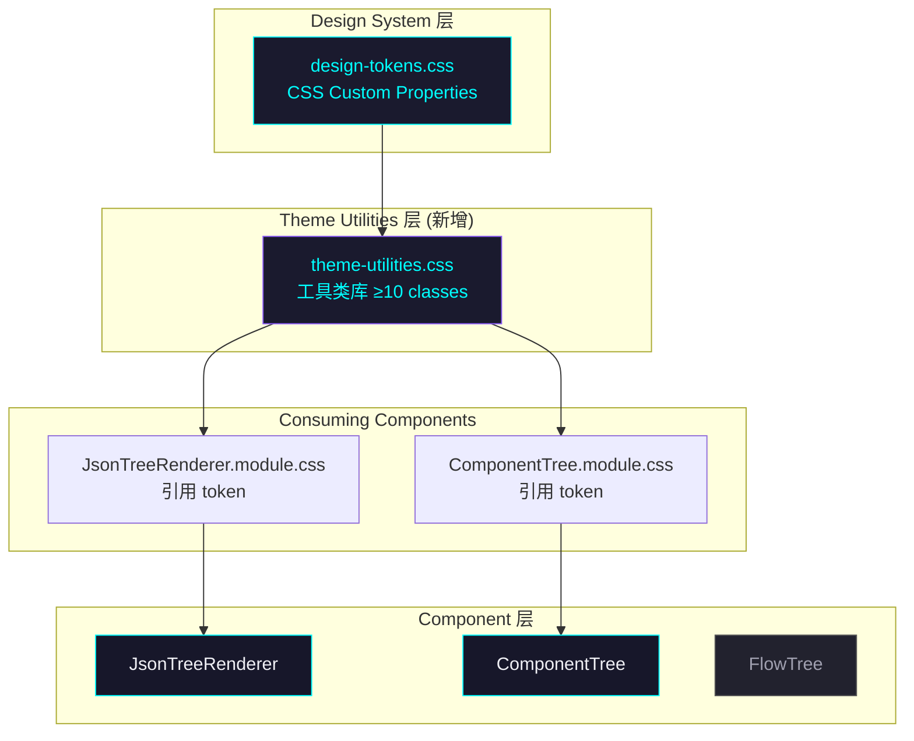

# Architecture: VibeX Sprint 2026-04-13

**Agent**: architect
**Date**: 2026-04-10
**Project**: vibex-proposals-20260413
**Status**: Proposed

---

## 1. Overview

本次 Sprint 包含两个 Epic：

| Epic | 目标 | 改动类型 |
|------|------|----------|
| **P001** | JsonTreeRenderer 风格适配 VibeX Design Tokens | CSS 变量化 |
| **P002** | 自定义组件统一主题层 | 架构层（新建 theme-utilities.css） |

两者共同解决：`JsonTreeRenderer` 及未来所有组件的视觉风格与 VibeX Design System 对齐问题。

---

## 2. Tech Stack

| 层级 | 技术选型 | 理由 |
|------|----------|------|
| **样式基础** | `design-tokens.css` 已有 CSS 变量体系 | 避免重复建设，直接复用 |
| **样式复用** | `theme-utilities.css`（纯 CSS 类库） | 零 JS 依赖，渐进迁移，兼容现有 CSS Modules |
| **组件样式** | CSS Modules（已有）+ 工具类（新增） | 不推翻现有架构，改动最小化 |
| **构建工具** | Next.js + Turbopack（已有） | 无变更 |

> **决策**：不引入 Tailwind CSS、styled-components 或 vanilla-extract。理由：与现有 CSS Modules 技术栈一致，工期为 1 天，短期 Sprint 不适合引入新范式。

---

## 3. Architecture Diagram



---

## 4. File Structure

```
vibex-fronted/src/
├── styles/
│   ├── design-tokens.css          # 已有：CSS 变量定义
│   ├── theme-utilities.css        # 新增：工具类库（Epic P002）
│   └── ...
└── components/
    └── visualization/
        └── JsonTreeRenderer/
            ├── JsonTreeRenderer.tsx            # 无改动（仅 CSS 引用）
            └── JsonTreeRenderer.module.css    # 改造：硬编码 hex → CSS 变量
```

---

## 5. P001: JsonTreeRenderer 风格适配

### 5.1 改动范围

**文件**：`src/components/visualization/JsonTreeRenderer/JsonTreeRenderer.module.css`

### 5.2 CSS 变量映射表

| 原有样式 | 当前值 | 目标值 |
|----------|--------|--------|
| `.renderer` 背景 | `#fafafa` | `var(--color-bg-glass)` |
| `.toolbar` 背景 | `#f3f4f6` | `var(--color-bg-elevated)` |
| `.toolbar` 边框 | `#e5e7eb` | `var(--color-border)` |
| `.toolbarBtn` 边框 | `#d1d5db` | `var(--color-border)` |
| `.toolbarBtn` 背景 | `white` | `var(--color-bg-secondary)` |
| `.searchBar` 背景 | `white` | `var(--color-bg-secondary)` |
| `.searchBar` 边框 | `#d1d5db` | `var(--color-border)` |
| `.searchInput` 边框 | `#d1d5db` | `var(--color-border)` |
| `.searchInput:focus` | `#3b82f6` | `var(--color-primary)` |
| `.row:hover` 背景 | `#f3f4f6` | `var(--color-bg-tertiary)` |
| `.rowSelected` 背景 | `#dbeafe` | `var(--color-primary-muted)` |
| `.rowMatch` 背景 | `#fef9c3` | `var(--color-accent-muted)` |
| `.toggle` 颜色 | `#6b7280` | `var(--color-text-secondary)` |
| `.toggleOpen` 颜色 | `#3b82f6` | `var(--color-primary)` |
| `.key` 颜色 | `#1f2937` | `var(--color-primary)` |
| `.colon` 颜色 | `#6b7280` | `var(--color-text-secondary)` |
| `.summary` 颜色 | `#9ca3af` | `var(--color-text-muted)` |
| `.string` 颜色 | `#059669` | `var(--color-green)` |
| `.number` 颜色 | `#2563eb` | `var(--color-accent)` |
| `.boolean` 颜色 | `#7c3aed` | `var(--color-pink)` |
| `.null` 颜色 | `#9ca3af` | `var(--color-text-muted)` |
| `.bracket` 颜色 | `#6b7280` | `var(--color-text-secondary)` |
| `.highlight` 背景 | `#fde047` | `var(--color-accent-muted)` |
| `.highlight` 文字 | `#1f2937` | `var(--color-accent)` |
| `.empty` 背景 | `#fafafa` | `var(--color-bg-glass)` |
| `.emptyText` 颜色 | `#374151` | `var(--color-text-primary)` |
| `.emptyHint` 颜色 | `#9ca3af` | `var(--color-text-secondary)` |

> **性能注意**：`backdrop-filter: blur()` 在低端设备上可能影响滚动帧率。评估结论：JsonTreeRenderer 用于 Canvas 内嵌预览，频率低，视觉优先。

### 5.3 API 定义

无 JS 接口变更，仅 CSS class 重映射。Props 接口保持不变：

```typescript
// JsonTreeRenderer.tsx — 接口不变
export interface JsonTreeRendererProps {
  data: unknown;
  defaultExpandedDepth?: number;
  maxDepth?: number;
  showSearch?: boolean;
  showToolbar?: boolean;
  onNodeSelect?: (node: JsonTreeNode) => void;
  className?: string;
}
```

---

## 6. P002: 统一主题层

### 6.1 改动范围

**新建文件**：`src/styles/theme-utilities.css`

### 6.2 Theme Utilities 类清单

| 类名 | 用途 | 核心 CSS |
|------|------|----------|
| `.vx-glass` | 玻璃态容器 | `backdrop-filter: blur(12px)` + 边框 |
| `.vx-glass-elevated` | 强化玻璃态面板 | 更大 blur + 更强边框 |
| `.vx-toolbar` | 工具栏/面板头 | flex 布局 + 底边框 |
| `.vx-toolbar-btn` | 工具栏按钮 | 边框按钮 + hover glow |
| `.vx-search` | 搜索输入框 | 统一搜索样式 + focus ring |
| `.vx-row-hover` | 行悬停效果 | neon 悬停阴影 |
| `.vx-row-selected` | 行选中效果 | primary 左边框 + 背景 |
| `.vx-row-match` | 搜索匹配行 | accent muted 背景 |
| `.vx-text-key` | JSON key 文字 | primary 色 + mono font |
| `.vx-text-string` | JSON string 值 | green 色 |
| `.vx-text-number` | JSON number 值 | accent 色 |
| `.vx-text-boolean` | JSON boolean 值 | pink 色 |
| `.vx-text-null` | JSON null 值 | muted 色 |
| `.vx-empty` | 空状态容器 | 居中 flex + glass |
| `.vx-copy-toast` | 复制成功提示 | 绝对定位居中 toast |
| `.vx-stats` | 统计数字文字 | secondary 色 + 字号 |

**验收标准**：≥10 个工具类（计划 15 个）。

### 6.3 接入模式

组件有两种接入方式（按需选择）：

```css
/* 方式 A：直接在 .module.css 中引用（推荐简单组件） */
.myComponent {
  composes: vx-glass vx-row-hover from global;
}

/* 方式 B：在 :global 中引用（隔离性强） */
:local(.wrapper) {
  /* 保留 CSS Modules 本地化 */
}
:global(.vx-glass) {
  /* 全局工具类作为基类 */
}
```

> **命名空间约定**：所有工具类以 `vx-` 为前缀，避免与现有 class 冲突。

---

## 7. Data Model

本次 Sprint 无数据模型变更，仅样式系统改动。

---

## 8. Performance Impact Assessment

| 指标 | 当前状态 | 改造后 | 影响 |
|------|----------|--------|------|
| **CSS bundle size** | ~0 行（新增文件） | ~200 行 | +2KB gzip，可接受 |
| **JS bundle size** | 无变化 | 无变化 | 0 |
| **渲染性能** | 已有虚拟滚动 | 无变化 | 0 |
| **`backdrop-filter`** | 无 | blur(12px) on glass | 低风险（仅 Canvas 内嵌使用，频率低） |
| **主题切换** | 需手动改 hex | 自动跟随 CSS 变量 | **正向提升** |

**结论**：性能影响可忽略，CSS 行数减少目标（≥30%）将降低样式体积。

---

## 9. Testing Strategy

### 9.1 测试框架

- **Vitest**（已有）
- **Playwright**（已有，截图对比）

### 9.2 核心测试用例

```typescript
// JsonTreeRenderer 深色主题测试
describe('JsonTreeRenderer Dark Theme', () => {
  it('renders with VibeX design tokens (no hardcoded light colors)', () => {
    render(<JsonTreeRenderer data={{ key: 'value' }} />);
    const renderer = screen.getByTestId('json-tree');
    
    // 验证没有浅色背景
    expect(renderer).not.toHaveClass(/background:\s*#fafafa/);
    expect(renderer).not.toHaveStyle({ backgroundColor: '#fafafa' });
    
    // 验证使用了 token 变量（通过 computed style 检查）
    const computed = window.getComputedStyle(renderer);
    expect(computed.backgroundColor).not.toBe('rgb(250, 250, 250)'); // #fafafa
  });

  it('key colors use primary token', () => {
    render(<JsonTreeRenderer data={{ myKey: 'value' }} />);
    const key = screen.getByText('myKey');
    // 验证不是浅色模式硬编码值
    expect(key).not.toHaveStyle({ color: '#1f2937' });
  });

  it('toolbar uses elevated background token', () => {
    render(<JsonTreeRenderer data={{ a: 1 }} showToolbar />);
    const toolbar = document.querySelector('[class*="toolbar"]');
    expect(toolbar).not.toHaveStyle({ backgroundColor: '#f3f4f6' });
  });
});

// Theme utilities 测试
describe('theme-utilities.css', () => {
  it('provides at least 10 utility classes', () => {
    const css = readFileSync(
      resolve(__dirname, '../src/styles/theme-utilities.css'),
      'utf8'
    );
    const classes = css.match(/\.vx-[a-z-]+/g) || [];
    expect(classes.length).toBeGreaterThanOrEqual(10);
  });

  it('vx-glass contains backdrop-filter', () => {
    const css = readFileSync(resolve(__dirname, '../src/styles/theme-utilities.css'), 'utf8');
    expect(css).toMatch(/backdrop-filter:\s*blur/);
  });

  it('vx-text-string uses green token', () => {
    const css = readFileSync(resolve(__dirname, '../src/styles/theme-utilities.css'), 'utf8');
    expect(css).toMatch(/var\(--color-green\)/);
  });
});
```

### 9.3 覆盖率要求

| 文件 | 覆盖率目标 |
|------|-----------|
| `JsonTreeRenderer.module.css` | > 80%（通过视觉测试） |
| `theme-utilities.css` | 语法检查（无运行时逻辑） |

### 9.4 视觉回归测试

使用 Playwright 截图对比（`playwright.ci.config.ts` 已有）：

```typescript
// Visual regression for JsonTreeRenderer
test('JsonTreeRenderer matches dark theme design', async ({ page }) => {
  await page.goto('/canvas');
  await page.waitForSelector('[data-testid="json-tree"]');
  
  const screenshot = await page.screenshot({
    animations: 'disabled',
    type: 'png',
  });
  
  // 对比 baseline
  expect(screenshot).toMatchSnapshot('json-tree-dark-theme.png', {
    threshold: 0.1, // 允许 10% 视觉差异
  });
});
```

---

## 10. Implementation Risks

| 风险 | 可能性 | 影响 | 缓解 |
|------|--------|------|------|
| `.vx-*` 与现有 class 冲突 | 低 | 中 | 前缀约定，CSS Modules 本地隔离 |
| `backdrop-filter` 低端设备性能 | 低 | 低 | 仅 Canvas 内嵌使用，非全站 |
| 深色/浅色主题不一致 | 低 | 低 | design-tokens.css 已支持，组件引用后自动跟随 |
| 迁移中短暂样式不一致 | 中 | 低 | 一次性 PR，CI 截图验证通过后合并 |

---

## 11. Out of Scope

- Tailwind CSS 引入
- CSS-in-JS 重构（styled-components / vanilla-extract）
- 数据模型变更
- API 变更
- 深色/浅色主题切换逻辑（`prefers-color-scheme` 由 design-tokens.css 处理）

---

## 执行决策

- **决策**: 已采纳
- **执行项目**: vibex-proposals-20260413
- **执行日期**: 2026-04-13
