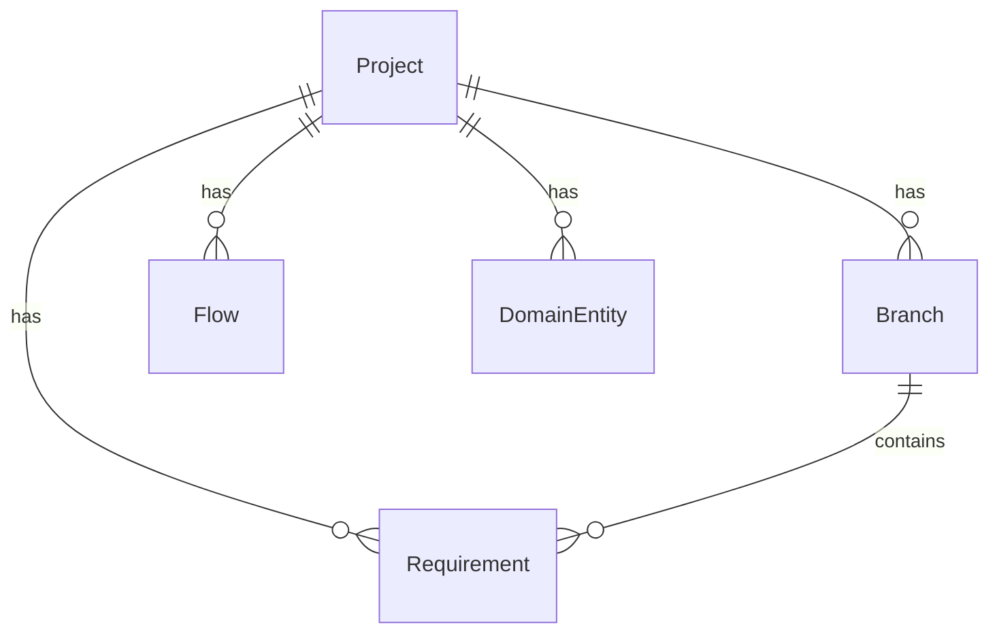

# VibeX Sprint 18 Architecture

**版本**: v1.0
**日期**: 2026-04-30
**Agent**: architect
**状态**: Draft

---

## 1. 背景与范围

Sprint 18 是 TypeScript 类型安全收尾 + 功能增强识别 Sprint。当前系统存在 **386 个 TS 编译错误**，集中在 E3-U2（mcp-server 独立 HTTP 服务器）和 E3-U3（vibex-backend Next.js 应用）模块。

**核心约束**：本次 Sprint 不做架构重构，只做类型修复、功能识别、测试覆盖提升。

---

## 2. 技术栈

### 2.1 现有技术栈（不变）

| 组件 | 技术选型 | 版本 | 说明 |
|------|---------|------|------|
| 后端框架 | Hono (on Next.js) | ^4.x | Cloudflare Workers 部署 |
| 前端框架 | Next.js + React | ^15.x | App Router |
| 类型语言 | TypeScript | ^5.x | 目标: strict 模式 |
| 包管理 | pnpm | ^9.x | workspaces monorepo |
| 共享类型 | @vibex/types | local package | packages/types |
| MCP Server | @modelcontextprotocol/sdk | 0.5.0 | stdio transport |
| 数据库 | Prisma + D1 | latest | Cloudflare D1 |
| API 风格 | REST + WebSocket | - | openapi.json 文档化 |

### 2.2 TS 修复策略选型

**选择方案**: 分区渐进修复（Schema-First Incremental）

| 方案 | 优点 | 缺点 | 决策 |
|------|------|------|------|
| 全局 `skipLibCheck: true` | 快速消错误 | 类型安全名存实亡 | ❌ 不采纳 |
| 单次 `any` 兜底 | 工作量小 | 技术债积累 | ❌ 不采纳 |
| **Schema-First 分区修复** | 类型安全逐步提升，每步可验证 | 需要逐文件处理 | ✅ 采纳 |

**Schema-First 分区修复原则**:
1. `@vibex/types` 作为唯一类型 source of truth
2. 每个 route/service 模块先定义 Zod schema，再导出 TS type
3. `as unknown as T` 仅限 Prisma → internal 边界使用，且必须附注释
4. 禁止在 module boundary 使用 `as any`

---

## 3. 架构图

### 3.1 系统架构（当前）

```mermaid
graph TB
    subgraph "Frontend (Next.js)"
        FE[VibeX Frontend<br/>Next.js 15 App Router]
    end

    subgraph "Backend (Next.js / Hono)"
        API[Hono API Routes<br/>/src/routes/*]
        WS[WebSocket Handler<br/>/src/websocket]
        MID[Middleware<br/>auth/cors/logger]
    end

    subgraph "Shared Packages"
        TYPES[@vibex/types<br/>packages/types]
        MCP[packages/mcp-server<br/>@modelcontextprotocol/sdk]
    end

    subgraph "Data Layer"
        D1[(D1 SQLite)]
        KV[(KV Store)]
    end

    FE --> API
    FE --> WS
    API --> TYPES
    API --> MCP
    API --> D1
    API --> KV
    WS --> D1
    MCP --> TYPES
```

### 3.2 Sprint 18 变更范围

```mermaid
graph TB
    subgraph "变更范围 Sprint 18"
        TS1[E3-U2<br/>mcp-server TS修复<br/>7 errors]
        TS2[E3-U3<br/>vibex-backend TS修复<br/>379 errors]
        SHARED[@vibex/types<br/>shared types 基础设施<br/>E18-TSFIX-3]
        BACKLOG[E18-CORE-1<br/>Sprint 1-17<br/>backlog 梳理]
        QUALITY1[E18-QUALITY-1<br/>测试覆盖提升]
        QUALITY2[E18-QUALITY-2<br/>DX 改进]
    end

    TS1 --> SHARED
    TS2 --> SHARED
    SHARED --> QUALITY1
    SHARED --> QUALITY2
    BACKLOG --> QUALITY1

    style TS1 fill:#bbf,color:#000
    style TS2 fill:#bbf,color:#000
    style SHARED fill:#f9f,color:#000
    style BACKLOG fill:#dfd,color:#000
    style QUALITY1 fill:#ffd,color:#000
    style QUALITY2 fill:#ffd,color:#000
```

---

## 4. 接口定义

### 4.1 核心类型接口（@vibex/types 导出）

```typescript
// packages/types/src/index.ts

// --- Session ---
export interface Session {
  id: string;
  userId: string;
  projectId: string;
  createdAt: string; // ISO8601
  updatedAt: string;
  metadata?: Record<string, unknown>;
}

// --- Config ---
export interface Config {
  id: string;
  sessionId: string;
  llmProvider: 'openai' | 'anthropic' | 'minimax';
  model: string;
  temperature: number; // 0.0-2.0
  maxTokens?: number;
}

// --- Response ---
export interface Response<T = unknown> {
  success: boolean;
  data?: T;
  error?: ResponseError;
  meta?: ResponseMeta;
}

export interface ResponseError {
  code: string;
  message: string;
  details?: unknown;
}

export interface ResponseMeta {
  durationMs?: number;
  tokensUsed?: number;
  model?: string;
}

// --- Project ---
export interface Project {
  id: string;
  name: string;
  description?: string;
  ownerId: string;
  createdAt: string;
  updatedAt: string;
  branches: Branch[];
}

// --- Branch ---
export interface Branch {
  id: string;
  name: string;
  projectId: string;
  isDefault: boolean;
  createdAt: string;
}

// --- Flow ---
export interface Flow {
  id: string;
  projectId: string;
  name: string;
  nodes: FlowNode[];
  edges: FlowEdge[];
  version: number;
  updatedAt: string;
}

export interface FlowNode {
  id: string;
  type: string;
  position: { x: number; y: number };
  data: Record<string, unknown>;
}

export interface FlowEdge {
  id: string;
  source: string;
  target: string;
  label?: string;
}
```

### 4.2 类型守卫（E18-TSFIX-3）

```typescript
// packages/types/src/guards.ts
import type { Session, Config, Response } from './index.js';

export function isSession(value: unknown): value is Session {
  return (
    typeof value === 'object' &&
    value !== null &&
    'id' in value && typeof (value as Session).id === 'string' &&
    'userId' in value && typeof (value as Session).userId === 'string'
  );
}

export function isConfig(value: unknown): value is Config {
  return (
    typeof value === 'object' &&
    value !== null &&
    'sessionId' in value && typeof (value as Config).sessionId === 'string' &&
    'llmProvider' in value
  );
}

export function isResponse<T>(value: unknown, guard: (v: unknown) => v is T): value is Response<T> {
  return (
    typeof value === 'object' &&
    value !== null &&
    'success' in value && typeof (value as Response<T>).success === 'boolean'
  );
}
```

### 4.3 MCP Server 工具接口

```typescript
// packages/mcp-server/src/tools/execute.ts
export type ToolName =
  | 'chat'
  | 'list_projects'
  | 'get_project'
  | 'create_project'
  | 'list_flows'
  | 'get_flow'
  | 'create_flow'
  | 'list_entities'
  | 'get_entity'
  | 'create_entity'
  | 'list_requirements'
  | 'get_requirement';

export interface ToolResult {
  content: Array<{
    type: 'text';
    text: string;
  }>;
  isError?: boolean;
}

export type ToolExecutor = (
  name: ToolName,
  args: Record<string, unknown>
) => Promise<ToolResult>;
```

---

## 5. 数据模型

### 5.1 Prisma Schema（相关模型）

```prisma
// vibex-backend/prisma/schema.prisma

model Project {
  id          String    @id @default(cuid())
  name        String
  description String?
  ownerId     String
  branches    Branch[]
  flows       Flow[]
  entities    DomainEntity[]
  requirements Requirement[]
  createdAt   DateTime  @default(now())
  updatedAt   DateTime  @updatedAt
}

model Branch {
  id        String   @id @default(cuid())
  name      String
  projectId String
  project   Project  @relation(fields: [projectId], references: [id])
  isDefault Boolean  @default(false)
  createdAt DateTime @default(now())
}

model Flow {
  id        String     @id @default(cuid())
  projectId String
  project   Project    @relation(fields: [projectId], references: [id])
  name      String
  version   Int        @default(1)
  updatedAt DateTime   @updatedAt
}

model DomainEntity {
  id          String   @id @default(cuid())
  projectId   String
  project     Project  @relation(fields: [projectId], references: [id])
  name        String
  description String?
  attributes  Json     // Array of EntityAttribute
  createdAt   DateTime @default(now())
  updatedAt   DateTime @updatedAt
}
```

### 5.2 实体关系



---

## 6. 性能影响评估

### 6.1 TypeScript 编译性能

| 指标 | 当前值 | 目标值 | 评估 |
|------|--------|--------|------|
| `tsc --noEmit` 耗时 | ~45s (vibex-backend) | < 60s | ⚠️ 严格模式开启后预计增加 10-20s，需优化 |
| `tsc --noEmit` (mcp-server) | ~3s | < 5s | ✅ 无影响 |
| 类型检查 CI 时间 | 待测 | < 5min | ⚠️ 需在 CI 中加入缓存策略 |

### 6.2 性能缓解措施

1. **TS Build Cache**: 在 CI 中启用 `tsc --incremental` + `Nwrlite` 缓存
2. **严格模式分阶段**: 先修复 mcp-server（7 errors），再修复 backend
3. **类型覆盖监控**: 使用 `typescript-plugin-styled-components` 等增量工具

### 6.3 运行时性能影响

- **零运行时影响**：纯类型修复无运行时行为变更
- **bundle size**：无变化（`noEmit: true`）

---

## 7. 质量门禁

### 7.1 CI Pipeline

```yaml
# .github/workflows/type-check.yml
name: Type Check
on: [push, pull_request]

jobs:
  type-check:
    runs-on: ubuntu-latest
    steps:
      - uses: actions/checkout@v4
      - uses: pnpm/action-setup@v4
      - run: pnpm install --frozen-lockfile
      - name: tsc mcp-server
        run: cd packages/mcp-server && pnpm exec tsc --noEmit
      - name: tsc vibex-backend
        run: pnpm exec tsc --noEmit
      - name: type coverage
        run: pnpm exec tsc --project tsconfig.coverage.json --noEmit
```

### 7.2 覆盖率要求

| 包 | 当前行覆盖 | Sprint 18 目标 | 验证命令 |
|----|-----------|---------------|----------|
| @vibex/types | < 60% | ≥ 80% | `pnpm exec jest --coverage` |
| mcp-server | < 70% | ≥ 80% | `pnpm exec jest --coverage` |
| vibex-backend routes | < 50% | ≥ 60% | `pnpm exec jest --coverage` |

---

## 8. 测试策略

### 8.1 测试框架

- **单元测试**: Jest (`jest.config.js`)
- **类型测试**: `tsc --noEmit` + `@typescript-eslint/consistent-type-imports`
- **集成测试**: Playwright（端到端画布流程）
- **变异测试**: Stryker（覆盖率引导）

### 8.2 核心测试用例

```typescript
// packages/types/src/__tests__/guards.test.ts

describe('Type Guards', () => {
  describe('isSession', () => {
    it('returns true for valid session', () => {
      const session = {
        id: 'sess_123',
        userId: 'user_456',
        projectId: 'proj_789',
        createdAt: '2026-04-29T10:00:00Z',
        updatedAt: '2026-04-29T10:00:00Z',
      };
      expect(isSession(session)).toBe(true);
    });

    it('returns false for invalid session', () => {
      expect(isSession(null)).toBe(false);
      expect(isSession({ id: '123' })).toBe(false);
      expect(isSession({ userId: 'u1' })).toBe(false);
    });
  });

  describe('isConfig', () => {
    it('validates llmProvider enum values', () => {
      const config = {
        id: 'cfg_1',
        sessionId: 'sess_1',
        llmProvider: 'openai',
        model: 'gpt-4o',
        temperature: 0.7,
      };
      expect(isConfig(config)).toBe(true);
    });

    it('rejects invalid llmProvider', () => {
      const bad = { id: 'c', sessionId: 's', llmProvider: 'unknown' };
      expect(isConfig(bad)).toBe(false);
    });
  });
});

// packages/mcp-server/src/__tests__/tools.test.ts

describe('MCP Tool Execution', () => {
  it('returns structured ToolResult for chat tool', async () => {
    const result = await executeTool('chat', { message: 'hello' });
    expect(result.content).toBeDefined();
    expect(result.content[0].type).toBe('text');
    expect(typeof result.content[0].text).toBe('string');
  });

  it('throws on unknown tool name', async () => {
    await expect(
      executeTool('unknown_tool' as ToolName, {})
    ).rejects.toThrow();
  });
});
```

---

## 9. 执行决策

- **决策**: 已采纳
- **执行项目**: vibex-sprint18
- **执行日期**: 2026-04-30

---

## 10. 附录：TS Error 分布

| 模块 | 文件数 | 错误数 | 典型错误类型 |
|------|--------|--------|-------------|
| vibex-backend src/ | ~1221 files | ~379 | missing types, implicit any, wrong imports |
| mcp-server src/ | ~10 files | 7 | ESM meta, http.ServerResponse wrong type |
| packages/types | ~4 files | 0 | - |
| vibex-frontend | 未计入 | 待测 | - |
