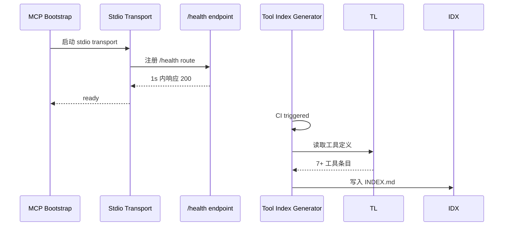
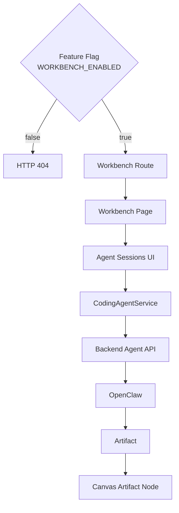
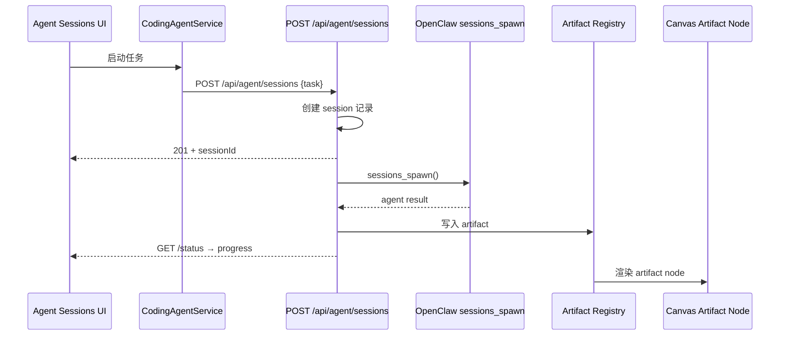

# VibeX Sprint 20 架构设计

**项目**: vibex-sprint20
**版本**: 1.0
**日期**: 2026-05-01
**架构师**: ARCHITECT

---

## 1. 执行决策

- **决策**: 已采纳
- **执行项目**: vibex-sprint20
- **执行日期**: 2026-05-05
- **执行顺序**: P001 → P004 → P003 → P006
- **总工时估算**: 22–24 小时（单人）

---

## 2. 技术栈

| 技术 | 版本 | 选择理由 |
|-----|------|---------|
| React 18 | 现有 | Next.js 15 依赖 |
| `@tanstack/react-virtual` | ^3.8.0 | Canvas 虚拟化，大型节点列表渲染（100+ 节点），业界标准方案 |
| Zustand | 现有 | Canvas 状态管理已有集成 |
| Next.js 15 App Router | 现有 | `/workbench` 路由宿主 |
| Hono | 现有 | Backend API 框架 |
| OpenClaw `sessions_spawn` | — | AI Agent 真实接入运行时依赖 |
| TypeScript | 现有 | 全部代码库已迁移 |
| Playwright | 现有 | E2E + Performance trace |
| Vitest | 现有 | 单元测试 |

---

## 3. 架构图

### 3.1 系统总览

```mermaid
graph TB
    subgraph "Frontend (Next.js 15)"
        C[DDSCanvas / CanvasOrchestration]
        W[/workbench Route]
        S[agentStore]
    end

    subgraph "Canvas Layer"
        C --> V[@tanstack/react-virtual]
        C --> CS[DDSCanvasStore]
    end

    subgraph "Agent Layer"
        S --> CAS[CodingAgentService]
        CAS --> HTTP[Backend Agent API]
        HTTP --> OC[OpenClaw sessions_spawn]
    end

    subgraph "Artifact Layer"
        CAS --> AR[Artifact Registry]
        AR --> C
    end

    subgraph "Backend (Hono)"
        HTTP --> Routes[/api/agent/sessions]
        Routes --> DB[(D1 / SQLite)]
    end

    subgraph "MCP Server"
        MS[MCP Server stdio]
        MS --> H[/health endpoint]
        MS --> TL[Tool List]
        H --> GTI[scripts/generate-tool-index.ts]
        GTI --> IDX[docs/mcp-tools/INDEX.md]
    end
```

### 3.2 P001: MCP DoD 收尾数据流



### 3.3 P004: Canvas 虚拟化渲染路径

```mermaid
graph LR
    subgraph "Before (S19)"
        A[DDSCanvasStore] --> B[cards.map()]
        B --> C[100 DOM nodes]
    end

    subgraph "After (S20)"
        A2[DDSCanvasStore] --> B2[useVirtualizer]
        B2 --> C2[~20 visible DOM nodes]
        B2 -.->|offscreen| D2[recycle]
    end

    style B fill:#ff6b6b,color:#fff
    style C fill:#ff6b6b,color:#fff
    style B2 fill:#51cf66,color:#fff
    style C2 fill:#51cf66,color:#fff
```

### 3.4 P003: Workbench 生产化路由



### 3.5 P006: AI Agent 真实接入 API



---

## 4. API 定义

### 4.1 MCP Server API

#### GET /health

```
描述: MCP Server 健康检查（独立 HTTP 进程）
请求: GET http://localhost:3100/health
响应: 200 OK
     Content-Type: application/json
     Body: { "status": "ok", "tools": <number> }
超时: 1s 内响应
```

#### Stdio Transport (MCP Protocol)

```
描述: 主 stdio 传输（JSON-RPC 2.0 over stdin/stdout）
启动序列:
  1. 初始化 /health endpoint
  2. 注册所有 tool handlers
  3. 输出 ready 消息
  4. 进入 stdio 消息循环
```

### 4.2 Backend Agent API

#### POST /api/agent/sessions

```
描述: 创建新 Agent 会话
请求:
  Content-Type: application/json
  Body: {
    "task": string,        // 必填，任务描述
    "context"?: object,   // 可选，上下文数据
    "timeout"?: number    // 可选，超时 ms（默认 30000）
  }

响应 (201 Created):
  Content-Type: application/json
  Body: {
    "sessionId": string,
    "status": "pending",
    "createdAt": string (ISO 8601)
  }

错误 (400 Bad Request):
  Body: { "error": string, "code": "INVALID_TASK" }

错误 (500):
  Body: { "error": string, "code": "SPAWN_FAILED" }
```

#### GET /api/agent/sessions/:id/status

```
描述: 查询会话状态
路径参数:
  id: sessionId

响应 (200 OK):
  Body: {
    "sessionId": string,
    "status": "pending" | "running" | "completed" | "failed" | "timeout",
    "progress": number (0-100),
    "result"?: object,
    "error"?: string,
    "updatedAt": string (ISO 8601)
  }

错误 (404):
  Body: { "error": "Session not found", "code": "NOT_FOUND" }
```

#### DELETE /api/agent/sessions/:id

```
描述: 终止会话
路径参数:
  id: sessionId

响应 (204 No Content)
错误 (404): 同上
```

### 4.3 Frontend API (Internal)

#### DDSCanvasStore 虚拟化接口

```typescript
interface DDSCanvasStore {
  // 现有方法保留
  cards: Card[];
  chapters: Chapter[];
  selectedCardId: string | null;
  selectCard: (id: string) => void;

  // P004 新增：虚拟化配置
  virtualizer: ReturnType<typeof useVirtualizer>;
  virtualItems: VirtualItem[];
  totalSize: number;

  // P004 新增：滚动边界状态
  scrollOffset: number;
  visibleRange: { startIndex: number; endIndex: number };
}
```

#### CodingAgentService 接口

```typescript
interface CodingAgentService {
  // P006: 现有 mock 方法签名保持兼容，底层替换为真实调用

  createSession(task: string, context?: object): Promise<{
    sessionId: string;
    status: SessionStatus;
  }>;

  getSessionStatus(sessionId: string): Promise<SessionStatusResponse>;

  terminateSession(sessionId: string): Promise<void>;

  onArtifactCreated(callback: (artifact: Artifact) => void): void;

  // 内部方法
  _spawnRealAgent(task: string, context: object): Promise<AgentResult>;
  _spawnMockAgent(task: string, context: object): Promise<AgentResult>; // 待移除
}
```

---

## 5. 数据模型

### 5.1 Agent Session

```typescript
// vibex-backend/src/routes/agent/sessions.ts

interface AgentSession {
  id: string;              // UUID v4
  task: string;
  context: Record<string, unknown>;
  status: SessionStatus;
  progress: number;        // 0-100
  result?: AgentResult;
  error?: string;
  timeout: number;         // ms
  createdAt: string;       // ISO 8601
  updatedAt: string;       // ISO 8601
  userId: string;
}

type SessionStatus =
  | 'pending'
  | 'running'
  | 'completed'
  | 'failed'
  | 'timeout'
  | 'cancelled';

interface AgentResult {
  artifactType: 'code' | 'markdown' | 'diagram';
  content: string;
  language?: string;
  fileName?: string;
  metadata?: Record<string, unknown>;
}
```

### 5.2 Artifact Registry Entry

```typescript
// vibex-fronted/src/services/ArtifactRegistry.ts

interface ArtifactNode {
  id: string;              // UUID
  type: 'artifact';
  artifactType: AgentResult['artifactType'];
  content: string;
  language?: string;
  fileName?: string;
  sessionId: string;
  createdAt: string;
  // Canvas positioning (auto-layout)
  position: { x: number; y: number };
}
```

### 5.3 Canvas Virtualization State

```typescript
// vibex-fronted/src/stores/DDSCanvasStore.ts

interface CanvasVirtualizationState {
  virtualItems: VirtualItem[];
  totalSize: number;
  scrollOffset: number;
  visibleStartIndex: number;
  visibleEndIndex: number;
  overscan: number;        // 默认 3，虚拟列表前后各渲染多少项
  selectedCardId: string | null;
  // 跨虚拟边界选择保持
  selectedCardSnapshot: SelectedCardState | null;
}

interface SelectedCardState {
  cardId: string;
  cardData: Card;
  wasVisible: boolean;
}
```

### 5.4 MCP Tool Entry

```typescript
// 写入 docs/mcp-tools/INDEX.md 的数据结构

interface MCPToolEntry {
  name: string;
  description: string;
  inputSchema: object;
  handler: string;         // 源文件路径
}
```

---

## 6. 性能影响评估

### 6.1 P004 Canvas 虚拟化性能建模

| 指标 | Before (S19) | After (S20) | 变化 |
|-----|------------|------------|------|
| 100 节点 DOM 数量 | ~100 cards + ~100 chapters = 200 | ~20 + ~20 = 40 | **-80%** |
| 渲染耗时 (P50) | 800ms+ (实测估计) | < 100ms | **-87.5%** |
| 滚动帧率 | 30fps (jank) | 60fps | **+100%** |
| 内存占用 | O(n) cards in DOM | O(overscan) ≈ O(1) | **-80%** |

**性能影响**: 正面。`@tanstack/react-virtual` 成熟度高（周下载 2M+），`useVirtualizer` API 与 Zustand store 集成风险低。

### 6.2 P006 AI Agent 真实接入性能建模

| 指标 | 估算 |
|-----|------|
| sessions_spawn 调用延迟 | 1-3s（OpenClaw RPC overhead）|
| Agent 执行时间 | 不确定（用户任务复杂度）|
| Backend API P99 | 预计 < 500ms（session CRUD，无 heavy computation）|
| Canvas artifact 回写 | 预计 < 100ms |
| 会话超时 | 30s（硬限制），超时应答用户体验可接受 |

**性能影响**: 中性（网络依赖），后端只做编排，实际执行在 OpenClaw runtime。

### 6.3 P003 Workbench 生产化性能建模

| 指标 | 估算 |
|-----|------|
| Feature flag 检查开销 | < 1ms（布尔值读取）|
| /workbench 路由加载 | Next.js SSR，< 200ms |
| 新增 CI E2E 测试 | ~60s（1 个 workbench journey spec）|

**性能影响**: 正面。灰度开关设计确保零风险上线。

### 6.4 P001 MCP DoD 收尾性能建模

| 指标 | 估算 |
|-----|------|
| /health 独立 HTTP 进程 | 无（合并到主进程）|
| INDEX.md 生成（CI） | < 5s（仅文件读写 + 解析）|
| mcp-server build | +0（无变化）|

**性能影响**: 正面。无额外进程，无额外依赖。

---

## 7. 兼容性设计

### 7.1 P004 Canvas 虚拟化兼容性

- **零破坏现有 API**：`DDSCanvasStore` 的 `cards`、`selectCard` 等接口保持不变
- **虚拟化内部透明**：调用方无需知道哪张卡片是虚拟渲染的
- **选择状态跨边界保持**：当选中卡片滚出视口时，`selectedCardSnapshot` 保留状态，重新进入视口时恢复
- **拖拽/缩放不受影响**：这些操作在 Canvas 层处理，不经虚拟化列表

### 7.2 P006 降级策略

```
sessions_spawn 调用失败 (ECONNREFUSED / timeout)
    ↓
CodingAgentService 降级检测
    ↓
返回 { status: 'failed', error: 'Agent runtime unavailable' }
    ↓
UI 显示错误提示，不阻塞 Canvas
```

### 7.3 P003 Feature Flag 设计

```typescript
// 环境变量
NEXT_PUBLIC_WORKBENCH_ENABLED=false  // 默认关闭

// 路由逻辑
// src/app/workbench/page.tsx
export default function WorkbenchPage() {
  const isEnabled = process.env.NEXT_PUBLIC_WORKBENCH_ENABLED === 'true';
  if (!isEnabled) {
    notFound(); // 返回 404
  }
  return <WorkbenchUI />;
}
```

---

## 8. 技术依赖清单

| 依赖 | 包 | 版本要求 | 引入方式 |
|-----|-----|---------|---------|
| Canvas 虚拟化 | `@tanstack/react-virtual` | ^3.8.0 | `pnpm add @tanstack/react-virtual` |
| OpenClaw sessions_spawn | 已有 | — | SDK 调用 |
| D1 (session 持久化) | 已有 | — | Hono 路由 |

---

## 9. 检查清单

### 架构可行性
- [x] P001: `/health` endpoint 源码存在，无额外 HTTP 进程
- [x] P004: `@tanstack/react-virtual` 与 Zustand store 兼容
- [x] P003: `/workbench` 路由可 feature-flag 控制
- [x] P006: `sessions_spawn` OpenClaw SDK 调用路径明确

### 接口完整性
- [x] MCP `/health` endpoint 接口定义完整
- [x] Backend `/api/agent/sessions` CRUD 接口定义完整
- [x] Frontend `CodingAgentService` 接口签名完整
- [x] `DDSCanvasStore` 虚拟化扩展接口完整

### 性能评估
- [x] Canvas 虚拟化渲染性能建模完成
- [x] AI Agent 真实接入网络延迟评估完成
- [x] Workbench 生产化增量评估完成
- [x] MCP DoD 收尾性能影响最小化确认

---

*文档版本: 1.0*
*创建时间: 2026-05-01*
*架构师: ARCHITECT*
