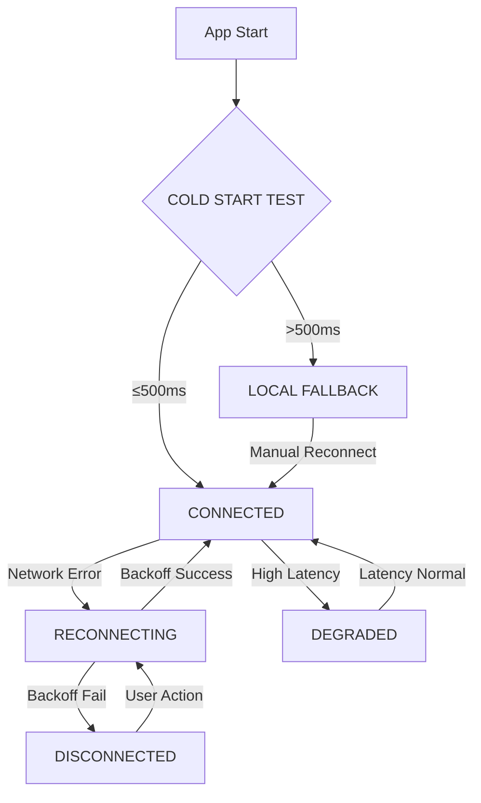

# S16-P1-1 Firebase Mock + Config Path

## Environment Variables

```bash
# .env.local (never commit to git)
NEXT_PUBLIC_FIREBASE_API_KEY=your-api-key
NEXT_PUBLIC_FIREBASE_AUTH_DOMAIN=your-project.firebaseapp.com
NEXT_PUBLIC_FIREBASE_DATABASE_URL=https://your-project.firebaseio.com
NEXT_PUBLIC_FIREBASE_PROJECT_ID=your-project-id
NEXT_PUBLIC_FIREBASE_STORAGE_BUCKET=your-project.appspot.com
NEXT_PUBLIC_FIREBASE_MESSAGING_SENDER_ID=your-sender-id
NEXT_PUBLIC_FIREBASE_APP_ID=your-app-id

# Mock mode toggle
NEXT_PUBLIC_FIREBASE_MOCK=true
```

## Mock vs Real Firebase Toggle

Set `NEXT_PUBLIC_FIREBASE_MOCK=true` to use the mock client-side implementation.
The mock intercepts all Firebase calls and simulates the 4 states.

## Connection Flow



## Mock States

| State | Behavior | UI Indicator |
|-------|----------|--------------|
| CONNECTED | Normal sync, no delay | ConflictBubble: "Synced" (auto-dismiss 2s) |
| DEGRADED | 2s simulated latency | ConflictBubble: "Slow connection" |
| DISCONNECTED | Returns null, local-only | ConflictBubble: "Offline — changes queued" |
| RECONNECTING | Exponential backoff | ConflictBubble: "Reconnecting..." |

## Cold Start Requirement

Target: < 500ms
If cold start > 500ms → automatic local-only fallback mode

## File Locations

- Mock server: `packages/mcp-server/src/mocks/firebaseMock.ts`
- Client mock: `src/lib/firebase/firebaseMock.ts`
- Hook: `src/hooks/useFirebase.ts`
- ConflictBubble: `src/components/collaboration/ConflictBubble.tsx`
