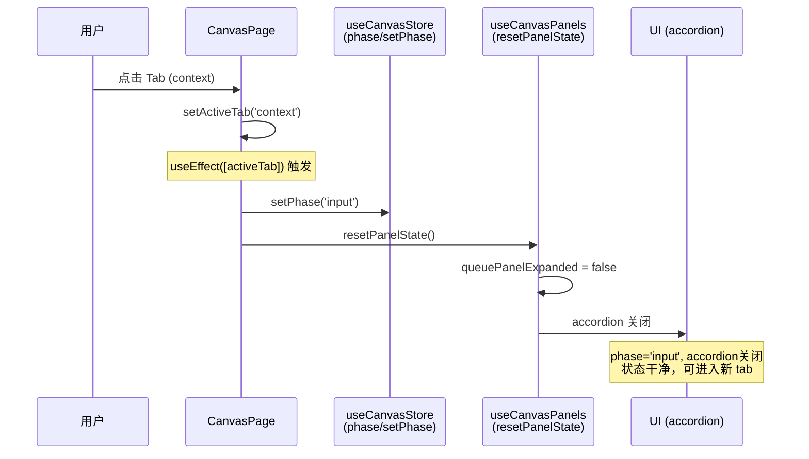
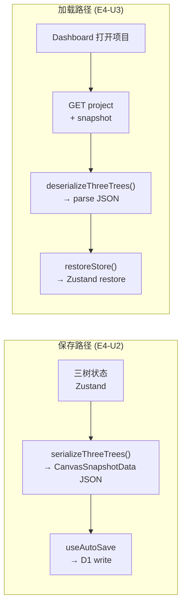

# Architecture: VibeX Sprint 2 技术架构设计

**项目**: vibex-sprint2-20260415
**日期**: 2026-04-16
**Agent**: architect
**状态**: 已完成

---

## 执行决策

- **决策**: 待评审
- **执行项目**: vibex-sprint2-20260415
- **执行日期**: 待定

---

## 1. Tech Stack

### 1.1 技术选型总览

| Epic | 技术选型 | 理由 |
|------|----------|------|
| **E1** | React useEffect + useCanvasStore setPhase | Tab 切换时重置 `phase → 'input'`，只需在现有 useEffect 中加一行调用 |
| **E2** | 现有 useVersionHistory hook + 新 Dialog UI + json-diff | hook 已就绪（17 tests），前端只需集成 UI；json-diff 做结构化比较 |
| **E3** | 纯前端序列化（JSON.stringify + js-yaml） | 三树数据全在前端，Zustand 直接序列化；无需后端改动；5MB 限制写入前校验 |
| **E4** | CanvasSnapshot table 扩展 + 前端序列化 | 复用现有 table，`data` 字段存 JSON；D1 migration 先本地验证再合入 |

### 1.2 技术栈详情

- **Frontend**: Next.js 14 (App Router), TypeScript, React 18, Zustand 4
- **Backend**: Hono (Cloudflare Workers), D1 (SQLite), TypeScript
- **Export**: JSZip 3.x, js-yaml
- **Diff**: json-diff（结构化 JSON diff 库）
- **Testing**: Vitest（单元），Playwright（E2E）
- **CI**: 已有 bundlesize 基线（继承 Sprint 1 E6 CI 门控）

**放弃方案**：
- json-diff-diffpatcher：bundle size 过大，json-diff 更轻量（~10KB vs ~50KB）
- 独立 ProjectTree 表（E4）：复用 CanvasSnapshot 已有的 `data` 字段，无需新增表

---

## 2. Architecture Diagram

### 2.1 系统数据流图

```mermaid
flowchart TD
    subgraph Frontend["前端 (Next.js App Router)"]
        CanvasPage["CanvasPage.tsx\nphase + queuePanelExpanded state"]
        useCanvasStore["useCanvasStore()\nphase/setPhase"]
        useCanvasPanels["useCanvasPanels()\nresetPanelState"]
        useVersionHistory["useVersionHistory hook\nGET /v1/canvas/snapshots"]
        VersionHistoryDialog["VersionHistoryDialog\n版本列表 + diff 视图"]
        ExportPanel["ExportPanel\nJSON / YAML 导出"]
        ImportPanel["ImportPanel\n文件导入 + round-trip"]
        ThreeTrees["ThreeTrees State\nZustand (contexts/flows/components)"]
        useAutoSave["useAutoSave hook"]
    end

    subgraph Backend["后端 (Cloudflare Workers)"]
        SnapshotAPI["/v1/canvas/snapshots\n已实现"]
        ProjectAPI["/api/projects\n已实现"]
        D1DB["D1 Database\nCanvasSnapshot + Project"]
    end

    subgraph DataLayer["数据层"]
        Snapshots["CanvasSnapshot table\n(data: JSON)"]
        Projects["Project table"]
    end

    %% E1: Tab State 修复
    E1_Fix["E1: Tab 切换\nsetPhase('input')"]
    CanvasPage --> |useEffect[activeTab]| E1_Fix
    E1_Fix --> useCanvasStore
    E1_Fix --> useCanvasPanels

    %% E2: 版本历史
    E2_List["E2-U1: 版本列表"]
    E2_Diff["E2-U3: Diff 查看"]
    E2_Restore["E2-U3: 版本恢复"]
    useVersionHistory --> |GET snapshots| SnapshotAPI
    SnapshotAPI --> |snapshot list| E2_List
    E2_List --> VersionHistoryDialog
    E2_List --> |select 2 versions| E2_Diff
    E2_Diff --> |json-diff| VersionHistoryDialog
    E2_Restore --> SnapshotAPI
    SnapshotAPI --> |restore payload| ThreeTrees

    %% E3: 导入导出
    E3_Export["E3: Export Service\nserialize → download"]
    E3_Import["E3: Import Service\nparse + validate + load"]
    ThreeTrees --> E3_Export
    E3_Export --> |JSZip download| Download["文件下载"]
    E3_Import --> |parse JSON/YAML| ThreeTrees
    E3_Import --> |5MB check| E3_Import

    %% E4: 三树持久化
    E4_Save["E4-U2: 保存序列化\nwrite to CanvasSnapshot.data"]
    E4_Load["E4-U3: 加载反序列化\nread from CanvasSnapshot.data"]
    ThreeTrees --> |serialize| E4_Save
    E4_Save --> D1DB
    D1DB --> |deserialize| E4_Load
    E4_Load --> ThreeTrees
    E4_Load --> CanvasPage
```

### 2.2 E1 Tab State 重置序列图



### 2.3 E4 持久化数据流



---

## 3. API Definitions

### 3.1 E2: 版本历史 API（前端消费，后端已实现）

```typescript
// GET /v1/canvas/snapshots?projectId=xxx&limit=20&offset=0
interface SnapshotListResponse {
  success: true;
  snapshots: Array<{
    snapshotId: string;
    projectId: string;
    label: string;
    trigger: 'manual' | 'auto' | 'ai_complete';
    createdAt: string;      // ISO 8601
    version: number;
    contextCount: number;
    flowCount: number;
    componentCount: number;
    isAutoSave: boolean;
  }>;
  total: number;
  limit: number;
  offset: number;
}

// GET /v1/canvas/snapshots/:id
interface SnapshotDetailResponse {
  success: true;
  snapshot: {
    snapshotId: string;
    projectId: string;
    label: string;
    trigger: 'manual' | 'auto' | 'ai_complete';
    createdAt: string;
    version: number;
    contextCount: number;
    contextNodes: BoundedContextNode[];
    flowNodes: BusinessFlowNode[];
    componentNodes: ComponentNode[];
  };
}

// POST /v1/canvas/snapshots/:id/restore
interface RestoreSnapshotResponse {
  success: true;
  contextNodes: BoundedContextNode[];
  flowNodes: BusinessFlowNode[];
  componentNodes: ComponentNode[];
}
```

### 3.2 E3: 导入导出 API（纯前端）

```typescript
// 导出格式
interface ProjectExport {
  version: '1.0.0';
  exportedAt: string;          // ISO 8601
  projectName: string;
  projectId?: string;
  data: {
    contexts: BoundedContextNode[];
    flows: BusinessFlowNode[];
    components: ComponentNode[];
  };
  metadata: {
    appVersion: string;
    format: 'json' | 'yaml';
    nodeCount: {
      contexts: number;
      flows: number;
      components: number;
    };
  };
}

// 导出服务
interface ExportService {
  exportAsJSON(projectName: string): Promise<Blob>;
  exportAsYAML(projectName: string): Promise<Blob>;
  validateFileSize(blob: Blob): boolean;  // 5MB limit
}

// 导入服务
interface ImportService {
  parseJSON(content: string): ProjectExport;
  parseYAML(content: string): ProjectExport;
  roundTripTest(exportData: ProjectExport): boolean;  // serialize → deserialize === original
  validateSchema(data: unknown): data is ProjectExport;
}
```

### 3.3 E4: 三树持久化数据格式

```typescript
// 存入 CanvasSnapshot.data 的 JSON 结构
interface CanvasSnapshotData {
  version: 1;
  contextNodes: BoundedContextNode[];
  flowNodes: BusinessFlowNode[];
  componentNodes: ComponentNode[];
  savedAt: string;            // ISO 8601
  ui?: {
    activeTab?: string;
    phase?: string;
  };
}

// 三树节点类型
interface BoundedContextNode {
  nodeId: string;
  name: string;
  description: string;
  type: 'core' | 'supporting' | 'generic';
  status: 'pending' | 'confirmed' | 'rejected';
  isActive: boolean;
  children: BoundedContextNode[];
}

interface BusinessFlowNode {
  nodeId: string;
  name: string;
  contextId: string;
  steps: FlowStep[];
  status: 'pending' | 'confirmed';
}

interface ComponentNode {
  nodeId: string;
  name: string;
  flowId: string;
  type: 'page' | 'component' | 'api';
  props: Record<string, unknown>;
  api?: { method: string; path: string; params: unknown[] };
}

// 序列化/反序列化
function serializeThreeTrees(
  contexts: BoundedContextNode[],
  flows: BusinessFlowNode[],
  components: ComponentNode[]
): CanvasSnapshotData;

function deserializeThreeTrees(data: string): CanvasSnapshotData;
```

---

## 4. Data Model

### 4.1 ER 图

```mermaid
erDiagram
    Project {
        string id PK
        string name
        datetime createdAt
        datetime updatedAt
        string userId FK
    }

    CanvasSnapshot {
        string id PK
        string projectId FK
        int version
        string name
        string label
        string description
        string data JSON       -- {contextNodes, flowNodes, componentNodes, version}
        datetime createdAt
        bool isAutoSave
        string trigger
    }

    Project ||--o{ CanvasSnapshot : "has"
```

**说明**：
- `Project.id` 为快照的主键引用（`projectId` FK）
- `CanvasSnapshot.data` 存储三树序列化 JSON（`version: 1`）
- E4 复用现有 `CanvasSnapshot` table，无需新增表

---

## 5. Performance & Risk Assessment

### 5.1 性能评估

| Epic | 操作 | 性能影响 | 结论 |
|------|------|----------|------|
| E1 | Tab 切换 + setPhase | O(1)，内存操作 | ✅ 无影响 |
| E2 | GET /v1/canvas/snapshots | 网络请求，list < 100 items | ✅ 正常 |
| E3 | JSON.stringify 三树 | 三树预估 < 500KB，序列化 < 10ms | ✅ 无影响 |
| E4 | D1 write CanvasSnapshot.data | D1 写入 < 50ms（500KB JSON） | ✅ 可接受 |

### 5.2 风险矩阵

| 风险 | 可能性 | 影响 | 缓解 |
|------|--------|------|------|
| E4 D1 migration 生产失败 | 低 | 高 | 先在 staging 验证，准备回滚脚本 |
| E3 round-trip 精度不足 | 中 | 低 | 写自动化 round-trip 测试 |
| E2 hook 与 API 接口不匹配 | 中 | 中 | 先验证接口兼容性 |
| E3 导入文件 > 5MB | 低 | 低 | 前端写入前检查，超限提示用户 |

---

## 6. Testing Strategy

### 6.1 测试框架

- **单元测试**: Vitest（Zustand store、序列化/反序列化、Diff 逻辑、Tab 重置）
- **集成测试**: Playwright（Tab 切换 E2E、导入导出 round-trip、Dashboard 恢复）
- **覆盖率要求**: 核心逻辑 > 80%

### 6.2 核心测试用例

#### E1: Tab State 修复

```typescript
describe('CanvasPage Tab State Reset', () => {
  it('AC1: Tab 切换到 context 时 phase 重置为 input', async () => {
    const { getByRole } = render(<CanvasPage />);
    fireEvent.click(getByRole('tab', { name: /context/i }));
    expect(useCanvasStore.getState().phase).toBe('input');
  });

  it('AC2: Prototype accordion 在离开 prototype tab 时关闭', async () => {
    const { getByRole } = render(<CanvasPage />);
    fireEvent.click(getByRole('tab', { name: /prototype/i }));
    expect(useCanvasStore.getState().phase).toBe('prototype');
    fireEvent.click(getByRole('tab', { name: /context/i }));
    // accordion 由 phase !== 'prototype' 控制
    expect(useCanvasStore.getState().phase).toBe('input');
  });

  it('AC3: resetPanelState 被调用且 queuePanelExpanded = false', async () => {
    const resetSpy = vi.spyOn(useCanvasPanels.getState(), 'resetPanelState');
    const { getByRole } = render(<CanvasPage />);
    fireEvent.click(getByRole('tab', { name: /flow/i }));
    expect(resetSpy).toHaveBeenCalled();
  });
});
```

#### E2: 版本历史集成

```typescript
describe('VersionHistory Integration', () => {
  it('AC1: useVersionHistory 正确调用 API 并解析 snapshot 列表', async () => {
    server.use(mockGetSnapshots([snapshot1, snapshot2]));
    const { result } = renderHook(() => useVersionHistory('pid-1'));
    await waitFor(() => expect(result.current.snapshots).toHaveLength(2));
  });

  it('AC2: json-diff 正确显示两个版本的差异', () => {
    const diff = jsonDiff.diff(snapshotA.data, snapshotB.data);
    expect(diff).toContainEqual({ path: '/contexts', kind: 'array' });
  });

  it('AC3: 恢复版本后三树状态更新', async () => {
    server.use(mockRestoreSnapshot(snapshotA));
    const { result } = renderHook(() => useVersionHistory('pid-1'));
    await act(async () => { await result.current.restore('snap-id'); });
    expect(useCanvasStore.getState().contextNodes).toEqual(snapshotA.contextNodes);
  });
});
```

#### E3: 导入导出

```typescript
describe('Import/Export', () => {
  it('AC1: JSON 导出包含 version/exportedAt/data/metadata', () => {
    const blob = await exportService.exportAsJSON('test-project');
    const text = await blob.text();
    const data = JSON.parse(text);
    expect(data).toMatchObject({ version: '1.0.0', projectName: 'test-project' });
    expect(data.data).toHaveProperty('contexts', 'flows', 'components');
  });

  it('AC2: YAML 导出可被 js-yaml 正确解析', async () => {
    const blob = await exportService.exportAsYAML('test-project');
    const text = await blob.text();
    const data = yaml.load(text) as ProjectExport;
    expect(data.version).toBe('1.0.0');
  });

  it('AC3: Round-trip 无损 (serialize → deserialize === original)', () => {
    const original = createTestProjectExport();
    const jsonStr = JSON.stringify(original);
    const parsed = JSON.parse(jsonStr) as ProjectExport;
    expect(parsed).toEqual(original);
  });

  it('AC4: 文件 > 5MB 时 validateFileSize 返回 false', () => {
    const largeBlob = new Blob([new Array(6 * 1024 * 1024).fill('x')]);
    expect(exportService.validateFileSize(largeBlob)).toBe(false);
  });

  it('AC5: 导入时不解析 URL', async () => {
    const maliciousYaml = 'data:\n  name: "test"\n  url: "javascript:alert(1)"';
    const parseSpy = vi.spyOn(yaml, 'load');
    importService.parseYAML(maliciousYaml);
    // yaml.load 不执行代码，只解析结构
    expect(parseSpy).toHaveBeenCalled();
  });
});
```

#### E4: 三树持久化

```typescript
describe('Three Trees Persistence', () => {
  it('AC1: serializeThreeTrees 生成正确 payload', () => {
    const payload = serializeThreeTrees(contexts, flows, components);
    expect(payload.version).toBe(1);
    expect(typeof payload.contextNodes).toBe('object');
    expect(payload.savedAt).toMatch(/^\d{4}-\d{2}-\d{2}T/);
  });

  it('AC2: deserializeThreeTrees 正确还原三树', () => {
    const jsonStr = JSON.stringify({ version: 1, contextNodes: contexts, flowNodes: flows, componentNodes: components, savedAt: new Date().toISOString() });
    const payload = deserializeThreeTrees(jsonStr);
    expect(payload.contextNodes).toEqual(contexts);
  });

  it('AC3: E2E: 创建项目 → 添加节点 → 刷新 → 节点存在', async () => {
    await page.goto('/canvas');
    await createProject('test-persistence');
    await addContextNode('TestContext');
    await page.reload();
    await page.goto('/canvas/project/test-persistence');
    expect(await page.locator('.context-node:has-text("TestContext")')).toBeVisible();
  });

  it('AC4: 空三树序列化不报错', () => {
    const payload = serializeThreeTrees([], [], []);
    expect(() => JSON.stringify(payload)).not.toThrow();
  });
});
```

### 6.3 覆盖率目标

| Epic | 关键路径 | 覆盖率目标 |
|------|----------|------------|
| E1 | useEffect → setPhase → resetPanelState | > 90% |
| E2 | snapshot list → render → diff → restore | > 85% |
| E3 | JSON export, YAML export, round-trip, 5MB limit | > 90% |
| E4 | serialize, deserialize, D1 write/read, E2E restore | > 85% |

---

## 执行决策

- **决策**: 待评审
- **执行项目**: vibex-sprint2-20260415
- **执行日期**: 待定
