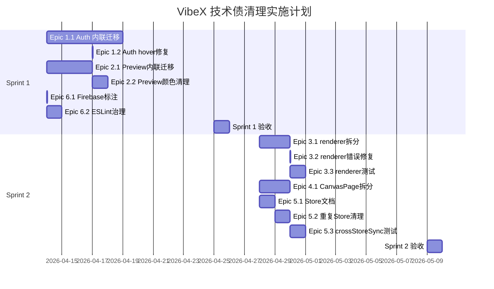

# VibeX 技术债清理 — 实施计划

**项目**: vibex-dev-proposals-task
**状态**: Planning Complete
**日期**: 2026-04-11
**Author**: Architect Agent

---

## 执行决策

- **决策**: 已采纳
- **执行项目**: team-tasks 项目 ID（待创建后绑定）
- **执行日期**: 2026-04-14（计划启动）

---

## 1. Sprint 划分概览

| Sprint | 周期 | 主要 Epic | 目标 | 工时 |
|--------|------|-----------|------|------|
| **Sprint 1** | 第 1-2 周（4.14-4.25） | Epic 1 + Epic 2 + Epic 6 | 设计系统统一 + 文档治理 | ~7 天 |
| **Sprint 2** | 第 3-4 周（4.28-5.9） | Epic 3 + Epic 4 + Epic 5 | 渲染引擎 + Canvas 拆分 + Store 规范化 | ~7 天 |

> 总工时约 12-18 天，两个 Sprint 各 6 个工作日。

---

## 2. Sprint 1 — 设计系统统一 + 文档治理

**目标**: 完成 Auth/Preview 页面 CSS Module 迁移，消除所有内联 style 字面量；建立文档治理机制。

### 2.1 Epic 1 — 设计系统统一（Auth）

#### Story 1.1 — Auth 页面内联样式迁移（3-5 天）

**代码修改点**:

| 文件 | 修改类型 | 说明 |
|------|----------|------|
| `src/app/auth/page.tsx` | 重构 | 扫描所有 `style={{}}`，替换为 CSS Module className |
| `src/app/auth/auth.module.css` | 新建 | 建立 `auth.module.css`，定义所有 Auth 页面样式 |
| `src/styles/variables.css` | 补充 | 如 `--color-primary-hover` 不存在则补充 |

**迁移步骤**:
1. 统计当前 `style={{}}` 数量：`grep -rn "style={{" src/app/auth/`
2. 按组件/区域逐个迁移（注册表单、登录表单、header、footer）
3. 验收：`grep -rn "style={{" src/app/auth/ --include="*.tsx"` 返回空
4. 运行 Playwright Auth E2E 测试截图对比

**验收条件**:
- [ ] `grep -rn "style={{" src/app/auth/` 返回空
- [ ] `auth.module.css` 文件存在且包含所有 Auth 样式
- [ ] Auth 页面视觉与 Dashboard 风格一致
- [ ] Playwright `auth.spec.ts` 全部通过

#### Story 1.2 — Auth hover 修复 + 设计变量补充（1h）

**代码修改点**:

| 文件 | 修改类型 | 说明 |
|------|----------|------|
| `src/styles/variables.css` | 修改 | 添加 `--color-primary-hover: #00e5e5` |
| `src/app/auth/auth.module.css` | 修改 | 注册按钮添加 `:hover` 样式使用变量 |

**验收条件**:
- [ ] `:hover` 时按钮背景色变化（视觉可感知）
- [ ] `--color-primary-hover` 在 `variables.css` 中已定义

---

### 2.2 Epic 2 — 设计系统统一（Preview）

#### Story 2.1 — Preview 页面内联样式迁移（2-3 天）

**代码修改点**:

| 文件 | 修改类型 | 说明 |
|------|----------|------|
| `src/app/preview/page.tsx` | 重构 | ~362 处 `style={{}}` → CSS Module className |
| `src/app/preview/preview.module.css` | 新建 | 建立 `preview.module.css`，覆盖所有 Preview 样式 |
| `src/styles/variables.css` | 补充 | 如需新变量则补充 |

**迁移策略**（362 处高风险，建议分批）:
1. **第一批**（Day 1）：静态展示类（图片、文字、卡片容器）
2. **第二批**（Day 2）：交互类（hover、active、focus 状态）
3. **第三批**（Day 3）：动态计算类（`{ width: val + '%' }` 保留，标注例外）
4. **验收**：每批完成后 `grep` 检测，截图对比

**验收条件**:
- [x] `grep -rn "style={{" src/app/preview/ --include="*.tsx"` 返回空（仅保留动态计算样式）
- [x] `preview.module.css` 文件存在且完整（~60 CSS 类）
- [ ] Preview 页面主题切换正常

#### Story 2.2 — Preview 硬编码颜色清理（1 天）

**代码修改点**:

| 文件 | 修改类型 | 说明 |
|------|----------|------|
| `src/app/preview/preview.module.css` | 重构 | `'#fff'` / `'#94a3b8'` → CSS 变量 |
| `src/styles/variables.css` | 补充 | 补充缺失的 CSS 变量 |

**验收条件**:
- [ ] `grep "'#fff'\\|'#94a3b8'" src/app/preview/` 返回空
- [ ] 所有 Preview 颜色使用 `var(--color-*)` 形式

---

### 2.3 Epic 6 — 文档与豁免治理

#### Story 6.1 — Firebase 协作状态标注（1h）

**代码修改点**:

| 文件 | 修改类型 | 说明 |
|------|----------|------|
| `README.md` | 修改 | "多人协作" 字段更新为"规划中（单用户版本）" |

**验收条件**:
- [ ] README.md 包含"多人协作: 规划中"

#### Story 7.1 — ESLint 豁免季度 review 机制（0.5 天）

**代码修改点**:

| 文件 | 修改类型 | 说明 |
|------|----------|------|
| `ESLINT_EXEMPTIONS.md` | 新建 | 包含 quarterly review 机制说明、豁免数量限制、MEMO 注释规范 |
| `.eslintrc.js` 或 `eslint.config.js` | 修改 | exhaustive-deps 豁免数量降至 ≤ 2 条 |

**验收条件**:
- [ ] `ESLINT_EXEMPTIONS.md` 存在且包含 quarterly review 机制
- [ ] exhaustive-deps 豁免 ≤ 2 条
- [ ] 新增豁免带 `// MEMO: <reason>` 注释

---

### 2.4 Sprint 1 验收清单

| 验收项 | 条件 |
|--------|------|
| Auth 内联样式 | `grep -rn "style={{" src/app/auth/` → 空 |
| Preview 内联样式 | `grep -rn "style={{" src/app/preview/` → 空 |
| Preview 硬编码颜色 | 无 `'#fff'` / `'#94a3b8'` |
| Auth hover | 按钮 hover 有视觉反馈 |
| README 状态 | "多人协作" → "规划中" |
| ESLint 豁免 | quarterly review 机制存在，豁免 ≤ 2 |
| 构建 | `pnpm build` 通过 |
| 测试 | `pnpm test` 通过 |

---

## 3. Sprint 2 — 渲染引擎重构 + Canvas 拆分 + Store 规范化

**目标**: 完成 renderer.ts 拆分、CanvasPage.tsx 缩减、Store 架构文档化。

### 3.1 Epic 3 — 渲染引擎重构

#### Story 3.1 — renderer.ts 模块拆分（2 天）

**代码修改点**:

| 新文件 | 职责 | 从原文件拆出的内容 |
|--------|------|-------------------|
| `src/lib/prototypes/renderer/types.ts` | 类型定义 | `ComponentDef`, `RenderContext`, `ThemeConfig`, 枚举类型 |
| `src/lib/prototypes/renderer/style-utils.ts` | 样式工具 | CSS 变量解析、fallback 计算、style 合并函数 |
| `src/lib/prototypes/renderer/component-renderers.ts` | 组件渲染器 | `renderHeading()`, `renderImage()`, `renderText()`, `renderButton()` |
| `src/lib/prototypes/renderer/theme-resolver.ts` | 主题解析 | `resolveTheme()`, `mapToCSSVars()`, 主题配置映射 |
| `src/lib/prototypes/renderer/main-renderer.ts` | 主渲染器 | 入口逻辑，协调子模块调用 |
| `src/lib/prototypes/renderer.ts` | 备份/兼容 | 保留原文件，添加 `@deprecated` 注释，指向新模块 |

**拆分策略**:
1. **先建 types.ts** — 所有子模块的共同依赖，无循环引用风险
2. **再拆工具函数** — style-utils.ts、theme-resolver.ts（独立无依赖）
3. **再拆组件渲染** — component-renderers.ts（依赖 types）
4. **最后主渲染器** — main-renderer.ts（依赖所有子模块）
5. **更新 renderer.ts** — 改为 re-export，标注 `@deprecated`

**验收条件**:
- [ ] 5 个子模块文件全部存在
- [x] `renderer.ts` → renderer/ 子目录，5 个模块文件（2175 行拆分完成）
- [x] `renderer.ts` 内容为 re-export + `@deprecated` 注释（向后兼容）
- [x] 36 个测试全部通过（types.test.ts 13 + style-utils.test.ts 23）

#### Story 3.2 — renderer 错误 fallback 使用 CSS 变量（1h）

**代码修改点**:

| 文件 | 修改 | 说明 |
|------|------|------|
| `renderer/component-renderers.ts` | 修改 | 错误状态背景色改用 `var(--color-error-bg)` |
| `renderer/theme-resolver.ts` | 修改 | 错误文字颜色改用 `var(--color-error)` |
| `src/styles/variables.css` | 补充 | 如不存在则补充 `--color-error-bg` |

**验收条件**:
- [ ] 错误状态无硬编码背景色/文字色

#### Story 3.3 — renderer Vitest 测试覆盖（1 天）

**代码修改点**:

| 测试文件 | 覆盖模块 | 目标覆盖率 |
|----------|----------|-----------|
| `renderer/types.test.ts` | types.ts | 80% |
| `renderer/style-utils.test.ts` | style-utils.ts | 85% |
| `renderer/component-renderers.test.ts` | component-renderers.ts | 75% |
| `renderer/theme-resolver.test.ts` | theme-resolver.ts | 80% |
| `renderer/main-renderer.test.ts` | main-renderer.ts | 70% |

**验收条件**:
- [ ] 每个子模块有独立 `.test.ts` 文件
- [ ] `pnpm vitest run --coverage` 整体覆盖率 ≥ 70%
- [ ] 所有测试用例通过

---

### 3.2 Epic 4 — Canvas 组件拆分

#### Story 4.1 — CanvasPage.tsx 职责拆分（1-2 天）

**代码修改点**:

| 文件 | 职责 | 从 CanvasPage.tsx 拆出的内容 |
|------|------|------------------------------|
| `src/components/canvas/CanvasLayout.tsx` | 三列布局容器 | 布局结构、响应式容器 |
| `src/components/canvas/CanvasHeader.tsx` | 顶部工具栏 | 工具栏按钮、操作区 |
| `src/components/canvas/CanvasPanels.tsx` | 左右侧边栏 | 面板展开/收起逻辑 |
| `src/components/canvas/CanvasPage.tsx` | 协调器 | 引用子组件 + store 连接（≤ 150 行） |
| `src/components/canvas/*.module.css` | 各子组件样式 | 每个子组件对应的 CSS Module |

**拆分步骤**:
1. **梳理状态清单** — 列出 CanvasPage 中所有 `useState`、`useCallback`、props
2. **建立子组件骨架** — 创建 `CanvasLayout.tsx` / `CanvasHeader.tsx` / `CanvasPanels.tsx`
3. **迁移布局代码** — CanvasLayout 处理三列布局
4. **迁移工具栏代码** — CanvasHeader 处理顶部操作
5. **迁移面板代码** — CanvasPanels 处理侧边栏
6. **精简 CanvasPage.tsx** — 仅保留协调逻辑，确保 ≤ 150 行
7. **验收行数 + E2E 测试**

**验收条件**:
- [ ] `CanvasPage.tsx` ≤ 150 行
- [ ] 3 个子组件文件存在
- [ ] Canvas 页面三列布局、工具栏、面板功能正常
- [ ] `pnpm playwright test canvas.spec.ts` 通过

---

### 3.3 Epic 5 — Store 体系规范化

#### Story 5.1 — Store 分层文档（0.5 天）

**代码修改点**:

| 文件 | 操作 | 说明 |
|------|------|------|
| `docs/architecture/store-architecture.md` | 新建 | Store 架构文档（职责矩阵、边界规则） |

**文档必须包含**:
- 根 stores vs canvas/stores 的职责矩阵
- Store 边界规则（何时用根 stores，何时用 canvas/stores）
- crossStoreSync 同步机制说明
- 新增 Store 的命名/放置规范

**验收条件**:
- [ ] `docs/architecture/store-architecture.md` 存在
- [ ] 包含职责矩阵（表格形式）
- [ ] 包含边界规则

#### Story 5.2 — 重复 Store 清理（1 天）

**代码修改点**:

| 操作 | 说明 |
|------|------|
| 对比 `simplifiedFlowStore` 和 `flowStore` | 确认重叠功能和差异化功能 |
| 合并或明确差异化 | 选择合并（推荐）或明确差异化定位 |
| 替换引用 | 所有引用旧 store 处更新为新 store |
| 验证功能 | 运行 Canvas E2E 测试验证无数据丢失 |

**验收条件**:
- [ ] 无功能重复的 store
- [ ] Canvas 画布数据正常
- [ ] 无数据丢失

#### Story 5.3 — crossStoreSync 测试（0.5 天）

**代码修改点**:

| 文件 | 操作 | 说明 |
|------|------|------|
| `crossStoreSync.test.ts` | 新建 | Vitest 测试 crossStoreSync 同步逻辑 |
| `crossStoreSync.ts` | 确认存在 | 同步机制已有则补充测试 |

**测试用例**:
- `it('flowStore 更新后触发同步回调')`
- `it('simplifiedFlowStore 更新后同步至 flowStore')`（如合并前）
- `it('同步失败时不影响主 store 正常工作')`

**验收条件**:
- [ ] `crossStoreSync.test.ts` 存在
- [ ] 所有测试通过
- [ ] 覆盖率 ≥ 80%

---

### 3.4 Sprint 2 验收清单

| 验收项 | 条件 |
|--------|------|
| renderer.ts 行数 | < 600 行（减少 ≥ 70%） |
| renderer 子模块 | 5 个子模块全部存在 |
| renderer 测试 | 覆盖率 ≥ 70% |
| CanvasPage.tsx 行数 | ≤ 150 行 |
| Canvas 子组件 | 3 个子组件存在 |
| Canvas E2E | Playwright 测试通过 |
| Store 文档 | `docs/architecture/store-architecture.md` 存在 |
| Store 重复 | `simplifiedFlowStore` 已清理或差异化 |
| crossStoreSync 测试 | 测试存在且通过 |
| 构建 | `pnpm build` 通过 |
| 测试 | `pnpm test` 通过 |

---

## 4. 里程碑时间线

---

## 5. 变更范围约束

| 约束 | 说明 |
|------|------|
| **不新增功能** | 本次重构仅消除技术债，不改变业务功能 |
| **不改变 API** | 对外 API（如果有）保持向后兼容 |
| **逐步合并** | renderer.ts 拆分采用先备份再替换策略 |
| **单次提交** | 每个 Story 单独 commit，方便回滚 |
| **CI 必须通过** | `pnpm build` + `pnpm test` + `pnpm lint` 全部通过方可合并 |

---

*本文档由 Architect Agent 生成，基于 PRD 和 Feature List*
