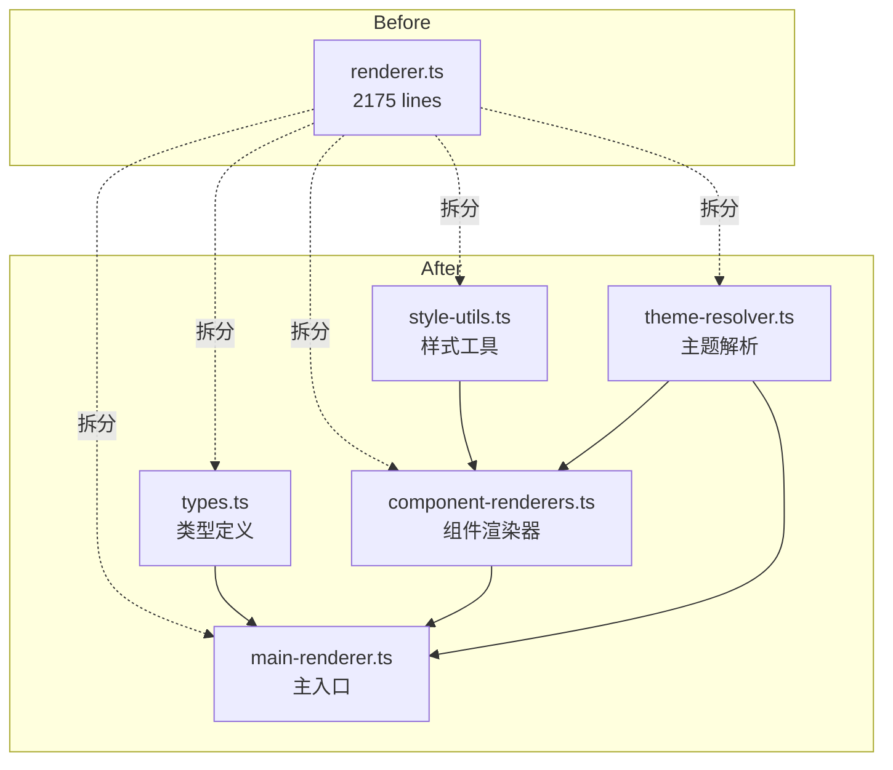
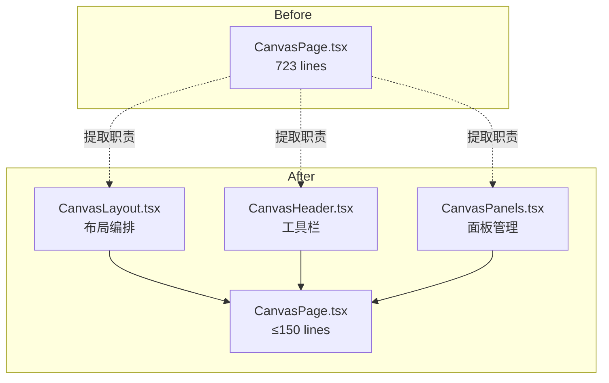

# VibeX 技术债清理 — 技术架构设计

**项目**: vibex-dev-proposals-task
**角色**: Architect
**日期**: 2026-04-11
**状态**: 设计完成

---

## 1. 技术栈

| 技术 | 选型 | 理由 |
|------|------|------|
| 前端框架 | Next.js 16.2.0 (App Router) | 现有技术栈，无变更 |
| 语言 | TypeScript (strict) | 现有技术栈，无变更 |
| 样式方案 | CSS Modules | PRD 核心目标，替代内联 style |
| 状态管理 | 现有 Zustand/React Context | Epic 5 仅做文档化，不改架构 |
| 渲染引擎 | 原型预览 renderer | Epic 3 拆分目标文件 |
| 测试 | Vitest + Playwright | 现有测试框架 |
| 代码规范 | ESLint + CLAUDE.md | 现有规范体系 |

---

## 2. 架构图

### 2.1 CSS Module 迁移架构

```mermaid
flowchart LR
    subgraph "Before"
        A1[page.tsx] --> A2[inline styles]
        A2 --> A3[style={{...}} × 362]
    end
    
    subgraph "After"
        B1[page.tsx] --> B2[CSS Module]
        B2 --> B3[*.module.css]
        B3 --> B4[CSS Variables]
        B4 --> B5[design-system]
    end
    
    A3 -.->|"迁移"| B3
```

### 2.2 renderer.ts 拆分架构



### 2.3 CanvasPage 拆分架构



---

## 3. 模块划分

| Epic | 模块 | 主要文件 | 工时 |
|------|------|----------|------|
| Epic 1 | Auth CSS Module | `src/app/auth/page.tsx`, `auth.module.css` | 3-5d |
| Epic 2 | Preview CSS Module | `src/app/preview/page.tsx`, `preview.module.css` | 3-4d |
| Epic 3 | renderer 重构 | `src/lib/prototypes/renderer/` (5 子模块) | 3d |
| Epic 4 | Canvas 拆分 | `src/components/canvas/` (4 子组件) | 1-2d |
| Epic 5 | Store 规范 | `docs/architecture/store-architecture.md` | 2d |
| Epic 6 | 文档治理 | `README.md`, ESLINT_EXEMPTIONS.md | 1h |

---

## 4. 技术风险评估

### Epic 1 & 2 — CSS Module 迁移

| 风险 | 级别 | 缓解 |
|------|------|------|
| 视觉回归 | 中 | 每步完成后截图对比；Storybook 组件级验证 |
| 样式优先级冲突 | 中 | CSS Module 隔离后需验证 specificity |
| 设计 token 不完整 | 低 | 先补全 CSS 变量再迁移，避免硬编码回填 |

### Epic 3 — renderer 重构

| 风险 | 级别 | 缓解 |
|------|------|------|
| 拆分引入运行时错误 | 高 | 保留原文件作备份；Playwright E2E 全程验证 |
| 循环依赖 | 中 | 拆分前先用 `madge --circular` 检测依赖图 |
| 测试覆盖率不足 | 中 | Epic 3.3 强制要求 ≥70% 覆盖 |

### Epic 4 — Canvas 拆分

| 风险 | 级别 | 缓解 |
|------|------|------|
| props drilling 深层传递 | 中 | 使用 React Context 在子组件间共享状态 |
| 事件处理逻辑位置变更 | 低 | 拆分时保持同文件内的 handler 内联 |

### Epic 5 — Store 规范化

| 风险 | 级别 | 缓解 |
|------|------|------|
| Store 合并后状态丢失 | 高 | 先加新 store → 验证功能 → 再删旧 store |
| 文档过时 | 低 | 文档与代码同 commit，确保同步 |

---

## 5. 测试策略

### 5.1 CSS Module 迁移

```bash
# Auth 内联样式检查
grep -rn "style={{" vibex-fronted/src/app/auth/ --include="*.tsx"
# 期望: 无输出

# Preview 内联样式检查
grep -rn "style={{" vibex-fronted/src/app/preview/ --include="*.tsx"
# 期望: 无输出

# Vitest
cd vibex-fronted && pnpm exec vitest run src/app/auth/ src/app/preview/
# 期望: 全部通过
```

### 5.2 renderer 重构

```bash
# 行数验证
wc -l vibex-fronted/src/lib/prototypes/renderer.ts
# 期望: < 600 行（减少 ≥70%）

# 模块存在验证
ls vibex-fronted/src/lib/prototypes/renderer/
# 期望: types.ts, style-utils.ts, component-renderers.ts, theme-resolver.ts, main-renderer.ts

# 覆盖率
cd vibex-fronted && pnpm exec vitest run src/lib/prototypes/renderer/ --coverage
# 期望: ≥70%
```

### 5.3 Canvas 拆分

```bash
# CanvasPage 行数验证
wc -l vibex-fronted/src/components/canvas/CanvasPage.tsx
# 期望: ≤ 150 行

# Playwright E2E
cd vibex-fronted && pnpm exec playwright test tests/e2e/canvas/
# 期望: 全部通过
```

---

## 6. ADR

### ADR-001: renderer.ts 拆分策略

**状态**: 已采纳

**决策**: 拆分为 5 个子模块，保留原文件作为备份

**理由**:
1. 2175 行单文件无法维护
2. 拆分为内聚子模块后每块可独立测试
3. 保留原文件确保拆分失败可回滚

### ADR-002: CanvasPage 拆分策略

**状态**: 已采纳

**决策**: 按 UI 区域提取（Layout/Header/Panels），CanvasPage 降为编排层

**理由**:
1. 三列布局 → CanvasLayout
2. 工具栏 → CanvasHeader
3. 面板管理 → CanvasPanels
4. 723 行 → ≤150 行

---

## 7. 技术审查 (Self-Review)

| 检查项 | 结果 | 说明 |
|--------|------|------|
| 架构可行性 | ✅ 通过 | 方案均为渐进式重构，有备份策略 |
| 功能点覆盖 | ✅ 通过 | 6 Epic 共 13 个 Story 均已设计 |
| 风险评估 | ✅ 通过 | 每个 Epic 均有风险点和缓解方案 |
| 测试策略 | ✅ 通过 | CSS grep + Vitest + Playwright 三层验证 |
| 实施计划 | ✅ 通过 | IMPLEMENTATION_PLAN.md 包含 Sprint 划分 |
| 开发约束 | ✅ 通过 | AGENTS.md 含 CSS 规范和变更禁区 |

---

## 8. 执行决策

- **决策**: 已采纳
- **执行项目**: vibex-dev-proposals-task
- **执行日期**: 2026-04-11
