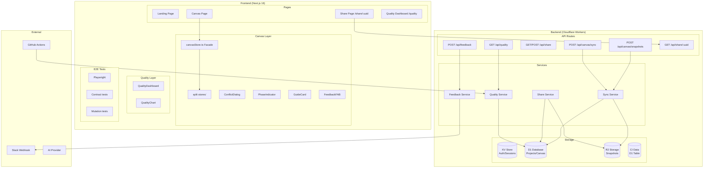
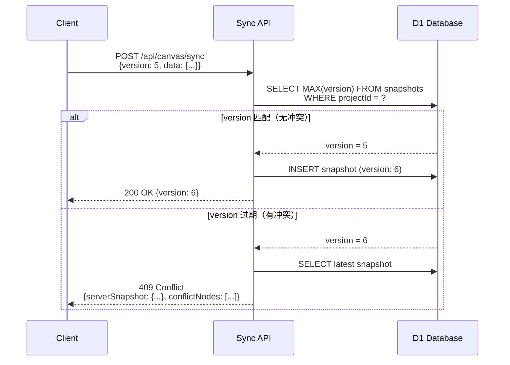
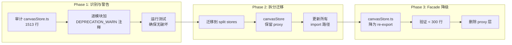
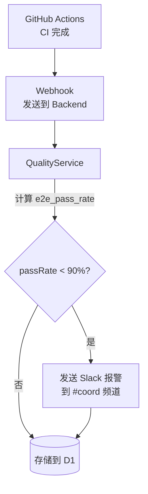
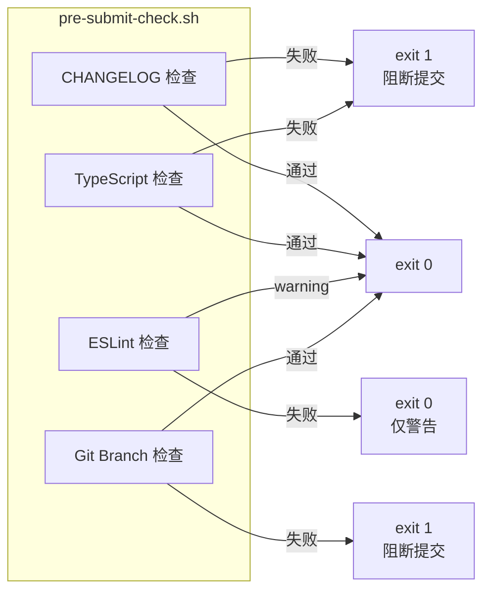
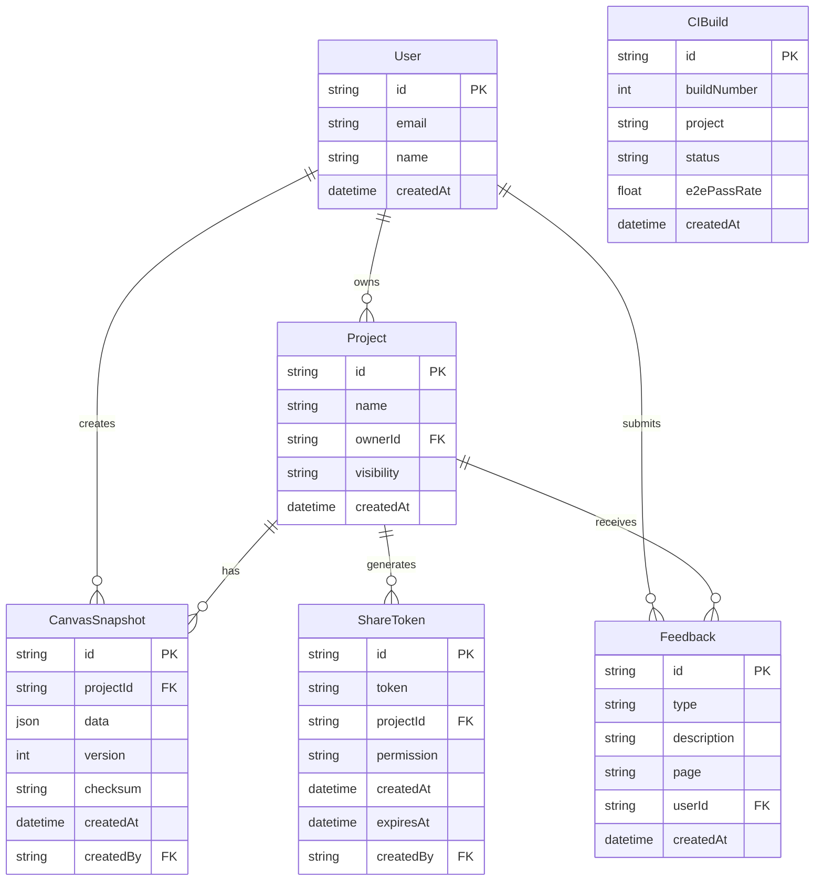
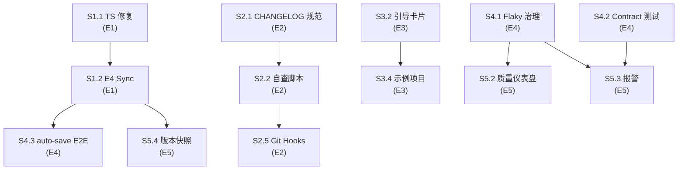

# VibeX Sprint 4 提案合并 — 系统架构设计

**项目**: vibex-proposals-summary-20260403_024652
**阶段**: design-architecture
**架构师**: Architect Agent
**日期**: 2026-04-03
**版本**: v1.0

---

## 执行决策
- **决策**: 已采纳
- **执行项目**: 待 coord 创建 Sprint 4 项目并绑定
- **执行日期**: 2026-04-03

---

## 1. 技术栈决策

### 1.1 新增依赖

| 依赖 | 版本 | 用途 | 引入位置 |
|------|------|------|---------|
| `diff` | ^5.x | 快照 diff 高亮计算 | frontend |
| `@tanstack/react-query` | ^5.x | Quality Dashboard 数据获取 | frontend |
| `recharts` | ^2.x | CI 通过率折线图 | frontend |
| `uuid` | ^9.x | 分享链接 token 生成 | backend |
| `striptags` | ^3.x | Feedback 内容清理 | backend |

### 1.2 技术约束

- **包体积增量**: ≤ 50KB (gzip)，Quality Dashboard 懒加载
- **性能目标**: Quality 页面 < 2s，Share 页面 < 1.5s
- **兼容性**: 现代浏览器 (Chrome 90+, Firefox 90+, Safari 15+)
- **降级方案**: Share 页面在未登录状态下不可编辑

---

## 2. 架构总览

### 2.1 系统层次结构



---

## 3. 核心模块设计

### 3.1 E4 Sync Protocol（冲突检测）

#### 3.1.1 数据模型

```typescript
// Canvas Snapshot Entity
interface CanvasSnapshot {
  id: string;              // UUID
  projectId: string;
  data: CanvasData;        // 完整画布 JSON
  version: number;         // 单调递增版本号
  createdAt: string;      // ISO 8601
  createdBy: string;      // User ID
  checksum: string;       // SHA-256(data)，快速比较
}

// Conflict Resolution Payload
interface ConflictPayload {
  serverVersion: CanvasSnapshot;
  localVersion: {
    data: CanvasData;
    version: number;
    checksum: string;
  };
  conflictNodes: ConflictNode[];  // 仅冲突节点列表
}

interface ConflictNode {
  id: string;
  type: 'boundedContext' | 'businessFlow' | 'component';
  serverState: any;
  localState: any;
}
```

#### 3.1.2 API 定义

```typescript
// POST /api/canvas/sync
// Request: 客户端提交本地快照
interface SyncRequest {
  projectId: string;
  data: CanvasData;
  version: number;   // 客户端知道的最新版本
  checksum: string;  // 客户端数据的 SHA-256
}

// Response: 200 OK 或 409 Conflict
interface SyncSuccessResponse {
  status: 200;
  snapshot: CanvasSnapshot;
  message: 'saved' | 'no_change';
}

interface SyncConflictResponse {
  status: 409;
  error: 'VERSION_CONFLICT';
  serverSnapshot: CanvasSnapshot;
  conflictNodes: ConflictNode[];
}

// GET /api/canvas/snapshots/:projectId
// Response: 获取快照列表（用于 S5.4 快照管理）
interface SnapshotListResponse {
  snapshots: Array<{
    id: string;
    name: string | null;
    version: number;
    createdAt: string;
    createdBy: string;
  }>;
}

// POST /api/canvas/snapshots/:projectId
// Request: 创建命名快照
interface CreateSnapshotRequest {
  name: string;  // 如 "v1.0 初始设计"
  data: CanvasData;
}
```

#### 3.1.3 ConflictDialog 三选项

```
┌──────────────────────────────────────────┐
│  ⚠️ 检测到版本冲突                         │
│                                          │
│  你的版本 (v12) 与服务端 (v13) 冲突        │
│  冲突节点: 3 个                           │
│                                          │
│  [保留本地版本]  → 强制覆盖 v13           │
│  [使用服务端版本] → 回滚到 v13             │
│  [手动合并]      → 打开 diff 视图         │
└──────────────────────────────────────────┘
```

#### 3.1.4 乐观锁策略



**Trade-off 分析**:
- ✅ 优点: 简单可靠，后端实现成本低
- ⚠️ 局限: 高并发写入时仍可能丢失（建议后续考虑 CRDT）
- 📋 缓解: E5 的版本快照可作为人工兜底

---

### 3.2 canvasStore Facade 清理

#### 3.2.1 目标状态

```
stores/
├── contextStore.ts     # 限界上下文状态（约150行）
├── flowStore.ts        # 业务流程状态（约200行）
├── componentStore.ts   # 组件/元素状态（约200行）
├── selectionStore.ts   # 选择/高亮状态（约80行）
└── uiStore.ts         # UI 状态（侧边栏、模态框，约100行）

canvasStore.ts          # 降级为 re-export 层（< 50行）
```

#### 3.2.2 迁移策略（三阶段）



#### 3.2.3 迁移验证命令

```bash
# 验证行数
wc -l src/lib/canvas/canvasStore.ts
# 目标: < 300 行

# 验证无状态定义
grep -E "useState|useReducer|create\(\)" src/lib/canvas/canvasStore.ts
# 目标: 无输出

# 验证 import 合法
grep -E "import.*from '\.\./" src/lib/canvas/canvasStore.ts
# 目标: 仅从 ./stores/ 导入
```

---

### 3.3 分享链接（Share Links）

#### 3.3.1 数据模型

```typescript
// ShareToken Entity (D1)
interface ShareToken {
  id: string;           // UUID primary key
  token: string;        // 8-char short token (唯一索引)
  projectId: string;    // FK -> projects
  permission: 'read' | 'comment';
  createdAt: string;
  expiresAt: string | null;  // null = 永不过期
  createdBy: string;
}

// API Endpoints
// POST /api/share — 创建分享链接
// GET  /api/share/:token — 获取分享项目数据（无需登录）
// POST /api/share/:token — 评论（如果支持）
```

#### 3.3.2 分享页面架构

```mermaid
flowchart TB
    U[User] --> |"访问 /share/abc123"| SP[SharePage]
    
    SP --> |"GET /api/share/abc123"| API[Share API]
    API --> |"token 验证"| DB[(D1<br/>ShareToken)]
    
    alt token 有效
        API --> |"200: 项目数据"| SP
        SP --> |"渲染只读 Canvas"| RDP[ReadOnly Canvas]
    else token 无效/过期
        API --> |"404/410"| SP
        SP --> |"渲染错误提示"| EP[Error Page<br/>"链接无效或已过期"]
    end
```

---

### 3.4 质量仪表盘（Quality Dashboard）

#### 3.4.1 CI 数据表设计

```sql
-- D1: ci_builds 表
CREATE TABLE IF NOT EXISTS ci_builds (
  id TEXT PRIMARY KEY,
  build_number INTEGER NOT NULL,
  project TEXT NOT NULL,
  branch TEXT NOT NULL,
  status TEXT NOT NULL,       -- 'success' | 'failure' | 'cancelled'
  e2e_pass_rate REAL,         -- 0.0 ~ 1.0
  e2e_total INTEGER,
  e2e_passed INTEGER,
  ts_errors INTEGER DEFAULT 0,
  eslint_warnings INTEGER DEFAULT 0,
  created_at TEXT NOT NULL DEFAULT (datetime('now'))
);

-- 索引: 按项目+时间范围查询
CREATE INDEX IF NOT EXISTS idx_ci_project_date 
ON ci_builds(project, created_at DESC);

-- GET /api/quality — 获取质量数据
interface QualityResponse {
  builds: Array<{
    buildNumber: number;
    date: string;
    status: 'success' | 'failure';
    e2ePassRate: number;
    tsErrors: number;
    eslintWarnings: number;
  }>;
  summary: {
    avgPassRate: number;      // 近10次平均
    totalBuilds: number;
    successRate: number;
  };
}
```

#### 3.4.2 报警逻辑



**报警 Webhook Payload**:
```json
{
  "channel": "#coord",
  "text": "🚨 VibeX E2E 通过率低于 90%",
  "blocks": [{
    "type": "section",
    "text": {
      "type": "mrkdwn",
      "text": "*项目*: vibex-fronted\n*构建*: #142\n*E2E 通过率*: 87.3%\n*影响*: 测试质量异常"
    }
  }]
}
```

---

### 3.5 快照版本管理

#### 3.5.1 快照对比算法

```typescript
// 使用 `diff` 库计算节点级别差异
import { diff } from 'diff';

interface SnapshotDiff {
  added: CanvasNode[];      // 绿色高亮
  removed: CanvasNode[];    // 红色高亮
  modified: Array<{
    nodeId: string;
    field: string;           // 如 'name', 'status', 'position'
    oldValue: any;
    newValue: any;
  }>;
}

// POST /api/canvas/snapshots/compare
interface CompareRequest {
  snapshotA: string;  // snapshot ID
  snapshotB: string;  // snapshot ID
}

interface CompareResponse {
  diff: SnapshotDiff;
  summary: {
    addedCount: number;
    removedCount: number;
    modifiedCount: number;
  };
}
```

#### 3.5.2 快照存储策略

```
R2 Bucket: vibex-snapshots/
├── {projectId}/
│   ├── {snapshotId}_data.json    # 完整画布数据
│   └── {snapshotId}_meta.json   # 元数据（名称、时间）
```

**限制**: 每项目最多 50 个快照，超出时 oldest 自动归档。

---

### 3.6 Feedback 收集

#### 3.6.1 API 定义

```typescript
// POST /api/feedback
interface FeedbackRequest {
  type: 'bug' | 'feature' | 'ux_issue';
  description: string;       // 必填，20-500 字
  page: string;             // 当前页面路径
  screenshot?: string;      // Base64 编码，可选
  userAgent?: string;       // 自动采集
}

interface FeedbackResponse {
  status: 200;
  ticketId: string;
  message: 'Feedback 已提交，感谢你的反馈！';
}

// Slack Webhook 格式
interface SlackFeedbackPayload {
  text: string;
  blocks: Array<{
    type: 'header' | 'section' | 'context';
    text?: { type: 'mrkdwn'; text: string };
    elements?: Array<{ type: 'mrkdwn'; text: string }>;
  }>;
}
```

**安全约束**: Feedback 数据不含 PII（自动过滤 email、password 字段）。

---

### 3.7 Pre-submit 自查脚本

#### 3.7.1 脚本架构



#### 3.7.2 Git Hooks 安装

```bash
# husky 配置（package.json 追加）
{
  "husky": {
    "hooks": {
      "pre-commit": "npx lint-staged",
      "commit-msg": "commitlint --edit"
    }
  }
}

# commitlint.config.js
module.exports = {
  extends: ['@commitlint/config-conventional'],
  rules: {
    'type-enum': [2, 'always', ['feat', 'fix', 'docs', 'refactor', 'test', 'chore']]
  }
};
```

---

## 4. API 完整定义

### 4.1 API 路由矩阵

| 方法 | 路径 | 用途 | 认证 | 优先级 |
|------|------|------|------|--------|
| POST | /api/canvas/sync | 冲突检测保存 | ✅ | P0 |
| GET | /api/canvas/snapshots/:projectId | 快照列表 | ✅ | P2 |
| POST | /api/canvas/snapshots/:projectId | 创建命名快照 | ✅ | P2 |
| POST | /api/canvas/snapshots/compare | 快照对比 | ✅ | P2 |
| POST | /api/share | 创建分享链接 | ✅ | P2 |
| GET | /api/share/:token | 获取分享项目 | ❌ | P2 |
| GET | /api/quality | CI 质量数据 | ❌ | P2 |
| POST | /api/feedback | 提交反馈 | ✅ | P1 |
| POST | /api/ci/webhook | CI 构建结果 | Webhook Token | P1 |

### 4.2 错误码规范

| HTTP 状态 | 错误码 | 含义 |
|-----------|--------|------|
| 400 | VALIDATION_ERROR | 请求参数校验失败 |
| 401 | UNAUTHORIZED | 未登录 |
| 403 | FORBIDDEN | 无权限 |
| 404 | NOT_FOUND | 资源不存在 |
| 409 | VERSION_CONFLICT | E4 同步冲突 |
| 410 | SHARE_EXPIRED | 分享链接已过期 |
| 429 | RATE_LIMITED | 请求过于频繁 |
| 500 | INTERNAL_ERROR | 服务端错误 |

---

## 5. 数据模型（核心实体）



---

## 6. 测试策略

### 6.1 测试框架

| 层级 | 框架 | 覆盖率目标 | 关键指标 |
|------|------|-----------|---------|
| 单元测试 | Vitest | > 80% | canvasStore split、diff 算法 |
| API Contract | Jest + Supertest | 100% | E4 Sync、Share API |
| E2E | Playwright | 核心路径全覆盖 | auto-save、ConflictDialog、Share |
| 突变测试 | Stryker | > 60% | canvasStore Facade 迁移后 |

### 6.2 核心测试用例

#### E4 Sync（API Contract）

```typescript
describe('E4 Sync Protocol', () => {
  it('POST /api/canvas/sync — 正常保存返回 200', async () => {
    const res = await api.post('/api/canvas/sync').send({
      projectId: 'proj-1',
      data: { nodes: [] },
      version: 1,
      checksum: sha256(data),
    });
    expect(res.status).toBe(200);
    expect(res.body.snapshot.version).toBe(2);
  });

  it('POST /api/canvas/sync — 版本冲突返回 409', async () => {
    // 先保存一个版本
    await api.post('/api/canvas/sync').send({ projectId: 'proj-1', data: {}, version: 1, checksum: 'a' });
    // 用旧版本尝试保存 → 冲突
    const res = await api.post('/api/canvas/sync').send({ projectId: 'proj-1', data: {}, version: 1, checksum: 'b' });
    expect(res.status).toBe(409);
    expect(res.body.error).toBe('VERSION_CONFLICT');
    expect(res.body.serverSnapshot).toBeDefined();
  });
});
```

#### ConflictDialog（E2E）

```typescript
describe('ConflictDialog', () => {
  it('409 响应时显示 ConflictDialog', async () => {
    // 模拟版本冲突
    await page.route('**/api/canvas/sync', (route) => {
      route.fulfill({ status: 409, body: { error: 'VERSION_CONFLICT', serverSnapshot: {} } });
    });
    
    await page.goto('/canvas/proj-1');
    // 触发 auto-save
    await page.waitForSelector('[data-testid="conflict-dialog"]');
    expect(page.getByText('版本冲突')).toBeVisible();
    expect(page.getByText('保留本地版本')).toBeVisible();
  });
});
```

#### Quality Dashboard（E2E）

```typescript
describe('Quality Dashboard', () => {
  it('显示最近 10 次 CI 通过率折线图', async () => {
    const res = await api.get('/api/quality?project=vibex-fronted&limit=10');
    expect(res.status).toBe(200);
    expect(res.body.builds.length).toBeLessThanOrEqual(10);
    expect(res.body.builds.every(b => b.e2ePassRate >= 0 && b.e2ePassRate <= 1)).toBe(true);
  });

  it('E2E 通过率 < 90% 时触发 Slack 报警', async () => {
    const webhookSpy = jest.spyOn(slackClient, 'send');
    await api.post('/api/ci/webhook').send({ project: 'vibex-fronted', e2ePassRate: 0.85 });
    expect(webhookSpy).toHaveBeenCalledWith(expect.objectContaining({ text: expect.stringContaining('90%') }));
  });
});
```

#### Share Links（E2E）

```typescript
describe('Share Links', () => {
  it('GET /api/share/:token — 无需认证返回项目数据', async () => {
    const res = await api.get('/api/share/abc123').send();
    expect(res.status).toBe(200);
    expect(res.body.data).toBeDefined();
    expect(res.body.readonly).toBe(true);
  });

  it('分享页面无法编辑', async () => {
    await page.goto('/share/abc123');
    const addBtn = page.getByTestId('add-context-btn');
    await expect(addBtn).toBeDisabled();
  });
});
```

### 6.3 Flaky 治理配置

```typescript
// playwright.config.ts
export default {
  retries: 2,           // 失败重试 2 次
  workers: 1,          // 单进程避免并发干扰
  timeout: 30000,      // 每用例 30s 超时
  expect: {
    timeout: 10000,     // 断言 10s 等待
  },
  use: {
    actionTimeout: 10000,
    navigationTimeout: 30000,
  },
} satisfies PlaywrightTestConfig;
```

---

## 7. 性能影响评估

| 功能 | 性能影响 | 缓解措施 |
|------|---------|---------|
| E4 Sync（每次 auto-save 调用 API） | RTT +50ms | beacon API + debounce 300ms |
| Quality Dashboard | 首屏 +1.5s | 懒加载 + SWR 缓存 |
| Share Page | 首屏 +0.5s | 静态生成 token 验证 |
| Snapshot 存储（R2） | 上传 +200ms | 异步写入，不阻断保存 |
| Feedback Slack | 无 | 异步，不影响前端响应 |
| Pre-submit 脚本 | 本地 +15s | 仅在 commit 时运行，不阻断开发 |

---

## 8. 风险矩阵

| 风险 | 可能性 | 影响 | 缓解 |
|------|--------|------|------|
| E4 Sync 与现有 auto-save 冲突 | 中 | 高 | Phase1 仅做冲突检测，不改保存逻辑 |
| canvasStore 迁移破坏现有功能 | 低 | 高 | 先加 deprecation 警告 + 全量测试 |
| Share 链接被滥用（爬虫抓取） | 中 | 中 | token 使用 8-char 随机字符串 |
| Quality Dashboard 数据为空 | 高 | 低 | CI webhook 触发即可填充 |
| Git Hooks 影响 Dev 效率 | 中 | 低 | 设为 Optional，可在 AGENTS.md 说明 |

---

## 9. 验收标准

- [ ] E4 Sync: `POST /api/canvas/sync` 返回 200/409，ConflictDialog 覆盖 3 种冲突场景
- [ ] canvasStore Facade: `canvasStore.ts < 300 行`，仅包含 re-export
- [ ] Share Links: `/share/:token` 无需认证可访问，`editable = false`
- [ ] Quality Dashboard: `/quality` 页面 < 2s 加载，显示近 10 次折线图
- [ ] Snapshots: 创建、列表、对比 diff 功能完整
- [ ] Feedback: 提交后 #coord 频道收到 Slack 通知
- [ ] Pre-submit 脚本: `bash scripts/pre-submit-check.sh` exit 0
- [ ] API Contract 测试: 所有新 API 有 100% 覆盖的 Jest 测试

---

## 10. 依赖关系



---

*文档版本: v1.0 | 架构师: Architect Agent | 日期: 2026-04-03*
