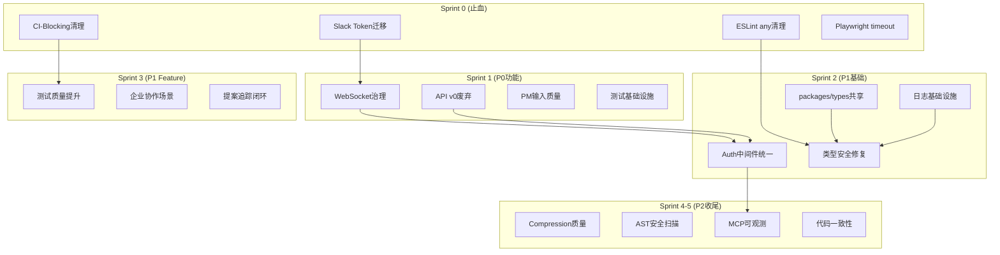

# Architecture: VibeX 提案汇总 — 5-Sprint 执行架构

**项目**: vibex-proposals-summary-20260411
**阶段**: design-architecture
**Architect**: Architect
**日期**: 2026-04-07

---

## 1. 执行摘要

本架构解决 58 条跨 Agent 提案在 5 Sprint 内的并行执行问题。核心挑战是 **Epic 依赖管理** 和 **共享基础设施的统一**。

---

## 2. 关键架构决策

### ADR-001: Sprint 0 优先于一切

**Decision**: Sprint 0 的 4 个历史 P0 必须在本 Sprint 内完成，不得带入 Sprint 1。

**理由**: 历史 P0 连续 2-3 轮未执行已成系统性风险，Slack token 硬编码已阻断所有 commit。每次心跳巡检发现遗留 P0 存在，coord 会立即报警。

### ADR-002: 共享基础设施先行

**Decision**: packages/types（E-P1-7）和 logger（E-P1-1）在 Sprint 2 优先完成，为所有下游 Epic 提供基础。

**数据流**:
```
Sprint 2
  ├── E-P1-7: packages/types 共享类型 → 依赖它的所有 Epic
  ├── E-P1-1: logger 统一 → E-P1-3 类型安全
  └── E-P1-2: Auth 中间件 → E-P2-4 MCP 可观测
```

### ADR-003: API v0/v1 双路由分阶段废弃

**Decision**: v0 路由不立即删除，先加 Deprecation header，30 天后监控使用率再决定废弃。

**理由**: 避免影响已有集成方。v1 路由逐步覆盖 v0 业务端点，contract test 仅在 v1 运行。

---

## 3. 技术架构

### 3.1 整体架构



### 3.2 共享模块依赖图

```
@vibex/logger (Sprint 2)
  ├── 替换 console.*
  ├── devDebug 统一
  └── 日志格式: JSON + 标准字段 (projectId, errorMsg, timestamp)

@vibex/types (Sprint 2)
  ├── AuthUser 类型
  ├── WebVitalsMetric
  ├── CompressionReport
  └── API Response 类型

@vibex/auth (Sprint 2)
  ├── getAuthUserFromRequest (jwtSecret 默认值)
  └── AuthMiddleware (Hono + Next.js 统一)

@webvitals-collector (Sprint 1)
  └── useWebVitals hook (已修复 ✅)

AST Scanner (Sprint 4)
  └── 代码安全扫描 (集成到 code-review/code-generation)
```

### 3.3 API 双路由架构

```
/api/v0/*  (Deprecation)
  ├── 添加 Deprecation + Sunset header
  └── 监控使用率下降至 < 5%

/api/v1/*  (主路由)
  ├── 覆盖所有 v0 业务端点
  └── contract test 仅在 v1 运行
```

### 3.4 WebSocket 连接治理

```
ConnectionPool
  ├── maxConnections: 1000 (可配置)
  ├── deadConnectionTimeout: 5min
  ├── healthCheckInterval: 30s
  └── CircuitBreaker: 连续5次失败触发熔断
```

---

## 4. 风险评估

| 风险 | 等级 | 缓解措施 |
|------|------|---------|
| 历史 P0 再次遗留 | 极高 | Sprint 0 强制完成，coord 每日追踪 |
| 提案追踪执行率低 | 高 | CLI CI 集成，PR 合并前强制更新状态 |
| API v0 废弃影响集成方 | 中 | 30天观察期，渐进废弃，v1 兜底 |
| packages/types 循环依赖 | 低 | Sprint 2 先行试点，确认后推广 |
| waitForTimeout 清理破坏测试 | 高 | 分批清理，每批 CI 验证 |

---

## 5. 性能影响

| 区域 | 影响 |
|------|------|
| 日志系统 | console → 结构化 logger，dev 模式有轻微 overhead (<1ms/call) |
| WebSocket | 连接数限制保护，OOM 风险消除 |
| 类型检查 | tsc --noEmit 通过后类型安全覆盖率 ≥ 80% |
| 测试执行 | waitForTimeout 清理后 E2E 执行速度预计提升 20-30% |

---

## 6. 验收标准

| Sprint | 关键交付 | 验证命令 |
|--------|---------|---------|
| Sprint 0 | 4 历史 P0 归零 | `grep xoxp- == 0 && grep @ci-blocking == 0` |
| Sprint 1 | 18 P0 完成 | 18 条验收标准 100% 通过 |
| Sprint 2 | 类型安全 + logger | `npx tsc --noEmit` + `grep console.* src == 0` |
| Sprint 3 | 企业协作 Feature | PM Feature E2E 100% 通过 |
| Sprint 4-5 | 全部 19 Epic | 所有 DoD checklist 完成 |

---

## 执行决策
- **决策**: 已采纳
- **执行项目**: vibex-proposals-summary-20260411
- **执行日期**: 2026-04-07
