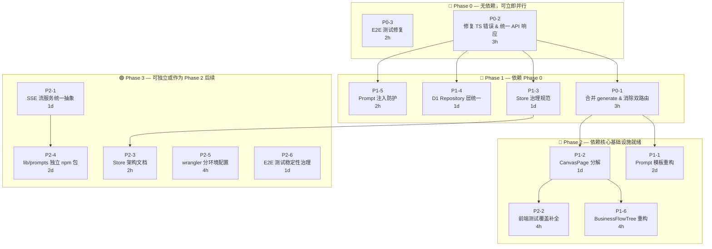

# VibeX 架构影响分析

> **项目**: vibex-proposals-20260406  
> **Agent**: architect  
> **日期**: 2026-04-06  
> **版本**: v1.0  
> **输入来源**: architect-proposals.md · summary.md · dev-proposals.md  
> **状态**: 已完成

---

## 1. 合并后的提案清单

基于三份输入文档，去重合并为 **9 个核心提案**（P0×3，P1×6，P2+×6）：

| ID | 名称 | 来源 | 优先级 | 工时 |
|----|------|------|--------|------|
| P0-1 | 合并 generate-components 实现 & 消除双 API 路由 | dev + architect | P0 | 3h |
| P0-2 | 修复 TypeScript 错误 & 统一 API 响应格式 | dev + architect | P0 | 3h |
| P0-3 | E2E 测试修复（Playwright in Jest + pre-existing 污染） | dev + tester + coord | P0 | 2h |
| P1-1 | Prompt 模板重构（分层 + 版本化）| architect | P1 | 2d |
| P1-2 | CanvasPage 分解（1120 行 → 单一职责组件）| architect + dev | P1 | 1d |
| P1-3 | Store 治理规范（29 个 Zustand store 治理）| architect + dev | P1 | 1d |
| P1-4 | D1 Repository 层统一 | architect | P1 | 1d |
| P1-5 | Prompt 注入防护增强 | architect | P1 | 2h |
| P1-6 | BusinessFlowTree 重构（920 行 → 单一职责）| dev | P1 | 4h |
| P2-1 | SSE 流服务统一抽象 | architect | P2 | 1d |
| P2-2 | 前端测试覆盖补全（Canvas / TreePanel / Toolbar）| dev | P2 | 4h |
| P2-3 | Store 架构文档 | dev | P2 | 2h |
| P2-4 | lib/prompts 独立 npm 包（版本化 / 可测试）| architect | P2 | 2d |
| P2-5 | wrangler 分环境部署配置 | architect | P2 | 4h |
| P2-6 | E2E 测试稳定性治理 | architect | P2 | 1d |

---

## 2. 提案影响矩阵（P0/P1）

评分说明：1=极低影响 / 5=极高影响

| ID | 名称 | API兼容性 | 数据迁移 | 前端影响 | 后端影响 | 测试覆盖 | 部署风险 | 总分 |
|----|------|:--------:|:--------:|:--------:|:--------:|:--------:|:--------:|:----:|
| P0-1 | 合并 generate & 消除双路由 | 5 | 3 | 2 | 4 | 2 | 3 | 19 |
| P0-2 | 修复 TS 错误 & 统一 API 响应 | 4 | 2 | 3 | 3 | 2 | 2 | 16 |
| P0-3 | E2E 测试修复 | 1 | 0 | 1 | 1 | 5 | 1 | 9 |
| P1-1 | Prompt 模板重构 | 2 | 2 | 1 | 3 | 3 | 2 | 13 |
| P1-2 | CanvasPage 分解 | 1 | 0 | 5 | 0 | 3 | 1 | 10 |
| P1-3 | Store 治理规范 | 2 | 0 | 4 | 0 | 2 | 1 | 9 |
| P1-4 | D1 Repository 层统一 | 1 | 3 | 0 | 4 | 2 | 2 | 12 |
| P1-5 | Prompt 注入防护 | 1 | 0 | 1 | 2 | 1 | 1 | 6 |
| P1-6 | BusinessFlowTree 重构 | 1 | 0 | 4 | 0 | 3 | 1 | 9 |

### 影响维度说明

| 维度 | 定义 |
|------|------|
| **API 兼容性** | 提案是否改变现有 API 契约，影响客户端 |
| **数据迁移** | 是否需要迁移现有数据或更新数据格式 |
| **前端影响** | 对前端代码结构、组件、Store 的影响范围 |
| **后端影响** | 对后端服务、路由、数据访问层的影响范围 |
| **测试覆盖** | 提案实施后测试覆盖率的提升幅度 |
| **部署风险** | 部署复杂度与回滚难度 |

### 高影响提案识别（总分 ≥ 16）

- **P0-1**（19分）：双重影响 — 既合并 API 实现又消除双路由，API 兼容性风险最高
- **P0-2**（16分）：涉及类型系统和 API 响应格式双重重构

---

## 3. 依赖关系图（Mermaid）

### 3.1 实施顺序依赖

### 3.2 依赖关系详情

| 提案 | 依赖项 | 依赖原因 |
|------|--------|---------|
| P0-1 合并 generate & 消除双路由 | P0-2（TS错误修复）| TS 错误未修复时合并风险极高 |
| P1-1 Prompt 模板重构 | P0-1 | 需 API 路由稳定后重构 prompt |
| P1-2 CanvasPage 分解 | P0-1 | 消除双路由后 canvas 组件引用稳定 |
| P1-6 BusinessFlowTree 重构 | P1-2 | CanvasPage 重构提供 hook 基础设施 |
| P2-2 前端测试覆盖补全 | P1-2 | CanvasPage 重构后组件可独立测试 |
| P2-3 Store 架构文档 | P1-3 | 需 Store 治理规范确定后再文档化 |
| P2-1 SSE 流服务统一抽象 | P0-2 | 统一 API 响应格式后抽象 SSE 层 |
| P2-4 lib/prompts 独立 npm 包 | P1-1 | 需 Prompt 模板重构完成后拆分 |

### 3.3 可独立实施的提案

以下提案无前置依赖，可随时开始：

- **P0-3**（E2E 测试修复）— 仅修改测试配置和隔离 pre-existing 失败
- **P1-5**（Prompt 注入防护）— 安全增强，可独立上线

---

## 4. 扩展性评估

| ID | 名称 | 扩展性影响 | 为后续改进打开大门 | 为后续改进关闭大门 | 风险点 |
|----|------|-----------|------------------|------------------|--------|
| P0-1 | 合并 generate & 消除双路由 | ⬆️ 显著正向 | 统一 API 后新增端点无需维护两套 | 旧 Next.js 路由废弃不可逆 | 需确认前端调用的主路由 |
| P0-2 | 修复 TS 错误 & 统一 API 响应 | ⬆️ 显著正向 | 类型安全 → 重构效率提升；统一响应 → 客户端简化 | 无 | 响应格式变更需同步前端 |
| P0-3 | E2E 测试修复 | ⬆️ 中等正向 | CI gate 启用 → 后续功能有回归保护 | 无 | 隔离 pre-existing 失败需明确边界 |
| P1-1 | Prompt 模板重构 | ⬆️ 显著正向 | 版本化 → A/B 测试、渐进优化；分层 → prompt 可复用 | 无 | 需防止分层过度设计 |
| P1-2 | CanvasPage 分解 | ⬆️ 显著正向 | 单一职责组件 → 增量功能开发速度↑；hook 可复用 | 无 | 分解过程中可能引入 bug，需测试先行 |
| P1-3 | Store 治理规范 | ➡️ 中性 | 规范 → 新 store 质量↑；但强制合并不合理的 store 可能降低灵活性 | 无 | 合并 `flowStore` + `simplifiedFlowStore` 需审慎 |
| P1-4 | D1 Repository 层统一 | ⬆️ 显著正向 | 事务边界清晰 → 数据一致性↑；Repository 可 mock → 测试可测性↑ | 无 | 现有 route 直接调用 `env.DB.prepare()` 的迁移工作量大 |
| P1-5 | Prompt 注入防护 | ➡️ 中性正向 | 安全基线提升；但误判会影响正常用户体验 | 无 | 需持续更新注入模式库 |
| P1-6 | BusinessFlowTree 重构 | ⬆️ 中等正向 | hook 可独立测试；并行开发可能性↑ | 无 | 数据转换函数 `buildFlowTreeData` 需保留行为兼容 |

### 扩展性风险警告

> **⚠️ P1-3 Store 治理 — 强制合并风险**
>
> 当前存在 `flowStore.ts` 和 `simplifiedFlowStore.ts` 两个 flow store。合并前需确认 `simplifiedFlowStore` 的使用者是否需要 `flowStore` 的全部能力。强制合并可能引入不必要复杂性（YAGNI 风险）。

> **⚠️ P2-4 lib/prompts 独立 npm 包 — 过度封装风险**
>
> 将 `lib/prompts/` 拆分为独立 npm 包 `@vibex/prompts` 需要：版本管理、npm 发布流程、跨项目依赖同步。若过早独立，会增加发布摩擦；若过晚独立，耦合已深难以拆分。建议在 P1-1（Prompt 模板重构）完成后再评估。

---

## 5. 实施优先级建议

### 5.1 推荐实施顺序

```mermaid
gantt
    title vibex-proposals-20260406 实施计划
    dateFormat  X
    axisFormat  %dd

    section Phase 0
    P0-3: P0-3, 0, 2h
    P0-2: P0-2, 0, 3h

    section Phase 1
    P0-1: P0-1, after P0-2, 3h
    P1-3: P1-3, after P0-2, 1d
    P1-4: P1-4, after P0-2, 1d
    P1-5: P1-5, after P0-2, 2h

    section Phase 2
    P1-2: P1-2, after P0-1, 1d
    P1-6: P1-6, after P1-2, 4h
    P1-1: P1-1, after P0-1, 2d

    section Phase 3
    P2-1: P2-1, after P1-2, 1d
    P2-2: P2-2, after P1-2, 4h
    P2-3: P2-3, after P1-3, 2h
    P2-4: P2-4, after P1-1, 2d
    P2-5: P2-5, 0, 4h
    P2-6: P2-6, 0, 1d
```

### 5.2 优先级决策理由

| 优先级 | 理由 |
|--------|------|
| **P0-3 最先** | 无依赖，E2E 测试可运行后所有后续提案的 PR 才有 CI 保护 |
| **P0-2 次之** | 类型系统和 API 响应格式是所有重构的地基；TS 错误阻碍 type-safe 重构 |
| **P0-1 第三** | 消除双路由后，其他所有 API 相关工作才有统一基准 |
| **P1-4 D1 Repository 与 P1-3 Store 治理并行** | 两者互不依赖，且都是架构性工作，适合并行推进 |
| **P1-2 CanvasPage 分解优先于 P1-1 Prompt 重构** | CanvasPage 是前端核心瓶颈，分解后其他前端改进可并行 |
| **P2 可全部并行或按需触发** | 无关键路径依赖，可根据团队资源灵活安排 |

### 5.3 团队分工建议

| 阶段 | 负责 Agent | 核心工作 |
|------|-----------|---------|
| Phase 0 | dev + tester | E2E 修复 + TS 错误修复 |
| Phase 1 | dev | 路由合并 + Repository 层 + Store 规范 |
| Phase 2 | dev + analyst | CanvasPage 分解 + Prompt 重构 + BusinessFlowTree |
| Phase 3 | 灵活安排 | 独立改进项，可与其他项目并行 |

---

## 6. ADR 索引

| ADR ID | 标题 | 类型 | 状态 | 关联提案 | 核心决策点 |
|--------|------|------|------|---------|-----------|
| **ADR-ARCH-001** | Canvas Store 治理规范 | 新增 | Proposed | P1-3 | 统一 selector 模式、禁止直接 `getState()`、合并冗余 store |
| **ADR-ARCH-002** | API 版本统一策略 | 新增 | Proposed | P0-1 | 废弃 `/api/*` Next.js 路由，统一迁移到 `/v1/*` Hono 路由 |
| **ADR-ARCH-003** | 统一 API 响应格式 | 新增 | Proposed | P0-2 | 确定 `{ success, data, error, timestamp }` 结构；统一错误码枚举 |
| **ADR-ARCH-004** | Prompt 模板分层规范 | 新增 | Proposed | P1-1 | 确定模板 / 渲染器 / 验证器分层；引入版本化策略 |
| **ADR-ARCH-005** | D1 Repository 层架构 | 新增 | Proposed | P1-4 | 废弃 route 直接调用 `env.DB.prepare()`；统一通过 Repository 类访问 |
| **ADR-ARCH-006** | SSE 流服务统一抽象 | 新增 | Proposed | P2-1 | 确定 `StreamService` 接口；统一超时 / 限流 / 断开处理 |
| **ADR-ARCH-007** | lib/prompts 独立包策略 | 新增 | Proposed | P2-4 | 评估 npm 包独立时机；确定版本策略和发布流程 |
| **ADR-ARCH-008** | 前端测试框架选型 | 更新 | Proposed | P0-3 | 确定 Vitest（单元）+ Playwright（E2E）分层；废弃 Stryker 与 Jest runner 不兼容问题 |

### ADR 优先级

| 批次 | ADR | 理由 |
|------|-----|------|
| **第一批**（Phase 0） | ADR-ARCH-003 统一 API 响应格式 | P0-2 立即需要，是所有 API 工作的基础 |
| **第二批**（Phase 1） | ADR-ARCH-002 + ADR-ARCH-005 | P0-1 和 P1-4 需要明确的架构决策 |
| **第三批**（Phase 2） | ADR-ARCH-001 + ADR-ARCH-004 + ADR-ARCH-008 | 前端重构和测试框架需要规范指导 |
| **第四批**（Phase 3） | ADR-ARCH-006 + ADR-ARCH-007 | 进阶改进，按需推进 |

---

## 7. 总结

### 关键发现

1. **最关键路径**：P0-2 → P0-1 → P1-2 → P1-6/P2-2，整条链路约 **3d** 工作量
2. **最高风险点**：P0-1（消除双 API 路由）影响 API 兼容性，需提前与前端团队确认调用的主路由
3. **最大架构红利**：P1-4（D1 Repository）统一数据访问层，是后续所有数据相关改进的基础
4. **最短实施路径**：P0-3（E2E 修复）独立无依赖，2h 可完成，立即建立 CI 保护

### 量化汇总

| 指标 | 数值 |
|------|------|
| P0 提案数 | 3 |
| P1 提案数 | 6 |
| P2 提案数 | 6 |
| P0 总工时 | ~8h |
| P1 总工时 | ~5d |
| P2 总工时 | ~5d |
| 需新增 ADR | 8 个 |
| 需更新 ADR | 1 个（ADR-ARCH-008）|

---

*文档版本: v1.0 | Architect | 2026-04-06*
