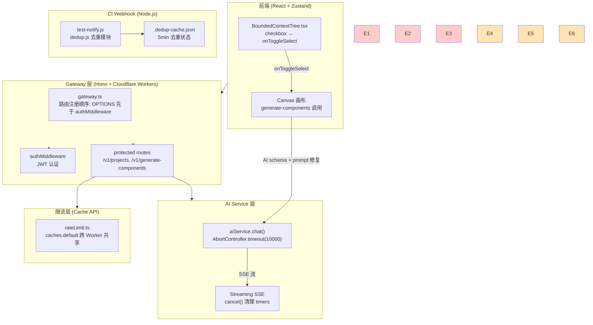
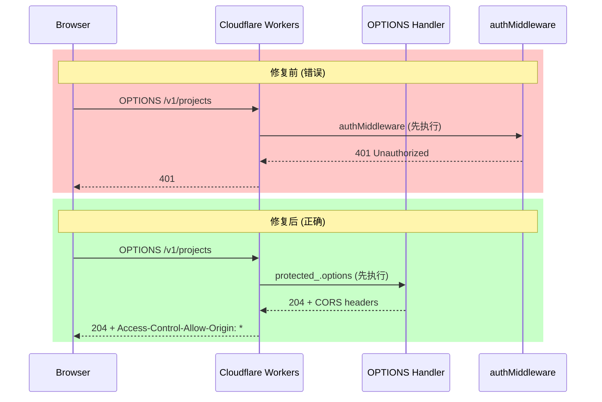
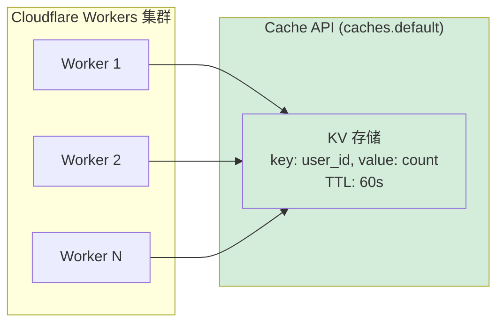
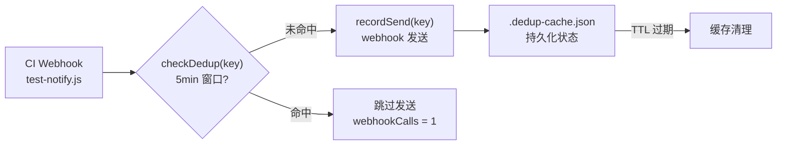

# 架构设计: vibex-proposals-summary-vibex-proposals-20260406

> **项目**: vibex-proposals-summary-vibex-proposals-20260406
> **版本**: v1.0
> **作者**: architect agent
> **日期**: 2026-04-06
> **状态**: 已采纳

---

## 执行决策

| 决策 | 状态 | 执行项目 | 执行日期 |
|------|------|----------|----------|
| E1: OPTIONS 预检路由修复 | 已采纳 | vibex-options-cors-fix | 2026-04-06 |
| E2: Canvas Context 多选修复 | 已采纳 | vibex-canvas-ctx-select-fix | 2026-04-06 |
| E3: generate-components flowId 修复 | 已采纳 | vibex-generate-components-flowid-fix | 2026-04-06 |
| E4: SSE 超时 + 连接清理 | 已采纳 | vibex-sse-timeout-fix | 2026-04-06 |
| E5: 分布式限流 (Cache API) | 已采纳 | vibex-distributed-rate-limit | 2026-04-06 |
| E6: test-notify 去重 | 已采纳 | vibex-test-notify-dedup | 2026-04-06 |
| 提案 A: vibex-e2e-test-fix | 已采纳 | vibex-e2e-test-fix | 2026-04-06 |
| 提案 B: vibex-generate-components-consolidation | 已采纳 | vibex-generate-components-consolidation | 2026-04-06 |

---

## 问题背景 (E1–E6)

### E1: OPTIONS 预检路由修复

**优先级**: P0  
**根因**: `gateway.ts` 中 `protected_.options` 在 `authMiddleware` 之后注册，所有跨域 OPTIONS 预检请求被 401 拦截。  
**影响**: 所有来自浏览器的 `POST/PUT/DELETE` 请求无法完成 CORS 预检，跨域功能完全失效。  
**提案来源**: A-P0-1, P001, T-P0-1, R-P0-1  
**工时**: 0.5h  
**修复方案**: 将 `protected_.options` handler 在 `authMiddleware` 之前注册，使 OPTIONS 请求绕过认证层。  
**验收标准**: `OPTIONS /v1/projects` → 204 + `Access-Control-Allow-*` headers，且 GET/POST 不受影响。

---

### E2: Canvas Context 多选修复

**优先级**: P0  
**根因**: `BoundedContextTree.tsx` 中 checkbox 的 `onChange` 错误绑定到 `toggleContextNode` 而非 `onToggleSelect`。  
**影响**: 用户点击 checkbox 无法触发节点选中状态更新，Canvas 多选功能完全不可用。  
**提案来源**: A-P0-2, P002, T-P0-2, R-P0-2  
**工时**: 0.3h  
**修复方案**: 将 checkbox 的 `onChange` 改为调用 `onToggleSelect`，确保选中状态正确维护。  
**验收标准**: checkbox 点击 → `selectedNodeIds` 正确更新，`onToggleSelect` 被调用，`toggleContextNode` 不受影响。

---

### E3: generate-components flowId 缺失

**优先级**: P0  
**根因**: AI schema 缺少 `flowId` 字段定义，且 prompt 未要求 AI 输出 flowId。  
**影响**: 生成的组件 `flowId` 全部为 `unknown`，无法建立组件到 flow 的映射关系。  
**提案来源**: A-P0-3, P003, T-P0-3  
**工时**: 0.3h  
**修复方案**: 在 AI schema 中添加 `flowId: string` 字段，prompt 明确要求 AI 输出 flowId。  
**验收标准**: AI 输出组件的 `flowId` 符合 `/^flow-/` 格式，不再是 `unknown`。

---

### E4: SSE 超时 + 连接清理

**优先级**: P1  
**根因**: `aiService.chat()` 使用 `setTimeout` 实现超时，但 `cancel()` 时未清理 timer，导致 Worker 泄漏。  
**影响**: 长耗时 AI 请求时 Worker 挂死，连接资源无法释放，影响系统稳定性。  
**提案来源**: A-P1-1, A-P0-2, P005  
**工时**: 1.5h  
**修复方案**: 使用 `AbortController.timeout(10000)` 包装 `aiService.chat()`；`ReadableStream.cancel()` 中清理所有 timers。  
**验收标准**: 10s 无响应时流自动关闭，`cancel()` 调用时 `clearTimeout` 被触发。

---

### E5: 分布式限流

**优先级**: P1  
**根因**: 限流使用内存 `Map` 存储计数，Cloudflare Workers 多 Worker 环境下不共享内存，限流跨实例失效。  
**影响**: 并发请求可绕过单 Worker 限流，大量请求可耗尽 Worker 资源。  
**提案来源**: A-P1-2, P005  
**工时**: 1.5h  
**修复方案**: 使用 Cloudflare Workers `caches.default` (KV-like API) 替代内存 Map，跨 Worker 共享限流状态。  
**验收标准**: 并发 100 请求后限流计数一致，后续请求收到 429；`wrangler` 配置启用 Cache API。

---

### E6: test-notify 去重

**优先级**: P1  
**根因**: JS 版本的 `test-notify.js` 缺少 5 分钟去重逻辑（Python 版已有），重复 CI webhook 触发导致重复通知。  
**影响**: CI 失败重试时重复发送 webhook，浪费资源并造成通知噪音。  
**提案来源**: A-P1-3, P004, T-P1-1  
**工时**: 1h  
**修复方案**: 新增 `dedup.js` 模块，实现 `checkDedup(key)` 和 `recordSend(key)`，状态持久化到 `.dedup-cache.json`。  
**验收标准**: 5 分钟内重复调用 `webhookCalls = 1`，状态持久化重启后仍有效。

---

## Tech Stack

| 层级 | 技术选型 | 版本 | 选型理由 |
|------|----------|------|----------|
| 运行时 | Cloudflare Workers | — | 现有生产环境，无迁移成本 |
| 后端框架 | Hono | ^4.x | 轻量、TypeScript 优先、天然支持 Worker 路由 |
| 前端框架 | React | ^18.x | 现有技术栈，无变更 |
| 状态管理 | Zustand | — | 现有技术栈，bug fix 不涉及架构变更 |
| 限流存储 | Cache API (`caches.default`) | — | Workers 原生支持，跨 Worker 共享 |
| 单元测试 | Jest | ^29.x | 现有测试框架 |
| E2E 测试 | Playwright + Jest | — | 现有测试框架，需修复集成配置 |
| 部署 | Wrangler | ^3.x | Workers 标准部署工具 |

---

## 架构图

### 整体系统架构

### E1: OPTIONS 路由修复前后对比

### E5: 分布式限流架构

### E6: test-notify 去重流程

---

## 实施计划

### Sprint 1 — P0 修复 (目标: 2026-04-06)

| Epic | 任务 | 工时 | 执行者 | 验收条件 |
|------|------|------|--------|----------|
| E1 | OPTIONS 路由顺序调整 | 0.5h | dev | `curl -X OPTIONS -I /v1/projects` → 204 |
| E2 | checkbox onChange 修复 | 0.3h | dev | checkbox 点击 → `selectedNodeIds` 更新 |
| E3 | flowId schema + prompt 修复 | 0.3h | dev | AI 输出 `flowId` 符合 `/^flow-/` |

**Sprint 1 目标**: 解除 3 个阻塞性 Bug，恢复核心功能可用性。

### Sprint 2 — P1 改进 (目标: 2026-04-07)

| Epic | 任务 | 工时 | 执行者 | 验收条件 |
|------|------|------|--------|----------|
| E4 | AbortController 超时 + cancel 清理 | 1.5h | dev | 10s 超时 + `clearTimeout` 触发 |
| E5 | Cache API 限流改造 | 1.5h | dev | 并发 100 → 429，后续请求受限 |
| E6 | dedup.js 去重模块 | 1h | dev | 5min 重复 → 跳过发送 |

**Sprint 2 目标**: 提升系统稳定性和 CI 集成质量。

### 并行提案实施

| 提案 | 目标 | 工时 | 执行者 | 验收条件 |
|------|------|------|--------|----------|
| vibex-e2e-test-fix | E2E 测试可运行，建立 CI gate | 2h | tester + dev | Playwright tests 在 CI 中通过 |
| vibex-generate-components-consolidation | 合并重复实现 | 1h | dev | 单一路由处理所有 generate-components |

---

## 测试策略

| 测试类型 | 框架 | 覆盖率目标 | 核心用例 |
|----------|------|-----------|----------|
| 单元测试 | Jest | >80% | `gateway.ts`, `rateLimit.ts`, `dedup.js` |
| 集成测试 | Jest + Supertest | 100% (API 层) | OPTIONS CORS, 限流计数 |
| E2E 测试 | Playwright (修复后) | 回归覆盖 | Canvas checkbox, generate flowId |
| 性能测试 | k6 / 自定义脚本 | 并发场景 | 100 并发限流一致性 |

---

## 风险与缓解

| 风险 | 影响 | 缓解措施 |
|------|------|----------|
| E1 修改破坏其他中间件 | OPTIONS 绕过认证可能影响安全 | 仅针对 OPTIONS method，测试覆盖 GET/POST |
| E4 SSE 超时破坏事件顺序 | 流中断可能导致前端状态不一致 | 外层 try-catch，cancel 后前端重新连接 |
| E5 Cache API 部署配置缺失 | 限流完全失效 | `wrangler.toml` 添加 `caches.default` 配置检查 |

---

## 决策记录摘要

| ADR | 决策 | 理由 |
|-----|------|------|
| ADR-E1 | OPTIONS 先于 authMiddleware | CORS 规范要求预检不被认证拦截 |
| ADR-E4 | AbortController 替代 setTimeout | 原生支持超时和取消语义，避免 timer 泄漏 |
| ADR-E5 | Cache API 替代内存 Map | Workers 多实例共享状态的唯一原生方案 |
| ADR-E6 | 文件持久化替代内存 Map | 进程重启后状态保留，简化 CI 重试场景 |

---

*文档版本: v1.0 | 最后更新: 2026-04-06*
