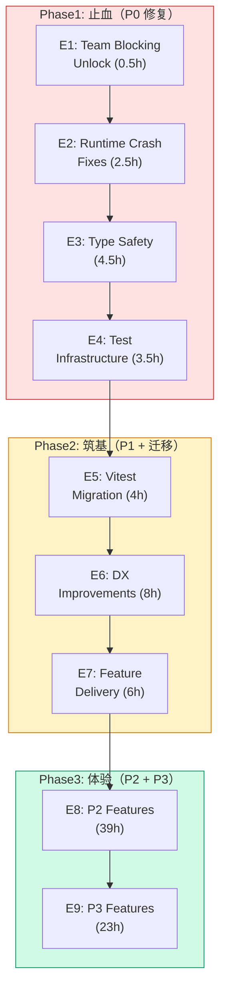
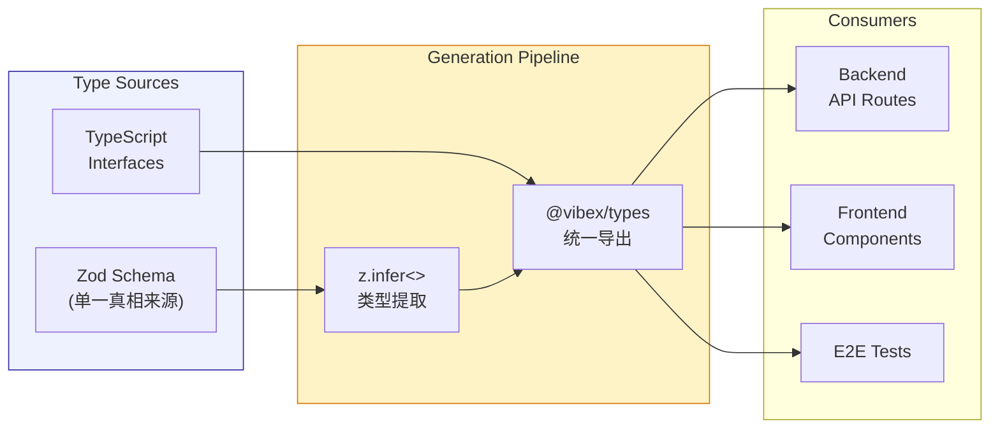
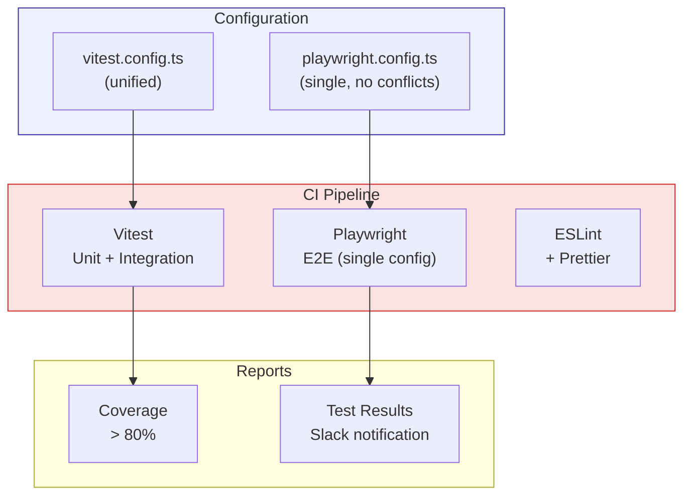

# Architecture: VibeX Quality Governance & Experience Enhancement 2026-04-10

> **项目**: vibex-proposals-summary-vibex-proposals-20260410  
> **作者**: Architect  
> **日期**: 2026-04-10  
> **版本**: v1.0

---

## 执行决策

| 决策 | 状态 | 执行项目 | 执行日期 |
|------|------|----------|----------|
| Phase1 止血优先 | **已采纳** | vibex-proposals-summary-vibex-proposals-20260410 | 2026-04-10 |
| Vitest 单框架 | **已采纳** | vibex-proposals-summary-vibex-proposals-20260410 | 2026-04-10 |
| Zod 统一 Schema | **已采纳** | vibex-proposals-summary-vibex-proposals-20260410 | 2026-04-10 |

---

## 1. Tech Stack

| 组件 | 技术选型 | 版本 | 说明 |
|------|----------|------|------|
| **类型** | TypeScript strict | ^5.5 | 严格模式，禁 `any` |
| **校验** | Zod | ^3.23 | 统一 Schema |
| **测试** | Vitest | ^1.5 | 统一测试框架 |
| **E2E** | Playwright | ^1.42 | 单一配置 |
| **监控** | Cloudflare Analytics | — | Workers 监控 |

---

## 2. 架构图

### 2.1 Epic 分层架构



### 2.2 类型安全架构



### 2.3 测试架构



---

## 3. API 定义

### 3.1 统一 Schema（Zod）

```typescript
// packages/types/src/schemas/canvas.ts
import { z } from 'zod';

// 统一 generationId（修复 sessionId vs generationId drift）
export const GenerationIdSchema = z.string().uuid();

export const GenerateComponentsSchema = z.object({
  projectId: z.string().min(1),
  prompt: z.string().min(1).max(5000),
  flowId: GenerationIdSchema.optional(), // E2E 验证
  context: z.object({
    existingNodes: z.array(z.object({
      id: z.string(),
      type: z.string(),
    })).optional(),
  }).optional(),
});

export const ChatMessageSchema = z.object({
  projectId: z.string().min(1),
  message: z.string().min(1).max(10000),
  generationId: GenerationIdSchema.optional(),
});

export const StreamingOptionsSchema = z.object({
  signal: z.instanceof(AbortSignal).optional(),
  timeout: z.number().int().min(1000).max(120000).default(60000),
});
```

### 3.2 环境变量配置

```typescript
// packages/types/src/env.ts
export const EnvSchema = z.object({
  // AI
  AI_TIMEOUT_MS: z.string().transform(Number).default('60000'),

  // Auth
  JWT_SECRET: z.string().min(32),
  SLACK_BOT_TOKEN: z.string().optional(), // P0-1: 不再硬编码

  // Rate Limiting
  REDIS_URL: z.string().url().optional(),
  RATE_LIMIT_MAX: z.string().transform(Number).default('100'),

  // Workers
  IS_CF_WORKERS: z.boolean().default(
    typeof globalThis !== 'undefined' && 'caches' in globalThis
  ),
});

export type Env = z.infer<typeof EnvSchema>;
```

---

## 4. P0 修复详细设计

### 4.1 P0-1: task_manager token 硬编码修复

```python
# 修复前
SLACK_BOT_TOKEN = "xoxb-xxxx"  # 硬编码 → GitHub secret scanning 报警

# 修复后
import os
SLACK_BOT_TOKEN = os.environ.get("SLACK_BOT_TOKEN", "")
if not SLACK_BOT_TOKEN:
    raise ValueError("SLACK_BOT_TOKEN environment variable is required")
```

### 4.2 P0-2: createStreamingResponse 闭包修复

```typescript
// 修复前
export function createStreamingResponse(generator: AsyncGenerator) {
  return new Response(new ReadableStream({
    async start(controller) {
      for await (const chunk of generator) {
        controller.enqueue(chunk); // 闭包引用未定义
      }
      controller.close();
    }
  }));
}

// 修复后
export function createStreamingResponse(
  generator: AsyncGenerator<Uint8Array>,
  options: { signal?: AbortSignal; timeout?: number } = {}
) {
  let timeoutId: ReturnType<typeof setTimeout>;

  const cleanup = () => {
    if (timeoutId) clearTimeout(timeoutId);
  };

  if (options.timeout) {
    timeoutId = setTimeout(() => {
      cleanup();
      options.signal?.throw(new Error('Streaming timeout'));
    }, options.timeout);
  }

  return new Response(
    new ReadableStream({
      async start(controller) {
        try {
          for await (const chunk of generator) {
            controller.enqueue(chunk);
          }
          controller.close();
        } catch (error) {
          controller.error(error);
        } finally {
          cleanup();
        }
      },
      cancel() {
        cleanup();
        options.signal?.abort();
      }
    }),
    {
      headers: { 'Content-Type': 'text/event-stream' },
    }
  );
}
```

### 4.3 P0-3: PrismaClient Workers 守卫

```typescript
// lib/prisma.ts
import { PrismaClient } from '@prisma/client/edge';

let prisma: PrismaClient;

function createPrismaClient() {
  // Workers 环境检测
  const isWorkers =
    typeof globalThis !== 'undefined' &&
    ('caches' in globalThis || 'navigator' in globalThis === false);

  if (isWorkers) {
    // Workers: 使用 edge-compatible client
    return new PrismaClient({
      datasources: { db: { url: process.env.DATABASE_URL } },
      log: ['error'],
    });
  }

  // Node.js: 标准 client
  return new PrismaClient();
}

// 单例模式（Workers 每次请求创建新实例）
export function getPrisma(): PrismaClient {
  if (typeof globalThis !== 'undefined' && 'caches' in globalThis) {
    // Cloudflare Workers: 请求级别实例
    return new PrismaClient();
  }
  // Node.js: 全局单例
  if (!globalThis.__prisma) {
    globalThis.__prisma = createPrismaClient();
  }
  return globalThis.__prisma;
}
```

---

## 5. 测试策略

### 5.1 Vitest 配置（统一）

```typescript
// vitest.config.ts
import { defineConfig } from 'vitest/config';

export default defineConfig({
  test: {
    environment: 'node',
    globals: true,
    coverage: {
      provider: 'v8',
      reporter: ['text', 'json', 'html'],
      thresholds: { lines: 80, functions: 80, branches: 70 },
    },
    include: ['src/**/*.test.ts', 'src/**/*.spec.ts'],
    exclude: ['node_modules', 'dist', 'e2e'],
  },
});
```

### 5.2 Playwright 单一配置

```typescript
// playwright.config.ts
import { defineConfig } from '@playwright/test';

export default defineConfig({
  testDir: './e2e', // 修复: 统一路径，不再有 ./e2e/ 目录冲突
  timeout: 30000,  // 修复: 统一 30s，不再有 10s vs 30s 冲突
  use: {
    baseURL: process.env.PLAYWRIGHT_BASE_URL ?? 'http://localhost:3000',
    screenshot: 'only-on-failure',
  },
  projects: [
    { name: 'chromium', use: { browserName: 'chromium' } },
  ],
  reporter: [
    ['html', { outputFolder: 'playwright-report' }],
    ['json', { outputFile: 'playwright-results.json' }],
  ],
  // 修复: 移除 grepInvert，避免跳过 @ci-blocking 测试
  grep: undefined,
});
```

---

## 6. Epic 工时汇总

| Epic | 主题 | 工时 | 优先级 | 阶段 |
|------|------|------|--------|------|
| E1 | Team Blocking Unlock | 0.5h | P0 | Phase1 |
| E2 | Runtime Crash Fixes | 2.5h | P0 | Phase1 |
| E3 | Type Safety + Schema | 4.5h | P0 | Phase1 |
| E4 | Test Infrastructure | 3.5h | P0 | Phase1 |
| E5 | Vitest Migration | 4h | P0 | Phase2 |
| E6 | DX Improvements | 8h | P1 | Phase2 |
| E7 | Feature Delivery | 6h | P0 | Phase2 |
| E8 | P2 Features | 39h | P2 | Phase3 |
| E9 | P3 Features | 23h | P3 | Phase3 |

**总计**: ~91h | **团队**: 2 Dev | **周期**: ~9 周

---

## 7. 风险评估

| Epic | 风险 | 概率 | 影响 | 缓解 |
|------|------|------|------|------|
| E1 | 破坏现有工具调用 | 低 | 高 | 提前通知团队 |
| E3 | `any` 清理 breaking change | 中 | 高 | 逐文件处理，CI 验证 |
| E5 | Vitest 迁移测试失败 | 中 | 中 | 并行运行验证 |
| E8 | P2 范围蔓延 | 高 | 中 | 严格 sprint 边界 |

---

## 8. 验收标准

| 检查项 | 命令 | 目标 |
|--------|------|------|
| P0-1 无硬编码 token | `grep -rn "xoxb" task_manager.py` | 无结果 |
| P0-2 streaming 无 error | `curl /api/v1/canvas/stream` | 无 ReferenceError |
| P0-3 wrangler deploy | `pnpm run deploy` | 成功 |
| P0-4 无 `any` 错误 | `pnpm exec tsc --noEmit` | 0 errors |
| E4 配置统一 | `grep "grepInvert" playwright.config` | 无结果 |
| E5 Vitest 通过 | `pnpm vitest run` | 全部通过 |
| E7 模板 + 引导 | E2E 测试 | 6/6 通过 |

---

*文档版本: v1.0 | 最后更新: 2026-04-10*
