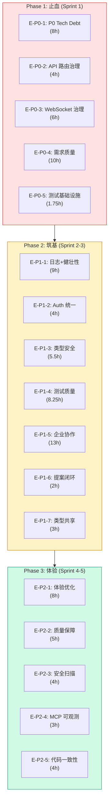

# Architecture: VibeX Proposals Summary 2026-04-11

> **项目**: vibex-proposals-summary-vibex-proposals-20260411  
> **作者**: Architect  
> **日期**: 2026-04-11  
> **版本**: v1.0

---

## 执行决策

| 决策 | 状态 | 执行项目 | 执行日期 |
|------|------|----------|----------|
| P0 止血优先 | **已采纳** | vibex-proposals-summary-vibex-proposals-20260411 | 2026-04-11 |
| 渐进式迁移 | **已采纳** | vibex-proposals-summary-vibex-proposals-20260411 | 2026-04-11 |
| 单框架测试 | **已采纳** | vibex-proposals-summary-vibex-proposals-20260411 | 2026-04-11 |

---

## 1. Tech Stack

| 组件 | 技术选型 | 版本 | 说明 |
|------|----------|------|------|
| **类型** | TypeScript strict | ^5.5 | 严格模式 |
| **校验** | Zod | ^3.23 | Schema 统一 |
| **日志** | pino | ^8.0 | 结构化日志 |
| **测试** | Vitest + Playwright | ^1.5 / ^1.42 | 单框架目标 |
| **类型共享** | @vibex/types | workspace | 统一导出 |

---

## 2. Epic 分层架构



---

## 3. 核心架构决策

### 3.1 P0 Tech Debt (E-P0-1)

**问题**: Slack token 硬编码 + ESLint any + PrismaClient Workers + @ci-blocking

```python
# task_manager.py — 环境变量化
SLACK_TOKEN = os.environ.get('SLACK_TOKEN', os.environ.get('SLACK_BOT_TOKEN', ''))
if not SLACK_TOKEN:
    raise ValueError('SLACK_TOKEN or SLACK_BOT_TOKEN required')
```

```typescript
// PrismaClient — Workers 守卫
export function getPrisma(): PrismaClient {
  const isWorkers = typeof globalThis !== 'undefined' && 'caches' in globalThis;
  if (isWorkers) return new PrismaClient();
  if (!globalThis.__prisma) globalThis.__prisma = new PrismaClient();
  return globalThis.__prisma;
}
```

### 3.2 API v0/v1 路由治理 (E-P0-2)

```typescript
// v0 路由添加 Deprecation header
export function withDeprecationHeaders(handler) {
  return async (c) => {
    const response = await handler(c);
    response.headers.set('Deprecation', 'true');
    response.headers.set('Sunset', 'Sat, 31 Dec 2026 23:59:59 GMT');
    return response;
  };
}
```

### 3.3 WebSocket 连接治理 (E-P0-3)

```typescript
export class ConnectionPool {
  static MAX_CONNECTIONS = 100;
  static HEARTBEAT_INTERVAL = 30000;
  static DEAD_CONNECTION_TIMEOUT = 300000;

  accept(socket: WebSocket): boolean {
    if (this.connections.size >= ConnectionPool.MAX_CONNECTIONS) {
      socket.close(1008, 'Too many connections');
      return false;
    }
    return true;
  }
}
```

### 3.4 类型共享 (E-P1-7)

```typescript
// packages/types/src/index.ts
export * from './schemas/canvas';
export * from './schemas/chat';

// workspace 依赖
{
  "dependencies": {
    "@vibex/types": "workspace:*"
  }
}
```

---

## 4. 测试架构

### 4.1 Playwright 配置统一

```typescript
// playwright.config.ts — 唯一配置
export default defineConfig({
  testDir: './tests/e2e',
  timeout: 60000,
  expect: { timeout: 30000 },
  // 删除 tests/e2e/playwright.config.ts
  // 删除 grepInvert
});
```

### 4.2 waitForTimeout 替换

```typescript
// 替换策略
'waitForTimeout(1000)' → await expect(locator).toBeVisible({ timeout: 5000 })
'waitForTimeout(2000)' → await page.waitForResponse(res => ...)
```

---

## 5. 工时汇总

| Phase | Epics | 工时 | 周期 |
|--------|--------|------|------|
| Phase 1: 止血 | E1-E5 | 29.75h | Sprint 1 |
| Phase 2: 筑基 | E6-E12 | 44.75h | Sprint 2-3 |
| Phase 3: 体验 | E13-E17 | 24h | Sprint 4-5 |

**总计**: ~98.5h | **团队**: 2 Dev | **周期**: ~10 周

---

## 6. 验收标准

| Epic | 检查项 | 命令 | 目标 |
|------|--------|------|------|
| E-P0-1 | 无 xoxp token | `grep "xoxp" task_manager.py` | 0 |
| E-P0-2 | v0 Deprecation | `curl -I /api/v0/agents` | 有 header |
| E-P0-3 | WebSocket 限制 | 并发 > 100 | 拒绝 |
| E-P0-5 | Playwright 配置 | `find . -name "playwright.config.ts" \| wc -l` | 1 |
| E-P1-1 | 无 console.log | `grep "console\.log" src/` | 0 |
| E-P1-3 | 无 as any | `grep "as any" src/` | 0 |
| E-P1-7 | @vibex/types | `grep "@vibex/types" src/` | >0 |
| E-P2-1 | 无 waitForTimeout | `grep "waitForTimeout" tests/` | 0 |

---

*文档版本: v1.0 | 最后更新: 2026-04-11*
