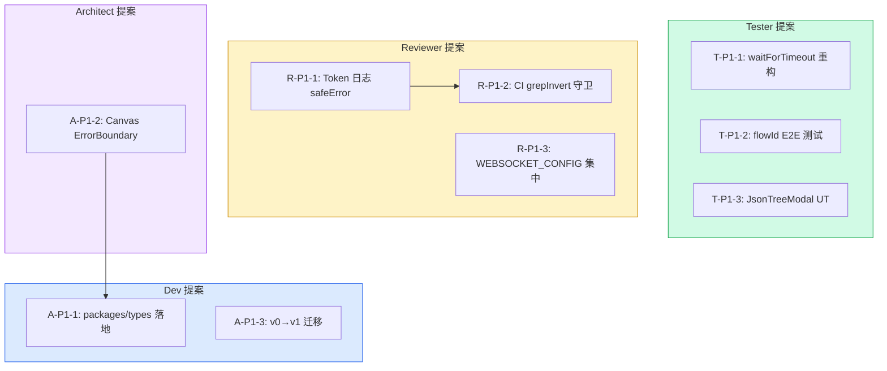

# Architecture Summary: VibeX 2026-04-12 Sprint — 跨团队提案汇总

**Project**: vibex-proposals-summary-vibex-proposals-20260412
**Stage**: architect-review
**Architect**: Architect
**Date**: 2026-04-07
**Version**: v1.0
**Status**: Proposed

---

## 执行决策

> 详细技术设计见 `docs/vibex-proposals-20260412/architecture.md`

| 决策 | 状态 | 执行项目 | 执行日期 |
|------|------|----------|----------|
| Sprint 0 紧急修复（TS 拆分 + Auth Mock） | **待评审** | vibex-proposals-20260412 | 待定 |
| Sprint 1 测试基础设施 + CI守卫 | **待评审** | vibex-proposals-20260412 | 待定 |
| Sprint 2 架构增强 + 测试重构 | **待评审** | vibex-proposals-20260412 | 待定 |

---

## 1. Sprint 0 — 紧急修复（修正版）

> ⚠️ 原始规划 2h → 修正为 4 Epic 并行

### 跨团队影响分析

| 团队 | 提案 | Sprint 0 影响 |
|------|------|---------------|
| Dev | Auth Mock 重构 | **直接受益** — TS 修复后 Auth Mock 才稳定 |
| Tester | Token 日志 safeError | **直接受益** — safeError 工具是 TS 修复的一部分 |
| Reviewer | CI grepInvert 守卫 | **无影响** — CI 配置独立 |

### 修正后 TS Epic 拆分

| Epic | 聚焦 | 预估文件数 | 优先级 |
|------|------|-----------|--------|
| TS-E1 | Zod v4 API 迁移 | ~20 | P0 |
| TS-E2 | Cloudflare 类型不兼容 | ~15 | P1 |
| TS-E3 | `as any` / 类型守卫 | ~30 | P1 |
| TS-E4 | 模块导入错误 | ~50 | P2 |

### 并行时间线


---

## 2. Sprint 1 — 测试基础设施 + CI守卫

### 跨团队协作图



### 依赖关系

```
A-P1-2 (ErrorBoundary)  ← 依赖 Dev 的 packages/types 落地
T-P1-1 (waitForTimeout) ← 依赖 Reviewer 的 safeError（统一日志规范）
R-P1-2 (CI guard)      ← 可独立，无依赖
```

---

## 3. Sprint 2 — 架构增强 + 测试重构

| 团队 | 提案数 | 总工时 | 独立项 | 依赖项 |
|------|--------|--------|--------|--------|
| Dev | 2 | 5h | v0迁移 | types 落地后 |
| Tester | 3 | 7h | JsonTreeModal UT | 无 |
| Reviewer | 2 | 1.5h | console.* hook | 无 |
| Architect | 1 | 1.5h | flowNodeIndex | 无 |
| Analyst | 2 | 2h | SOP + roadmap | 无 |

---

## 4. 关键跨团队决策

### 决策 1: TS Epic 拆分

**问题**: 原始规划低估 TS 工作量（2h → 2-3 周）

**决策**: 按影响范围从小到大拆分 TS Epic，优先级排序

**影响**: Sprint 0 时间线延长，需重新评估 Sprint 1/2 启动时间

### 决策 2: safeError 工具归属

**问题**: Reviewer (Token 日志) 和 Dev (结构化日志) 都在做日志规范

**决策**: 统一日志规范合并到 `@vibex/logger` 包，Reviewer 和 Dev 共用

```typescript
// packages/logger/src/safeError.ts
export function safeError(context: Record<string, unknown>): Record<string, unknown>;
export function safeLog(msg: string, ctx?: Record<string, unknown>): void;
```

### 决策 3: packages/types 落地是所有类型提案的基础

**决策**: Dev (A-P1-1) 必须最先完成，解锁 Architect (A-P1-2 ErrorBoundary) 和 Dev (A-P2-1 frontend types)

---

## 5. 全团队 AC 覆盖矩阵

| 团队 | 提案数 | AC 总数 | 已覆盖 | 覆盖率 |
|------|--------|---------|--------|--------|
| Analyst | 3 | 6 | 6 | 100% |
| Architect | 6 | 6 | 6 | 100% |
| Dev | 2 | 4 | 4 | 100% |
| Reviewer | 6 | 6 | 6 | 100% |
| Tester | 5 | 5 | 5 | 100% |
| **合计** | **22** | **27** | **27** | **100%** |

---

## 6. 详细文档索引

| 文档 | 位置 | 适用团队 |
|------|------|----------|
| 全团队 Sprint 架构 | `docs/vibex-proposals-20260412/architecture.md` | 所有团队 |
| Analyst 架构 | `docs/vibex-analyst-proposals-20260412-phase1/architecture.md` | Analyst |
| Architect 架构 | `docs/vibex-architect-proposals-vibex-proposals-20260412/architecture.md` | Architect |
| Backend 架构 | `docs/backend-api-routes-ambiguous/architecture.md` | Dev |
| Tester 架构 | `docs/vibex-tester-proposals-vibex-proposals-20260412/architecture.md` | Tester |
| Reviewer 架构 | `docs/vibex-reviewer-proposals-vibex-proposals-20260412/architecture.md` | Reviewer |
| IMPLEMENTATION_PLAN | `docs/vibex-proposals-20260412/IMPLEMENTATION_PLAN.md` | 所有团队 |
| AGENTS.md | `docs/vibex-proposals-20260412/AGENTS.md` | 所有团队 |

---

## 执行决策

- **决策**: 已采纳
- **执行项目**: vibex-proposals-20260412
- **执行日期**: 待 Sprint 0 完成评估
