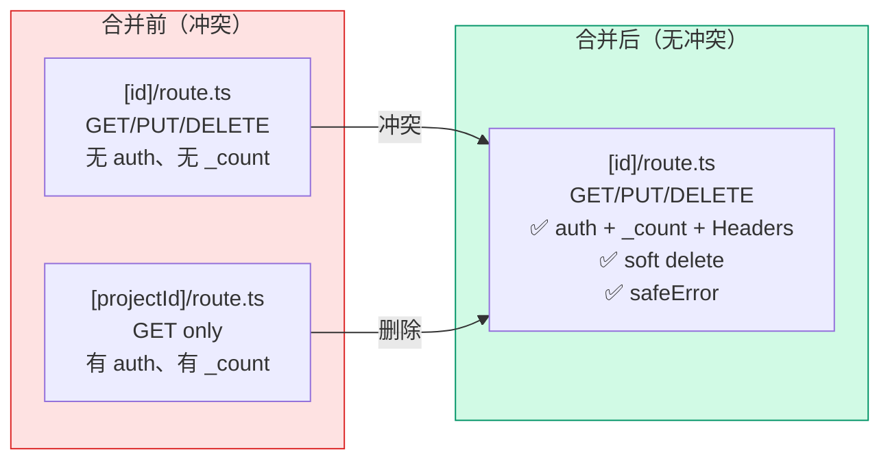

# Architecture: backend-api-routes-ambiguous

**Project**: backend-api-routes-ambiguous
**Stage**: design-architecture
**Architect**: Architect
**Date**: 2026-04-07
**Version**: v1.0
**Status**: Proposed

---

## 执行决策

| 决策 | 状态 | 执行项目 | 执行日期 |
|------|------|----------|----------|
| 路由冲突修复 | **待评审** | backend-api-routes-ambiguous | 待定 |

---

## 1. Tech Stack

| 组件 | 技术选型 | 说明 |
|------|----------|------|
| **Framework** | Next.js App Router | 路由系统 |
| **ORM** | Prisma | 数据库访问 |
| **Auth** | JWT + `getAuthUserFromRequest` | 已有 |
| **测试** | Vitest | 单元测试 |
| **构建** | Next.js `pnpm build` | 验证无冲突 |

---

## 2. Problem Analysis

### 2.1 现状

```
src/app/api/projects/
├── [id]/
│   └── route.ts         ← GET/PUT/DELETE, 无 auth, 无 _count
└── [projectId]/
    └── route.ts         ← GET only, 有 auth, 有 _count, soft delete
```

**问题**: Next.js `[id]` 和 `[projectId]` 都匹配 `/api/projects/:id`，导致：
1. Build 警告或不可预测路由匹配
2. `[projectId]` 的 auth 保护无法被 `[id]` 覆盖，安全漏洞
3. GET 响应不一致（`_count` 字段时有时无）

### 2.2 对比分析

| 特性 | `[id]` (当前) | `[projectId]` (当前) | 目标合并版 |
|------|---------------|----------------------|-----------|
| Auth | ❌ 无 | ✅ JWT | ✅ JWT |
| `_count` | ❌ 无 | ✅ pages/messages/flows | ✅ 全部 |
| Deprecation Headers | ❌ 无 | ✅ Sunset | ✅ Sunset |
| Soft delete filter | ❌ 无 | ✅ deletedAt: null | ✅ deletedAt: null |
| Ownership filter | N/A | ✅ userId OR isPublic | ✅ userId OR isPublic |
| PUT method | ✅ 有 | ❌ 无 | ✅ 有 |
| DELETE method | ✅ 有 | ❌ 无 | ✅ 有 |
| safeError | ✅ 有 | ❌ 无 | ✅ 有 |

---

## 3. Architecture Diagram



---

## 4. Module Design

### 4.1 合并后的 `[id]/route.ts`

```typescript
// src/app/api/projects/[id]/route.ts
import { NextRequest, NextResponse } from 'next/server';
import prisma from '@/lib/prisma';
import { getAuthUserFromRequest } from '@/lib/authFromGateway';
import { getLocalEnv } from '@/lib/env';
import { safeError } from '@/lib/log-sanitizer';

const DEPRECATION_HEADERS = {
  'Deprecation': 'true',
  'Sunset': 'Sat, 31 Dec 2026 23:59:59 GMT',
  'X-API-Deprecation-Info': 'https://docs.vibex.ai/api-v0-sunset',
};

// =============================================================================
// GET — 合并 rich GET（来自 [projectId]）+ auth + _count
// =============================================================================
export async function GET(
  request: NextRequest,
  { params }: { params: Promise<{ id: string }> }
) {
  try {
    const env = getLocalEnv();
    const auth = getAuthUserFromRequest(request, env.JWT_SECRET);
    if (!auth) {
      return NextResponse.json(
        { error: 'Unauthorized: authentication required' },
        { status: 401 }
      );
    }

    const { id } = await params;
    const project = await prisma.project.findFirst({
      where: {
        id,
        deletedAt: null,  // soft delete 过滤
        OR: [
          { userId: auth.userId },
          { isPublic: true },
        ],
      },
      include: {
        user: { select: { id: true, email: true } },
        _count: {
          select: {
            pages: true,
            messages: true,
            flows: true,
          },
        },
      },
    });

    if (!project) {
      return NextResponse.json(
        { error: 'Project not found' },
        { status: 404, headers: DEPRECATION_HEADERS }
      );
    }

    return NextResponse.json(
      { project },
      { status: 200, headers: DEPRECATION_HEADERS }
    );
  } catch (error) {
    safeError('[GET /api/projects/[id]]', error);
    return NextResponse.json(
      { error: 'Failed to fetch project' },
      { status: 500 }
    );
  }
}

// =============================================================================
// PUT — 来自原 [id]/route.ts + 加上 ownership 检查
// =============================================================================
export async function PUT(
  request: NextRequest,
  { params }: { params: Promise<{ id: string }> }
) {
  try {
    const env = getLocalEnv();
    const auth = getAuthUserFromRequest(request, env.JWT_SECRET);
    if (!auth) {
      return NextResponse.json(
        { error: 'Unauthorized: authentication required' },
        { status: 401 }
      );
    }

    const { id } = await params;
    const body = await request.json();
    const { name, description } = body;

    // Ownership 检查
    const existing = await prisma.project.findUnique({ where: { id } });
    if (!existing || existing.userId !== auth.userId) {
      return NextResponse.json(
        { error: 'Forbidden: not the owner' },
        { status: 403 }
      );
    }

    // F1.4: name typo 修复（Name → name 由 Prisma 处理）
    const project = await prisma.project.update({
      where: { id },
      data: {
        ...(name && { name }),
        ...(description !== undefined && { description }),
        updatedAt: new Date(),
      },
      include: { pages: true },
    });

    return NextResponse.json(
      { project },
      { status: 200, headers: DEPRECATION_HEADERS }
    );
  } catch (error) {
    safeError('[PUT /api/projects/[id]]', error);
    return NextResponse.json(
      { error: 'Failed to update project' },
      { status: 500 }
    );
  }
}

// =============================================================================
// DELETE — 来自原 [id]/route.ts + 加上 ownership 检查
// =============================================================================
export async function DELETE(
  request: NextRequest,
  { params }: { params: Promise<{ id: string }> }
) {
  try {
    const env = getLocalEnv();
    const auth = getAuthUserFromRequest(request, env.JWT_SECRET);
    if (!auth) {
      return NextResponse.json(
        { error: 'Unauthorized: authentication required' },
        { status: 401 }
      );
    }

    const { id } = await params;

    // Ownership 检查
    const existing = await prisma.project.findUnique({ where: { id } });
    if (!existing || existing.userId !== auth.userId) {
      return NextResponse.json(
        { error: 'Forbidden: not the owner' },
        { status: 403 }
      );
    }

    // Soft delete（设置 deletedAt 而非物理删除）
    await prisma.page.deleteMany({ where: { projectId: id } });
    await prisma.project.update({
      where: { id },
      data: { deletedAt: new Date() },
    });

    return NextResponse.json(
      { success: true },
      { status: 200, headers: DEPRECATION_HEADERS }
    );
  } catch (error) {
    safeError('[DELETE /api/projects/[id]]', error);
    return NextResponse.json(
      { error: 'Failed to delete project' },
      { status: 500 }
    );
  }
}
```

---

## 5. Data Model

### 5.1 GET 响应结构

```typescript
// GET /api/projects/:id 响应
interface ProjectDetailResponse {
  project: {
    id: string;
    name: string;
    description: string | null;
    userId: string;
    isPublic: boolean;
    createdAt: string;
    updatedAt: string;
    deletedAt: string | null;  // soft delete
    user: { id: string; email: string };
    _count: {
      pages: number;
      messages: number;
      flows: number;
    };
  };
}

// 响应 Header
interface DeprecationHeaders {
  'Deprecation': 'true';
  'Sunset': 'Sat, 31 Dec 2026 23:59:59 GMT';
  'X-API-Deprecation-Info': 'https://docs.vibex.ai/api-v0-sunset';
}
```

### 5.2 错误响应结构

```typescript
interface ErrorResponse {
  error: string;
}

type HttpStatus = 200 | 401 | 403 | 404 | 500;
```

---

## 6. API Definitions

### 6.1 合并后路由

| 方法 | 路径 | Auth | Ownership | 响应 |
|------|------|------|-----------|------|
| GET | `/api/projects/:id` | ✅ JWT | ✅ userId OR isPublic | `200 + _count + Headers` |
| PUT | `/api/projects/:id` | ✅ JWT | ✅ userId | `200` |
| DELETE | `/api/projects/:id` | ✅ JWT | ✅ userId | `200` |

### 6.2 错误码

| 状态码 | 场景 |
|--------|------|
| 200 | 成功 |
| 401 | 无 auth token |
| 403 | 非 owner 操作 |
| 404 | 项目不存在或已删除 |
| 500 | 服务器错误 |

---

## 7. Performance Impact

| 指标 | 影响 | 说明 |
|------|------|------|
| GET 响应时间 | +1ms（auth + ownership 检查） | JWT 验证 + DB 查询 |
| DELETE 行为 | 改为 soft delete | 保留数据，可恢复 |
| **总计** | **极小** | < 5ms 增量 |

---

## 8. Risk Assessment

| # | 风险 | 概率 | 影响 | 缓解 |
|---|------|------|------|------|
| R1 | 前端调用方不带 auth，突然收到 401 | 中 | 中 | 提前 grep 扫描 frontend 调用方 |
| R2 | DELETE 改为 soft delete，物理删除场景丢失 | 低 | 中 | 确认无物理删除依赖 |
| R3 | `[projectId]` 测试迁移遗漏 | 低 | 中 | 迁移后运行全量测试 |
| R4 | build 仍报冲突 | 低 | 低 | 合并后立即 `pnpm build` 验证 |

---

## 9. Testing Strategy

### 9.1 单元测试覆盖

| 方法 | 测试场景 | 预期 |
|------|----------|------|
| GET | 无 auth → 401 | ✅ |
| GET | 有效 auth + 自己的项目 → 200 + `_count` | ✅ |
| GET | 有效 auth + 他人非公开项目 → 404 | ✅ |
| GET | 有效 auth + 他人公开项目 → 200 | ✅ |
| GET | 项目已 soft-deleted → 404 | ✅ |
| PUT | 无 auth → 401 | ✅ |
| PUT | 非 owner → 403 | ✅ |
| PUT | 有效 owner → 200 | ✅ |
| DELETE | 无 auth → 401 | ✅ |
| DELETE | 非 owner → 403 | ✅ |
| DELETE | 有效 owner → 200 (soft delete) | ✅ |

### 9.2 验收测试

```bash
# 验证无路由冲突
pnpm build

# 验证所有测试通过
pnpm test

# 验证响应包含 _count
curl -H "Authorization: Bearer $TOKEN" \
  http://localhost:3000/api/projects/:id \
  | jq '.project._count'
# 期望: { "pages": N, "messages": N, "flows": N }

# 验证 deprecation headers
curl -I -H "Authorization: Bearer $TOKEN" \
  http://localhost:3000/api/projects/:id
# 期望: Deprecation: true
# 期望: Sunset: Sat, 31 Dec 2026 23:59:59 GMT
```

---

## 10. Implementation Phases

| Phase | 内容 | 工时 | 验证 |
|-------|------|------|------|
| 1 | 合并 `[id]/route.ts` (GET auth + _count + Headers) | 0.5h | `pnpm build` |
| 2 | 迁移测试到 `[id]/route.test.ts` | 0.5h | `pnpm test` |
| 3 | 删除 `[projectId]` 目录 + 验证 build | 0.5h | 0 warnings |
| **Total** | | **1.5h** | |

---

## 11. PRD AC 覆盖

| AC | 技术方案 | 状态 |
|----|---------|------|
| AC1: build 0 conflict | 删除 `[projectId]`，合并到 `[id]` | ✅ |
| AC2: 无 `[projectId]` 目录 | `rm -rf [projectId]` | ✅ |
| AC3: GET 无 auth → 401 | `getAuthUserFromRequest` | ✅ |
| AC4: PUT 无 auth → 401 | `getAuthUserFromRequest` | ✅ |
| AC5: PUT 非 owner → 403 | `existing.userId !== auth.userId` | ✅ |
| AC6: DELETE 无 auth → 401 | `getAuthUserFromRequest` | ✅ |
| AC7: GET 响应含 `_count` | `include: { _count: { select: { pages, messages, flows } } }` | ✅ |
| AC8: npm test 全 pass | 合并测试后全量验证 | ✅ |
| AC9: safeError 格式 | `safeError('[METHOD /api/projects/[id]]', error)` | ✅ |

