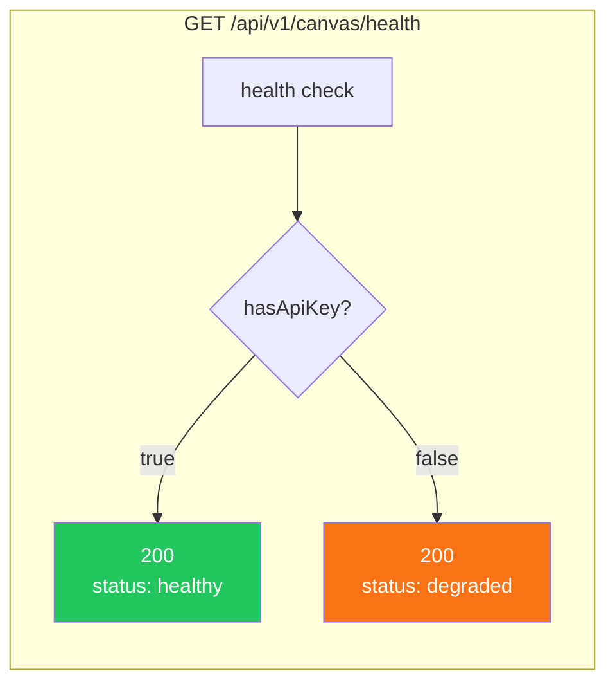

# Architecture — canvas-api-500-fix

**项目**: canvas-api-500-fix
**Architect**: Architect Agent
**日期**: 2026-04-04
**仓库**: /root/.openclaw/vibex

---

## 1. 执行摘要

修复 `POST /api/v1/canvas/generate-contexts` 返回 500 错误（`TypeError: Promise did not resolve to Response`），增强错误处理，增加 API 健康检查端点。

| Epic | Stories | 影响文件 | 工时 | 风险 |
|------|---------|----------|------|------|
| E1 (P0) | S1-S3 | generate-contexts/route.ts | 1h | 低 |
| E2 (P1) | S1 | health/route.ts（新建） | 0.5h | 低 |
| E3 (P1) | S1 | generate-contexts.test.ts / health.test.ts | 0.5h | 低 |

**总工时**: 2h

---

## 2. 系统架构图

### 2.1 错误修复前后对比

```mermaid
graph TD
    subgraph "修复前（500 崩溃）"
        REQ1[POST /generate-contexts] --> VAL1{requirementText<br/>验证？}
        VAL1 -->|空值| AI1[aiService.generateJSON]
        AI1 --> EX[未捕获异常 ❌]
        EX --> CRASH[500 Internal Error<br/>Promise未resolve]
    end

    subgraph "修复后（统一 Response）"
        REQ2[POST /generate-contexts] --> VAL2{requirementText<br/>验证？}
        VAL2 -->|空值| RESP1[NextResponse.json<br/>status: 400]
        VAL2 -->|有效| KEY[API Key 检查]
        KEY -->|缺失| RESP2[NextResponse.json<br/>status: 500]
        KEY -->|存在| AI2[aiService.generateJSON]
        AI2 --> CATCH[.catch() 捕获]
        CATCH --> RESP3[NextResponse.json<br/>status: 200/500]
    end

    style CRASH fill:#ef4444,color:#fff
    style RESP1 fill:#22c55e,color:#fff
    style RESP2 fill:#22c55e,color:#fff
    style RESP3 fill:#22c55e,color:#fff
```

### 2.2 健康检查端点架构



---

## 3. 技术方案

### 3.1 E1-F1: 输入验证

```typescript
// generate-contexts/route.ts
export async function POST(request: NextRequest): Promise<NextResponse> {
  try {
    const body = await request.json().catch(() => null);

    // E1-F1: 输入验证
    if (!body || typeof body.requirementText !== 'string' || !body.requirementText.trim()) {
      return NextResponse.json(
        { success: false, contexts: [], generationId: '', confidence: 0, error: 'requirementText 不能为空' },
        { status: 400 }
      );
    }
    // ...
  } catch (err) {
    // E1-F3: 统一返回 JSON Response，不抛出
    return NextResponse.json(
      { success: false, contexts: [], generationId: '', confidence: 0, error: '服务器内部错误' },
      { status: 500 }
    );
  }
}
```

### 3.2 E1-F2: API Key 环境检查

```typescript
// E1-F2: 添加在 aiService 调用前
if (!process.env.MINIMAX_API_KEY) {
  return NextResponse.json(
    { success: false, contexts: [], generationId: '', confidence: 0, error: 'AI 服务未配置（API Key 缺失）' },
    { status: 500 }
  );
}
```

### 3.3 E1-F3: AI 服务 .catch() 防御

```typescript
// E1-F3: 添加 .catch() 防止未捕获异常
const result = await aiService
  .generateJSON<BoundedContextResponse[]>(prompt, undefined, { temperature: 0.3, maxTokens: 3072 })
  .catch(err => {
    console.error('[generate-contexts] AI service error:', err);
    return { success: false, error: err.message, data: null };
  });
```

### 3.4 E2-S1: 健康检查端点

```typescript
// src/app/api/v1/canvas/health/route.ts
export async function GET(): Promise<NextResponse> {
  const hasApiKey = !!process.env.MINIMAX_API_KEY;
  const status = hasApiKey ? 'healthy' : 'degraded';

  return NextResponse.json({
    status,
    hasApiKey,
    timestamp: new Date().toISOString(),
    endpoints: {
      'generate-contexts': '/api/v1/canvas/generate-contexts',
      'generate-flows': '/api/v1/canvas/generate-flows',
      'generate-components': '/api/v1/canvas/generate-components',
    },
  }, { status: hasApiKey ? 200 : 503 });
}
```

---

## 4. 接口定义

### 4.1 API Response Schema

```typescript
// 所有 API 端点统一响应格式
interface CanvasAPIResponse<T = unknown> {
  success: boolean;      // 操作是否成功
  contexts?: T[];        // 数据（失败时为空数组）
  generationId?: string; // 生成ID
  confidence?: number;   // 置信度 0-1
  error?: string;        // 错误信息（success=false 时有）
}

// HTTP 状态码约定
// 200: 成功
// 400: 请求参数错误（validation failed）
// 500: 服务器内部错误（AI service failure）
// 503: 服务不可用（API key missing）
```

### 4.2 健康检查响应

```typescript
interface HealthResponse {
  status: 'healthy' | 'degraded';
  hasApiKey: boolean;
  timestamp: string;  // ISO 8601
  endpoints: Record<string, string>;
}
```

---

## 5. 测试策略

| Epic | 测试文件 | 覆盖率目标 |
|------|---------|-----------|
| E1 | `generate-contexts.test.ts` | > 80% |
| E2 | `health.test.ts` | > 90% |
| E3 | 同上 | > 80% |

```typescript
// generate-contexts.test.ts 核心用例
describe('generate-contexts API', () => {
  it('空字符串返回 400', async () => {
    const res = await POST(req({ requirementText: '' }));
    expect(res.status).toBe(400);
  });
  it('无 API Key 返回 500 且有 error 字段', async () => {
    const res = await POST(req({ requirementText: 'test' }));
    const body = await res.json();
    expect(body).toHaveProperty('error');
    expect(body.success).toBe(false);
  });
  it('有效输入返回 200 且有 success 字段', async () => {
    const res = await POST(req({ requirementText: '这是一个测试需求' }));
    expect([200, 500]).toContain(res.status); // 200=成功，500=AI服务问题
    const body = await res.json();
    expect(body).toHaveProperty('success');
    expect(body).toHaveProperty('contexts');
  });
});

// health.test.ts
it('有 API Key 返回 healthy', async () => {
  const res = await GET();
  expect(res.status).toBe(200);
});
it('无 API Key 返回 degraded + 503', async () => {
  const res = await GET();
  expect(res.status).toBe(503);
});
```

---

## 6. 性能影响评估

| 变更 | 性能影响 | 评估 |
|------|---------|------|
| 输入验证（trim） | < 1ms | 可忽略 |
| API Key 检查 | < 1ms | 可忽略 |
| .catch() 防御 | < 1ms | 可忽略 |
| 健康检查端点 | < 5ms | 极小 |

**结论**: 所有变更无性能影响。

---

*本文档由 Architect Agent 生成于 2026-04-05 00:00 GMT+8*
