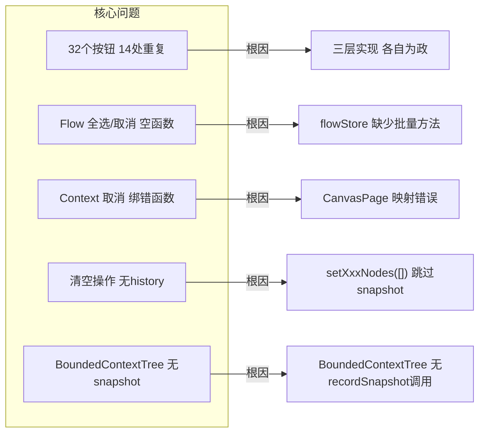
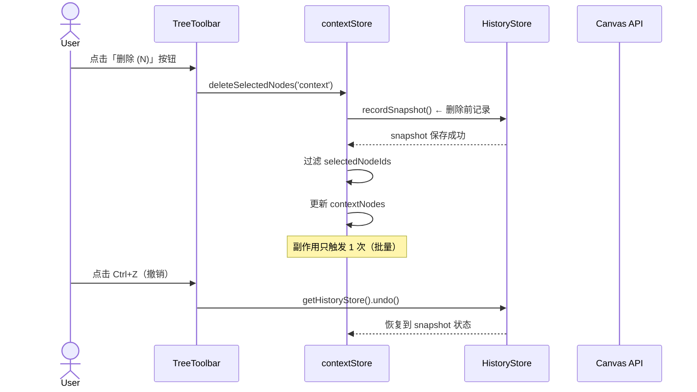

# Canvas 按钮系统清理架构文档

> **项目**: canvas-button-cleanup  
> **作者**: architect  
> **日期**: 2026-04-06  
> **版本**: v1.0

---

## 执行决策

- **决策**: 已采纳
- **执行项目**: canvas-button-cleanup
- **执行日期**: 2026-04-06

---

## 问题背景

Canvas 三栏面板（Context / Flow / Component）按钮系统存在三层实现混乱：

| 层级 | 来源 | 按钮数 | 问题 |
|------|------|--------|------|
| 层级 1 | TreeToolbar（统一工具栏） | ~4 | 部分绑定错误 |
| 层级 2 | 各 Tree 组件内部 | ~12 | 硬编码重复 |
| 层级 3 | CanvasPage extraButtons | ~1 | Mock 假数据 |

**核心数据**：
- 三栏合计 **32 个按钮**，14 处功能重复
- **2 处事件绑定错误**（Context「取消」绑成 selectAllNodes；Flow 全选/取消空函数）
- **3 处 Store 空实现**（contextStore flow 分支全空）
- **3 处跳过 history 快照**（清空操作无撤销）
- **4 处功能缺失**（Flow 缺 selectAll/clear/delete/reset）

---

## Tech Stack

| 层级 | 技术 | 版本 | 说明 |
|------|------|------|------|
| 前端框架 | Next.js 15 (App Router) | ^15.0 | React Server Components |
| 状态管理 | Zustand | ^5.0 | Canvas 子 store 体系 |
| 样式 | CSS Modules + CSS Variables | - | 组件隔离 |
| 测试 | Jest + React Testing Library | latest | 组件级测试 |
| 代码规范 | ESLint + TypeScript strict | - | 无新依赖 |

**关键约束**：不引入新依赖，不改变现有 API 接口，不破坏现有 Ctrl+Z 行为。

---

## 架构图

### 目标按钮体系（每栏 6 个按钮）

```mermaid
graph TB
    subgraph TreeToolbar["TreeToolbar（唯一按钮入口）"]
        TA1["✓ 全选"]
        TA2["○ 取消"]
        TA3["🔄 重新生成"]
        TA4["✕ 删除"]
        TA5["↺ 重置"]
        TA6["→ 继续"]
    end

    subgraph ContextStore["contextStore"]
        CS1["selectAllNodes('context')"]
        CS2["clearNodeSelection('context')"]
        CS3["setContextNodes() + recordSnapshot"]
        CS4["deleteSelectedNodes('context')"]
        CS5["resetContextCanvas()"]
        CS6["autoGenerateFlows()"]
    end

    subgraph FlowStore["flowStore（新建）"]
        FS1["selectAllNodes()"]
        FS2["clearNodeSelection()"]
        FS3["autoGenerateFlows() + recordSnapshot"]
        FS4["deleteSelectedNodes()"]
        FS5["resetFlowCanvas()"]
        FS6["generateComponents()"]
    end

    subgraph ComponentStore["componentStore"]
        CO1["selectAllNodes()"]
        CO2["clearNodeSelection()"]
        CO3["setComponentNodes() + recordSnapshot"]
        CO4["deleteSelectedNodes()"]
        CO5["clearComponentCanvas()"]
        CO6["triggerPrototypeGeneration()"]
    end

    TA1 -->|"Context"| CS1
    TA2 -->|"Context"| CS2
    TA3 -->|"Context"| CS3
    TA4 -->|"Context"| CS4
    TA5 -->|"Context"| CS5
    TA6 -->|"Context"| CS6

    TA1 -->|"Flow"| FS1
    TA2 -->|"Flow"| FS2
    TA3 -->|"Flow"| FS3
    TA4 -->|"Flow"| FS4
    TA5 -->|"Flow"| FS5
    TA6 -->|"Flow"| FS6

    TA1 -->|"Component"| CO1
    TA2 -->|"Component"| CO2
    TA3 -->|"Component"| CO3
    TA4 -->|"Component"| CO4
    TA5 -->|"Component"| CO5
    TA6 -->|"Component"| CO6

    style TreeToolbar fill:#667eea,color:#fff
    style ContextStore fill:#48bb78,color:#fff
    style FlowStore fill:#ed8936,color:#fff
    style ComponentStore fill:#38b2ac,color:#fff
```



### 现状问题映射



### 数据流序列图（删除操作）



---

## Epic 接口与数据流定义

### E1: BoundedContextTree History 修复（P0）

**根因**: `BoundedContextTree.tsx` 中没有任何 `getHistoryStore().recordSnapshot()` 调用。

**涉及文件**: `BoundedContextTree.tsx`

**数据流**:
```
用户操作（delete/edit/add）
  → 调用对应 store 方法
  → recordSnapshot() 在调用前执行
  → 状态更新
  → Ctrl+Z 时从 snapshot 恢复
```

**接口定义**:
```typescript
// BoundedContextTree.tsx 修复点
import { getHistoryStore } from '@/lib/canvas/stores/historyStore'

// 删除后 snapshot
const handleDelete = (nodeId: string) => {
  getHistoryStore().getState().recordSnapshot()  // ✅ 新增
  deleteContextNode(nodeId)
}

// 编辑确认后 snapshot
const handleEditConfirm = (nodeId: string, name: string, description: string) => {
  getHistoryStore().getState().recordSnapshot()  // ✅ 新增
  editContextNode(nodeId, { name, description })
}

// 新增后 snapshot
const handleAdd = (node: BoundedContextNode) => {
  getHistoryStore().getState().recordSnapshot()  // ✅ 新增
  addContextNode(node)
}
```

**验收标准**:
- `expect(getHistoryStore().getState().canUndo()).toBe(true)` 删除/编辑/新增后
- 手动：Ctrl+Z 能正确撤销 Context 树操作

---

### E2: TreeToolbar 按钮逻辑修复（P0）

**根因**: `CanvasPage.tsx` 中 TreeToolbar 映射错误：
- Context 栏：`onDeselectAll` 绑成了 `selectAllNodes`
- Flow 栏：`onSelectAll` 和 `onDeselectAll` 都是空函数

**涉及文件**: `CanvasPage.tsx`、`flowStore.ts`、`componentStore.ts`

**数据流**:
```
TreeToolbar onDeselectAll 点击
  → CanvasPage 绑定函数
  → 正确调用 clearNodeSelection / flowStore.clearNodeSelection
  → selectedNodeIds 正确清空
```

**接口定义**:
```typescript
// CanvasPage.tsx（修复后）

// Context 栏
<TreeToolbar
  treeType="context"
  nodeCount={contextNodes.length}
  selectedCount={selectedNodeIds.context.length}
  onSelectAll={() => contextStore.selectAllNodes('context')}
  onDeselectAll={() => contextStore.clearNodeSelection('context')}  // ✅ 修复
  onRegenerate={handleContextRegenerate}
  onDelete={() => contextStore.deleteSelectedNodes('context')}
  onReset={() => {
    getHistoryStore().getState().recordSnapshot()  // ✅ 重置也要 snapshot
    contextStore.setContextNodes([])
  }}
  onContinue={handleContinueToFlow}
/>

// Flow 栏
<TreeToolbar
  treeType="flow"
  nodeCount={flowNodes.length}
  selectedCount={flowSelectedIds.length}
  onSelectAll={() => flowStore.selectAllNodes()}   // ✅ flowStore 方法
  onDeselectAll={() => flowStore.clearNodeSelection()}  // ✅ flowStore 方法
  onRegenerate={handleFlowRegenerate}
  onDelete={() => flowStore.deleteSelectedNodes()}   // ✅ flowStore 方法
  onReset={() => {
    getHistoryStore().getState().recordSnapshot()
    flowStore.setFlowNodes([])
  }}
  onContinue={handleContinueToComponent}
/>
```

**flowStore 需新增方法**（E2 + E4）:
```typescript
// flowStore.ts 新增
selectAllNodes: () => void     // 选中所有 flowNodes
clearNodeSelection: () => void  // 清空 flow 选中
deleteSelectedNodes: () => void // 删除选中的 flowNodes
resetFlowCanvas: () => void     // 重置（含 history）

selectAllNodes: () => set(s => ({
  selectedNodeIds: { ...s.selectedNodeIds, flow: s.flowNodes.map(n => n.nodeId) }
})),

clearNodeSelection: () => set(s => ({
  selectedNodeIds: { ...s.selectedNodeIds, flow: [] }
})),

deleteSelectedNodes: () => {
  const snapshot = getHistoryStore().getState().recordSnapshot()
  set(s => ({
    flowNodes: s.flowNodes.filter(n => !s.selectedNodeIds.flow.includes(n.nodeId)),
    selectedNodeIds: { ...s.selectedNodeIds, flow: [] }
  }))
},

resetFlowCanvas: () => {
  getHistoryStore().getState().recordSnapshot()
  set({ flowNodes: [], selectedNodeIds: { ...get().selectedNodeIds, flow: [] } })
},
```

**验收标准**:
- `expect(onDeselectAll).toBe(contextStore.clearNodeSelection)` Context 栏
- `expect(flowStore.selectAllNodes).toBeDefined()` Flow 栏
- `expect(selectedNodeIds.flow.length).toBe(0)` 取消后

---

### E3: 删除操作 Snapshot 统一（P1）

**根因**: `BusinessFlowTree` 和 `ComponentTree` 的删除操作未统一记录 snapshot。

**涉及文件**: `BusinessFlowTree.tsx`、`ComponentTree.tsx`

**数据流**:
```
删除选中节点
  → recordSnapshot() 先执行
  → 批量删除节点
  → canUndo = true
  → Ctrl+Z 恢复
```

**接口定义**:
```typescript
// BusinessFlowTree.tsx（修复后）
const handleDeleteSelected = () => {
  getHistoryStore().getState().recordSnapshot()  // ✅ 新增
  flowStore.deleteSelectedNodes()
}

// ComponentTree.tsx（修复后）
const handleDeleteSelected = () => {
  getHistoryStore().getState().recordSnapshot()  // ✅ 新增
  componentStore.deleteSelectedNodes()
}
```

**验收标准**:
- `expect(getHistoryStore().getState().canUndo()).toBe(true)` Flow/Component 删除后

---

### E4: Store Batch Delete 方法（P1）

**根因**: 当前用 `forEach` 逐个删除，N 次副作用。

**涉及文件**: `contextStore.ts`、`flowStore.ts`、`componentStore.ts`

**接口定义**:
```typescript
// contextStore.ts 新增
deleteAllNodes: () => void  // 批量删除所有节点，一次副作用

deleteAllNodes: () => {
  const snapshot = getHistoryStore().getState().recordSnapshot()
  set({ contextNodes: [], selectedNodeIds: { ...get().selectedNodeIds, context: [] } })
},

// componentStore.ts 新增
deleteAllNodes: () => void  // 已有部分实现，补全

// 注意：BoundedContextTree 内的 forEach 删除改为调用 deleteAllNodes
// 删除全部: contextStore.deleteAllNodes() 替代 forEach 循环
```

**验收标准**:
- `expect(typeof contextStore.deleteAllNodes).toBe('function')` ✓
- 调用后 `expect(contextNodes.length).toBe(0)` ✓
- 副作用只触发 1 次（非 N 次）✓

---

## TreeToolbar 统一接口

```typescript
// TreeToolbar.tsx（扩展为 6 按钮）
interface TreeToolbarProps {
  treeType: 'context' | 'flow' | 'component'
  nodeCount: number
  selectedCount: number
  onSelectAll: () => void
  onDeselectAll: () => void
  onRegenerate: () => void
  onDelete: () => void
  onReset: () => void
  onContinue?: () => void
  continueLabel?: string
  continueDisabled?: boolean
}
```

**按钮规范（每栏固定 6 个）**：
| # | 按钮 | 图标 | 功能 |
|---|------|------|------|
| 1 | 全选 | ✓ | `onSelectAll()` |
| 2 | 取消 | ○ | `onDeselectAll()` |
| 3 | 重新生成 | 🔄 | `onRegenerate()` |
| 4 | 删除 | ✕ | `onDelete()`（仅 selectedCount > 0 时显示）|
| 5 | 重置 | ↺ | `onReset()` |
| 6 | 继续 | → | `onContinue()`（可选显示）|

---

## 技术审查（风险评估）

| 风险 | 级别 | 描述 | 缓解措施 |
|------|------|------|----------|
| snapshot 重复记录 | 低 | recordSnapshot 在组件层和 store 层都调用 | 组件层统一调用，store 层不调用 snapshot |
| Flow 选择状态迁移 | 中 | flowStore 新建 selectAll 时需要访问 selectedNodeIds.flow | 选择状态保留在 flowStore 内部，contextStore 不再持有 flow 分支 |
| Ctrl+Z 行为被破坏 | 高 | 修改 history 调用可能影响撤销链 | 先在 Playwright 中录制约束用例，修改后回归 |
| 批量删除遗漏中间状态 | 低 | deleteAllNodes 是原子操作，无需中间状态 | 使用 Zustand set 原子更新 |

---

## 测试策略

### 测试框架

| 测试类型 | 框架 | 覆盖目标 |
|----------|------|----------|
| 单元测试 | Jest | store 方法逻辑 |
| 组件测试 | Jest + RTL | TreeToolbar 按钮绑定 |
| E2E 测试 | Playwright | Ctrl+Z 撤销流程 |

### 覆盖率要求

- 核心逻辑覆盖率 > 80%
- 每个 Epic 至少 2 个正向用例 + 1 个负向用例

### 核心测试用例

#### E1: History Snapshot
```typescript
describe('BoundedContextTree history', () => {
  it('records snapshot after delete', () => {
    getHistoryStore().getState().recordSnapshot()
    deleteContextNode('node-1')
    expect(getHistoryStore().getState().canUndo()).toBe(true)
  })

  it('records snapshot after edit', () => {
    getHistoryStore().getState().recordSnapshot()
    editContextNode('node-1', { name: 'New Name' })
    expect(getHistoryStore().getState().canUndo()).toBe(true)
  })

  it('undo restores deleted node', () => {
    addContextNode({ nodeId: 'new-node', name: 'Test' })
    getHistoryStore().getState().recordSnapshot()
    deleteContextNode('new-node')
    getHistoryStore().getState().undo()
    expect(contextNodes.find(n => n.nodeId === 'new-node')).toBeDefined()
  })
})
```

#### E2: TreeToolbar 按钮绑定
```typescript
describe('TreeToolbar button mapping', () => {
  it('Context deselectAll calls clearNodeSelection', () => {
    const clearSpy = jest.spyOn(contextStore, 'clearNodeSelection')
    render(<TreeToolbar treeType="context" onDeselectAll={clearSpy} ... />)
    fireEvent.click(screen.getByText('○'))
    expect(clearSpy).toHaveBeenCalled()
  })

  it('Flow selectAll is no longer empty function', () => {
    expect(typeof flowStore.selectAllNodes).toBe('function')
    flowStore.selectAllNodes()
    expect(flowStore.getState().selectedNodeIds.flow.length).toBe(flowNodes.length)
  })
})
```

#### E4: Batch Delete
```typescript
describe('batch delete', () => {
  it('deleteAllNodes clears all nodes in one operation', () => {
    const originalLength = contextNodes.length
    contextStore.deleteAllNodes()
    expect(contextStore.getState().contextNodes).toHaveLength(0)
  })
})
```

---

## 实施计划

### Sprint 1（全部 2h，可并行）

| Epic | 内容 | 工时 | 依赖 |
|------|------|------|------|
| E1 | BoundedContextTree History 修复 | 0.5h | 无 |
| E2 | TreeToolbar 按钮逻辑修复 | 0.5h | E4（flowStore 方法先行）|
| E3 | 删除操作 Snapshot 统一 | 0.5h | 无 |
| E4 | Store Batch Delete 方法 | 0.5h | 无 |

**实施顺序**: E4 → E2（因为 E2 依赖 flowStore 新方法），E1 和 E3 可并行。

### 详细步骤

**E4: Store Batch Delete（先做，为 E2 铺路）**
```
1. flowStore.ts 新增 selectAllNodes/clearNodeSelection/deleteSelectedNodes/resetFlowCanvas
2. contextStore.ts 新增 deleteAllNodes
3. componentStore.ts 新增 deleteAllNodes（如缺失）
4. Jest 测试覆盖新增方法
```

**E2: TreeToolbar 按钮逻辑（依赖 E4）**
```
1. CanvasPage.tsx 修正 Context 栏 onDeselectAll 映射
2. CanvasPage.tsx 修正 Flow 栏 onSelectAll/onDeselectAll/onDelete/onReset
3. 验证 TreeToolbar 在三栏均正确工作
4. Playwright E2E 测试
```

**E1: BoundedContextTree History**
```
1. BoundedContextTree.tsx 定位 delete/edit/add 操作
2. 在每处操作前插入 recordSnapshot() 调用
3. 手动 Ctrl+Z 测试
4. Jest 测试覆盖
```

**E3: 删除 Snapshot 统一**
```
1. BusinessFlowTree.tsx 在 deleteSelectedNodes 前插入 recordSnapshot
2. ComponentTree.tsx 在 deleteSelectedNodes 前插入 recordSnapshot
3. Ctrl+Z 测试 Flow/Component 撤销
```

---

## 回滚方案

| Epic | 回滚命令 |
|------|----------|
| E1 | `git checkout HEAD -- vibex-fronted/src/components/canvas/BoundedContextTree.tsx` |
| E2 | `git checkout HEAD -- vibex-fronted/src/lib/canvas/stores/flowStore.ts vibex-fronted/src/app/canvas/page.tsx` |
| E3 | `git checkout HEAD -- vibex-fronted/src/components/canvas/BusinessFlowTree.tsx vibex-fronted/src/components/canvas/ComponentTree.tsx` |
| E4 | `git checkout HEAD -- vibex-fronted/src/lib/canvas/stores/flowStore.ts vibex-fronted/src/lib/canvas/stores/contextStore.ts` |

---

## 验收标准汇总

| ID | Given | When | Then |
|----|-------|------|------|
| AC1 | Context 树节点 | 删除/编辑/新增后 Ctrl+Z | 状态恢复到操作前 |
| AC2 | TreeToolbar 全选按钮 | Flow/Component 栏点击 | 对应 store 所有节点被选中 |
| AC3 | TreeToolbar 取消按钮 | Flow/Component 栏点击 | 所有节点取消选中 |
| AC4 | Flow/Component 删除 | deleteSelectedNodes 后 | history canUndo = true |
| AC5 | Store batch delete | 调用 deleteAllNodes | 节点清空，副作用只触发一次 |
