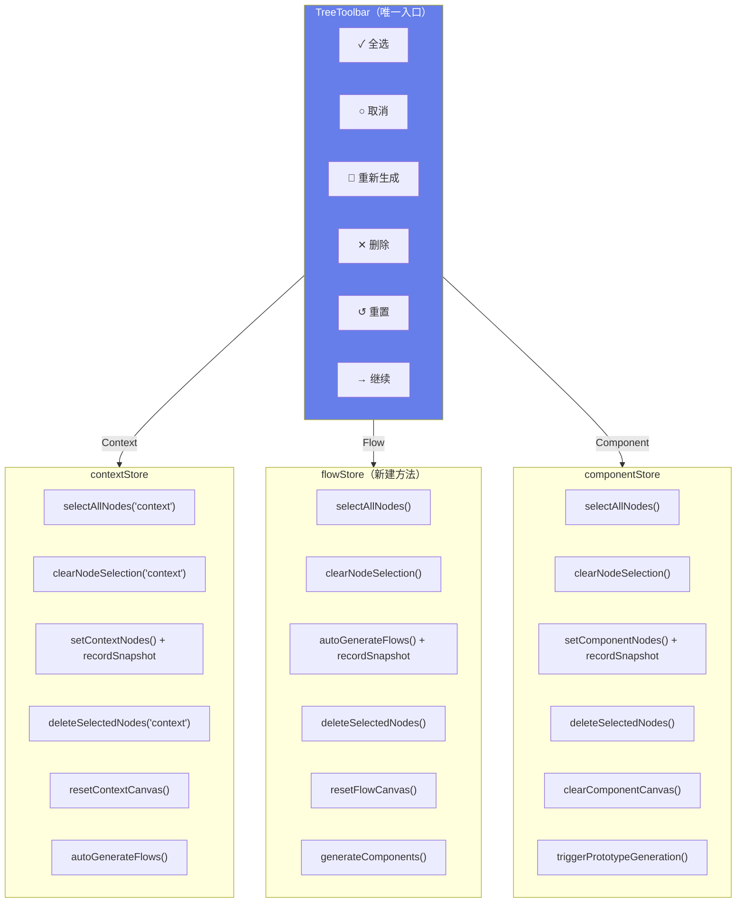
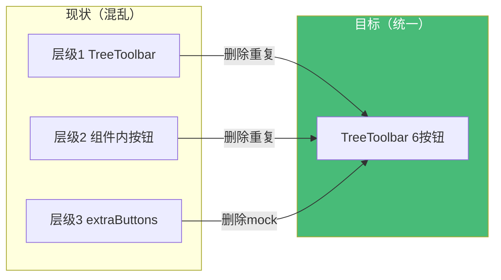
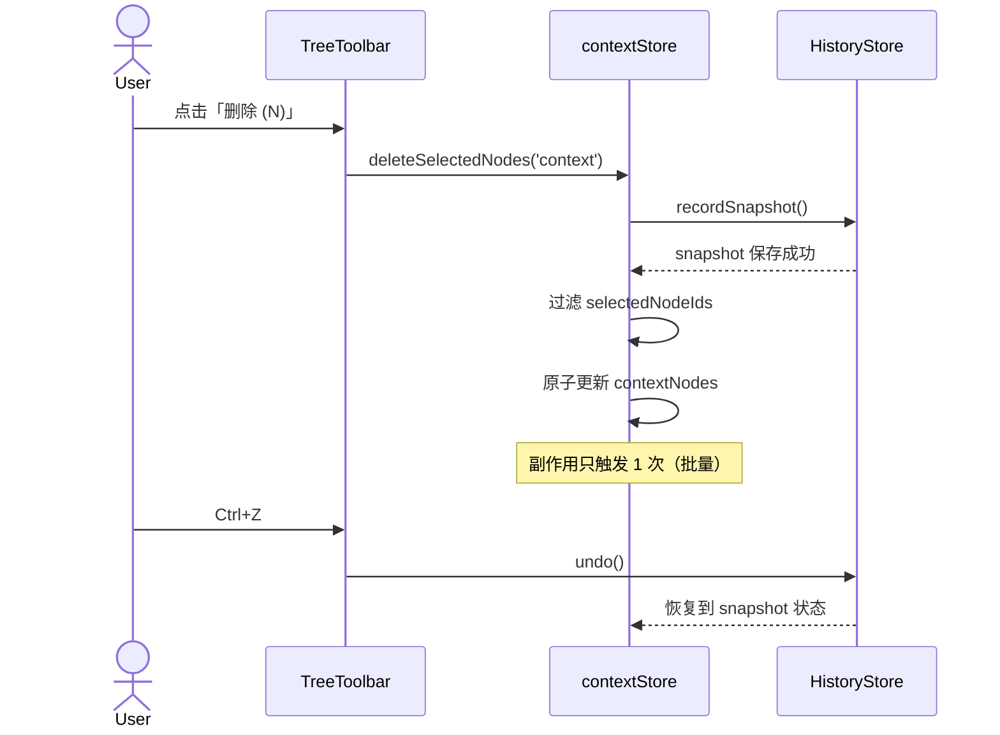

# Canvas 按钮体系整合架构文档

> **项目**: canvas-button-consolidation  
> **作者**: architect  
> **日期**: 2026-04-06  
> **版本**: v1.0

---

## 执行决策

- **决策**: 已采纳
- **执行项目**: canvas-button-consolidation
- **执行日期**: 2026-04-06

---

## 问题背景

Canvas 三栏面板按钮体系存在三层实现混乱，导致 32 个按钮中 14 处重复、功能错误、Store 空实现。

| 层级 | 来源 | 问题 |
|------|------|------|
| 层级 1 | TreeToolbar（统一工具栏） | 部分绑定错误（Context「取消」绑成 selectAllNodes）|
| 层级 2 | 各 Tree 组件内部 | 硬编码按钮重复实现 |
| 层级 3 | CanvasPage extraButtons | mock 数据假按钮 |

**核心数据**：14 处重复、2 处绑定错误、3 处 Store 空实现、3 处跳过 history。

---

## Tech Stack

| 层级 | 技术 | 版本 | 说明 |
|------|------|------|------|
| 前端框架 | Next.js 15 (App Router) | ^15.0 | React Server Components |
| 状态管理 | Zustand | ^5.0 | Canvas 子 store 体系 |
| 样式 | CSS Modules + CSS Variables | - | 组件隔离 |
| 测试 | Jest + React Testing Library + Playwright | latest | 单元 + E2E |
| 代码规范 | ESLint + TypeScript strict | - | 无新依赖 |

**关键约束**：不引入新依赖，不破坏现有 Ctrl+Z 行为，mock 按钮必须替换为真实 AI 调用。

---

## 架构图

### 目标按钮体系（每栏 6 个按钮）



### 现状→目标迁移



### 删除操作数据流（含 history 快照）



---

## Epic 接口与数据流定义

### E1: TreeToolbar 按钮体系标准化（P0）

**根因**: 三层按钮各自实现，职责边界不清。

**涉及文件**: `TreeToolbar.tsx`、`BoundedContextTree.tsx`、`BusinessFlowTree.tsx`、`ComponentTree.tsx`、`CanvasPage.tsx`

**接口定义**:
```typescript
// TreeToolbar.tsx 统一 6 按钮接口
interface TreeToolbarProps {
  treeType: 'context' | 'flow' | 'component'
  nodeCount: number
  selectedCount: number
  onSelectAll: () => void
  onDeselectAll: () => void
  onRegenerate: () => void
  onDelete: () => void
  onReset: () => void
  onContinue?: () => void
  continueLabel?: string
  continueDisabled?: boolean
}
```

**删除按钮**：仅 `selectedCount > 0` 时显示
**重置按钮**：始终显示，带 history 快照
**继续按钮**：`continueDisabled` 控制，`nodeCount > 0` 时可用

---

### E2: Store flow 分支修复（P0）

**根因**: `contextStore` 的 flow 分支全部 `return s` 空实现。

**涉及文件**: `contextStore.ts`

**接口定义**:
```typescript
// contextStore.ts flow 分支修复
selectAllNodes: (tree: 'context' | 'flow') => {
  if (tree === 'context') {
    set(s => ({ selectedNodeIds: { ...s.selectedNodeIds, context: s.contextNodes.map(n => n.nodeId) } }))
  }
  if (tree === 'flow') {
    // ✅ 新增：flow 分支正确处理
    set(s => ({ selectedNodeIds: { ...s.selectedNodeIds, flow: s.flowNodes.map(n => n.nodeId) } }))
  }
},

clearNodeSelection: (tree: 'context' | 'flow') => {
  if (tree === 'context') {
    set(s => ({ selectedNodeIds: { ...s.selectedNodeIds, context: [] } }))
  }
  if (tree === 'flow') {
    // ✅ 新增：flow 分支正确处理
    set(s => ({ selectedNodeIds: { ...s.selectedNodeIds, flow: [] } }))
  }
},

deleteSelectedNodes: (tree: 'context' | 'flow') => {
  if (tree === 'context') {
    const snapshot = getHistoryStore().getState().recordSnapshot()
    set(s => ({
      contextNodes: s.contextNodes.filter(n => !s.selectedNodeIds.context.includes(n.nodeId)),
      selectedNodeIds: { ...s.selectedNodeIds, context: [] }
    }))
  }
  if (tree === 'flow') {
    // ✅ 新增：flow 分支正确处理
    const snapshot = getHistoryStore().getState().recordSnapshot()
    set(s => ({
      flowNodes: s.flowNodes.filter(n => !s.selectedNodeIds.flow.includes(n.nodeId)),
      selectedNodeIds: { ...s.selectedNodeIds, flow: [] }
    }))
  }
},
```

---

### E3: flowStore 批量操作补全（P0）

**根因**: `flowStore` 完全没有 `selectAllNodes`/`clearNodeSelection`/`deleteSelectedNodes` 方法。

**涉及文件**: `flowStore.ts`

**接口定义**:
```typescript
// flowStore.ts 新增方法
selectAllNodes: () => set(s => ({
  selectedNodeIds: { ...s.selectedNodeIds, flow: s.flowNodes.map(n => n.nodeId) }
})),

clearNodeSelection: () => set(s => ({
  selectedNodeIds: { ...s.selectedNodeIds, flow: [] }
})),

deleteSelectedNodes: () => {
  const snapshot = getHistoryStore().getState().recordSnapshot()
  set(s => ({
    flowNodes: s.flowNodes.filter(n => !s.selectedNodeIds.flow.includes(n.nodeId)),
    selectedNodeIds: { ...s.selectedNodeIds, flow: [] }
  }))
},

resetFlowCanvas: () => {
  const snapshot = getHistoryStore().getState().recordSnapshot()
  set({ flowNodes: [], selectedNodeIds: { ...get().selectedNodeIds, flow: [] } })
},
```

---

### E4: 清空操作 history 强制化（P0）

**根因**: 三栏「清空」直接 `setNodes([])` 跳过 `recordSnapshot`，无法撤销。

**涉及文件**: `CanvasPage.tsx`、`contextStore.ts`、`flowStore.ts`、`componentStore.ts`

**接口定义**:
```typescript
// CanvasPage.tsx 重置按钮（修复后）
// Context 栏
onReset={() => {
  const snapshot = getHistoryStore().getState().recordSnapshot()
  contextStore.setContextNodes([])
}}

// Flow 栏
onReset={() => {
  const snapshot = getHistoryStore().getState().recordSnapshot()
  flowStore.setFlowNodes([])
}}

// Component 栏 — 调用 store 方法而非直接 set
onReset={() => {
  const snapshot = getHistoryStore().getState().recordSnapshot()
  componentStore.clearComponentCanvas()  // ✅ 而非 setComponentNodes([])
}}
```

---

### E5: 重新生成按钮 mock 修复（P1）

**根因**: Context 栏「重新生成」extraButton 使用硬编码 mock 数据，未触发真实 AI API。

**涉及文件**: `CanvasPage.tsx`

**接口定义**:
```typescript
// 修复前（mock 数据）
extraButtons={
  <Button onClick={() => setContextNodes([mock1, mock2])}>
    🔄 重新生成
  </Button>
}

// 修复后（真实 AI 调用）
onRegenerate={() => {
  const result = await canvasApi.generateContexts(requirementText)
  contextStore.setContextNodes(result)
  getHistoryStore().getState().recordSnapshot()
}}
```

---

### E6: 回归测试验证（P1）

**涉及文件**: `__tests__/tree-toolbar.test.ts`、`__tests__/stores/*.test.ts`

**测试用例**:
```typescript
describe('TreeToolbar 6-button system', () => {
  describe('全选按钮', () => {
    it('Context 栏全选所有节点', () => {
      contextStore.setContextNodes([{nodeId:'1'}, {nodeId:'2'}])
      contextStore.selectAllNodes('context')
      expect(contextStore.getState().selectedNodeIds.context).toEqual(['1','2'])
    })

    it('Flow 栏全选所有节点', () => {
      flowStore.setFlowNodes([{nodeId:'1'}, {nodeId:'2'}])
      flowStore.selectAllNodes()
      expect(flowStore.getState().selectedNodeIds.flow).toEqual(['1','2'])
    })
  })

  describe('删除操作', () => {
    it('批量删除只触发一次 snapshot', () => {
      const recordSpy = jest.spyOn(getHistoryStore().getState(), 'recordSnapshot')
      contextStore.setContextNodes([{nodeId:'1'}, {nodeId:'2'}])
      contextStore.deleteSelectedNodes('context')
      expect(recordSpy).toHaveBeenCalledTimes(1)
    })

    it('删除后可撤销', () => {
      contextStore.deleteSelectedNodes('context')
      expect(getHistoryStore().getState().canUndo()).toBe(true)
      getHistoryStore().getState().undo()
      expect(contextStore.getState().contextNodes).toHaveLength(2)
    })
  })

  describe('重新生成', () => {
    it('调用真实 AI API 而非 mock', async () => {
      const generateSpy = jest.spyOn(canvasApi, 'generateContexts')
      render(<TreeToolbar treeType="context" onRegenerate={handleRegenerate} ... />)
      await fireEvent.click(screen.getByText('🔄 重新生成'))
      expect(generateSpy).toHaveBeenCalled()
    })
  })
})
```

---

## 技术审查（风险评估）

| 风险 | 级别 | 描述 | 缓解措施 |
|------|------|------|----------|
| 删除层级 2/3 按钮后功能遗漏 | 高 | 组件内硬编码按钮被删除但对应功能未迁移 | Playwright E2E 覆盖三栏按钮全流程 |
| history 快照重复记录 | 低 | 组件层和 store 层都调用 | 组件层统一调用，store 层按需调用 |
| flowStore 方法与 contextStore 不一致 | 中 | 两套 selectAllNodes 接口不同 | TypeScript 接口类型检查 |
| mock 替换后 AI 调用失败 | 低 | 无网络或 API 错误时体验降级 | try-catch + toast 提示 |

---

## 测试策略

| 测试类型 | 框架 | 覆盖目标 |
|----------|------|----------|
| 单元测试 | Jest | store 方法逻辑（E2-E3）|
| 组件测试 | Jest + RTL | TreeToolbar 按钮绑定（E1）|
| E2E 测试 | Playwright | 三栏按钮完整流程（E6）|

**覆盖率要求**: 核心逻辑 > 80%，E1-E4 全部覆盖。

---

## 验收标准汇总

| ID | Given | When | Then |
|----|-------|------|------|
| AC1 | 按钮数量 | 三栏 TreeToolbar | 每栏 ≤ 6 个 |
| AC2 | 全选按钮 | 三栏点击 | 所有节点 selected |
| AC3 | 取消按钮 | 点击 | 所有节点取消 selected |
| AC4 | 删除按钮 | 有选中时点击 | canUndo = true |
| AC5 | 清空按钮 | 点击 | 画布空 + canUndo = true |
| AC6 | 重新生成 | 点击 | 调用真实 AI API（非 mock）|
| AC7 | Ctrl+Z | 删除/清空后 | 状态恢复 |
