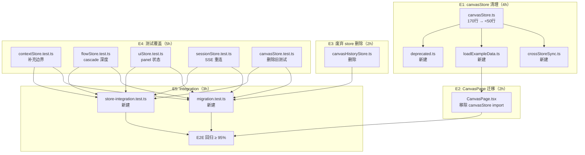
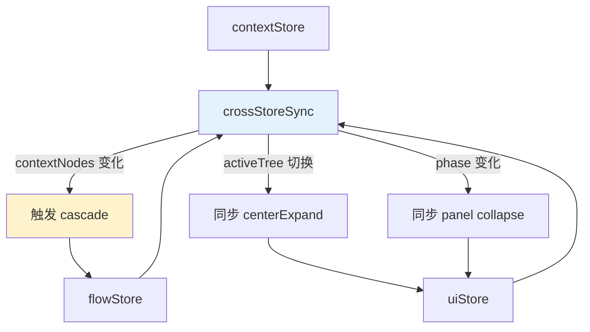
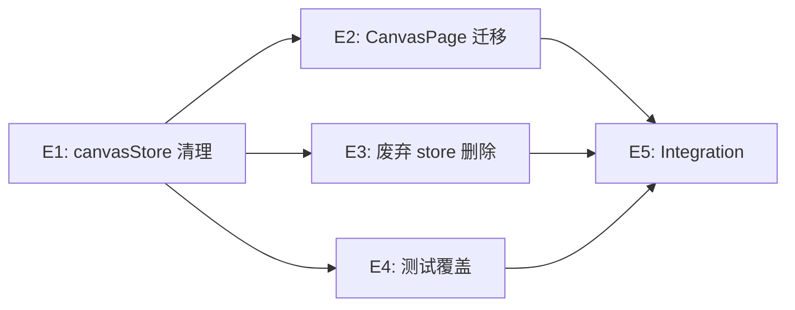

# VibeX canvasStore 迁移清理 — 系统架构设计

**项目**: canvas-canvasstore-migration
**阶段**: design-architecture
**架构师**: Architect Agent
**日期**: 2026-04-04
**版本**: v1.0

---

## 执行决策
- **决策**: 已采纳
- **执行项目**: 待 coord 创建项目并绑定
- **执行日期**: 2026-04-04

---

## 1. 现状分析

### 1.1 当前状态

| 组件 | 状态 | 行数 |
|------|------|------|
| canvasStore.ts（兼容层） | ❌ 待清理 | ~170 行 |
| split stores（5 个） | ✅ 已完成 | — |
| CanvasPage.tsx（import 混乱） | ❌ 待迁移 | — |
| canvasHistoryStore.ts | ❌ 死代码 | — |

### 1.2 目标状态

```
src/lib/canvas/
├── canvasStore.ts          # < 50 行，纯类型 re-export
├── crossStoreSync.ts      # 新建，跨 store 订阅
├── loadExampleData.ts     # 新建，示例数据加载
├── deprecated.ts          # 新建，废弃兼容层
└── stores/
    ├── contextStore.ts   # ✅ 已独立
    ├── flowStore.ts      # ✅ 已独立
    ├── componentStore.ts # ✅ 已独立
    ├── uiStore.ts        # ✅ 已独立
    ├── sessionStore.ts   # ✅ 已独立
    └── index.ts          # ✅ 已独立
```

---

## 2. 架构图

### 2.1 文件操作总览



### 2.2 crossStoreSync 订阅架构



---

## 3. 核心模块设计

### 3.1 canvasStore.ts 降级目标

```typescript
// src/lib/canvas/canvasStore.ts
// 此文件已废弃，请从 stores/ 目录导入对应 store
// @deprecated 使用 contextStore/flowStore/componentStore/uiStore/sessionStore
export { useContextStore } from './stores';
export { useFlowStore } from './stores';
export { useComponentStore } from './stores';
export { useUIStore } from './stores';
export { useSessionStore } from './stores';
export type { CanvasStore } from './stores/types';
```

### 3.2 crossStoreSync.ts

```typescript
// src/lib/canvas/crossStoreSync.ts
import { useContextStore } from './stores/contextStore';
import { useFlowStore } from './stores/flowStore';
import { useUIStore } from './stores/uiStore';
import type { Middleware } from 'zustand';

export function createCrossStoreSync(): Middleware {
  return (config) => {
    const store = config(useContextStore.setState);
    
    // 监听 context 树变化 → 触发 cascade
    const unsubContext = useContextStore.subscribe(
      (state) => state.contextNodes,
      (nodes) => {
        // 当 context 节点确认时，自动触发 flow cascade
      }
    );

    // 监听 activeTree 切换 → 同步 centerExpand
    const unsubUI = useUIStore.subscribe(
      (state) => state.activeTree,
      (activeTree) => {
        useUIStore.setState({ centerExpand: activeTree });
      }
    );

    return store;
  };
}
```

### 3.3 loadExampleData.ts

```typescript
// src/lib/canvas/loadExampleData.ts
import { useContextStore } from './stores/contextStore';
import { useFlowStore } from './stores/flowStore';
import { useComponentStore } from './stores/componentStore';
import { useUIStore } from './stores/uiStore';
import { EXAMPLE_CONTEXTS, EXAMPLE_FLOWS, EXAMPLE_COMPONENTS } from './example-data';

export function loadExampleData(): void {
  useContextStore.getState().setContextNodes(EXAMPLE_CONTEXTS);
  useFlowStore.getState().setFlowNodes(EXAMPLE_FLOWS);
  useComponentStore.getState().setComponentNodes(EXAMPLE_COMPONENTS);
  useUIStore.getState().setPhase('context');
  useUIStore.getState().setActiveTree('context');
}
```

### 3.4 deprecated.ts

```typescript
// src/lib/canvas/deprecated.ts
/**
 * @deprecated 请从 src/lib/canvas/stores/ 导入对应 store
 * 此文件将在未来版本中移除
 */

// eslint-disable-next-line @typescript-eslint/no-explicit-any
export function setContextNodes(nodes: any[]): void {
  console.warn('[deprecated] setContextNodes 请使用 useContextStore.getState().setContextNodes');
  useContextStore.getState().setContextNodes(nodes);
}
```

---

## 4. 性能影响评估

| 变更 | 性能影响 | 缓解 |
|------|---------|------|
| crossStoreSync 订阅增加 | < 1ms | Zustand subscribe 高效 |
| 测试文件增加 | CI +5min | 可接受 |
| **总体** | **无负面影响** | 拆分降低耦合 |

---

## 5. 风险矩阵

| 风险 | 可能性 | 影响 | 缓解 |
|------|--------|------|------|
| crossStoreSync 订阅逻辑丢失 | 中 | 高 | E1-S2 提取后立即运行 E2E |
| loadExampleData 数据源切换后不渲染 | 中 | 高 | E2-S2 全流程测试 |
| canvasStore.test.ts 删除后覆盖率下降 | 中 | 中 | E4-S5 先补充覆盖率 |
| canvasHistoryStore 有隐藏消费者 | 低 | 中 | grep 全量搜索确认 |

---

## 6. 验收标准

| Epic | 指标 | 验证方式 |
|------|------|---------|
| E1 | canvasStore.ts < 50 行 | `wc -l` |
| E1 | crossStoreSync 无循环依赖 | `madge --circular` |
| E1 | loadExampleData 功能正常 | 单元测试 |
| E2 | CanvasPage.tsx 无 canvasStore import | `grep canvasStore` |
| E3 | canvasHistoryStore.ts 已删除 | 文件检查 |
| E4 | contextStore 覆盖率 ≥ 80% | Jest 覆盖率 |
| E4 | canvasStore.test.ts 已删除 | 文件检查 |
| E5 | migration.test.ts 存在且通过 | Jest |
| E5 | E2E 通过率 ≥ 95% | Playwright |

---

## 7. 依赖关系



---

*文档版本: v1.0 | 架构师: Architect Agent | 日期: 2026-04-04*
