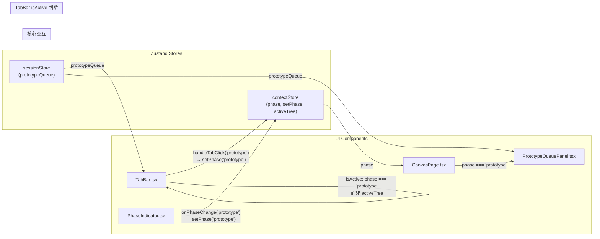

# Architecture: vibex-canvas-context-nav（v2）

> **Decision**: ADOPTED
> **Project**: vibex-canvas-context-nav
> **Date**: 2026-04-13
> **Architect**: architect
> **Status**: v2（修复 9 个 blocker）
> **Changes**: 修复 coord 审查发现的 9 个 blocker

---

## 执行决策

| 字段 | 值 |
|------|-----|
| **决策** | 已采纳 |
| **执行项目** | vibex-canvas-context-nav |
| **执行日期** | 2026-04-13 |
| **v2 变更** | 9 个 blocker 全部修复 |

---

## 1. Tech Stack

| 组件 | 技术 | 选择理由 |
|------|------|---------|
| TabBar.tsx | React + CSS Modules | 现有组件，无新依赖 |
| PhaseIndicator.tsx | React + CSS Modules | 现有组件，无新依赖 |
| contextStore | Zustand + persist | `setPhase`/`phase`/`activeTree` 已暴露 |
| sessionStore | Zustand + persist | `prototypeQueue` 已在其中（注意：非 contextStore）|
| 单元测试 | Vitest + @testing-library | 现有测试框架 |
| E2E 测试 | Playwright | 现有基础设施 |

---

## 2. 代码基线验证

| 检查项 | 实际值 | 文档原值 | 状态 |
|--------|--------|---------|------|
| `Phase` 类型 | `'prototype'` 已存在 | — | ✅ |
| 队列存储 | `sessionStore.prototypeQueue` | — | ✅ |
| `PrototypePage.pageId` | 字段名 `pageId` 非 `id` | ❌ | 修复 |
| `--tree-prototype-color` | 未定义 | ❌ | 需定义 |
| PhaseIndicator `getCurrentPhaseMeta` | 无 prototype 兜底 | ❌ | 需修复 |
| TabBar `setPhase` | 未导入 | ❌ | 需导入 |

---

## 3. 架构图（Mermaid）



**关键数据流**:
1. TabBar prototype tab → `setPhase('prototype')` → `contextStore.phase = 'prototype'`
2. PhaseIndicator prototype 选项 → `onPhaseChange('prototype')` → `setPhase('prototype')`
3. CanvasPage 检测 `phase === 'prototype'` → 渲染 `<div className={styles.prototypePhase}><PrototypeQueuePanel /></div>`
4. PrototypeQueuePanel 从 `sessionStore.prototypeQueue`（非 contextStore）读取数据

---

## 4. API 定义

### 4.1 contextStore.setPhase

```typescript
// contextStore.ts — 已存在
setPhase: (phase: Phase) => void;
phase: Phase; // 'input' | 'context' | 'flow' | 'component' | 'prototype'
```

### 4.2 TabBar prototype tab

```typescript
// TabBar.tsx — 需修改
import { useContextStore } from '@/lib/canvas/stores/contextStore';
import { useSessionStore } from '@/lib/canvas/stores/sessionStore'; // 新增 import
import type { PrototypePage } from '@/lib/canvas/types'; // 新增 import

const TABS: { id: TreeType | 'prototype'; label: string; emoji: string }[] = [
  // ... existing tabs ...
  { id: 'prototype', label: '原型', emoji: '🚀' }, // 新增
];

const setPhase = useContextStore((s) => s.setPhase); // 新增
const prototypeCount = useSessionStore((s) => s.prototypeQueue.length); // 新增

const handleTabClick = (tabId: TreeType | 'prototype') => {
  if (tabId === 'prototype') {
    setPhase('prototype');
    setActiveTree(null);
    return;
  }
  // ... existing phase guard ...
};

// prototype tab 的 isActive：用 phase 判断（不是 activeTree）
const isActive =
  tab.id === 'prototype'
    ? phase === 'prototype'
    : activeTree === tab.id || (activeTree === null && tab.id === 'context');
```

### 4.3 PhaseIndicator prototype 选项

```typescript
// PhaseIndicator.tsx — 需修改
// SWITCHABLE_PHASES 必须包含 prototype
const SWITCHABLE_PHASES = [
  // ... context/flow/component ...
  { key: 'prototype', label: '🚀 原型队列', icon: '🚀', colorVar: 'var(--tree-prototype-color)' },
];

// getCurrentPhaseMeta 必须有 prototype 兜底
function getCurrentPhaseMeta(phase: Phase) {
  return SWITCHABLE_PHASES.find((p) => p.key === phase)
    ?? { key: 'prototype', label: '🚀 原型队列', icon: '🚀', colorVar: 'var(--tree-prototype-color)' };
}

// 移除 prototype 时的 return null
if (phase === 'input') return null; // 不再 return null for prototype
```

---

## 5. 数据模型

```typescript
// PrototypePage — types.ts 已存在
interface PrototypePage {
  pageId: string;        // ⚠️ 字段名是 pageId，不是 id
  componentId: string;
  name: string;
  status: PrototypeStatus;
  progress: number;       // 0-100
  retryCount: number;
  errorMessage?: string;
  generatedAt?: number;
}

// prototypeQueue 在 sessionStore（不是 contextStore）
sessionStore.prototypeQueue: PrototypePage[];
```

---

## 6. 核心实现方案

### 6.1 TabBar — prototype tab

**文件**: `vibex-fronted/src/components/canvas/TabBar.tsx`

**变更清单**:

| 变更 | 内容 |
|------|------|
| 新增 import | `import { useSessionStore } from '@/lib/canvas/stores/sessionStore'` |
| 新增 import | `import type { PrototypePage } from '@/lib/canvas/types'` |
| TABS 类型 | `{ id: TreeType \| 'prototype'; ... }[]` |
| TABS 增加 | `{ id: 'prototype', label: '原型', emoji: '🚀' }` |
| 新增 selector | `const setPhase = useContextStore((s) => s.setPhase)` |
| 新增 selector | `const prototypeCount = useSessionStore((s) => s.prototypeQueue.length)` |
| handleTabClick | 参数类型改为 `TreeType \| 'prototype'`；新增 `if (tabId === 'prototype')` 分支 |
| isActive | prototype tab 用 `phase === 'prototype'` 判断（不是 activeTree）|
| isLocked | prototype tab 排除：`tab.id !== 'prototype' && tabIdx > phaseIdx` |

**⚠️ 关键修正 — isActive 判断**:
> 原方案用 `activeTree === 'prototype'` 判断 prototype tab 的 isActive，但 `activeTree` 永远是 `TreeType`（不含 `'prototype'`），且点击 prototype tab 时只设 `setActiveTree(null)`，不设为 `'prototype'`。修正为 `phase === 'prototype'` 判断。

### 6.2 PhaseIndicator — prototype 选项（多处修改）

**文件**: `vibex-fronted/src/components/canvas/features/PhaseIndicator.tsx`

**⚠️ 关键问题 — 三处必须同时修改**：

| 位置 | 错误写法 | 正确写法 |
|------|---------|---------|
| SWITCHABLE_PHASES | 无 prototype entry | 增加 `{ key: 'prototype', ... }` |
| getCurrentPhaseMeta | 无 prototype 兜底，返回 undefined | 增加 `?? {...prototype fallback}` |
| return null | `if (phase === 'input' \|\| phase === 'prototype')` | `if (phase === 'input')` |

### 6.3 CSS 变量

**文件**: `vibex-fronted/src/app/globals.css` 或 `PhaseIndicator.module.css`

```css
:root {
  --tree-prototype-color: #9333ea; /* 紫色 */
}
```

---

## 7. 测试策略

### 7.1 TabBar 测试（mock 字段修正）

```typescript
// TabBar.test.tsx — prototypeCount mock 必须用 pageId
useSessionStore.setState({
  prototypeQueue: [
    {
      pageId: '1',           // ⚠️ 不是 id，是 pageId
      componentId: 'c1',
      name: 'Page1',
      status: 'queued',
      progress: 0,
      retryCount: 0,
    } as PrototypePage,
    {
      pageId: '2',
      componentId: 'c2',
      name: 'Page2',
      status: 'done',
      progress: 100,
      retryCount: 0,
    } as PrototypePage,
  ],
});
```

### 7.2 E2E 选择器

| 选择器 | 来源 | 状态 |
|--------|------|------|
| `[class*="prototypePhase"]` | CanvasPage.tsx `className={styles.prototypePhase}` | ✅ 存在 |
| `[class*="queueItem"]` | 未验证，不使用 | ⚠️ 不保证存在 |

**E2E 测试不依赖 `queueItem` class** — 只验证 `prototypePhase` container 可见。

---

## 8. 风险评估（v2）

| 风险 ID | 描述 | 可能性 | 影响 | 缓解 |
|---------|------|--------|------|------|
| R1 | setPhase 触发副作用 | 低 | 中 | 直接设状态，无 API 调用 |
| R2 | prototypeQueue 在 sessionStore 非 contextStore | 低 | 中 | TabBar 导入 useSessionStore |
| R3 | getCurrentPhaseMeta 对 prototype 返回 undefined | 高 | 中 | 同时修改 SWITCHABLE_PHASES + 兜底 |
| R4 | PhaseIndicator prototype phase 显示时按钮 label undefined | 高 | 中 | 渲染层 undefined 兜底 |
| R5 | CSS --tree-prototype-color 未定义 | 中 | 低 | 在 globals.css 中定义 |
| R6 | TabBar prototype isActive 永远 false | 高 | 中 | 用 phase === 'prototype' 判断 |
| R7 | PrototypePage 字段名用 id 而非 pageId | 高 | 高 | 确认类型定义，使用 pageId |

---

## 9. 文件清单

| 文件 | 操作 | 变更点 |
|------|------|--------|
| `TabBar.tsx` | 修改 | import sessionStore + setPhase；TABS 增加 prototype；handleTabClick；isActive 逻辑 |
| `TabBar.test.tsx` | 修改 | tabs 数量 4；mock 用 pageId；6 个新测试 |
| `PhaseIndicator.tsx` | 修改 | SWITCHABLE_PHASES 增加 prototype；getCurrentPhaseMeta 兜底；return null 修正 |
| `PhaseIndicator.test.tsx` | 新建 | 3 个测试 |
| `e2e/prototype-nav.spec.ts` | 新建 | 3 个 E2E，不依赖 queueItem |
| `globals.css` | 修改 | 定义 --tree-prototype-color |

---

## 10. 执行决策

- **决策**: 已采纳（v2）
- **执行项目**: vibex-canvas-context-nav
- **执行日期**: 2026-04-13
- **v2 修复**: 9 个 blocker

*文档版本: v2 | Architect: architect | 2026-04-13*
