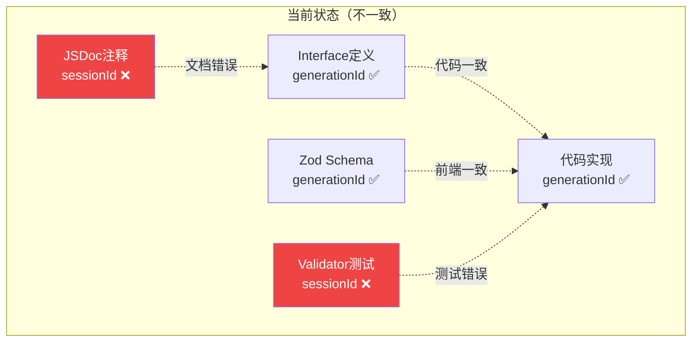
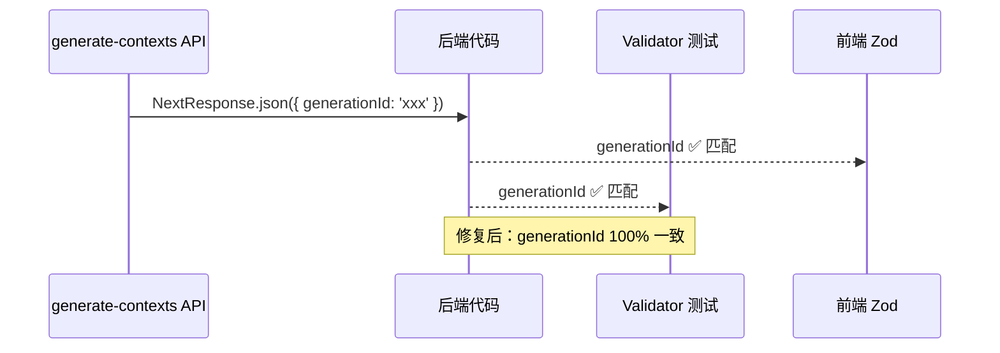

# Architecture — canvas-contexts-schema-fix

**项目**: canvas-contexts-schema-fix
**Architect**: Architect Agent
**日期**: 2026-04-05
**仓库**: /root/.openclaw/vibex

---

## 1. 执行摘要

修复 `generate-contexts` API 中 `sessionId` vs `generationId` 字段名不一致问题。

| Epic | Stories | 影响文件 | 工时 | 风险 |
|------|---------|----------|------|------|
| E1 | S1-S2 | route.ts / canvasApiValidation.test.ts | 0.3h | 低 |

---

## 2. 问题分析



**根因**: JSDoc 注释未同步更新，validator 测试使用了旧字段名。

---

## 3. 技术方案

### 3.1 E1-F1: JSDoc 修复

```typescript
// route.ts JSDoc 修复
// 修改前:
/**
 * @returns { success: boolean, contexts: BoundedContext[], sessionId: string, confidence: number }
 */

// 修改后:
/**
 * @returns { success: boolean, contexts: BoundedContext[], generationId: string, confidence: number }
 */
```

### 3.2 E1-F2: Validator 测试修复

```typescript
// canvasApiValidation.test.ts
// 修改前:
expect(isValidGenerateContextsResponse({
  success: true, contexts: [],
  sessionId: 'xxx',  // ❌ 错误
  confidence: 0.85,
})).toBe(true);

// 修改后:
expect(isValidGenerateContextsResponse({
  success: true, contexts: [],
  generationId: 'xxx',  // ✅ 正确
  confidence: 0.85,
})).toBe(true);

// 新增反向测试
expect(isValidGenerateContextsResponse({
  success: true, contexts: [],
  sessionId: 'xxx',  // ❌ 错误字段名
  confidence: 0.85,
})).toBe(false);
```

---

## 4. 数据流



---

## 5. 测试策略

| Story | 测试方式 | 验收 |
|-------|---------|------|
| E1-F1 | 静态检查 | `sessionId` 不出现在 JSDoc 注释中 |
| E1-F2 | 单元测试 | `generationId` → valid, `sessionId` → invalid |

---

## 6. 性能影响

无性能影响（仅文档和测试修复）。

---

*本文档由 Architect Agent 生成于 2026-04-05 01:10 GMT+8*
