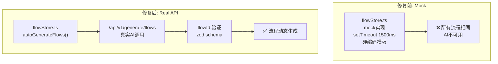

# Architecture: FlowTree API Fix

> **项目**: canvas-flowtree-api-fix  
> **Architect**: Architect Agent  
> **日期**: 2026-04-07  
> **版本**: v1.0  
> **状态**: Proposed

---

## 1. 概述

### 1.1 问题陈述

`autoGenerateFlows` 在 `flowStore.ts` 中是 mock 实现（1500ms 延迟 + 硬编码模板），所有上下文生成相同流程，AI 生成能力不可用。

### 1.2 技术目标

| 目标 | 描述 | 优先级 |
|------|------|--------|
| AC1 | API 调用成功 | P0 |
| AC2 | flowId 正确关联 | P1 |
| AC3 | 错误状态处理 | P1 |

---

## 2. 系统架构

### 2.1 架构对比



---

## 3. 详细设计

### 3.1 E1: API 调用替换

```typescript
// flowStore.ts — 修复前
const autoGenerateFlows = async (contexts: string[]) => {
  // ❌ mock 实现
  await new Promise(r => setTimeout(r, 1500));
  return { flows: contexts.map(() => ({ id: 'mock-id', name: 'Mock Flow' })) };
};

// 修复后
import { flowApi } from '@/lib/api/canvas';

const autoGenerateFlows = async (contexts: string[]) => {
  const result = await flowApi.generateFlows({ contexts });
  if (!result.success) {
    throw new Error(result.error);
  }
  return result.data;
};
```

### 3.2 E2: flowId 关联

```typescript
// lib/api/canvas/flows.ts
import { z } from 'zod';

export const FlowIdSchema = z.string().regex(/^flow-[a-z0-9-]+$/, {
  message: 'flowId must start with "flow-"',
});

export const flowApi = {
  async generateFlows(params: { contexts: string[] }) {
    const res = await fetch('/api/v1/generate/flows', {
      method: 'POST',
      headers: { 'Content-Type': 'application/json' },
      body: JSON.stringify(params),
    });

    if (!res.ok) {
      return { success: false, error: `API error: ${res.status}` };
    }

    const data = await res.json();
    const validated = FlowIdSchema.parse(data.flowId);

    return { success: true, data: { flowId: validated, ...data } };
  },
};
```

### 3.3 E3: 错误处理

```typescript
// flowStore.ts
const autoGenerateFlows = async (contexts: string[]) => {
  setFlowGenerating(true);
  setFlowError(null);

  try {
    const result = await flowApi.generateFlows({ contexts });
    if (!result.success) {
      setFlowError(result.error ?? 'Unknown error');
      return;
    }
    setFlowId(result.data.flowId);
  } catch (err) {
    setFlowError(err instanceof Error ? err.message : 'Generation failed');
  } finally {
    setFlowGenerating(false);
  }
};
```

---

## 4. 接口定义

| 接口 | 路径 | 方法 | 说明 |
|------|------|------|------|
| generateFlows | `/api/v1/generate/flows` | POST | AI 生成流程 |
| flowId 验证 | `FlowIdSchema` | Zod | 格式验证 |

---

## 5. 性能影响评估

| 指标 | 影响 | 说明 |
|------|------|------|
| API 调用延迟 | +200-3000ms | 取决于 AI 响应时间 |
| Mock 延迟移除 | -1500ms | 不再等待 1500ms |
| **总计** | **变化±** | 取决于实际 API |

---

## 6. 技术审查

### 6.1 PRD 验收标准覆盖

| PRD AC | 技术方案 | 缺口 |
|---------|---------|------|
| AC1: API 调用成功 | ✅ flowApi.generateFlows() | 无 |
| AC2: flowId 正确 | ✅ FlowIdSchema | 无 |
| AC3: 错误处理 | ✅ try/catch + setFlowError | 无 |

### 6.2 风险点

| 风险 | 等级 | 缓解 |
|------|------|------|
| API 超时 | 🟡 中 | 添加 timeout: 30s |
| AI 服务不可用 | 🟡 中 | 降级到本地生成 |

---

## 7. 实施计划

| Epic | 工时 | 交付物 |
|------|------|--------|
| E1: API 替换 | 2h | flowStore.ts + flowApi.ts |
| E2: flowId 关联 | 1h | FlowIdSchema |
| E3: 错误处理 | 1h | try/catch 逻辑 |
| **合计** | **4h** | |

*本文档由 Architect Agent 生成 | 2026-04-07*
