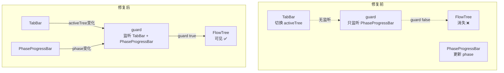

# Architecture: FlowTree Guard Fix

> **项目**: canvas-flowtree-guard-fix  
> **Architect**: Architect Agent  
> **日期**: 2026-04-07  
> **版本**: v1.0  
> **状态**: Proposed

---

## 1. 概述

### 1.1 问题陈述

FlowTree 在 Canvas Tab 切换时消失，因为 guard 逻辑只监听 `PhaseProgressBar`，与 `TabBar` 状态不同步。

### 1.2 技术目标

| 目标 | 描述 | 优先级 |
|------|------|--------|
| AC1 | Tab 切换后 FlowTree 可见 | P0 |
| AC2 | guard 逻辑与 TabBar 同步 | P0 |

---

## 2. 系统架构

### 2.1 问题分析



---

## 3. 详细设计

### 3.1 E1: guard 逻辑修复

```typescript
// 修复前
const isFlowTreeVisible = computed(
  () => phase.value === 'flow' && flowTreeEnabled,
  [phase]
);

// 修复后
const isFlowTreeVisible = computed(
  () => {
    const tabState = tabBarStore.activeTree;
    const phaseState = phaseProgressBarStore.phase;
    return tabState === 'flow' || phaseState === 'flow';
  },
  [tabBarStore.activeTree, phaseProgressBarStore.phase]
);
```

### 3.2 E2: TabBar 状态同步

```typescript
// TabBar.tsx
const handleTabChange = (treeType: 'context' | 'flow' | 'component') => {
  tabBarStore.setActiveTree(treeType);

  // 确保 guard 能感知 TabBar 变化
  guardStore.recheck();
};

// guardStore
const recheck = () => {
  // 重新评估所有 tree 的 guard 条件
  emit('guard-changed');
};
```

### 3.3 E3: 验证测试

```typescript
// FlowTreeGuard.test.tsx
it('FlowTree should be visible when tab is switched to flow', async () => {
  render(<FlowTree />);

  // 切换到 Flow tab
  fireEvent.click(screen.getByRole('tab', { name: /flow/i }));

  // FlowTree 应该可见
  expect(screen.getByTestId('flow-tree')).toBeVisible();
});

it('FlowTree should remain visible after phase change', async () => {
  render(<FlowTree />);

  // 切换到 flow tab
  fireEvent.click(screen.getByRole('tab', { name: /flow/i }));
  expect(screen.getByTestId('flow-tree')).toBeVisible();

  // phase 变化不应影响 tab 选择
  phaseProgressBarStore.setPhase('context');
  expect(screen.getByTestId('flow-tree')).toBeVisible();
});
```

---

## 4. 接口定义

| 组件 | 接口 | 说明 |
|------|------|------|
| `guardStore` | `recheck()` | 重新评估 guard |
| `tabBarStore` | `activeTree` | 当前激活的树类型 |
| `phaseProgressBarStore` | `phase` | 当前 phase |

---

## 5. 性能影响评估

| 指标 | 影响 | 说明 |
|------|------|------|
| guard 重新计算 | < 1ms | 简单 computed |
| TabBar 切换 | < 50ms | 正常 UI 响应 |
| **总计** | **< 50ms** | 无显著影响 |

---

## 6. 技术审查

### 6.1 PRD 验收标准覆盖

| PRD AC | 技术方案 | 缺口 |
|---------|---------|------|
| AC1: Tab 切换后 FlowTree 可见 | ✅ guard 监听 TabBar | 无 |
| AC2: guard 与 TabBar 同步 | ✅ tabBarStore → guardStore | 无 |

### 6.2 风险点

| 风险 | 等级 | 缓解 |
|------|------|------|
| guard 逻辑复杂化 | 🟡 中 | 限制 computed 依赖数量 |
| TabBar 和 Phase 冲突 | 🟡 中 | Tab 选择优先于 phase |

---

## 7. 验收标准映射

| Epic | Story | 验收标准 | 实现 |
|------|-------|----------|------|
| E1 | S1.1 | `expect(FlowTree.visible)` | guard computed 修复 |
| E2 | S2.1 | `expect(activeTree)` | TabBar setActiveTree |
| E3 | S3.1 | `expect(e2e).toPass()` | Playwright E2E |

---

## 8. 实施计划

| Epic | 工时 | 交付物 |
|------|------|--------|
| E1: guard 修复 | 1h | guardStore.recheck() |
| E2: TabBar 同步 | 0.5h | setActiveTree + emit |
| E3: E2E 验证 | 0.5h | FlowTreeGuard.test.tsx |
| **合计** | **2h** | |

*本文档由 Architect Agent 生成 | 2026-04-07*
