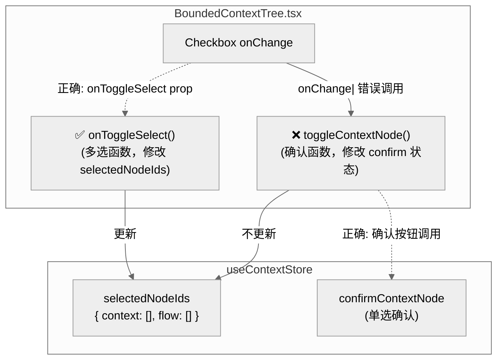
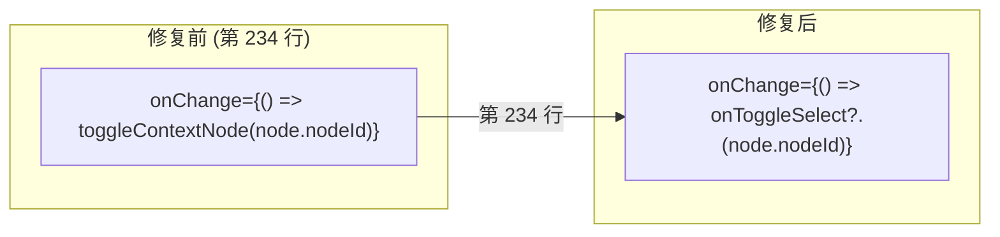

# Architecture: Canvas Generate Components Context Fix

> **项目**: canvas-generate-components-context-fix  
> **架构师**: architect  
> **日期**: 2026-04-05  
> **版本**: v1.0  
> **状态**: 已完成

---

## 1. 执行决策

- **决策**: 已采纳
- **执行项目**: canvas-generate-components-context-fix
- **执行日期**: 2026-04-05

---

## 2. 问题背景

`BoundedContextTree.tsx` 第 234 行 checkbox `onChange` 调用了错误的函数：

| 函数 | 用途 | 调用者 |
|------|------|--------|
| `toggleContextNode` | 确认节点（单选 toggle）| ❌ checkbox 错误调用 |
| `onToggleSelect` | 多选节点（添加到 `selectedNodeIds`）| ✅ checkbox 应调用 |
| `toggleNodeSelect` | Zustand store 多选方法 | ✅ 正确传递方式 |

**影响**: 用户勾选 checkbox → 调用确认函数 → `selectedNodeIds` 不更新 → 后续 `handleContinueToComponents` 发送空/全部上下文。

**关联**: 与 `vibex-canvas-context-selection` 为同一 Bug 的两个根因，本修复 checkbox，`vibex-canvas-context-selection` 修复 `handleContinueToComponents`。

---

## 3. Tech Stack

| 组件 | 技术选型 | 理由 |
|------|---------|------|
| **修复** | 1 行代码改动 | 无需依赖 |
| **测试框架** | Vitest + RTL (现有) | `vibex-fronted` 已使用 |

---

## 4. 架构图

### 4.1 根因定位



### 4.2 修复对比



---

## 5. API 定义

无新增 API — 仅修改 checkbox 事件处理器。

---

## 6. 数据模型

无变更。`selectedNodeIds` 类型不变：

```typescript
interface SelectedNodeIds {
  context: string[];  // 多选选中的 context nodeId
  flow: string[];
}
```

---

## 7. 模块设计

### 7.1 修改文件清单

| 文件 | 行号 | 修改内容 |
|------|------|---------|
| `vibex-fronted/src/components/canvas/BoundedContextTree.tsx` | 234 | `onChange` 从 `toggleContextNode` 改为 `onToggleSelect` |

### 7.2 修复前后对比

**第 234 行 — 修复前**:
```tsx
onChange={() => { toggleContextNode(node.nodeId); }}
```

**第 234 行 — 修复后**:
```tsx
onChange={() => { onToggleSelect?.(node.nodeId); }}
```

**ContextCard 第 165 行已正确传递**:
```tsx
onToggleSelect?.(node.nodeId);
```

---

## 8. 技术审查

### 8.1 风险评估

| 风险 | 严重性 | 缓解 |
|------|--------|------|
| `onToggleSelect` 为 undefined | 低 | `?.()` optional chaining 保护 |
| 破坏其他 checkbox 功能 | 低 | 仅修改第 234 行，无其他副作用 |
| 与 BusinessFlowTree 不一致 | 无 | BusinessFlowTree 已正确使用 `onToggleSelect` |

### 8.2 关联修复

| 项目 | 修复内容 | 依赖 |
|------|---------|------|
| `canvas-generate-components-context-fix` | checkbox onChange 改为 onToggleSelect | 独立 |
| `vibex-canvas-context-selection` | handleContinueToComponents 读取 selectedNodeIds | 依赖本修复 |

两个修复都必须完成，context selection 功能才能正常工作。

---

## 9. 测试策略

### 9.1 测试文件

```
src/components/canvas/BoundedContextTree.test.tsx
```

### 9.2 核心测试用例

```typescript
describe('Checkbox selection', () => {
  it('should call onToggleSelect when checkbox clicked', async () => {
    const onToggleSelect = vi.fn();
    renderWithStore(
      <BoundedContextTree onToggleSelect={onToggleSelect} />
    );
    
    const checkbox = screen.getByRole('checkbox');
    await userEvent.click(checkbox);
    
    expect(onToggleSelect).toHaveBeenCalledWith(node.nodeId);
  });

  it('should NOT call toggleContextNode', async () => {
    const toggleContextNode = vi.fn();
    renderWithStore(
      <BoundedContextTree toggleContextNode={toggleContextNode} />
    );
    
    await userEvent.click(screen.getByRole('checkbox'));
    expect(toggleContextNode).not.toHaveBeenCalled();
  });
});
```

---

## 10. 实施计划

| Phase | 内容 | 工时 | 产出 |
|-------|------|------|------|
| E1 | 第 234 行 onChange 修复 | 0.3h | BoundedContextTree.tsx |

---

## 11. 验收标准

| ID | Given | When | Then |
|----|-------|------|------|
| AC1 | 点击 checkbox | BoundedContextTree | `onToggleSelect(node.nodeId)` 被调用 |
| AC2 | 点击 checkbox | BoundedContextTree | `toggleContextNode` 不被调用 |
| AC3 | 选择后继续 | 组件树 | `selectedNodeIds.context` 包含选中的 nodeId |

---

*文档版本: v1.0 | 最后更新: 2026-04-05*
