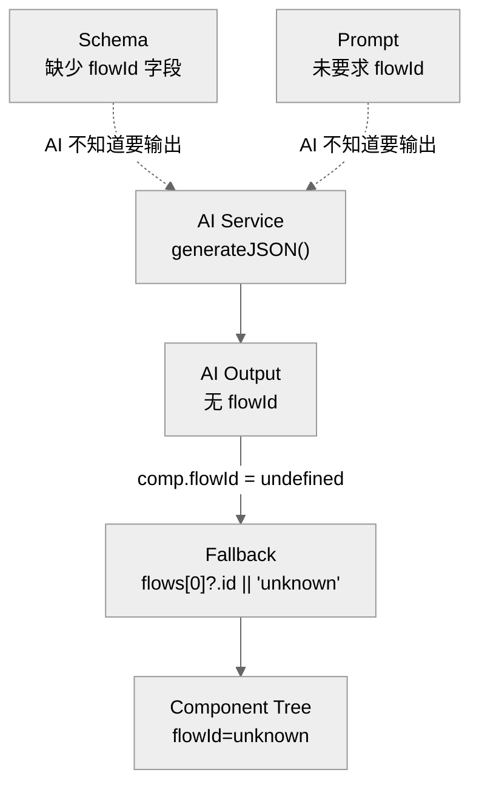
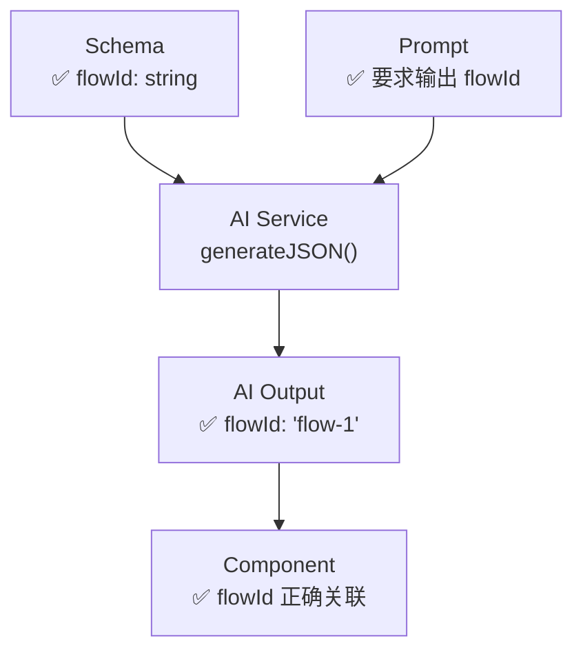

# Architecture: Canvas Generate Components Prompt Fix

> **项目**: canvas-generate-components-prompt-fix  
> **架构师**: architect  
> **日期**: 2026-04-05  
> **版本**: v1.0  
> **状态**: 已完成

---

## 1. 执行决策

- **决策**: 已采纳
- **执行项目**: canvas-generate-components-prompt-fix
- **执行日期**: 2026-04-05

---

## 2. 问题背景

`generate-components` API 的 prompt 和 AI schema 缺少 `flowId` 字段，AI 输出不含 flowId，代码 fallback 为 `flows[0]?.id || 'unknown'`，导致组件树无法关联流程。

| 问题 | 代码位置 |
|------|---------|
| AI schema 缺少 `flowId` | `vibex-backend/src/routes/v1/canvas/index.ts` 第 291 行 |
| prompt 未要求 `flowId` | 第 272-284 行 |
| fallback 到 `unknown` | 第 307 行 |

---

## 3. Tech Stack

| 组件 | 技术选型 | 理由 |
|------|---------|------|
| **修改** | Prompt 字符串 + TypeScript 类型 | 纯文本修改，无新依赖 |
| **测试** | Vitest (现有) | `vibex-backend` 已使用 |

---

## 4. 架构图

### 4.1 问题链路



### 4.2 修复后链路



---

## 5. API 定义

### 5.1 修改后 AI 调用

**文件**: `vibex-backend/src/routes/v1/canvas/index.ts`

**修改前** (第 291 行):
```typescript
await aiService.generateJSON<Array<{
  name: string
  type: string
  props: Record<string, unknown>
  api: { method: string; path: string; params: string[] }
}>>(componentPrompt, ...)
```

**修改后**:
```typescript
await aiService.generateJSON<Array<{
  name: string
  type: string
  flowId: string   // ✅ 新增
  props: Record<string, unknown>
  api: { method: string; path: string; params: string[] }
}>>(componentPrompt, ...)
```

**修改后 prompt** (第 272-284 行):
```
基于以下业务流程，生成组件树节点。

流程列表：
${flowSummary}

每个流程 → 多个组件。
每个组件需包含：
- name: 组件名（名词短语，如"订单卡片"、"支付按钮"）
- type: 类型（button|form|table|card|modal|input|list|navigation）
- flowId: 所属流程ID（从上述流程中选择，如 ${flows.map(f => f.id).join('|')})  // ✅ 新增
- props: 默认属性
- api: 接口

重要：每个组件必须标注正确的 flowId，不能留空或使用 unknown。  // ✅ 新增
```

---

## 6. 数据模型

无变更 — `ComponentNode.flowId` 类型已是 `string`。

```typescript
interface ComponentNode {
  flowId: string;  // 修复后: AI 输出正确的 flowId
  name: string;
  type: string;
  // ...
}
```

---

## 7. 模块设计

### 7.1 修改文件

| 文件 | 行号 | 修改内容 |
|------|------|---------|
| `vibex-backend/src/routes/v1/canvas/index.ts` | 272-284 | prompt 添加 flowId 要求 |
| `vibex-backend/src/routes/v1/canvas/index.ts` | 291 | schema 添加 `flowId: string` |
| `vibex-backend/src/routes/v1/canvas/index.ts` | 307 | fallback 逻辑保留（向后兼容）|

---

## 8. 技术审查

### 8.1 风险评估

| 风险 | 严重性 | 缓解 |
|------|--------|------|
| AI 输出无效 flowId | 低 | fallback 兜底；测试覆盖 |
| AI 输出的 flowId 不在 flows 中 | 低 | fallback 兜底 |
| 修改破坏其他组件生成逻辑 | 低 | 仅改 prompt 字符串和 schema 类型 |

### 8.2 兼容性

| 场景 | 影响 |
|------|------|
| 现有 ComponentNode 渲染 | 无影响 |
| 现有 API 接口签名 | 无变化 |
| 旧数据（flowId=unknown）| 兼容，不重新生成 |

---

## 9. 测试策略

### 9.1 测试文件

```
vibex-backend/src/routes/v1/canvas/__tests__/generate-components.test.ts
```

### 9.2 核心测试用例

```typescript
describe('flowId in AI response', () => {
  it('should include flowId in component schema', async () => {
    // mock aiService 返回带 flowId 的响应
    const result = await generateComponents({ flows: mockFlows, ... });
    result.components.forEach(comp => {
      expect(comp.flowId).toMatch(/^flow-/);
    });
  });

  it('should not fallback to unknown', async () => {
    const result = await generateComponents({ flows: mockFlows, ... });
    result.components.forEach(comp => {
      expect(comp.flowId).not.toBe('unknown');
    });
  });
});
```

---

## 10. 实施计划

| Phase | 内容 | 工时 | 产出 |
|-------|------|------|------|
| E1 | flowId prompt + schema 修复 | 0.3h | `canvas/index.ts` |

---

## 11. 验收标准

| ID | Given | When | Then |
|----|-------|------|------|
| AC1 | AI 生成组件 | 检查 `componentResult.data` | 每个组件有 `flowId` |
| AC2 | 组件渲染 | 检查 flowId | 不是 `'unknown'` |
| AC3 | 组件树 | 展开节点 | 组件正确归属 flow |

---

*文档版本: v1.0 | 最后更新: 2026-04-05*
