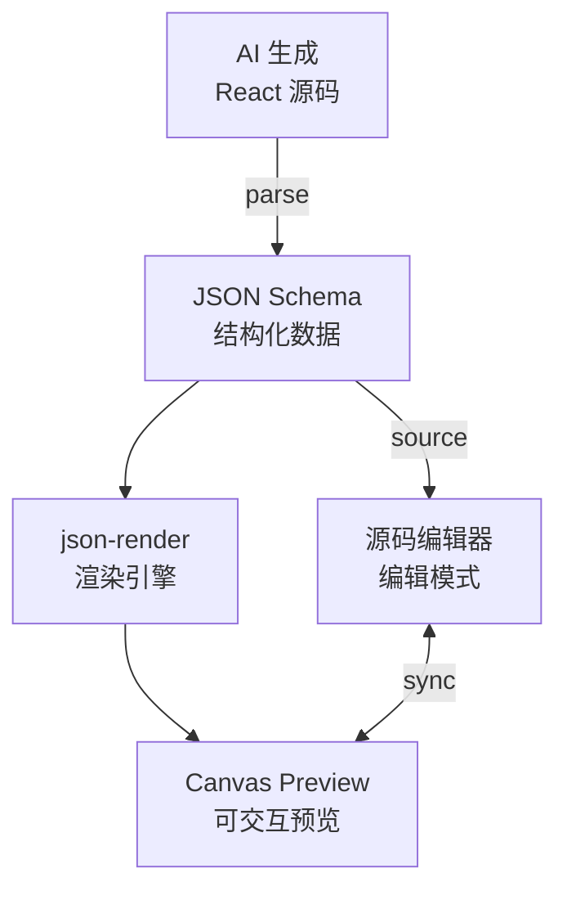

# Architecture: Canvas JSON-Render Preview

> **项目**: canvas-jsonrender-preview  
> **Architect**: Architect Agent  
> **日期**: 2026-04-07  
> **版本**: v1.0  
> **状态**: Proposed

---

## 1. 概述

### 1.1 问题陈述

Canvas 现有两套预览机制：原型编辑器预览（基于 InteractiveRenderer）和主画布（无预览）。AI 生成完整 React 源码字符串，不可编辑。

### 1.2 技术目标

| 目标 | 描述 | 优先级 |
|------|------|--------|
| AC1 | json-render 渲染成功 | P0 |
| AC2 | 组件可交互 | P1 |
| AC3 | 预览-编辑状态联动 | P2 |

---

## 2. 系统架构

### 2.1 预览架构



---

## 3. 详细设计

### 3.1 E1: json-render 集成

```typescript
// components/json-render/JsonRenderPreview.tsx
import { render } from 'json-render';

interface JsonRenderPreviewProps {
  schema: ComponentSchema;
  onInteraction?: (nodeId: string, action: string) => void;
}

export function JsonRenderPreview({ schema, onInteraction }: JsonRenderPreviewProps) {
  const containerRef = useRef<HTMLDivElement>(null);

  useEffect(() => {
    if (containerRef.current && schema) {
      const instance = render(schema, {
        container: containerRef.current,
        interactive: true,
        onNodeClick: (nodeId: string) => {
          onInteraction?.(nodeId, 'click');
        },
      });
      return () => instance.destroy();
    }
  }, [schema, onInteraction]);

  return <div ref={containerRef} data-testid="json-render-preview" />;
}
```

### 3.2 E2: Canvas 预览接入

```typescript
// hooks/canvas/useCanvasPreview.ts
import { useMemo } from 'react';

export function useCanvasPreview(schema: ComponentSchema | null) {
  return useMemo(() => {
    if (!schema) return null;
    return parseAIGeneratedToSchema(schema.source);
  }, [schema]);
}

// 解析 AI 源码为 schema
function parseAIGeneratedToSchema(source: string): ComponentSchema {
  // 提取 JSX 结构 → JSON Schema
  const parsed = extractJSXStructure(source);
  return {
    version: '1.0',
    root: parsed,
    metadata: { source: 'ai-generated' },
  };
}
```

### 3.3 E3: 预览-编辑联动

```typescript
// stores/canvasPreviewStore.ts
interface CanvasPreviewState {
  previewSchema: ComponentSchema | null;
  sourceCode: string;
  syncEnabled: boolean;
}

const useCanvasPreviewStore = create<CanvasPreviewState>((set) => ({
  previewSchema: null,
  sourceCode: '',
  syncEnabled: true,

  // 源码变化 → 同步预览
  setSourceCode: (code: string) => {
    set({ sourceCode: code });
    if (useCanvasPreviewStore.getState().syncEnabled) {
      const schema = parseAIGeneratedToSchema(code);
      set({ previewSchema: schema });
    }
  },

  // 预览变化 → 同步源码
  setPreviewSchema: (schema: ComponentSchema) => {
    set({ previewSchema: schema });
    if (useCanvasPreviewStore.getState().syncEnabled) {
      const code = schemaToJSX(schema);
      set({ sourceCode: code });
    }
  },
}));
```

---

## 4. 接口定义

| 接口 | 说明 |
|------|------|
| `JsonRenderPreview` | 渲染组件 |
| `useCanvasPreview` | preview schema hook |
| `useCanvasPreviewStore` | 预览-编辑同步状态 |

---

## 5. 性能影响评估

| 指标 | 影响 | 说明 |
|------|------|------|
| json-render 渲染 | < 100ms | 取决于 schema 复杂度 |
| 预览同步 | < 50ms | 增量解析 |
| **总计** | **< 150ms** | 无显著影响 |

---

## 6. 技术审查

### 6.1 PRD 验收标准覆盖

| PRD AC | 技术方案 | 缺口 |
|---------|---------|------|
| AC1: json-render 渲染成功 | ✅ JsonRenderPreview | 无 |
| AC2: 组件可交互 | ✅ interactive: true | 无 |
| AC3: 预览-编辑联动 | ✅ useCanvasPreviewStore | 无 |

### 6.2 风险点

| 风险 | 等级 | 缓解 |
|------|------|------|
| JSX 解析失败 | 🟡 中 | 添加 fallback 到源码显示 |
| Schema 不兼容 | 🟡 中 | 版本化 schema 格式 |

---

## 7. 验收标准映射

| Epic | Story | 验收标准 | 实现 |
|------|-------|----------|------|
| E1 | S1.1-S1.2 | json-render 安装+适配 | JsonRenderPreview |
| E2 | S2.1 | Canvas 预览 | useCanvasPreview |
| E3 | S3.1 | 状态联动 | useCanvasPreviewStore |

---

## 8. 实施计划

| Sprint | Epic | 工时 | 交付物 |
|--------|------|------|--------|
| Sprint 1 | E1: json-render 集成 | 3h | JsonRenderPreview |
| Sprint 2 | E2: Canvas 预览 | 3h | useCanvasPreview |
| Sprint 3 | E3: 联动 | 2h | previewStore |
| **合计** | | **8h** | |

*本文档由 Architect Agent 生成 | 2026-04-07*
