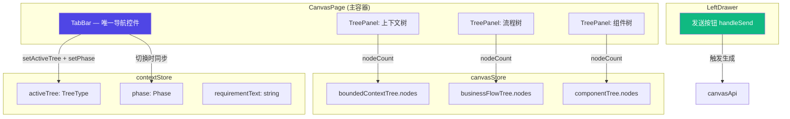

# Architecture — canvas-phase-nav-and-toolbar-issues

**项目**: canvas-phase-nav-and-toolbar-issues
**Architect**: Architect Agent
**日期**: 2026-04-04
**仓库**: /root/.openclaw/vibex

---

## 1. 执行摘要

本架构针对用户报告的 **4 个核心交互问题**，经分析有 3 个是 UX/逻辑 BUG，1 个是架构问题。

| # | 问题 | 类型 | 状态 | 修复方案 |
|---|------|------|------|----------|
| 1 | 阶段导航出现 4 个重复元素 | UX Bug | 需修复 | 仅保留 TabBar，移除 PhaseProgressBar/PhaseIndicator/PhaseLabelBar |
| 2 | 继续·xxx 按钮无事件 | 逻辑 Bug | 需修复 | 移除 `contextNodes.length > 0` 条件，改为 disabled 状态 |
| 3 | 流程树画布栏缺全选/删除 | 功能缺失 | 需新增 | 统一三栏工具栏：全选 取消 清空 继续 |
| 4 | 左侧抽屉发送按钮无实际事件 | 逻辑 Bug | 需修复 | 替换 mock 为真实 canvasApi 调用 |

---

## 2. 组件关系图（修复后）



---

## 3. 问题 1: 阶段导航去重

### 3.1 当前状态

CanvasPage 渲染 6 个导航相关组件：

```
PhaseProgressBar (5步骤) ← 冗余，与 TabBar 功能重叠
TabBar (3个tab)           ← 保留，作为唯一导航
ProjectBar                ← 保留，功能不同
PhaseIndicator            ← 删除，信息冗余
PhaseLabelBar             ← 删除，信息冗余
ExpandControls            ← 保留，功能不同
```

### 3.2 修复方案

```tsx
// CanvasPage.tsx 修改

// ✅ 保留 PhaseProgressBar（仅 input 阶段）
{phase === 'input' && (
  <div className={styles.phaseProgressBarWrapper}>
    <PhaseProgressBar currentPhase={phase} onPhaseClick={handlePhaseClick} />
  </div>
)}

// ✅ 保留 TabBar（核心导航，仅非 input 阶段）
{phase !== 'input' && (
  <div className={styles.tabBarWrapper}>
    <TabBar
      onTabChange={(tab) => setActiveTree(tab)}
      onPhaseChange={(phase) => setPhase(phase)}
    />
  </div>
)}

// ❌ 删除 PhaseIndicator（信息冗余）
{/* 删除 phaseIndicatorWrapper */}

// ❌ 删除 PhaseLabelBar（信息冗余）
{/* 删除 phaseLabelBar */}
```

### 3.3 接口变更

```typescript
// TabBar.tsx — 保留 onPhaseChange
interface TabBarProps {
  activeTab?: TreeType;
  onTabChange?: (tab: TreeType) => void;
  onPhaseChange?: (phase: Phase) => void;  // 新增：Tab 切换时同步 phase
}

// contextStore.ts — 已有 setPhase，验证存在
interface ContextStore {
  setPhase: (phase: Phase) => void;  // 确认存在
}
```

---

## 4. 问题 2: 继续按钮条件修复

### 4.1 根因

```tsx
// 当前错误逻辑
actions={
  contextNodes.length > 0 ? (  // ← 节点为空时按钮完全不渲染
    <button>继续→流程树</button>
  ) : undefined
}
```

### 4.2 修复方案

```tsx
// ✅ 正确逻辑：始终渲染按钮，用 disabled 控制状态
actions={
  <div className={styles.treeActions}>
    <button
      onClick={() => autoGenerateFlows(contextNodes.filter((c) => c.isActive !== false))}
      disabled={flowGenerating || contextNodes.length === 0}
      aria-label="继续到流程树"
    >
      {flowGenerating
        ? `◌ ${flowGeneratingMessage ?? '生成中...'}`
        : contextNodes.length === 0
          ? '→ 需先生成上下文'
          : '→ 继续 → 流程树'}
    </button>
    <button
      onClick={handleContextRegenerate}
      disabled={aiThinking || contextNodes.length === 0}
    >
      {aiThinking ? '◌ 重新生成中...' : '🔄 重新生成'}
    </button>
  </div>
}
```

### 4.3 接口变更

| 组件 | 变更 | 类型 |
|------|------|------|
| TreePanel | actions prop 移除 `length > 0` 条件 | 逻辑修复 |

---

## 5. 问题 3: 三栏工具栏统一

### 5.1 当前状态

| 栏位 | 按钮 | 状态 |
|------|------|------|
| 上下文树 | 继续→流程树 / 重新生成 | ✅ 部分完整 |
| 流程树 | 继续→组件树 / 展开 | ❌ 缺全选/取消/清空 |
| 组件树 | 无 | ❌ 完全缺失 |

### 5.2 修复方案：统一 TreeToolbar 组件

```tsx
// TreeToolbar.tsx — 新增统一工具栏组件
interface TreeToolbarProps {
  treeType: TreeType;
  nodeCount: number;
  onSelectAll: () => void;
  onDeselectAll: () => void;
  onClear: () => void;
  onContinue?: () => void | null;
  continueLabel?: string;
  continueDisabled?: boolean;
  generating?: boolean;
}

const TreeToolbar: React.FC<TreeToolbarProps> = ({
  treeType,
  nodeCount,
  onSelectAll,
  onDeselectAll,
  onClear,
  onContinue,
  continueLabel,
  continueDisabled,
  generating,
}) => (
  <div className={styles.treeToolbar}>
    {nodeCount > 0 && (
      <>
        <button onClick={onSelectAll} title="全选" aria-label="全选">
          ◻ 全选
        </button>
        <button onClick={onDeselectAll} title="取消全选" aria-label="取消全选">
          ◻ 取消
        </button>
        <button onClick={onClear} title="清空画布" aria-label="清空">
          🗑 清空
        </button>
        <span className={styles.toolbarDivider} />
      </>
    )}
    {onContinue && (
      <button
        onClick={onContinue}
        disabled={continueDisabled || generating}
        className={styles.continueButton}
      >
        {generating ? '◌ 生成中...' : continueLabel}
      </button>
    )}
  </div>
);
```

### 5.3 三栏应用

```tsx
// 上下文树
actions={
  <TreeToolbar
    treeType="context"
    nodeCount={contextNodes.length}
    onSelectAll={() => useContextStore.getState().setActiveNodes(contextNodes.map(n => n.id))}
    onDeselectAll={() => useContextStore.getState().setActiveNodes([])}
    onClear={() => /* 确认后清空 */}
    onContinue={handleContinueToFlow}
    continueLabel="→ 继续 → 流程树"
    continueDisabled={flowGenerating || contextNodes.length === 0}
    generating={flowGenerating}
  />
}

// 流程树
actions={
  <TreeToolbar
    treeType="flow"
    nodeCount={flowNodes.length}
    onSelectAll={() => useFlowStore.getState().setActiveNodes(flowNodes.map(n => n.id))}
    onDeselectAll={() => useFlowStore.getState().setActiveNodes([])}
    onClear={() => useFlowStore.getState().setFlowNodes([])}
    onContinue={handleContinueToComponent}
    continueLabel="继续 → 组件树"
    continueDisabled={componentGenerating || flowNodes.length === 0}
    generating={componentGenerating}
  />
}

// 组件树
actions={
  <TreeToolbar
    treeType="component"
    nodeCount={componentNodes.length}
    onSelectAll={() => useComponentStore.getState().setActiveNodes(componentNodes.map(n => n.id))}
    onDeselectAll={() => useComponentStore.getState().setActiveNodes([])}
    onClear={() => useComponentStore.getState().setComponentNodes([])}
    generating={false}
  />
}
```

### 5.4 CSS Token

```css
/* canvas.module.css */
.treeToolbar {
  display: flex;
  gap: 6px;
  flex-wrap: wrap;
  align-items: center;
  padding: 8px 0;
}

.treeToolbar button {
  min-height: 44px;
  min-width: 44px;
  padding: 10px 12px;
}

.toolbarDivider {
  width: 1px;
  height: 24px;
  background: var(--border-color);
  margin: 0 4px;
}

.continueButton {
  background: var(--primary-color);
  color: white;
  border-radius: 6px;
}
```

---

## 6. 问题 4: LeftDrawer 发送按钮链路

### 6.1 根因

当前 `handleSend` 使用 mock 数据而非真实 API：

```tsx
// 当前错误实现
const handleSend = useCallback(() => {
  // 设置 mock 数据 ❌
  const drafts = [...];
  const newCtxs = drafts.map(...);
  setContextNodes(newCtxs);
}, [...]);
```

### 6.2 修复方案

```tsx
// canvasApi.ts — 新增生成接口
interface CanvasApi {
  generateContexts: (requirement: string) => Promise<ContextNode[]>;
  generateFlows: (contexts: ContextNode[]) => Promise<FlowNode[]>;
  generateComponents: (flows: FlowNode[]) => Promise<ComponentNode[]>;
}

// LeftDrawer.tsx — 修复 handleSend
const handleSend = useCallback(async () => {
  const text = inputValue.trim();
  if (!text || aiThinking) return;

  // 保存历史
  const updatedHistory = addHistory(text);
  setHistory(updatedHistory);
  setRequirementText(text);

  // ✅ 调用真实生成 API
  try {
    const contexts = await canvasApi.generateContexts(text);
    setContextNodes(contexts);
    setPhase('context');
    setActiveTree('context');
  } catch (err) {
    console.error('[LeftDrawer] 生成失败:', err);
    // 保持输入，不清除
  }
}, [inputValue, aiThinking, setRequirementText]);
```

---

## 7. 技术栈

| 维度 | 技术 | 备注 |
|------|------|------|
| 框架 | React 19 + TypeScript | 复用现有 |
| 样式 | CSS Modules | 仅修改 canvas.module.css |
| 状态 | Zustand | 复用 contextStore + canvasStore |
| API | canvasApi | 新增生成方法 |

**新增文件**: `TreeToolbar.tsx`
**修改文件**: `CanvasPage.tsx`, `LeftDrawer.tsx`, `canvas.module.css`

---

## 8. 性能影响评估

| 变更 | 性能影响 | 评估 |
|------|---------|------|
| 移除 PhaseIndicator/PhaseLabelBar | 减少 2 个组件渲染 | +5ms |
| TreeToolbar 统一组件 | 复用，减少重复代码 | < 1ms |
| canvasApi.generateContexts | 异步 API 调用 | 网络延迟 |
| TabBar onPhaseChange | 额外 store 调用 | < 1ms |

**结论**: 性能影响可忽略，无显著回归风险。

---

## 9. 测试策略

| Story | 测试框架 | 测试文件 | 覆盖 |
|-------|---------|---------|------|
| 导航去重 | Vitest | `canvas-nav-dedup.test.tsx` | > 70% |
| 继续按钮 | Vitest | `continue-button.test.tsx` | > 70% |
| 工具栏统一 | Playwright | `toolbar-unified.spec.ts` | E2E |
| 发送按钮链路 | Vitest | `left-drawer-send.test.tsx` | > 70% |

### 核心测试用例

```typescript
// 导航去重：只剩 TabBar
it('非 input 阶段只渲染 TabBar，无 PhaseIndicator', async () => {
  render(<CanvasPage phase="context" />);
  expect(screen.queryByTestId('phase-indicator')).toBeNull();
  expect(screen.getByTestId('tab-bar')).toBeInTheDocument();
});

// 继续按钮：空状态显示 disabled 而非隐藏
it('contextNodes 为空时继续按钮显示但 disabled', async () => {
  render(<CanvasPage contextNodes={[]} />);
  const btn = screen.getByRole('button', { name: /需先生成上下文/i });
  expect(btn).toBeDisabled();
});

// 工具栏：流程树有全选/清空按钮
it('flowNodes > 0 时工具栏显示全选和清空', async () => {
  render(<CanvasPage flowNodes={[mockNode]} />);
  expect(screen.getByRole('button', { name: /全选/i })).toBeInTheDocument();
  expect(screen.getByRole('button', { name: /清空/i })).toBeInTheDocument();
});

// 发送按钮：调用真实 API
it('发送按钮点击后调用 canvasApi.generateContexts', async () => {
  vi.mocked(canvasApi.generateContexts).mockResolvedValue([mockCtx]);
  render(<LeftDrawer />);
  await userEvent.type(screen.getByRole('textbox'), '用户需求');
  await userEvent.click(screen.getByRole('button', { name: /发送/i }));
  expect(canvasApi.generateContexts).toHaveBeenCalledWith('用户需求');
});
```

---

## 10. 兼容性

- **向后兼容**: 所有变更向后兼容，无 breaking changes
- **渐进增强**: TreeToolbar 替代分散的 inline buttons
- **API 兼容**: canvasApi.generateContexts 需 Dev 实现

---

*本文档由 Architect Agent 生成于 2026-04-04 18:50 GMT+8*
