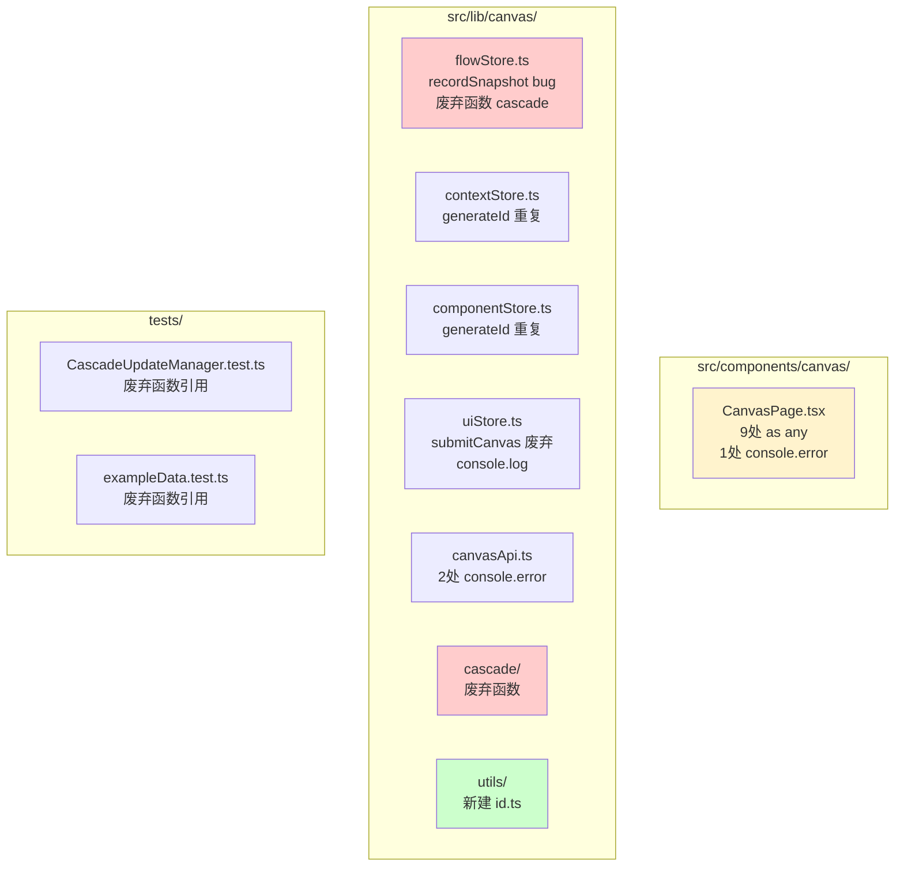
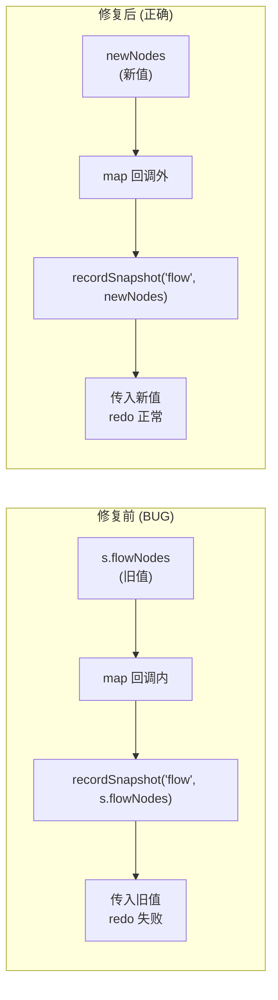

# VibeX Canvas Phase0 代码清理 — 系统架构设计

**项目**: canvas-phase0-cleanup
**阶段**: design-architecture
**架构师**: Architect Agent
**日期**: 2026-04-03
**版本**: v1.0

---

## 执行决策
- **决策**: 已采纳
- **执行项目**: 待 coord 创建项目并绑定
- **执行日期**: 2026-04-03

---

## 1. 问题总览

| 债务类型 | 当前值 | 目标值 | 优先级 |
|----------|--------|--------|--------|
| `as any` 类型断言（CanvasPage） | 9 处 | 0 | P1 |
| `console.log/error` | 4 处 | 0 | P2 |
| `generateId()` 重复定义 | 6 处 | 0 | P2 |
| 废弃函数 | 3 个 | 0 | P2 |
| `recordSnapshot` bug | 存在 | 修复 | **P0** |

---

## 2. 架构图

### 2.1 文件改动范围



### 2.2 关键 Bug：recordSnapshot 逻辑错误



### 2.3 类型守卫架构

```mermaid
flowchart TB
    U[unknown serverData] --> TG[type-guards.ts]
    TG --> |isValidContextNodes| C[BoundedContextNode[]]
    TG --> |isValidFlowNodes| F[BusinessFlowNode[]]
    TG --> |isValidComponentNodes| CM[ComponentNode[]]
    
    C --> SET1[canvasSetContextNodes]
    F --> SET2[canvasSetFlowNodes]
    CM --> SET3[setComponentNodes]
    
    style TG fill:#e3f2fd
    style U fill:#ffcccc
    style C fill:#ccffcc
```

---

## 3. 技术方案

### 3.1 Epic 1: 消除 `as any`

**Group A — 冲突处理器（CanvasPage.tsx L362/365/368）**

```typescript
// src/lib/canvas/utils/type-guards.ts（新建）
export function isValidContextNodes(data: unknown): data is BoundedContextNode[] {
  return Array.isArray(data) && data.every(
    (n) => typeof n === 'object' && n !== null && 'nodeId' in n && 'name' in n
  );
}
export function isValidFlowNodes(data: unknown): data is BusinessFlowNode[] {
  return Array.isArray(data) && data.every(
    (n) => typeof n === 'object' && n !== null && 'nodeId' in n && 'steps' in n
  );
}
export function isValidComponentNodes(data: unknown): data is ComponentNode[] {
  return Array.isArray(data) && data.every(
    (n) => typeof n === 'object' && n !== null && 'nodeId' in n
  );
}

// CanvasPage.tsx — handleConflictUseServer
if (isValidContextNodes(serverData.contexts)) {
  canvasSetContextNodes(serverData.contexts);
}
// 替换: serverData.contexts as any → 类型守卫
```

**Group B — undo/redo（CanvasPage.tsx L528/545）**

```typescript
// 定义 HistorySnapshot 联合类型
type HistorySnapshot = BoundedContextNode[] | BusinessFlowNode[] | ComponentNode[];

// historyStore.undo/redo 返回类型改为 HistorySnapshot | null
const prev = historyStore.undo('context');
if (prev && isValidContextNodes(prev)) {
  canvasSetContextNodes(prev);
}
// 替换: prev as any → 类型守卫
```

### 3.2 Epic 2: 清理调试语句

| 文件 | 行号 | 操作 |
|------|------|------|
| `CanvasPage.tsx` | L773 | `console.error` → 删除 |
| `uiStore.ts` | L166 | `console.log` → 删除（`submitCanvas` 函数同步删除，见 Epic 4）|
| `canvasApi.ts` | L135 | `console.error` → 删除 |
| `canvasApi.ts` | L412 | `console.error` → 删除 |

### 3.3 Epic 3: 提取 generateId()

```typescript
// src/lib/canvas/utils/id.ts（新建）
export function generateId(): string {
  return `${Date.now()}-${Math.random().toString(36).slice(2, 9)}`;
}
export function generateNodeId(): string {
  return `node-${generateId()}`;
}
export function generateFlowId(): string {
  return `flow-${generateId()}`;
}
```

**替换清单**（6 个文件）：

| 文件 | 替换 |
|------|------|
| `flowStore.ts` | 移除本地函数，import from `id.ts` |
| `contextStore.ts` | 移除本地函数，import from `id.ts` |
| `componentStore.ts` | 移除本地函数，import from `id.ts` |
| `requirementHistoryStore.ts` | 移除本地函数，import from `id.ts` |
| `useCanvasSnapshot.ts` | 移除本地函数，import from `id.ts` |
| `useHomeState.ts` | 移除本地函数，import from `id.ts` |

### 3.4 Epic 4: 删除废弃函数

| 函数 | 文件 | 操作 |
|------|------|------|
| `submitCanvas` | `uiStore.ts` | 删除函数 |
| `cascadeContextChange` | `cascade/CascadeUpdateManager.ts` | 删除实现 + cascade/index.ts 移除导出 |
| `cascadeFlowChange` | `cascade/CascadeUpdateManager.ts` | 删除实现 + cascade/index.ts 移除导出 |
| `areAllConfirmed` | `cascade/CascadeUpdateManager.ts` | 删除实现 + cascade/index.ts 移除导出 |

**关联测试文件清理**：
- `CascadeUpdateManager.test.ts` — 删除 `describe('areAllConfirmed')` / `describe('cascadeContextChange')` / `describe('cascadeFlowChange')` 块
- `exampleData.test.ts` — 删除 `areAllConfirmed` 引用

### 3.5 Epic 5: 修复 recordSnapshot bug

```typescript
// flowStore.ts — reorderSteps
reorderSteps: (flowNodeId, fromIndex, toIndex) => {
  set((s) => {
    const newNodes = s.flowNodes.map((n) => {
      if (n.nodeId !== flowNodeId) return n;
      const steps = [...n.steps];
      const [moved] = steps.splice(fromIndex, 1);
      const insertAt = fromIndex < toIndex ? toIndex - 1 : toIndex;
      steps.splice(insertAt, 0, moved);
      return {
        ...n,
        steps: steps.map((st, i) => ({ ...st, order: i })),
        status: 'pending' as const,
      };
    });
    // ✅ 修复：在 map 外调用，传入 newNodes
    getHistoryStore().recordSnapshot('flow', newNodes);
    return { flowNodes: newNodes };
  }),
},
```

---

## 4. 性能影响

**无性能影响**。所有改动均为代码质量优化，不涉及运行时逻辑变更。

---

## 5. 风险矩阵

| 风险 | 可能性 | 影响 | 缓解 |
|------|--------|------|------|
| 删除 cascade 函数破坏生产代码 | 极低 | 高 | 删除前全量 `grep -rn` 确认无引用 |
| 类型守卫遗漏边界情况 | 低 | 中 | 添加 null/undefined/false 值测试 |
| generateId 格式变化影响现有数据 | 极低 | 中 | 仅移动位置，格式不变 |

---

## 6. 验收标准

| Epic | 指标 | 验证方式 |
|------|------|---------|
| E1 | CanvasPage.tsx `as any` = 0 | `grep -c "as any" CanvasPage.tsx` |
| E2 | console.log/error = 0 | `grep -rn "console\.\(log\|error\)" src/` |
| E3 | generateId 重复定义 = 0 | `grep "function generateId" src/` |
| E4 | 废弃函数 = 0 | `grep "submitCanvas\|areAllConfirmed" src/` |
| E5 | recordSnapshot 调用在 map 外 | 代码审查 + 单元测试 |

---

## 7. 依赖关系

**5 Epic 完全独立，可并行开发。**


---

*文档版本: v1.0 | 架构师: Architect Agent | 日期: 2026-04-03*
