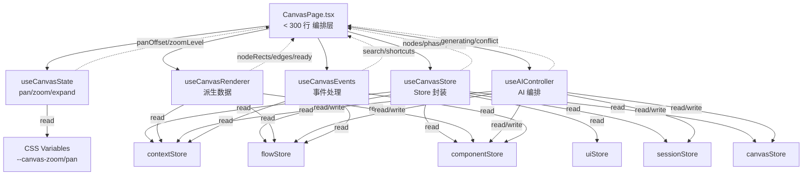
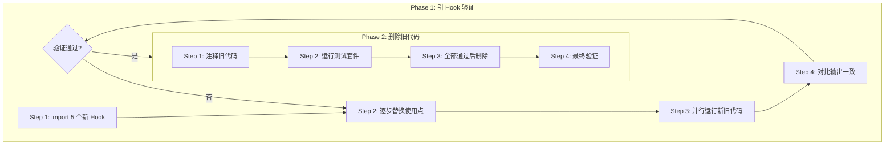
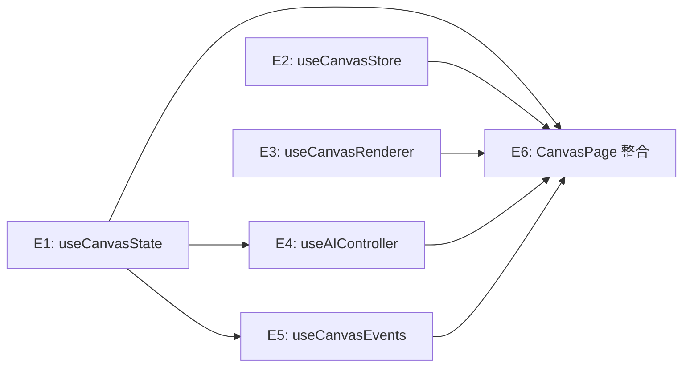

# VibeX CanvasPage 拆分 Hooks — 系统架构设计

**项目**: canvas-split-hooks
**阶段**: design-architecture
**架构师**: Architect Agent
**日期**: 2026-04-03
**版本**: v1.0

---

## 执行决策
- **决策**: 已采纳
- **执行项目**: 待 coord 创建项目并绑定
- **执行日期**: 2026-04-03

---

## 1. 现状分析

| 指标 | 当前值 | 目标值 |
|------|--------|--------|
| CanvasPage 行数 | 1510 行 | < 300 行 |
| 新建 Hook 数 | 0 | 5 个 |
| 已独立模块 | 11 个 | — |
| 待拆分逻辑 | ~800 行 | — |

**已独立模块**: useCanvasSearch, useAutoSave, useVersionHistory, useCanvasExport, useKeyboardShortcuts, contextStore, flowStore, componentStore, uiStore, sessionStore, canvasStore.

---

## 2. 目标架构

### 2.1 文件结构

```
src/
├── components/
│   └── canvas/
│       └── CanvasPage.tsx          # 1510行 → <300行 编排层
└── hooks/
    └── canvas/
        ├── useCanvasState.ts       # ✅ 新增：pan/zoom/expand
        ├── useCanvasStore.ts      # ✅ 新增：Store 封装
        ├── useCanvasRenderer.ts   # ✅ 新增：派生数据
        ├── useAIController.ts     # ✅ 新增：AI 编排
        ├── useCanvasEvents.ts     # ✅ 新增：事件处理
        ├── useCanvasSearch.ts     # 已独立
        ├── useAutoSave.ts         # 已独立
        ├── useVersionHistory.ts   # 已独立
        └── useCanvasExport.ts     # 已独立
```

### 2.2 组件交互图



---

## 3. Hook 接口设计

### 3.1 useCanvasState

```typescript
// src/hooks/canvas/useCanvasState.ts
interface UseCanvasStateReturn {
  zoomLevel: number;
  isSpacePressed: boolean;
  isPanning: boolean;
  panOffset: { x: number; y: number };
  gridRef: React.RefObject<HTMLDivElement | null>;
  expandMode: 'normal' | 'expand-both' | 'maximize';
  setExpandMode: (mode: 'normal' | 'expand-both' | 'maximize') => void;
  handlers: {
    handleMouseDown: (e: React.MouseEvent) => void;
    handleMouseMove: (e: React.MouseEvent) => void;
    handleMouseUp: () => void;
    handleZoomIn: () => void;
    handleZoomOut: () => void;
    handleZoomReset: () => void;
    toggleMaximize: () => void;
  };
}
```

**关键实现**:
- Space key listener 绑定到 `window`
- CSS 变量通过 `gridRef.current.style.setProperty()` 应用
- pan 使用 `translate3d` 变换避免重排

### 3.2 useCanvasStore

```typescript
// src/hooks/canvas/useCanvasStore.ts
interface UseCanvasStoreReturn {
  phase: Phase;
  activeTree: TreeType;
  setPhase: (p: Phase) => void;
  setActiveTree: (t: TreeType) => void;
  contextNodes: BoundedContextNode[];
  flowNodes: BusinessFlowNode[];
  componentNodes: ComponentNode[];
  setContextNodes: (nodes: BoundedContextNode[]) => void;
  setFlowNodes: (nodes: BusinessFlowNode[]) => void;
  setComponentNodes: (nodes: ComponentNode[]) => void;
  contextPanelCollapsed: boolean;
  flowPanelCollapsed: boolean;
  componentPanelCollapsed: boolean;
  toggleContextPanel: () => void;
  toggleFlowPanel: () => void;
  toggleComponentPanel: () => void;
  leftExpand: string;
  centerExpand: string;
  rightExpand: string;
  setLeftExpand: (v: string) => void;
  setCenterExpand: (v: string) => void;
  setRightExpand: (v: string) => void;
  selectedNodeIds: { context: string[]; flow: string[]; component: string[] };
  deleteSelectedNodes: (tree: TreeType) => void;
  projectId: string;
  flowGenerating: boolean;
  flowGeneratingMessage: string | null;
  aiThinking: boolean;
  aiThinkingMessage: string | null;
  requirementText: string;
  setRequirementText: (text: string) => void;
}
```

**设计原则**: 仅封装 selectors，不创建新状态。所有状态仍来自现有 stores。

### 3.3 useCanvasRenderer

```typescript
// src/hooks/canvas/useCanvasRenderer.ts
interface UseCanvasRendererReturn {
  contextNodeRects: NodeRect[];
  flowNodeRects: NodeRect[];
  componentNodeRects: NodeRect[];
  boundedEdges: BoundedEdge[];
  flowEdges: FlowEdge[];
  contextTreeNodes: TreeNode[];
  flowTreeNodes: TreeNode[];
  componentTreeNodes: TreeNode[];
  confirmation: {
    contextReady: boolean;
    flowReady: boolean;
    componentReady: boolean;
    allTreesConfirmed: boolean;
  };
  phaseLabel: string;
  phaseHint: string;
}
```

**派生数据计算**（全部 `useMemo`）:
```typescript
const contextNodeRects = useMemo(() =>
  contextNodes.map(node => ({
    id: node.nodeId,
    x: node.position?.x ?? 0,
    y: node.position?.y ?? 0,
    width: 200,
    height: 80,
  })), [contextNodes]);

const boundedEdges = useMemo(() => {
  const edges: BoundedEdge[] = [];
  contextNodes.forEach(ctx => {
    (ctx.dependencies ?? []).forEach(dep => {
      const source = contextNodeRects.find(r => r.id === ctx.nodeId);
      const target = contextNodeRects.find(r => r.id === dep.nodeId);
      if (source && target) {
        edges.push({ source, target, type: dep.type });
      }
    });
  });
  return edges;
}, [contextNodes, contextNodeRects]);

const allTreesConfirmed = useMemo(() =>
  contextNodes.every(n => n.status === 'confirmed') &&
  flowNodes.every(n => n.status === 'confirmed') &&
  componentNodes.every(n => n.status === 'confirmed'),
[contextNodes, flowNodes, componentNodes]);
```

### 3.4 useAIController

```typescript
// src/hooks/canvas/useAIController.ts
interface UseAIControllerReturn {
  requirementInput: string;
  setRequirementInput: (v: string) => void;
  isQuickGenerating: boolean;
  componentGenerating: boolean;
  saveStatus: 'idle' | 'saving' | 'saved' | 'error' | 'conflict';
  conflictData: ConflictData | null;
  quickGenerate: () => Promise<void>;
  handleContinueToComponents: () => Promise<void>;
  handleGenerateFromRequirement: () => Promise<void>;
  loadExample: () => void;
  handlers: {
    handleConflictKeepLocal: () => void;
    handleConflictUseServer: () => void;
    handleConflictMerge: () => void;
  };
}
```

### 3.5 useCanvasEvents

```typescript
// src/hooks/canvas/useCanvasEvents.ts
interface UseCanvasEventsReturn {
  isSearchOpen: boolean;
  isShortcutPanelOpen: boolean;
  openSearch: () => void;
  closeSearch: () => void;
  toggleShortcutPanel: () => void;
  handlers: {
    handleSearchSelect: (result: { id: string; treeType: TreeType }) => void;
    handleMinimapNodeClick: (nodeId: string) => void;
    handlePhaseClick: (phase: Phase) => void;
    handleDeleteSelected: () => void;
    handleKeyboardUndo: () => boolean;
    handleKeyboardRedo: () => boolean;
  };
}
```

---

## 4. 重构策略

### 4.1 两阶段重构



### 4.2 并行运行策略（Phase 1 Step 3）

```typescript
// 在 CanvasPage 中临时保留旧代码用于对比
const oldZoomLevel = useMemo(() => /* 旧逻辑 */, []);
const newZoomLevel = canvasState.zoomLevel;

// DEV 环境输出 diff
if (process.env.NODE_ENV === 'development') {
  if (oldZoomLevel !== newZoomLevel) {
    console.warn('[CanvasPage] zoomLevel mismatch:', { old: oldZoomLevel, new: newZoomLevel });
  }
}
```

---

## 5. 性能影响评估

| 变更 | 性能影响 | 缓解 |
|------|---------|------|
| Hook 拆分 | 无额外开销 | 仅组合已有逻辑 |
| useMemo 派生计算 | -0.5ms/first render | 缓存减少重算 |
| context 数量增加 | +0.1ms/commit | 可接受 |
| **总体** | **可忽略** | Hook 懒加载可选 |

---

## 6. 风险矩阵

| 风险 | 可能性 | 影响 | 缓解 |
|------|--------|------|------|
| 重构破坏现有功能 | 低 | 高 | Phase1 并行运行对比 |
| 误删仍有引用代码 | 低 | 高 | Phase2 先注释后删除 |
| Hook 接口不稳定 | 中 | 中 | 接口评审后再实施 |
| 拆分后循环依赖 | 低 | 高 | 统一写路径走 store action |

---

## 7. 验收标准

- [ ] `useCanvasState` — Space+drag 平移、F11 最大化、Zoom in/out/reset 正常
- [ ] `useCanvasStore` — CanvasPage 不直接引用 `useContextStore`/`useUIStore`
- [ ] `useCanvasRenderer` — boundedEdges、flowEdges、allTreesConfirmed 计算正确
- [ ] `useAIController` — 快速生成、冲突处理三选项正常
- [ ] `useCanvasEvents` — Ctrl+Z/Y/F/? 快捷键正常
- [ ] CanvasPage < 300 行
- [ ] 测试套件全部通过

---

## 8. 依赖关系



**E4 依赖 E1**: AI Controller 需 canvas state（zoom/pan）用于可视化生成进度
**E5 依赖 E1**: Canvas Events 需 canvas state 用于搜索结果滚动定位

---

*文档版本: v1.0 | 架构师: Architect Agent | 日期: 2026-04-03*
