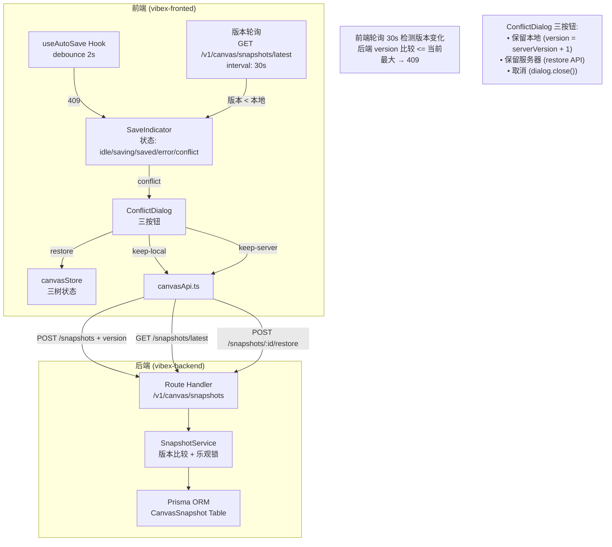
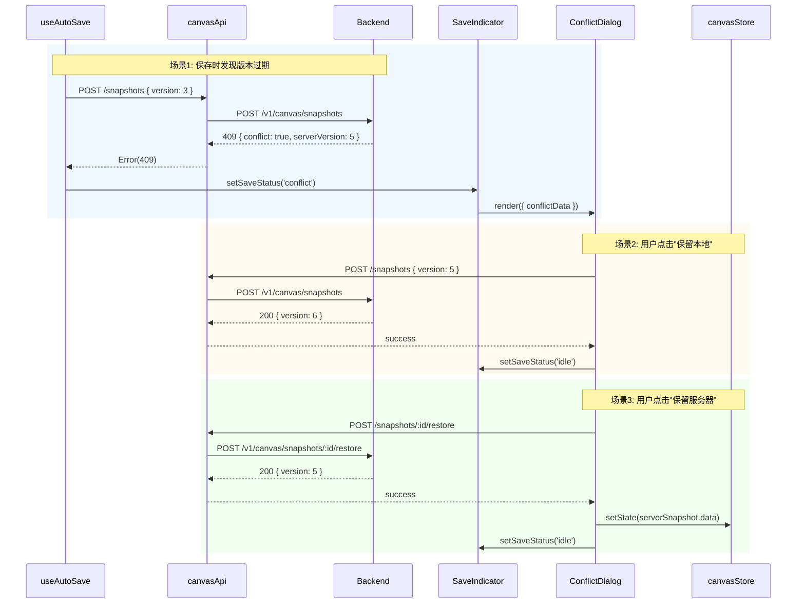

# ADR-023: E4 Sync Protocol — 冲突检测与冲突解决

**状态**: 已采纳
**项目**: canvas-sync-protocol-complete
**日期**: 2026-04-03
**Architect**: Architect Agent

---

## 上下文

canvas-json-persistence Epic 前三 Sprint 已完成（数据模型 + 版本化存储 + 自动保存），但 E4 同步协议缺失。前端已具备冲突 UI 基础（SaveIndicator conflict 状态 + useAutoSave 409 捕获），后端 `/v1/canvas/snapshots` API 和 ConflictDialog 组件需新建。

**现有能力**:
- `useAutoSave.ts`: 捕获 409 并设置 `saveStatus: 'conflict'`，前端 ConflictDialog 展示层就绪
- `canvasApi.ts`: 已有 `createSnapshot` / `listSnapshots` / `getSnapshot` / `restoreSnapshot` 方法（但后端 API 缺失）
- `SaveIndicator.tsx`: 已展示 conflict 状态和"解决"按钮
- `CanvasSnapshot` 数据库表: migration 0006 已存在，字段包含 `id, projectId, version, name, data(JSON), createdAt, isAutoSave`

**缺口**:
1. 后端 snapshots REST API 缺失（路由不存在）
2. 冲突检测逻辑缺失（version 比较 + 409 响应体）
3. ConflictDialog 三按钮逻辑缺失

---

## 决策

### Tech Stack

| 组件 | 技术选型 | 理由 |
|------|---------|------|
| 后端 API | Next.js App Router Route Handlers | 现有架构，vibex-backend 使用 App Router |
| 冲突检测 | 乐观锁（version 比较） | 最小改动，前端已支持 |
| 前端冲突 UI | React + CSS Modules | 现有技术栈 |
| 轮询检测 | 轻量 GET `/latest` | 避免全量 data 传输 |
| 状态管理 | Zustand（已有 canvasStore） | 复用现有架构 |

**版本**: Next.js 15, React 19, TypeScript 5, Zustand 4

---

## 架构图



---

## API 定义

### 1. POST /v1/canvas/snapshots

**请求体**:
```typescript
interface CreateSnapshotRequest {
  projectId: string | null;
  label?: string;          // '手动保存' | '自动保存'
  trigger?: 'auto' | 'manual';
  version?: number;         // E1 乐观锁：当前持有的版本号
  contextNodes: ContextNode[];
  flowNodes: FlowNode[];
  componentNodes: ComponentNode[];
}
```

**成功响应 (200)**:
```typescript
{
  success: true;
  snapshot: {
    id: string;
    version: number;        // 新版本号
    label: string;
    createdAt: string;     // ISO8601
  };
}
```

**冲突响应 (409)**:
```typescript
{
  success: false;
  conflict: true;
  serverVersion: number;   // 服务器当前最新版本
  serverSnapshot: {
    id: string;
    version: number;
    data: {
      contextNodes: ContextNode[];
      flowNodes: FlowNode[];
      componentNodes: ComponentNode[];
    };
    createdAt: string;
  };
}
```

**业务逻辑**:
```
IF version === undefined OR version > maxServerVersion:
    INSERT snapshot, RETURN 200
ELSE:
    RETURN 409 { conflict: true, serverVersion, serverSnapshot }
```

### 2. GET /v1/canvas/snapshots/latest

**查询参数**: `?projectId=xxx`

**响应 (200)**:
```typescript
{
  success: true;
  latestVersion: number;    // 服务器最新版本
  updatedAt: string;        // ISO8601
}
```

**用途**: 轮询检测，轻量 API（不返回全量 data）

### 3. GET /v1/canvas/snapshots

**查询参数**: `?projectId=xxx`

**响应 (200)**:
```typescript
{
  success: true;
  snapshots: Array<{
    id: string;
    version: number;
    label: string;
    isAutoSave: boolean;
    createdAt: string;
  }>;
}
```

**注意**: 不返回全量 `data` 字段，仅返回 metadata

### 4. GET /v1/canvas/snapshots/:id

**响应 (200)**:
```typescript
{
  success: true;
  snapshot: {
    id: string;
    version: number;
    label: string;
    isAutoSave: boolean;
    createdAt: string;
    data: {
      contextNodes: ContextNode[];
      flowNodes: FlowNode[];
      componentNodes: ComponentNode[];
    };
  };
}
```

### 5. POST /v1/canvas/snapshots/:id/restore

**响应 (200)**:
```typescript
{
  success: true;
  version: number;         // 恢复后的新版本号
}
```

---

## 数据模型

### Prisma Schema（CanvasSnapshot）

```prisma
model CanvasSnapshot {
  id          String   @id @default(cuid())
  projectId   String?
  version     Int      @default(autoincrement())
  label       String   @default("")
  data        Json     // { contextNodes, flowNodes, componentNodes }
  isAutoSave  Boolean  @default(false)
  createdAt   DateTime @default(now())
  createdBy   String?
  isDeleted   Boolean  @default(false)

  @@index([projectId, version])
  @@unique([projectId, version])  // 乐观锁约束
}
```

---

## 冲突解决流程



---

## 前端改动范围

| 文件 | 改动 | 类型 |
|------|------|------|
| `components/canvas/features/ConflictDialog.tsx` | 新建，三按钮组件 | 新增 |
| `hooks/canvas/useAutoSave.ts` | 增加版本轮询检测（30s间隔） | 修改 |
| `lib/canvas/api/canvasApi.ts` | 增加 `getLatestVersion()` 方法 | 修改 |
| `components/canvas/features/SaveIndicator.tsx` | conflict 按钮连接 ConflictDialog | 修改 |
| `app/canvas/page.tsx` | 集成 ConflictDialog | 修改 |

---

## 性能考虑

| 维度 | 评估 | 缓解 |
|------|------|------|
| 轮询 overhead | < 50ms/次（仅 HEAD 请求） | ✅ 已满足 |
| 409 响应体大小 | serverSnapshot 含全量 data，可能大 | 只在冲突时返回，可接受 |
| 并发保存 | 多标签页同时触发 useAutoSave | 乐观锁保护，最后写入胜出 |

---

## Testing Strategy

### 测试框架
- **后端**: Jest（`*.test.ts`）
- **前端**: Jest（单元/集成）+ Playwright（E2E）
- **覆盖要求**: 行 ≥ 65%，分支 ≥ 50%

### 核心测试用例

#### 后端单元测试（`vibex-backend/src/app/api/v1/canvas/snapshots/*.test.ts`）

```typescript
// 1. 乐观锁成功
describe('POST /v1/canvas/snapshots', () => {
  it('version > maxServerVersion → 200 + 新版本号', async () => {
    const res = await POST('/v1/canvas/snapshots', {
      projectId: 'proj-1',
      version: 100,         // 远大于当前最大版本
      contextNodes: [],
      flowNodes: [],
      componentNodes: [],
    });
    expect(res.status).toBe(200);
    expect(res.body.snapshot.version).toBeGreaterThan(100);
  });

  it('version ≤ maxServerVersion → 409 + conflict body', async () => {
    const res = await POST('/v1/canvas/snapshots', {
      projectId: 'proj-1',
      version: 1,            // 小于当前最大版本
      contextNodes: [],
      flowNodes: [],
      componentNodes: [],
    });
    expect(res.status).toBe(409);
    expect(res.body.conflict).toBe(true);
    expect(res.body.serverVersion).toBeDefined();
    expect(res.body.serverSnapshot).toBeDefined();
  });

  it('无 version 字段 → 200（新快照，无乐观锁）', async () => {
    const res = await POST('/v1/canvas/snapshots', {
      projectId: 'proj-1',
      contextNodes: [],
      flowNodes: [],
      componentNodes: [],
    });
    expect(res.status).toBe(200);
  });
});

// 2. GET /latest 轻量版本检测
describe('GET /v1/canvas/snapshots/latest', () => {
  it('返回 latestVersion 和 updatedAt', async () => {
    const res = await GET('/v1/canvas/snapshots/latest?projectId=proj-1');
    expect(res.status).toBe(200);
    expect(typeof res.body.latestVersion).toBe('number');
  });
});

// 3. Restore API
describe('POST /v1/canvas/snapshots/:id/restore', () => {
  it('restore 到指定快照 → 200 + 新版本号', async () => {
    const res = await POST('/v1/canvas/snapshots/snap-id/restore');
    expect(res.status).toBe(200);
    expect(res.body.success).toBe(true);
    expect(res.body.version).toBeDefined();
  });
});
```

#### 前端单元测试（`vibex-fronted/src/hooks/canvas/__tests__/useAutoSave.test.ts`）

```typescript
describe('useAutoSave 冲突检测', () => {
  it('POST 返回 409 时 saveStatus 变为 conflict', async () => {
    mockCanvasApi.createSnapshot.mockRejectedValue({ status: 409, isConflict: true });
    const { result } = renderHook(() => useAutoSave({ projectId: 'proj-1' }));
    act(() => { result.current.saveNow(); });
    await waitFor(() => {
      expect(result.current.saveStatus).toBe('conflict');
    });
  });

  it('conflict 状态下 conflictData 包含 serverSnapshot', async () => {
    const serverSnapshot = { version: 5, data: mockData };
    mockCanvasApi.createSnapshot.mockRejectedValue({
      status: 409,
      isConflict: true,
      response: { data: { conflict: true, serverVersion: 5, serverSnapshot } },
    });
    const { result } = renderHook(() => useAutoSave({ projectId: 'proj-1' }));
    act(() => { result.current.saveNow(); });
    await waitFor(() => {
      expect(result.current.conflictData).toMatchObject({ serverVersion: 5 });
    });
  });
});

describe('版本轮询检测', () => {
  it('30s 轮询间隔，版本差异 → conflict', async () => {
    jest.useFakeTimers();
    mockCanvasApi.getLatestVersion.mockResolvedValue({ latestVersion: 10 });
    const { result } = renderHook(() => useAutoSave({ projectId: 'proj-1' }));
    // 模拟本地版本 = 5
    act(() => { result.current.setLocalVersion(5); });
    // 快进 30s
    act(() => { jest.advanceTimersByTime(30000); });
    await waitFor(() => {
      expect(result.current.saveStatus).toBe('conflict');
    });
    jest.useRealTimers();
  });
});
```

#### E2E 测试（`tests/e2e/conflict-resolution.spec.ts`）

```typescript
describe('冲突检测与解决 E2E', () => {
  it('标签页A保存 → 标签页B触发冲突 → 保留本地', async ({ page: pageA, context }) => {
    // 标签页A: 创建项目并保存
    await pageA.goto('/canvas');
    const projectId = await createProject(pageA);
    await pageA.keyboard.type('Tab A content');
    await pageA.waitForSelector('[data-testid="save-indicator"]');

    // 标签页B: 打开同一项目（模拟服务器有新版本）
    const pageB = await context.newPage();
    await pageB.goto(`/canvas?projectId=${projectId}`);

    // 模拟: 后端 version 比 pageB 本地高 → pageB 保存触发 409
    await pageB.keyboard.type('Tab B content (after A saved)');
    // 手动触发保存
    await pageB.keyboard.press('Control+s');

    // 期望: 出现 ConflictDialog
    await expect(pageB.locator('[data-testid="conflict-dialog"]')).toBeVisible();
    await expect(pageB.getByText('保留本地')).toBeVisible();
    await expect(pageB.getByText('保留服务器')).toBeVisible();

    // 点击"保留本地"
    await pageB.getByRole('button', { name: '保留本地' }).click();

    // 期望: Dialog 关闭，saveStatus 恢复 idle
    await expect(pageB.locator('[data-testid="conflict-dialog"]')).not.toBeVisible();
  });

  it('标签页A保存 → 标签页B触发冲突 → 保留服务器', async ({ page: pageA, context }) => {
    const pageB = await context.newPage();
    // ... (setup same as above)

    // 点击"保留服务器"
    await pageB.getByRole('button', { name: '保留服务器' }).click();

    // 期望: 三树状态被 serverSnapshot 替换
    // 验证 contextNodes 数量与 serverSnapshot 一致
    const contextCount = await pageB.locator('.context-node').count();
    expect(contextCount).toBe(serverSnapshot.contextNodes.length);
  });
});
```

---

## 实施计划

### Phase 1: 后端 API（2h）
| 步骤 | 任务 | 产出 |
|------|------|------|
| 1.1 | 新建 Route Handler `POST /v1/canvas/snapshots` 含乐观锁 | `route.ts` |
| 1.2 | 新建 `GET /v1/canvas/snapshots/latest` 轻量版本检测 | `route.ts` |
| 1.3 | 新建 `GET /v1/canvas/snapshots/:id` | `route.ts` |
| 1.4 | 新建 `POST /v1/canvas/snapshots/:id/restore` | `route.ts` |
| 1.5 | 单元测试覆盖所有 API 路径 | `*.test.ts` |

### Phase 2: 前端冲突 UI（2h）
| 步骤 | 任务 | 产出 |
|------|------|------|
| 2.1 | 新建 `ConflictDialog.tsx` 组件 | `ConflictDialog.tsx` |
| 2.2 | 修改 `useAutoSave.ts` 增加轮询检测 | `useAutoSave.ts` |
| 2.3 | 修改 `canvasApi.ts` 增加 `getLatestVersion()` | `canvasApi.ts` |
| 2.4 | 修改 `SaveIndicator.tsx` 连接 ConflictDialog | `SaveIndicator.tsx` |
| 2.5 | 单元测试 + 组件测试 | `*.test.ts` |

### Phase 3: 集成 + E2E（1h）
| 步骤 | 任务 | 产出 |
|------|------|------|
| 3.1 | E2E 完整冲突解决流程 | `conflict-resolution.spec.ts` |
| 3.2 | 集成测试 | `*.test.ts` |

**预计总工时**: 5h

---

## 风险与缓解

| 风险 | 概率 | 影响 | 缓解 |
|------|------|------|------|
| 轮询延迟导致冲突未及时检测 | 中 | 低 | 可缩短至 15s（需权衡服务器负载） |
| 保留服务器后数据不可恢复 | 低 | 高 | Restore API 创建新 snapshot，不破坏原数据 |
| 多标签页同时解决冲突 | 低 | 中 | 乐观锁保证最后一次操作胜出 |

---

## 执行决策

- **决策**: 已采纳
- **执行项目**: team-tasks 项目 canvas-sync-protocol-complete
- **执行日期**: 2026-04-03
