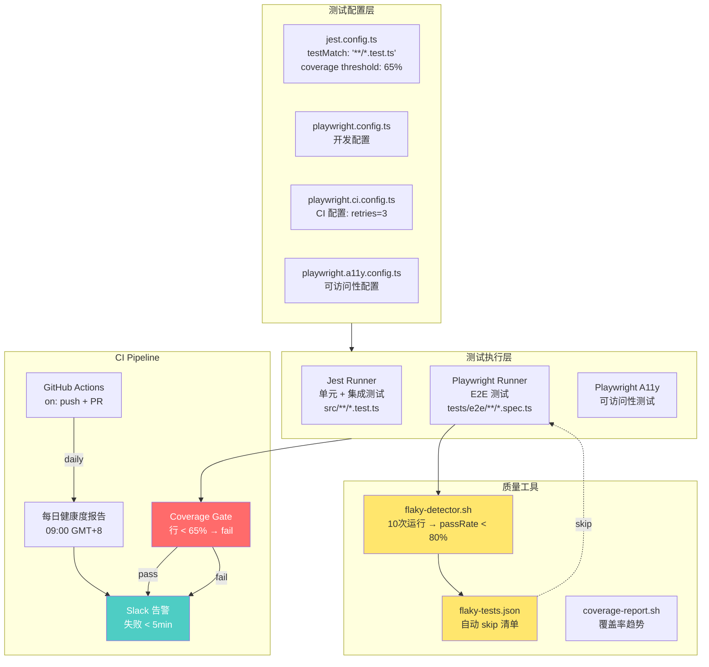

# ADR-024: VibeX 测试框架标准化

**状态**: 已采纳
**项目**: canvas-test-framework-standardize
**日期**: 2026-04-03
**Architect**: Architect Agent

---

## 上下文

VibeX 前端双框架并行（Jest + Playwright），存在 5 大系统性缺陷：

| 痛点 | 当前状态 | 目标 |
|------|---------|------|
| 规范边界模糊 | Jest/Playwright 职责不清，有重复文件 | 明确边界，无重复 |
| CI Gate 不完善 | 无测试通过率 gate，无 Slack 告警 | 完整 CI 质量护栏 |
| 测试覆盖率低 | 行 52.76% / 分支 33.75% | 行 ≥ 65% / 分支 ≥ 50% |
| Playwright 配置碎片化 | 7 个配置文件 | ≤ 3 个 |
| Flaky 测试 | retries=1，flaky 未管理 | retries=3，连续 5 次无 flaky |

---

## 决策

### Tech Stack

| 组件 | 技术选型 | 理由 |
|------|---------|------|
| 单元/集成测试 | Jest（现有） | 渐进式，不破坏现有代码 |
| E2E 测试 | Playwright（现有） | 渐进式，不破坏现有代码 |
| 覆盖率工具 | Jest coverage（现有） | 复用现有 jest --coverage |
| CI 平台 | GitHub Actions（现有） | 复用现有配置 |
| 告警 | Slack Webhook（现有） | 复用现有 CI Slack 集成 |
| Flaky 检测 | 自定义脚本 | 轻量，无需引入新依赖 |

**版本**: Jest 29, Playwright 1.50, GitHub Actions, Node 22

---

## 架构图



---

## 文件合并方案

### Playwright 配置（7 → 3）

| 现状 | 合并后 | 用途 |
|------|--------|------|
| `playwright.config.ts` | ✅ 保留 | 开发调试（`npx playwright test`）|
| `playwright.test.config.ts` | ❌ 删除 | 合并入 `playwright.config.ts` |
| `playwright.ci.config.ts` | ✅ 保留 | CI 专用（`npx playwright test --config playwright.ci.config.ts`）|
| `playwright.a11y.config.ts` | ✅ 保留 | 可访问性（`npx playwright test --config playwright.a11y.config.ts`）|
| `playwright-canvas-phase2.config.ts` | ❌ 删除 | 临时配置，合并入 `playwright.config.ts` |
| `playwright-canvas-crash-test.config.cjs` | ❌ 删除 | 临时配置，合并入 `playwright.ci.config.ts` |
| `playwright.perf.config.ts` | ❌ 删除 | 合并入 `playwright.config.ts` |

**合并策略**:
- `playwright.config.ts` 保留 `reporter: 'list'`，dev 用
- `playwright.ci.config.ts` 继承 `playwright.config.ts`（`extends`），覆盖 `reporter: 'html'`，加 `retries: 3`
- `playwright.a11y.config.ts` 独立，测试目标 `tests/a11y/**/*.spec.ts`

### 重复测试文件合并

| 重复文件 | 合并方案 |
|---------|---------|
| `tests/basic.spec.ts` | 内容与 `tests/e2e/basic.spec.ts` 对比，去重合并后删除根目录版本 |
| 其他 `tests/unit/*.spec.ts` | 检查是否与 `src/__tests__/` 下测试重复，合并覆盖 |

---

## Jest 配置规范化

### 当前问题

```typescript
// jest.config.ts 中使用 testPathIgnorePatterns 依赖路径
testPathIgnorePatterns: [
  '/node_modules/',
  '/tests/e2e/',      // ← 依赖路径而非命名
  '/tests/performance/',
]
```

### 规范化后

```typescript
// jest.config.ts 使用 testMatch 命名规范
testMatch: ['**/*.test.ts'],  // ← 明确命名约定
// 移除 testPathIgnorePatterns 中的路径依赖

// ESLint 强制命名规范
// .eslintrc.json 增加:
{
  "rules": {
    "test文件名": ["error", { "pattern": "^.+\\.test\\.(ts|tsx|js|jsx)$" }]
  }
}
```

---

## CI 质量门禁

### GitHub Actions 配置

```yaml
# .github/workflows/test.yml
name: Test & Quality Gate

on:
  push:
    branches: [main, develop]
  pull_request:
    branches: [main]

jobs:
  jest:
    runs-on: ubuntu-latest
    steps:
      - uses: actions/checkout@v4
      - uses: pnpm/action-setup@v4
        with: { version: 9 }
      - uses: actions/setup-node@v4
        with: { node-version: '22', cache: 'pnpm' }
      - run: pnpm install --frozen-lockfile
      - name: Run Jest with coverage
        run: pnpm jest --coverage --coverage-threshold=65
        env:
          CI: true
      - name: Upload coverage to GitHub
        uses: actions/upload-artifact@v4
        with: { name: jest-coverage, path: coverage/ }

  e2e:
    runs-on: ubuntu-latest
    steps:
      - uses: actions/checkout@v4
      - uses: pnpm/action-setup@v4
        with: { version: 9 }
      - uses: actions/setup-node@v4
        with: { node-version: '22', cache: 'pnpm' }
      - run: pnpm install --frozen-lockfile
      - name: Install Playwright browsers
        run: npx playwright install --with-deps chromium
      - name: Run E2E
        run: pnpm playwright test --config=playwright.ci.config.ts
        continue-on-error: true  # 允许 flaky 失败，但报告仍上传
      - name: Run Flaky Detector
        run: bash scripts/flaky-detector.sh
        continue-on-error: true
      - name: Slack Alert on Failure
        if: failure()
        uses: slackapi/slack-github-action@v1.27
        with:
          channel-id: ${{ secrets.SLACK_CI_ALERTS_CHANNEL_ID }}
          payload: |
            {
              "text": "❌ E2E Test Failed: ${{ github.event.head_commit.message }}",
              "blocks": [{ "type": "section", "text": { "type": "mrkdwn", "text": "PR: ${{ github.event.pull_request.html_url }} | Run: ${{ github.run_id }}" } }]
            }
        env:
          SLACK_BOT_TOKEN: ${{ secrets.SLACK_BOT_TOKEN }}
```

---

## 测试覆盖率提升方案

### 当前低覆盖模块

| 模块 | 行覆盖 | 分支覆盖 | 优先级 |
|------|--------|---------|--------|
| `historySlice.ts` | ~40% | 16% | P0 |
| `contextStore.ts` | ~50% | 25% | P0 |
| `flowStore.ts` | ~55% | 30% | P1 |
| `componentStore.ts` | ~50% | 25% | P1 |
| `useAutoSave.ts` | ~60% | 40% | P1 |

### 分阶段提升计划

| 阶段 | 目标 | 工时 | 负责人 |
|------|------|------|--------|
| Phase 1 | historySlice 分支 ≥ 40% | 3h | dev |
| Phase 2 | Canvas 核心模块分支 ≥ 50% | 3h | dev |
| Phase 3 | 全局达标行 ≥ 65% / 分支 ≥ 50% | 2h | dev |

### 覆盖率阈值分阶段

```javascript
// jest.config.ts — 分阶段提升阈值
// Phase 1: 当前实际值 + 5%
const phase1Thresholds = { lines: 55, branches: 40, functions: 80 };

// Phase 2: 目标值 - 5%
const phase2Thresholds = { lines: 60, branches: 45, functions: 85 };

// Phase 3: 目标值
const phase3Thresholds = { lines: 65, branches: 50, functions: 90 };
```

---

## Flaky 测试治理

### flaky-detector.sh 脚本设计

```bash
#!/bin/bash
# scripts/flaky-detector.sh
# 运行 E2E 测试 N 次，统计 pass rate，输出 flaky-tests.json

RUNS=${1:-10}
CONFIG=${2:-playwright.ci.config.ts}
OUTPUT=flaky-tests.json

declare -A PASS_COUNT
declare -A FAIL_COUNT
TOTAL=0

# 收集所有测试文件
TEST_FILES=$(npx playwright test --config=$CONFIG --list 2>/dev/null | grep "·" | awk '{print $2}')

for test in $TEST_FILES; do
  PASS=0
  FAIL=0
  for i in $(seq 1 $RUNS); do
    if npx playwright test "$test" --config=$CONFIG > /dev/null 2>&1; then
      ((PASS++))
    else
      ((FAIL++))
    fi
  done
  PASS_RATE=$(echo "scale=2; $PASS / $RUNS" | bc)
  if (( $(echo "$PASS_RATE < 0.8" | bc -l) )); then
    echo "Flaky: $test (pass rate: $PASS_RATE)"
    echo "{\"test\": \"$test\", \"passRate\": $PASS_RATE, \"passes\": $PASS, \"failures\": $FAIL}" >> $OUTPUT
  fi
done

echo "Flaky test detection complete. Output: $OUTPUT"
```

### flaky-tests.json 格式

```json
[
  {
    "test": "tests/e2e/project-flow.spec.ts",
    "passRate": 0.7,
    "passes": 7,
    "failures": 3,
    "skip": true
  }
]
```

### CI 自动 skip 机制

```typescript
// scripts/skip-flaky.ts
import flakyTests from '../flaky-tests.json';
import { readFileSync } from 'fs';

// Playwright 配置中动态 skip
flakyTests.forEach(ft => {
  if (ft.skip) {
    test.skip(ft.test, `Flaky: pass rate ${ft.passRate}`);
  }
});
```

---

## Testing Strategy

### 测试框架
- **单元/集成测试**: Jest (`*.test.ts`)
- **E2E 测试**: Playwright (`*.spec.ts`)
- **覆盖率要求**: 行 ≥ 65%，分支 ≥ 50%，函数 ≥ 80%

### 目录结构规范

```
tests/
  unit/           ← Jest 测试（可选，实际使用 src/__tests__/）
  e2e/            ← Playwright E2E 测试
  e2e/*.spec.ts   ← 命名规范：.spec.ts
  a11y/           ← Playwright 可访问性测试
  performance/    ← Playwright 性能测试

src/
  __tests__/      ← Jest 单元测试（*.test.ts）
```

### 核心测试用例示例

#### historySlice 覆盖率提升

```typescript
// src/lib/canvas/stores/__tests__/historySlice.test.ts
describe('historySlice 分支覆盖', () => {
  it('undo 在空历史时返回 undefined', () => {
    const state = createHistorySlice({ past: [], present: mockPresent, future: [] });
    const result = state.nodes[0].undo(state);
    expect(result).toBeUndefined();
  });

  it('redo 在空未来时返回 undefined', () => {
    const state = createHistorySlice({ past: [mockPast], present: mockPresent, future: [] });
    const result = state.nodes[0].redo(state);
    expect(result).toBeUndefined();
  });

  it('undo 超过历史长度时返回 undefined', () => {
    const state = createHistorySlice({ past: [mockPast[0]], present: mockPresent, future: [] });
    const result = state.nodes[0].undo(state);
    // 验证不会越界
    expect(result.present).toEqual(mockPresent);
  });

  it('多个连续 undo/redo 操作正确', () => {
    const state1 = createHistorySlice({ past: [], present: v1, future: [] });
    const state2 = state1.nodes[0].push(state1, v2);
    const state3 = state2.nodes[0].undo(state2);
    const state4 = state3.nodes[0].redo(state3);
    expect(state4.present).toEqual(v2);
  });
});
```

#### CI Gate 验证

```typescript
// scripts/__tests__/ci-gate.test.ts
describe('CI Coverage Gate', () => {
  it('覆盖率低于阈值时 CI 应该阻断', () => {
    const coverage = { lines: 52, branches: 30, functions: 70 };
    const thresholds = { lines: 65, branches: 50, functions: 80 };

    const linePass = coverage.lines >= thresholds.lines;
    const branchPass = coverage.branches >= thresholds.branches;
    const funcPass = coverage.functions >= thresholds.functions;

    expect(linePass).toBe(false);  // 52 < 65 → CI fail
    expect(branchPass).toBe(false); // 30 < 50 → CI fail
    expect(funcPass).toBe(true);    // 70 < 80 → CI fail
  });
});
```

---

## 实施计划

### Phase 1: 止血（1-2 天）

| 步骤 | 任务 | 产出 | 工时 |
|------|------|------|------|
| 1.1 | 合并 Playwright 配置文件（7→3） | 3 个配置文件 | 2h |
| 1.2 | 删除重复测试文件 | 无重复文件 | 1h |
| 1.3 | 编写 TESTING_STRATEGY.md | 策略文档 | 1h |
| 1.4 | Jest 配置规范化（testMatch） | jest.config.ts | 1h |

### Phase 2: CI Gate（1-2 天）

| 步骤 | 任务 | 产出 | 工时 |
|------|------|------|------|
| 2.1 | 配置 GitHub Actions 覆盖率 gate | test.yml | 2h |
| 2.2 | Slack 告警脚本 | slack-alert.sh | 2h |
| 2.3 | 每日健康度报告脚本 | daily-report.sh | 3h |

### Phase 3: 覆盖率提升（3-5 天）

| 步骤 | 任务 | 产出 | 工时 |
|------|------|------|------|
| 3.1 | historySlice 覆盖率修复 | 8 个测试 | 3h |
| 3.2 | Canvas 核心模块覆盖 | 15 个测试 | 3h |
| 3.3 | 全局覆盖率达标 | 持续补充 | 2h |

### Phase 4: Flaky 治理（1-2 天）

| 步骤 | 任务 | 产出 | 工时 |
|------|------|------|------|
| 4.1 | flaky-detector.sh 脚本 | 脚本 | 2h |
| 4.2 | 自动 skip 机制 | flaky-tests.json | 2h |
| 4.3 | 连续 5 次 CI 验证 | CI 通过 | 1h |

### Phase 5: 命名规范（0.5 天）

| 步骤 | 任务 | 产出 | 工时 |
|------|------|------|------|
| 5.1 | ESLint 命名强制 | .eslintrc | 1h |
| 5.2 | 目录结构文档化 | TESTING_STRATEGY.md 更新 | 0.5h |

**总工时**: 约 29h（5 个工作日）

---

## 风险与缓解

| 风险 | 概率 | 影响 | 缓解 |
|------|------|------|------|
| 覆盖率提升占用 dev 工时 | 高 | 中 | 工时从 Sprint 技术债预留中扣除 |
| Flaky 根因复杂无法消除 | 高 | 中 | retries=3 吸收，低频 flaky 标记 skip |
| CI 频繁 blocking 影响节奏 | 中 | 中 | 分阶段阈值（52%→55%→60%→65%）|
| 删除重复测试误删有价值用例 | 低 | 高 | 删除前对比测试用例集合 |

---

## 执行决策

- **决策**: 已采纳
- **执行项目**: team-tasks 项目 canvas-test-framework-standardize
- **执行日期**: 2026-04-03
