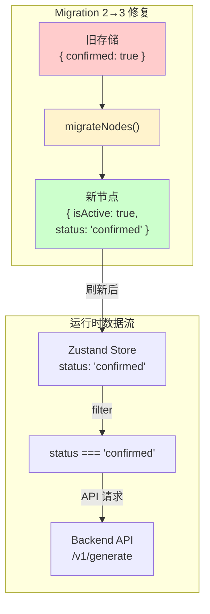

# Checkbox Persistence Fix — 系统架构设计

**项目**: checkbox-persistence-fix
**阶段**: design-architecture
**架构师**: Architect Agent
**日期**: 2026-04-03
**版本**: v1.0

---

## 执行决策
- **决策**: 已采纳
- **执行项目**: 待 coord 创建项目并绑定
- **执行日期**: 2026-04-03

---

## 1. 问题分析

### 1.1 根因

Migration 2→3 将 `confirmed: true` 映射为 `isActive: true`，但 **`status` 字段未设置**，默认为 `'pending'`。

### 1.2 数据流

```
旧存储: { contextNodes: [{ ..., confirmed: true }] }
    ↓ Migration 2→3
新节点: { ..., isActive: true }    ← status 未设置 = 'pending'
    ↓ 刷新后
generateComponentFromFlow: ctx.status === 'confirmed' → FALSE ❌
    ↓
API 请求缺失该节点
```

---

## 2. 技术方案

### 2.1 Migration 修复

**文件**: `vibex-fronted/src/lib/canvas/canvasStore.ts` — `runMigrations()`

```typescript
// 修复前（缺陷）
const migrateNodes = (nodes: any[]): any[] =>
  nodes.map((n: any) => {
    const confirmed = n.confirmed;
    const { confirmed: _confirmed, ...rest } = n;
    return {
      ...rest,
      isActive: confirmed ?? true,
      // ❌ status 未设置，默认为 'pending'
    };
  });

// 修复后
const migrateNodes = (nodes: any[]): any[] =>
  nodes.map((n: any) => {
    const confirmed = n.confirmed;
    const { confirmed: _confirmed, ...rest } = n;
    return {
      ...rest,
      isActive: confirmed ?? true,
      // ✅ 关键修复：confirmed → status
      status: confirmed ? 'confirmed' : (rest.status ?? 'pending'),
    };
  });
```

### 2.2 三棵树节点数据结构

| 树 | 节点类型 | 确认字段 | 持久化 | Migration 影响 |
|----|---------|---------|--------|--------------|
| 限界上下文 | BoundedContextNode | `status` + `isActive` | ✅ Zustand persist | ✅ 需修复 |
| 业务流程 | BusinessFlowNode | `status` + `isActive` | ✅ Zustand persist | ✅ 需修复 |
| 组件 | ComponentNode | `status` | ✅ Zustand persist | ❌ 无需修复 |

### 2.3 API 数据过滤

`generateComponentFromFlow` 调用后端 API 时使用 `status === 'confirmed'` 过滤：

```typescript
// canvasStore.ts line ~1033
const confirmedContexts = contextNodes.filter((ctx) => ctx.status === 'confirmed');
const confirmedFlows     = flowNodes.filter((f)    => f.status === 'confirmed');
```

**过滤语义**:
- `status === 'confirmed'` — 已确认，参与 API 请求
- `status === 'pending'` — 未确认，不参与 API 请求

---

## 3. 架构图



---

## 4. 验收标准

| ID | Given | When | Then |
|----|-------|------|------|
| AC1 | Migration 2→3 | 旧数据 `confirmed: true` | `status === 'confirmed'` |
| AC2 | 刷新页面 | 确认后刷新 | checkbox 视觉一致 |
| AC3 | API 请求 | generateComponentFromFlow | 只含 `status === 'confirmed'` 节点 |

---

## 5. 测试策略

```typescript
// canvasStore.migration.test.ts
describe('Migration 2→3', () => {
  it('confirmed: true → status: confirmed', () => {
    const oldNode = { nodeId: '1', name: 'Test', confirmed: true };
    const migrated = migrateNodes([oldNode])[0];
    expect(migrated.status).toBe('confirmed');
    expect(migrated.isActive).toBe(true);
    expect(migrated.confirmed).toBeUndefined();
  });

  it('confirmed: false → status: pending', () => {
    const oldNode = { nodeId: '1', name: 'Test', confirmed: false };
    const migrated = migrateNodes([oldNode])[0];
    expect(migrated.status).toBe('pending');
  });

  it('confirmed 缺失 → status: pending', () => {
    const oldNode = { nodeId: '1', name: 'Test' };
    const migrated = migrateNodes([oldNode])[0];
    expect(migrated.status).toBe('pending');
  });
});
```

---

## 6. 风险

| 风险 | 可能性 | 影响 | 缓解 |
|------|--------|------|------|
| Migration 重复执行 | 极低 | Migration 有 version 检查，只执行一次 | 无 |
| 已正确数据被覆盖 | 极低 | 只影响 Migration 2→3 期间确认的节点 | 无 |

---

## 7. 性能影响

无。Migration 在 `runMigrations()` 初始化时执行一次，节点数量有限。

---

*文档版本: v1.0 | 架构师: Architect Agent | 日期: 2026-04-03*
