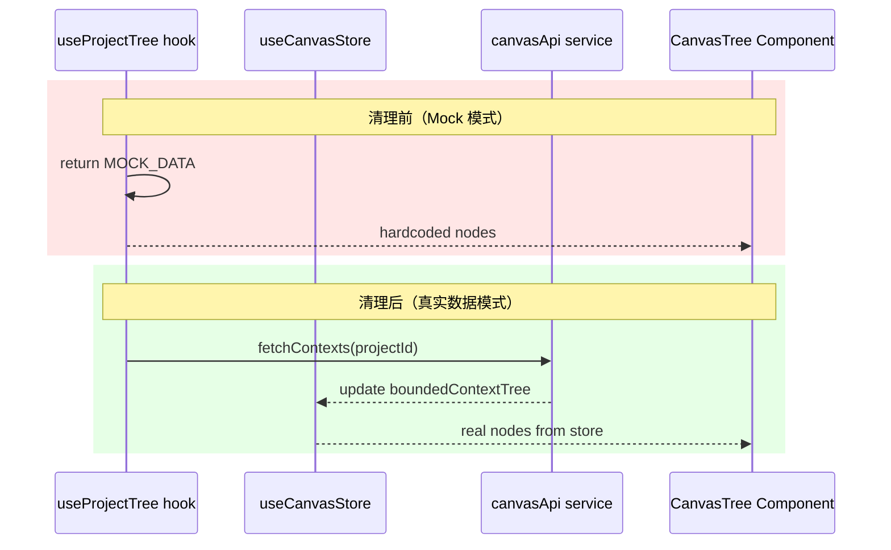

# Architecture — frontend-mock-cleanup

**项目**: frontend-mock-cleanup
**Architect**: Architect Agent
**日期**: 2026-04-04
**仓库**: /root/.openclaw/vibex

---

## 1. 执行摘要

清理前端生产代码中的 mock 数据遗留，确保 Canvas 三树组件使用真实数据源。

| Epic | 范围 | 工时 | 风险 |
|------|------|------|------|
| E1 | useProjectTree / BoundedContextTree / ComponentTree mock 清理 | 3-4h | 中 |
| E2 | cleanup-mocks.js 误报修复（test-utils 目录） | 0.5h | 低 |

**总工时**: 3.5-4.5h

---

## 2. 系统架构图

### 2.1 Mock 清理影响范围

```mermaid
graph TD
    subgraph "清理前（有 mock 遗留）"
        UPT[useProjectTree.ts<br/>3x return MOCK_DATA] 
        BCT[BoundedContextTree.tsx<br/>mockGenerateContexts()]
        CMT[ComponentTree.tsx<br/>mockGenerateComponents()]
    end

    subgraph "清理后（真实数据源）"
        UPT2[useProjectTree.ts<br/>→ useQuery() 或空状态]
        BCT2[BoundedContextTree.tsx<br/>→ useCanvasStore()]
        CMT2[ComponentTree.tsx<br/>→ useCanvasStore()]
    end

    UPT -->|移除 mock| UPT2
    BCT -->|替换真实 API| BCT2
    CMT -->|替换真实 API| CMT2

    style UPT fill:#ef4444,color:#fff
    style BCT fill:#ef4444,color:#fff
    style CMT fill:#ef4444,color:#fff
    style UPT2 fill:#22c55e,color:#fff
    style BCT2 fill:#22c55e,color:#fff
    style CMT2 fill:#22c55e,color:#fff
```

### 2.2 数据流变更



---

## 3. E1 详细方案

### 3.1 useProjectTree.ts — 移除 3 处 MOCK_DATA return

**文件**: `vibex-fronted/src/hooks/useProjectTree.ts`

| 行号 | 当前代码 | 替换方案 |
|------|---------|---------|
| L280 | `if (query.isError && useMockOnError) return MOCK_DATA;` | 移除此行，错误状态由调用方处理 |
| L281 | `if (skip) return MOCK_DATA;` | 移除此行，返回 `null`（调用方显示加载状态） |
| L282 | `if (!projectId) return MOCK_DATA;` | 改为 `return { nodes: [], projectId, name: '项目分析' };`（空状态） |

**注意**: `MOCK_DATA` 常量（L111-163）和 `useMockOnError` 变量（L224）仍保留，待确认无其他引用后删除。

**向后兼容**: CanvasPage 调用 useProjectTree 返回空数据时，应显示空状态而非崩溃。

### 3.2 BoundedContextTree.tsx — 替换 mockGenerateContexts

**文件**: `vibex-fronted/src/components/canvas/BoundedContextTree.tsx`

| 行号 | 当前代码 | 替换方案 |
|------|---------|---------|
| L399 | `const drafts = mockGenerateContexts('');` | 使用 `useCanvasStore` 获取 `boundedContextTree.nodes` |

```typescript
// 替换方案
const boundedContextTree = useCanvasStore(s => s.boundedContextTree);
const drafts = boundedContextTree?.nodes ?? [];
```

**向后兼容**: 若 store 中无数据，显示空状态（`drafts.length === 0` 时渲染空提示）。

### 3.3 ComponentTree.tsx — 替换 mockGenerateComponents

**文件**: `vibex-fronted/src/components/canvas/ComponentTree.tsx`

| 行号 | 当前代码 | 替换方案 |
|------|---------|---------|
| L683 | `const drafts = mockGenerateComponents(flowNodes.length);` | 使用 `useCanvasStore` 获取 `componentTree.nodes` |

```typescript
// 替换方案
const componentTree = useCanvasStore(s => s.componentTree);
const drafts = componentTree?.nodes ?? [];
```

**向后兼容**: 同 BoundedContextTree。

---

## 4. E2 详细方案

### 4.1 cleanup-mocks.js — 跳过 test-utils 目录

**文件**: `vibex-fronted/scripts/cleanup-mocks.js`（或 `scripts/cleanup-mocks.js`）

```javascript
// 在 SKIP_PATTERNS 或 scanDir 配置中添加
const SKIP_PATTERNS = [
  '/node_modules/',
  '/test-utils/',   // ← 新增：跳过 test-utils 目录（JSDoc 注释误报）
  '/__tests__/',
  '/__mocks__/',
];

// 或在文件扫描时过滤
const files = allFiles.filter(f => !f.includes('/test-utils/'));
```

**误报原因**: `src/test-utils/factories/index.ts` 的 JSDoc 注释中包含 `mock` 关键词（描述 mock factory 用途），被正则表达式误检测为 mock 调用。

---

## 5. 接口定义

### 5.1 CanvasTree 组件数据源

```typescript
// 清理后各 Tree 组件的数据契约
interface TreeDataSource {
  boundedContextTree: {
    nodes: BoundedContextNode[];  // 来自 canvasStore
  } | null;
  businessFlowTree: {
    nodes: FlowNode[];           // 来自 canvasStore
  } | null;
  componentTree: {
    nodes: ComponentNode[];     // 来自 canvasStore
  } | null;
}

// 各组件使用方式
const boundedContextTree = useCanvasStore(s => s.boundedContextTree);
const drafts = boundedContextTree?.nodes ?? [];  // 不再使用 mockGenerateContexts

const componentTree = useCanvasStore(s => s.componentTree);
const drafts = componentTree?.nodes ?? [];        // 不再使用 mockGenerateComponents
```

### 5.2 useProjectTree 清理后签名

```typescript
// 清理后的 return 语义
interface UseProjectTreeResult {
  nodes: CardTreeVisualizationRaw[];
  projectId: string | null;
  name: string;
  isLoading: boolean;
  isError: boolean;
}

// 三种状态不再返回 MOCK_DATA：
// 1. query.isError && useMockOnError → 返回空 nodes + isError=true
// 2. skip → 返回 { nodes: [], isLoading: true }
// 3. !projectId → 返回 { nodes: [], projectId: null, name: '项目分析' }
```

---

## 6. 测试策略

| Epic | 测试方式 | 验收 |
|------|---------|------|
| E1-F1/F2/F3 | 静态代码检查（grep） | `grep -r "MOCK_DATA\|mockGenerateContexts\|mockGenerateComponents" src/` 无生产代码 |
| E1-E2E | Playwright Canvas 渲染 | 三树组件正常显示 |
| E2-F1 | 脚本执行验证 | `node scripts/cleanup-mocks.js` 输出 0 issues |

### 核心验收测试

```typescript
// E1: 静态检查测试
it('useProjectTree.ts 无 MOCK_DATA return', () => {
  const source = fs.readFileSync('src/hooks/useProjectTree.ts', 'utf-8');
  const mockReturns = source.match(/return MOCK_DATA;/g);
  expect(mockReturns).toBeNull();
});

it('BoundedContextTree.tsx 无 mockGenerateContexts', () => {
  const source = fs.readFileSync('src/components/canvas/BoundedContextTree.tsx', 'utf-8');
  expect(source).not.toMatch(/mockGenerateContexts/);
});

it('ComponentTree.tsx 无 mockGenerateComponents', () => {
  const source = fs.readFileSync('src/components/canvas/ComponentTree.tsx', 'utf-8');
  expect(source).not.toMatch(/mockGenerateComponents/);
});

// E2: cleanup-mocks.js 误报修复
it('cleanup-mocks.js 跳过 test-utils', () => {
  const result = execSync('node scripts/cleanup-mocks.js', { cwd: 'vibex-fronted' });
  expect(result.stdout).not.toMatch(/test-utils/);
});
```

---

## 7. 风险与缓解

| 风险 | 影响 | 缓解措施 |
|------|------|---------|
| 移除 mock 后 Canvas 页面无数据可显示 | 高 | 确保 useCanvasStore 有初始数据源（loadExampleData 或后端 API） |
| useProjectTree 调用方未处理空状态 | 中 | 审查所有 useProjectTree 调用点，必要时加防御性空状态 |
| cleanup-mocks.js 误报修复引入新漏报 | 低 | 添加 `test-utils` 后手动验证其他真实 mock 仍被检测 |

---

## 8. 性能影响

清理 mock 后实际**性能提升**：
- 无 mockGenerateContexts/Components 的同步计算开销
- 真实数据来自 store，无需 JSON parse mock 数据
- 页面渲染真实数据，无闪烁（mock 随机性导致的视觉抖动消除）

**结论**: mock 清理对性能有正面影响，无负面影响。

---

*本文档由 Architect Agent 生成于 2026-04-04 18:45 GMT+8*
