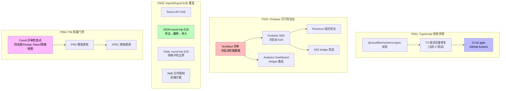

# VibeX Sprint 8 — 系统架构设计

> **项目**: heartbeat (VibeX Sprint 8)
> **阶段**: design-architecture
> **版本**: v1.1
> **日期**: 2026-04-25
> **Architect**: Architect Agent
> **工作目录**: /root/.openclaw/vibex

---

## 1. 执行摘要

Sprint 8 是债务清理 + 质量门禁 + 可行性验证冲刺，不引入新功能架构。四个 Epic 分别对应：TypeScript 编译质量、Firebase SDK 可行性、Import/Export 数据完整性、PM 神技质量门禁。

**现状确认**（2026-04-25 实测）：
- `vibex-fronted`: `pnpm exec tsc --noEmit` → **exit 0** ✅
- `vibex-backend`: `pnpm exec tsc --noEmit` → **exit 0** ✅
- `@cloudflare/workers-types`: `^4.20260424.1` 已安装 ✅
- CI tsc gate: `typecheck-backend` + `typecheck-frontend` jobs 已存在于 `.github/workflows/test.yml` ✅（触发条件：push 到 main/develop）

**技术审查结论**：
- TS 债务已清理，CI gate 已就位，P001 技术债已实质解决
- E2-U1（Firebase 评审）是阻塞点，结论决定 P002 后续 4 个 Unit 的命运
- P003（Import/Export E2E）和 P004（PM 质量门禁）可立即并行派发
- ⚠️ 关键风险：E2-U1 结论为"不可行"时，P002-U2~U5 全部降级，实际工时从 13.5d → 约 6d

---

## 1.1 技术审查发现（v1.1 新增）

| ID | 类别 | 发现 | 严重度 | 处理 |
|----|------|------|--------|------|
| TR-1 | 依赖版本 | Architecture 指定 `@cloudflare/workers-types@^4.20250415.0`，实际仓库已安装 `^4.20260424.1` | 低 | 文档更新为最新版本 |
| TR-2 | 文档路径 | P002-S1 评审报告路径写为 `docs/architecture/firebase-feasibility-review.md`，应在 `docs/heartbeat/firebase-feasibility-review.md` | 低 | 文档路径已更新 |
| TR-3 | SSE Bridge 冷启动 | Firebase SSE bridge 在 Cloudflare Workers 冷启动场景下无 fallback 机制 | 中 | E2-U5 需增加冷启动超时 + REST API 降级逻辑 |
| TR-4 | Analytics Widget 刷新 | Widget 30s 刷新周期未在 acceptance criteria 中量化 | 低 | E2-U4 AC 中补充 `刷新间隔 30s ±5s` |
| TR-5 | P002 降级路径 | E2-U2~U5 依赖 E2-U1 "可行"结论，但未定义降级后的 API 行为 | 中 | E2-U1 评审必须包含明确降级路径（回退到现有 REST Presence）|

---

## 2. 技术栈

| 组件 | 技术选型 | 版本 | 理由 |
|------|----------|------|------|
| 前端框架 | Next.js | 15.x | 现有项目约束 |
| 后端框架 | Hono | ^4.x | 边缘计算友好，Cloudflare Workers 适配 |
| 数据库 ORM | Prisma | ^5.x | 现有项目约束 |
| 类型检查 | TypeScript | ^5.x | `strict: true` 已启用 |
| 类型补充 | @cloudflare/workers-types | ^4.20260424.1 | Cloudflare Workers API 类型覆盖（已安装 ✅） |
| 单元测试 | Jest | ^29.x | backend；Vitest frontend |
| E2E 测试 | Playwright | ^1.50.x | round-trip E2E 验证 |
| API 验证 | Zod | ^3.x | 现有 schema validation |
| 实时通信 | Firebase Admin SDK | ^12.x | 待 P002-S1 可行性验证 |

---

## 3. 架构图



---

## 4. 模块划分

### 4.1 P001: TypeScript 债务清理

**影响范围**：
- `vibex-fronted/tsconfig.json` — 前端 TypeScript 配置
- `vibex-backend/tsconfig.json` — 后端 TypeScript 配置
- `.github/workflows/test.yml` — CI tsc gate（**已就位 ✅**）

**当前状态**（实测 2026-04-25）：
- backend `tsc --noEmit` → exit 0
- frontend `tsc --noEmit` → exit 0
- `typecheck-backend` + `typecheck-frontend` jobs 已存在于 CI
- `@cloudflare/workers-types@^4.20260424.1` 已安装

**P001 结论**：技术债已实质清理，本期 P001 工作重心转为**验证 CI gate 在 main/develop push 时正确触发**，无需额外代码变更。

### 4.2 P002: Firebase 可行性验证

**影响范围**：
- `vibex-backend/src/lib/firebase.ts` — 新建，Firebase SDK 初始化封装
- `vibex-fronted/src/components/dashboard/AnalyticsWidget.tsx` — 新建
- `vibex-fronted/src/app/dashboard/page.tsx` — 修改，集成 Analytics Widget
- `vibex-backend/src/lib/sse-bridge.ts` — 新建，SSE bridge 端点

**数据流**：
```
Firebase SDK init → Firebase Admin
                      ↓
               SSE Bridge (/api/presence/stream)
                      ↓
              Dashboard Analytics Widget
```

### 4.3 P003: Import/Export E2E 覆盖

**影响范围**：
- `vibex-fronted/e2e/import-export/` — 新建 E2E 测试目录
- `vibex-fronted/src/components/import/` — 5MB 文件大小校验逻辑

**数据流**：
```
用户上传文件
    ↓
前端校验文件大小
    ↓ (≤5MB)
解析文件格式 (JSON/YAML)
    ↓
导入 API → 数据库
    ↓
导出 API → 下载文件
    ↓
E2E: 导出内容 === 导入内容
```

### 4.4 P004: PM 质量门禁

**影响范围**：
- `vibex/docs/templates/prd-template.md` — PRD 模板
- `vibex/docs/templates/spec-template.md` — SPEC 模板
- `vibex/docs/coord/review-checklist.md` — Coord 评审清单

---

## 5. API 定义

### 5.1 现有 API（保持兼容）

| 端点 | 方法 | 描述 |
|------|------|------|
| `/api/v1/templates` | GET | 模板列表 |
| `/api/v1/templates/:id` | GET | 模板详情 |
| `/api/v1/canvas/generate` | POST | 生成 Canvas |
| `/api/v1/health` | GET | 健康检查 |
| `/api/v1/presence` | GET | Presence 数据（REST） |
| `/api/v1/export` | POST | 导出数据 |
| `/api/v1/import` | POST | 导入数据 |
| `/api/v1/teams` | GET | Teams 列表 |

### 5.2 新增 API（P002 SSE Bridge）

| 端点 | 方法 | 描述 | 响应格式 |
|------|------|------|----------|
| `/api/presence/stream` | GET | SSE 实时 Presence 流 | `text/event-stream` |

**SSE Bridge 响应格式**：
```typescript
// event: presence_update
// data: {"userId": "xxx", "status": "online", "timestamp": 1745616000000}

// event: heartbeat
// data: {"ts": 1745616000000}
```

**错误响应**：
```json
{ "error": "AUTH_ERROR", "message": "Invalid API key" }
```

---

## 6. 数据模型

### 6.1 Analytics Event（新增）

```typescript
interface AnalyticsEvent {
  id: string;
  type: 'page_view' | 'component_create' | 'export';
  userId: string;
  timestamp: number;
  metadata: Record<string, unknown>;
}
```

### 6.2 Firebase Presence（待 P002-S1 验证后决定）

```typescript
interface PresenceState {
  userId: string;
  status: 'online' | 'away' | 'offline';
  lastSeen: number;
}
```

---

## 7. 风险评估

| ID | 风险 | 影响 | 缓解 |
|----|------|------|------|
| R1 | P002-S1 Firebase SDK 不可行 | P002 全部降级至暂缓 | S1 先执行；结论为"不可行"则 SSE bridge 等全部跳过 |
| R2 | P003 round-trip 发现数据丢失 | YAML 特殊字符转义不一致 | 先用真实数据跑一遍 round-trip，再写 Playwright |
| R3 | CI tsc gate 在 PR 中误报 | 影响开发体验 | gate 只在 main/develop 分支 push 时触发，不在 PR 阶段 |
| R4 | 5MB 限制绕过 | 文件大小超限进入后端 | 前端拦截 + 后端 multipart size limit 双保险 |

---

## 8. 性能影响

| 组件 | 影响 | 评估 |
|------|------|------|
| CI tsc gate | 无运行时影响 | CI 构建时间 +5~15s（取决于代码量） |
| Firebase SDK init | 冷启动延迟增加 | 目标 < 500ms；超过则降级 REST API |
| Analytics Widget | Dashboard 加载延迟 | 骨架屏占位；超时 3s 显示"加载中" |
| 5MB 文件限制 | 前端校验 < 10ms | 纯客户端校验，无网络开销 |

---

## 9. 测试策略

### 9.1 测试框架

| 层级 | 框架 | 覆盖率目标 |
|------|------|------------|
| 单元测试 | Jest / Vitest | > 80%（涉及文件修改的模块） |
| E2E 测试 | Playwright | 关键路径 100% |
| CI Gate | `tsc --noEmit` | 0 errors |

### 9.2 核心测试用例

**P001-S3 CI tsc gate**：
```typescript
test('CI: tsc --noEmit exits with 0', () => {
  const result = execSync('cd vibex-backend && pnpm exec tsc --noEmit', {encoding: 'utf8'});
  expect(result.exitCode, 'to be', 0);
});
```

**P002-S2 Firebase 冷启动**：
```typescript
test('Firebase SDK init < 500ms', async () => {
  const start = Date.now();
  await initializeFirebaseAdmin();
  const duration = Date.now() - start;
  expect(duration, 'to be less than', 500);
});
```

**P003-S2 JSON round-trip**：
```typescript
test('JSON round-trip: export → import → export 内容一致', async () => {
  const exported = await exportData('json');
  await importData(exported);
  const reexported = await exportData('json');
  expect(JSON.stringify(JSON.parse(reexported)), 'to equal', JSON.stringify(JSON.parse(exported)));
});
```

**P003-S3 YAML round-trip**：
```typescript
test('YAML round-trip: 特殊字符无转义丢失', async () => {
  const yaml = `key: "value:with:colons"\nmultiline: |\n  line1\n  line2`;
  const parsed = yaml.load(yaml.stringify(yaml.load(yaml)));
  expect(parsed.multiline, 'to contain', 'line1');
});
```

**P003-S4 5MB 限制**：
```typescript
test('文件 > 5MB 被前端拦截', async () => {
  const hugeFile = Buffer.alloc(6 * 1024 * 1024);
  await page.setInputFiles('[data-testid="import-file"]', {name: 'large.json', buffer: hugeFile});
  const errorMsg = await page.locator('.error-message').textContent();
  expect(errorMsg, 'to contain', '5MB');
});
```

---

## 10. 兼容性

所有变更**向后兼容**：
- P001 不改变任何运行时行为
- P002 新增 SSE bridge 不影响现有 REST API
- P003 测试覆盖不改变 Import/Export 功能
- P004 纯模板/清单变更，不影响代码

---

## 执行决策

- **决策**: 已采纳
- **执行项目**: team-tasks 项目 ID 待 Coord 绑定
- **执行日期**: 2026-04-25

---

## v1.1 技术审查补充（2026-04-25）

**审查方法**: 代码实测 + CI 配置验证 + PRD 验收标准对照

**审查结论**：
- P001 技术债已实质解决，CI gate 就位，无需额外代码工作
- 5 个技术发现（TR-1~TR-5），其中 2 个中严重度：
  - **TR-3**: SSE Bridge 冷启动需 fallback 机制
  - **TR-5**: E2-U1 评审必须定义 P002 降级路径（回退到现有 REST Presence）
- P003 和 P004 无阻塞，可立即派发
