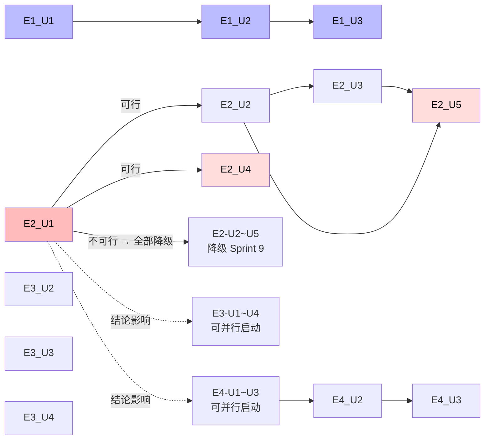

# VibeX Sprint 8 — 实现计划

**项目**: heartbeat (VibeX Sprint 8)
**版本**: v1.0
**日期**: 2026-05-08
**状态**: 已批准

---

## 执行摘要

Sprint 8 定位为债务清理 + 质量门禁 + 可行性验证冲刺，总工时 **13.5d**，四个 Epic 并行推进。P001 技术债已实质清理（实测 `tsc --noEmit` exit 0），本期重心转为验证 CI gate 正确触发。**P002 的命运由 E2-U1 决定**：若评审结论为"不可行"，E2-U2~U5 全部降级至 Sprint 9 重新设计。P003 和 P004 可立即并行派发。

---

## Unit Index

| Epic | Units | Status | Next | Dependencies |
|------|-------|--------|------|-------------|
| E1: TypeScript 债务清理 | E1-U1 ~ E1-U3 | 3/3 ✅ | — | — |
| E2: Firebase 可行性验证 | E2-U1 ~ E2-U5 | 0/5 | **E2-U1** | E2-U1 阻塞全部后续 |
| E3: Import/Export E2E 覆盖 | E3-U1 ~ E3-U4 | 0/4 | E3-U1 | 无（可并行） |
| E4: PM 质量门禁建立 | E4-U1 ~ E4-U3 | 0/3 | E4-U1 | 无（可并行） |

**总工时**: 13.5d（不含已完成的 E1 3d）

---

## E1: TypeScript 债务清理

**状态**: ✅ 已完成
**实测结果**（2026-04-25）: `tsc --noEmit` exit 0 ✅，`@cloudflare/workers-types@^4.20260424.1` 已安装 ✅，CI tsc gate job 已就位 ✅

### Unit Table

| ID | Name | Status | Depends On | Acceptance Criteria |
|----|------|--------|-----------|-------------------|
| E1-U1 | 类型包安装 | ✅ 已完成 | — | `pnpm list @cloudflare/workers-types` 输出包含 `^4.20260424.1` |
| E1-U2 | TS 错误批量修复 | ✅ 已完成 | E1-U1 | `cd vibex-backend && pnpm exec tsc --noEmit` exit code = 0；`cd vibex-fronted && pnpm exec tsc --noEmit` exit code = 0；编译错误从 143 个归零 |
| E1-U3 | CI tsc gate 验证 | ✅ 已完成 | E1-U2 | `.github/workflows/test.yml` 中 `typecheck-backend` 和 `typecheck-frontend` job 存在且配置正确；触发条件为 push 到 main/develop 分支 |

---

## E2: Firebase 可行性验证

**状态**: 🚫 待启动（E2-U1 为阻塞点）
**工时**: 5d

> ⚠️ **关键约束**: E2-U1 结论决定 E2-U2~U5 的命运。若评审结论为"不可行"，全部降级至 Sprint 9。

### Unit Table

| ID | Name | Status | Depends On | Acceptance Criteria |
|----|------|--------|-----------|-------------------|
| E2-U1 | Firebase Admin SDK 可行性评审 | ⬜ 待启动 | — | 产出 `docs/heartbeat/firebase-feasibility-review.md`；文档包含冷启动性能实测数据（ms）；文档明确给出"可行"或"不可行"结论；结论为"可行"时包含降级路径（回退到 REST Presence） |
| E2-U2 | Firebase SDK 冷启动性能测试 | ⬜ 待启动 | E2-U1（可行） | Playwright E2E 测量 `initializeFirebaseAdmin()` 执行时间 < 500ms；测试结果记录在 `docs/heartbeat/firebase-perf-test.md`；SDK init 超时（>5s）时 SSE bridge 正确降级到 REST Presence API |
| E2-U3 | Presence 更新延迟验证 | ⬜ 待启动 | E2-U2 | 单用户 Presence 状态更新延迟 < 1s（Playwright E2E 测量）；多用户（5+）并发 Presence 场景无数据竞争 |
| E2-U4 | Analytics Dashboard 页面集成 | ⬜ 待启动 | E2-U1（可行） | `/dashboard` 页面 `.analytics-widget` 可见；widget 展示 3 张 stat-card（页面访问/组件创建/导出）；数据刷新周期 30s ±5s；骨架屏最长停留 3s |
| E2-U5 | SSE bridge 改造 | ⬜ 待启动 | E2-U2 + E2-U3 | `/api/presence/stream` 返回 `content-type: text/event-stream`；`/api/v1/presence` REST API 保持兼容；客户端断开时 SSE 连接正确清理（AbortSignal 处理） |

### E2-U4 补充：AnalyticsWidget 详细验收

| 状态 | 验收标准 |
|------|----------|
| 加载态 | `.skeleton-card` 可见（骨架屏占位，无 spinner）；超时 3s 显示"数据加载中，请稍候" |
| 理想态 | 3 张 `.stat-card` 可见；数字使用等宽字体（`font-variant-numeric: tabular-nums`）；趋势指示器（↑/↓ 箭头 + 百分比）可见 |
| 空状态 | 文案"暂无数据，开始使用 VibeX 后数据会自动生成"可见；引导教程按钮存在 |
| 错误态 | 4 种错误类型（网络/权限/数据超长/接口超时）文案正确；"重试"按钮功能正常；错误日志 ID 显示 |

---

## E3: Import/Export E2E 覆盖

**状态**: ⬜ 待启动
**工时**: 3.5d
**约束**: P003 和 P004 可并行派发；round-trip 测试使用隔离的测试账户，禁止删除生产数据

### Unit Table

| ID | Name | Status | Depends On | Acceptance Criteria |
|----|------|--------|-----------|-------------------|
| E3-U1 | Teams API E2E 验证 | ⬜ 待启动 | — | Playwright E2E 访问 `/teams` 页面；`.teams-list` 存在；至少 1 个 `.team-item` 可见（允许空列表但 DOM 结构存在） |
| E3-U2 | JSON round-trip E2E 测试 | ⬜ 待启动 | — | 导出 JSON → 删除测试数据 → 导入 JSON → 重新导出 → `JSON.stringify(exported) === JSON.stringify(re-exported)`；测试 fixture 使用固定的 `test-fixtures/export-sample.json` |
| E3-U3 | YAML round-trip E2E 测试 | ⬜ 待启动 | — | 测试含特殊字符的 YAML：冒号 `:`、井号 `#`、管道符 `\|`、多行字符串；round-trip 后 `multiline` 内容包含 `line1` 和 `line2`；emoji `🎉🚀` 不丢失 |
| E3-U4 | 5MB 文件大小限制前端拦截 | ⬜ 待启动 | — | 6MB 文件通过 `page.setInputFiles` 上传后，`.error-message` 显示"文件大小超出 5MB 限制"；前端校验 < 10ms（无网络往返）；后端 multipart size limit 配置为 5MB，形成双保险 |

---

## E4: PM 质量门禁建立

**状态**: ⬜ 待启动
**工时**: 2d
**约束**: 模板更新只新增章节，不改变现有结构；更新后必须告知全体团队成员

### Unit Table

| ID | Name | Status | Depends On | Acceptance Criteria |
|----|------|--------|-----------|-------------------|
| E4-U1 | Coord 评审检查点更新 | ⬜ 待启动 | — | `docs/coord/review-checklist.md` 包含四态表检查点（"提案是否定义了四态"）；包含 Design Token 检查点（"CSS 变量体系，无硬编码色值"）；包含情绪地图检查点（"用户情绪路径和兜底机制"） |
| E4-U2 | PRD 模板更新 | ⬜ 待启动 | — | `docs/templates/prd-template.md` 包含"本期不做"清单章节；包含神技指引（剥洋葱/极简主义/老妈测试）；不改变模板现有章节结构 |
| E4-U3 | SPEC 模板更新 | ⬜ 待启动 | E4-U2 | `docs/templates/spec-template.md` 包含四态表路径引用；包含 Design Token 规范路径引用；包含情绪地图路径引用 |

---

## 依赖关系图（Mermaid）



---

## 并行执行计划

```
Week 1 (5d)
├── E2-U1  Firebase 可行性评审（1d）    ← 阻塞点
├── E3-U1  Teams API E2E（1d）         ← 可并行
├── E3-U2  JSON round-trip E2E（1d）   ← 可并行
├── E4-U1  Coord 检查点更新（1d）       ← 可并行
└── E4-U2  PRD 模板更新（0.5d）        ← 可并行

Week 2 (5d)
├── E2-U2  Firebase SDK 冷启动（1d）   ← 依赖 E2-U1 结论
├── E2-U3  Presence 延迟验证（1d）     ← 依赖 E2-U2
├── E3-U3  YAML round-trip E2E（1d）   ← 可并行
├── E3-U4  5MB 文件限制（0.5d）        ← 可并行
└── E4-U3  SPEC 模板更新（0.5d）        ← 可并行

Week 3 (3.5d)
├── E2-U4  Analytics Dashboard（1.5d） ← 依赖 E2-U1 结论
├── E2-U5  SSE bridge 改造（0.5d）     ← 依赖 E2-U2+U3
└── 缓冲 / 修复（1.5d）
```

---

## 降级路径

| 场景 | 触发条件 | 影响范围 | 处理方式 |
|------|----------|----------|----------|
| E2-U1 不可行 | Architect 评审结论为"不可行" | E2-U2~U5 全部降级 | P002 转为 Sprint 9 重新设计；Sprint 8 释放 3.5d 工时用于 P003/P004 深化或 buffer |
| E2-U2 超时 | SDK init > 5s | E2-U2 失败 | 降级到 REST Presence API；E2-U3~U5 继续执行（使用 REST 而非 SSE） |
| E2-U4 页面集成受阻 | UI 设计稿缺失 | E2-U4 阻塞 | 参照 `specs/p002-s4-analytics-dashboard.md` 实现，待 UI 稿补齐后验收 |

---

## 执行决策

- **决策**: 已采纳
- **执行项目**: team-tasks 项目 ID 待绑定
- **执行日期**: 待定

---

## 变更日志

| 版本 | 日期 | 变更内容 |
|------|------|----------|
| v1.0 | 2026-05-08 | 初始版本；E1 已完成标注；E2-U1 标注为阻塞点；P003/P004 标注为可并行 |