# 实施计划: homepage-v4-fix

**状态**: 进行中  
**创建日期**: 2026-03-21  
**预计总工期**: 10h  
**执行顺序**: Epic 1 → Epic 2 → Epic 3 → Epic 4

---

## 1. Phase 顺序与依赖关系

```mermaid
gantt
    title homepage-v4-fix 实施计划
    dateFormat HH:mm
    section Epic 1
    AIPanel 集成到 HomePage    :t1, 00:00, 1.5h
    thinkingMessages 数据渲染   :t2, after t1, 1h
    新项目脉冲动画              :t3, after t2, 0.5h
    section Epic 2
    BottomPanel 目录结构        :t4, after t3, 0.5h
    底部面板布局与子组件        :t5, after t4, 3.5h
    section Epic 3
    Grid 布局实现               :t6, after t5, 1.5h
    浅色主题变量                :t7, after t6, 0.5h
    HomePage 布局迁移           :t8, after t7, 1h
    section Epic 4
    视觉一致性验证               :t9, after t8, 1h
    回归测试                     :t10, after t9, 1h
```



---

## 2. 详细 Phase 分解

### Phase 1: Epic 1 — 右侧AI思考列表集成

| Story | 任务 | 工时 | Dev 产出 |
|-------|------|------|----------|
| ST-1.1 | AIPanel 组件适配（移除旧 aside，集成 AIPanel） | 1.5h | HomePage.tsx 修改 |
| ST-1.2 | thinkingMessages 数据渲染（useMemo 适配器） | 1h | 适配器逻辑 |
| ST-1.3 | 新项目脉冲动画 | 0.5h | AIPanel.module.css 修改 |

**小计**: 3h  
**依赖**: 无（从现有代码库出发）

---

### Phase 2: Epic 2 — 底部面板组件

| Story | 任务 | 工时 | Dev 产出 |
|-------|------|------|----------|
| ST-2.0 | BottomPanel 目录结构 | 0.5h | 5 个新文件 |
| ST-2.1 | BottomPanel 主容器 + 布局 | 1h | BottomPanel.tsx + CSS |
| ST-2.2 | CollapseHandle (30px) | 0.5h | CollapseHandle.tsx |
| ST-2.3 | InputArea (80px) | 0.5h | InputArea.tsx |
| ST-2.4 | ActionBar (50px) + 7个按钮 | 1h | ActionBar.tsx |
| ST-2.5 | AIDisplay (3列卡片) | 1h | AIDisplay.tsx |

**小计**: 5h  
**依赖**: Phase 1 完成（AIPanel 集成后才能确认布局空间）

---

### Phase 3: Epic 3 — 布局与主题调整

| Story | 任务 | 工时 | Dev 产出 |
|-------|------|------|----------|
| ST-3.1 | 新建 `homepage-v4.module.css`（Grid 布局） | 1.5h | 新 CSS 文件 |
| ST-3.2 | 浅色主题 CSS Variables | 0.5h | CSS 变量定义 |
| ST-3.3 | HomePage 布局迁移（className 更新） | 1h | HomePage.tsx 修改 |

**小计**: 3h  
**依赖**: Phase 2 完成（BottomPanel 需要 Grid 定位）

---

### Phase 4: Epic 4 — 视觉一致性验证

| Story | 任务 | 工时 | 负责人 |
|-------|------|------|--------|
| ST-4.1 | 三栏宽度验证（220px / 1fr / 260px） | 0.5h | Tester |
| ST-4.2 | 左侧抽屉背景色验证 | 0.5h | Tester |
| ST-4.3 | 预览区渐变背景验证 | 0.5h | Tester |
| ST-4.4 | 回归测试（6步流程 + SSE + PreviewArea） | 1h | Tester |
| ST-4.5 | Reviewer 代码审查 | 1h | Reviewer |

**小计**: 3.5h  
**依赖**: Phase 3 完成（所有组件到位后验证）

---

## 3. 工时汇总

| Phase | Epic | 工时 | 累计 |
|-------|------|------|------|
| Phase 1 | Epic 1: AIPanel 集成 | 3h | 3h |
| Phase 2 | Epic 2: 底部面板 | 5h | 8h |
| Phase 3 | Epic 3: 布局与主题 | 3h | 11h |
| Phase 4 | Epic 4: 验证与审查 | 3.5h | 14.5h |

**预计总工期**: ~14.5h（单人）/ ~8h（两人并行：Phase 1-2 并行，Phase 3-4 串行）

**建议**:
- Epic 1 + Epic 2 可由同一 Dev 并行开发（不同文件）
- Epic 3 依赖 Epic 2 的 BottomPanel 组件
- Epic 4 依赖 Epic 3 的布局完成

---

## 4. 风险点与缓解措施

| ID | 风险 | 概率 | 影响 | 缓解措施 |
|----|------|------|------|----------|
| **R-1** | Grid 布局迁移破坏现有 Flex 布局 | 中 | 高 | 分两阶段：先新建 `homepage-v4.module.css`，验证后再删除旧文件 |
| **R-2** | 浅色主题与全局深色主题冲突 | 中 | 中 | 仅在首页 CSS 中定义变量，不修改 `globals.css`；用 class 隔离 |
| **R-3** | AIPanel 适配器导致 thinkingMessages 数据丢失 | 低 | 高 | 添加单元测试验证适配器逻辑；空数组边界处理 |
| **R-4** | 底部面板 380px 在小屏幕设备上挤压预览区 | 中 | 中 | 响应式策略：< 1200px 时底部面板改为浮动抽屉模式 |
| **R-5** | 回归破坏：6步流程点击异常 | 低 | 极高 | 每个 Epic 完成后立即执行回归测试；红线约束 R-1/R-4 |
| **R-6** | SSE thinkingMessages 性能问题（大量消息时） | 低 | 中 | 虚拟化列表（windowing），限制最大显示 50 条 |
| **R-7** | ActionBar 7个按钮在小屏幕上换行 | 中 | 低 | 响应式：< 1200px 使用图标 + tooltip 模式 |

---

## 5. 里程碑与验收

| 里程碑 | 验收条件 | 产出物 |
|--------|----------|--------|
| **M1**: AIPanel 集成 | AC-P0-1, AC-P0-2, AC-P0-5 通过 | AIPanel 正确渲染 |
| **M2**: 底部面板完成 | AC-P0-3, AC-P0-4 通过 | 4个子组件可见 |
| **M3**: Grid 布局完成 | 宽度: 220/1fr/260px | 新 CSS 文件生效 |
| **M4**: 浅色主题完成 | body 背景 #fff / 抽屉 #f9fafb | 主题变量生效 |
| **M5**: 视觉一致性 | ST-4.1/4.2/4.3 通过 | 布局匹配设计稿 |
| **M6**: 回归通过 | RG-1 ~ RG-5 全部通过 | Step 流程无破坏 |
| **M7**: 代码审查通过 | Reviewer 100% 通过 | PR Approved |

---

## 6. 回滚计划

| 场景 | 触发条件 | 回滚操作 |
|------|----------|----------|
| Grid 布局异常 | 新布局用户报告异常 | 恢复 `homepage.module.css` className；注释掉 `homepage-v4.module.css` |
| 浅色主题异常 | 颜色变量冲突 | 移除 `homepage-v4.module.css` 中的 CSS Variables |
| AIPanel 数据丢失 | 适配器逻辑错误 | 恢复旧 `<aside>` 结构；注释掉 AIPanel 集成代码 |
| BottomPanel 破坏布局 | 挤压其他区域 | 移除 BottomPanel 在 HomePage 中的引用 |

---

## 7. 关键文件清单

```
vibex-fronted/src/
├── app/
│   └── homepage-v4.module.css   🆕 Grid 布局 + 浅色主题
└── components/homepage/
    ├── HomePage.tsx             📝 集成 AIPanel + BottomPanel
    ├── AIPanel/
    │   └── AIPanel.module.css   📝 脉冲动画 .new class
    └── BottomPanel/             🆕 新建目录
        ├── BottomPanel.tsx
        ├── BottomPanel.module.css
        ├── CollapseHandle.tsx
        ├── InputArea.tsx
        ├── ActionBar.tsx
        └── AIDisplay.tsx
```
