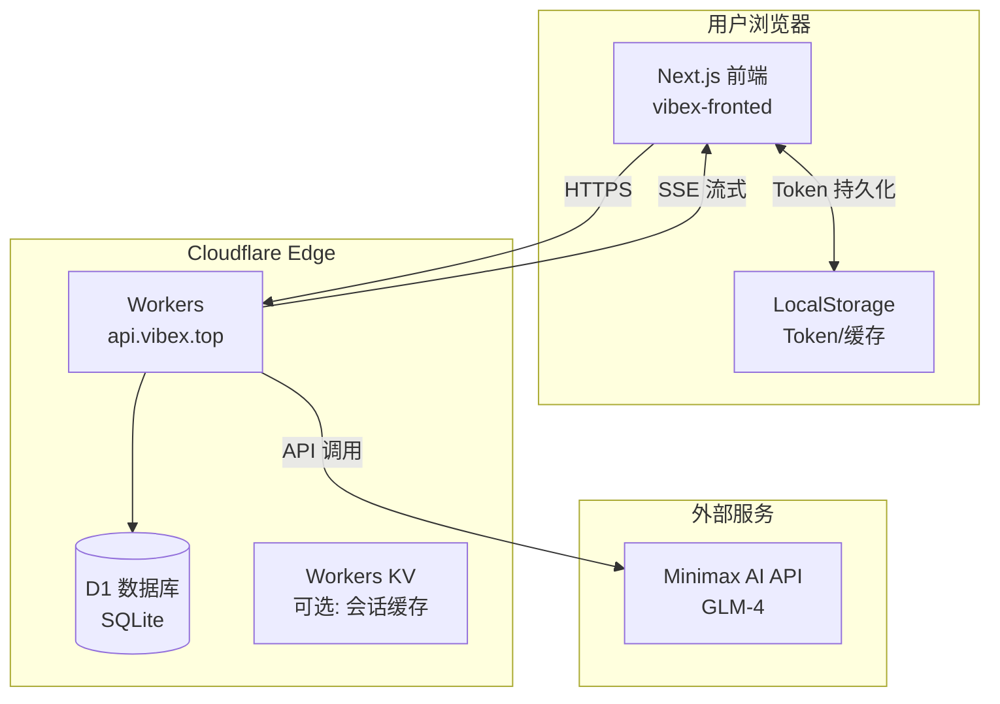

# VibeX 前后端联调架构设计

**设计时间**: 2026-02-28 11:25
**项目**: vibex-fullstack-integration
**架构师**: Architect Agent

---

## 一、系统架构概览



---

## 二、部署架构设计

### 2.1 Cloudflare Workers 部署策略

#### 当前配置状态
```toml
# wrangler.toml (已配置)
name = "vibex-backend"
main = "src/index.ts"
compatibility_date = "2024-09-23"
compatibility_flags = ["nodejs_compat"]

[[d1_databases]]
binding = "DB"
database_name = "vibex-db"
database_id = "52de5df6-fe28-48c2-b2ab-bac4812597d0"

[[routes]]
pattern = "api.vibex.top/*"
zone_name = "vibex.top"
```

#### 部署命令序列
```bash
# 1. 确保已登录 Cloudflare
wrangler login

# 2. 创建 D1 数据库 (如果未创建)
wrangler d1 create vibex-db

# 3. 执行数据库迁移
wrangler d1 migrations apply vibex-db --remote

# 4. 配置 Secrets (敏感信息)
wrangler secret put JWT_SECRET
wrangler secret put MINIMAX_API_KEY
wrangler secret put MINIMAX_API_BASE
wrangler secret put MINIMAX_MODEL

# 5. 部署 Workers
wrangler deploy

# 6. 验证部署
curl https://api.vibex.top/
```

### 2.2 D1 数据库迁移方案

#### 迁移文件结构
```
vibex-backend/
├── migrations/
│   ├── 0001_initial_schema.sql
│   └── 0002_add_flows_table.sql
└── wrangler.toml
```

#### 核心表结构
```sql
-- 用户表
CREATE TABLE IF NOT EXISTS users (
    id TEXT PRIMARY KEY,
    name TEXT NOT NULL,
    email TEXT UNIQUE NOT NULL,
    password_hash TEXT NOT NULL,
    avatar TEXT,
    created_at TEXT DEFAULT (datetime('now')),
    updated_at TEXT DEFAULT (datetime('now'))
);

-- 项目表
CREATE TABLE IF NOT EXISTS projects (
    id TEXT PRIMARY KEY,
    name TEXT NOT NULL,
    description TEXT,
    user_id TEXT NOT NULL,
    created_at TEXT DEFAULT (datetime('now')),
    updated_at TEXT DEFAULT (datetime('now')),
    FOREIGN KEY (user_id) REFERENCES users(id)
);

-- 消息表
CREATE TABLE IF NOT EXISTS messages (
    id TEXT PRIMARY KEY,
    role TEXT NOT NULL CHECK(role IN ('user', 'assistant', 'system')),
    content TEXT NOT NULL,
    project_id TEXT NOT NULL,
    created_at TEXT DEFAULT (datetime('now')),
    FOREIGN KEY (project_id) REFERENCES projects(id)
);

-- Agent 表
CREATE TABLE IF NOT EXISTS agents (
    id TEXT PRIMARY KEY,
    name TEXT NOT NULL,
    prompt TEXT NOT NULL,
    model TEXT,
    temperature REAL DEFAULT 0.7,
    user_id TEXT NOT NULL,
    created_at TEXT DEFAULT (datetime('now')),
    updated_at TEXT DEFAULT (datetime('now')),
    FOREIGN KEY (user_id) REFERENCES users(id)
);

-- 页面表
CREATE TABLE IF NOT EXISTS pages (
    id TEXT PRIMARY KEY,
    name TEXT NOT NULL,
    content TEXT,
    project_id TEXT NOT NULL,
    created_at TEXT DEFAULT (datetime('now')),
    updated_at TEXT DEFAULT (datetime('now')),
    FOREIGN KEY (project_id) REFERENCES projects(id)
);

-- 流程图表
CREATE TABLE IF NOT EXISTS flows (
    id TEXT PRIMARY KEY,
    name TEXT,
    nodes TEXT NOT NULL DEFAULT '[]',
    edges TEXT NOT NULL DEFAULT '[]',
    project_id TEXT NOT NULL,
    created_at TEXT DEFAULT (datetime('now')),
    updated_at TEXT DEFAULT (datetime('now')),
    FOREIGN KEY (project_id) REFERENCES projects(id)
);
```

### 2.3 Secrets 管理策略

| Secret 名称 | 用途 | 示例值 |
|------------|------|--------|
| `JWT_SECRET` | JWT 签名密钥 | 32+ 字符随机字符串 |
| `MINIMAX_API_KEY` | Minimax AI API 密钥 | 从控制台获取 |
| `MINIMAX_API_BASE` | API 基础 URL | `https://api.minimax.chat` |
| `MINIMAX_MODEL` | 模型名称 | `glm-4` |

#### 安全策略
1. **禁止**在代码中硬编码 Secrets
2. **禁止**将 `.dev.vars` 提交到 Git
3. 使用 `wrangler secret put` 在生产环境配置
4. 本地开发使用 `.dev.vars` 文件

### 2.4 DNS/域名配置

```
类型: CNAME
名称: api
目标: vibex-backend.<account>.workers.dev
TTL: Auto
```

**验证命令**:
```bash
dig api.vibex.top
curl -I https://api.vibex.top/
```

---

## 三、前端适配架构

### 3.1 API 响应适配层设计

#### 问题分析
| 接口 | 后端响应 | 前端期望 | 适配方式 |
|------|----------|----------|----------|
| `/auth/login` | `{ success, data: { token, user } }` | `{ token, user }` | 提取 `data` 字段 |
| `/auth/register` | `{ success, data: { token, user } }` | `{ token, user }` | 提取 `data` 字段 |
| `/messages` | `{ messages: [...] }` | `Message[]` | 提取 `messages` 字段 |

#### 适配代码
```typescript
// src/services/api.ts

async login(credentials: LoginRequest): Promise<AuthResponse> {
  return this.withRetry(async () => {
    const response = await this.client.post('/auth/login', credentials);
    // 适配后端响应格式: { success, data: { token, user } }
    const data = response.data.data || response.data;
    if (typeof window !== 'undefined') {
      localStorage.setItem('auth_token', data.token);
      localStorage.setItem('user_id', data.user.id);
    }
    return data;
  });
}

async register(data: RegisterRequest): Promise<AuthResponse> {
  return this.withRetry(async () => {
    const response = await this.client.post('/auth/register', data);
    // 适配后端响应格式
    const responseData = response.data.data || response.data;
    if (typeof window !== 'undefined') {
      localStorage.setItem('auth_token', responseData.token);
      localStorage.setItem('user_id', responseData.user.id);
    }
    return responseData;
  });
}

async getMessages(projectId: string): Promise<Message[]> {
  const cacheKey = `messages_${projectId}`;
  const cached = this.getFromCache<Message[]>(cacheKey);
  
  if (!this.isOnline() && cached) {
    return cached;
  }

  return this.withRetry(async () => {
    const response = await this.client.get('/messages', { params: { projectId } });
    // 适配后端响应格式: { messages: [...] }
    const messages = response.data.messages || response.data;
    this.setToCache(cacheKey, messages);
    return messages;
  });
}
```

### 3.2 Token 持久化方案

#### 存储策略
```typescript
// 登录成功后存储
interface AuthStorage {
  auth_token: string;      // JWT Token
  user_id: string;         // 用户 ID
  user_email?: string;     // 用户邮箱 (可选)
}

// 存储方法
const saveAuth = (data: AuthResponse) => {
  localStorage.setItem('auth_token', data.token);
  localStorage.setItem('user_id', data.user.id);
  localStorage.setItem('user_email', data.user.email);
};

// 清除方法
const clearAuth = () => {
  localStorage.removeItem('auth_token');
  localStorage.removeItem('user_id');
  localStorage.removeItem('user_email');
};

// 检查登录状态
const isAuthenticated = (): boolean => {
  return !!localStorage.getItem('auth_token');
};
```

#### Token 刷新机制 (可选扩展)
```typescript
// 响应拦截器中处理 401
this.client.interceptors.response.use(
  (response) => response,
  async (error) => {
    if (error.response?.status === 401) {
      clearAuth();
      // 可选: 跳转到登录页
      if (typeof window !== 'undefined') {
        window.location.href = '/auth';
      }
    }
    return Promise.reject(error);
  }
);
```

### 3.3 全局错误处理策略

#### 错误分类与处理
```typescript
// src/lib/error-handler.ts

export enum ErrorType {
  NETWORK = 'NETWORK',
  AUTH = 'AUTH',
  VALIDATION = 'VALIDATION',
  SERVER = 'SERVER',
  UNKNOWN = 'UNKNOWN',
}

export interface AppError {
  type: ErrorType;
  message: string;
  details?: any;
}

export const handleError = (error: unknown): AppError => {
  if (axios.isAxiosError(error)) {
    const status = error.response?.status;
    
    switch (status) {
      case 401:
        return { type: ErrorType.AUTH, message: '登录已过期，请重新登录' };
      case 403:
        return { type: ErrorType.AUTH, message: '没有权限执行此操作' };
      case 404:
        return { type: ErrorType.NETWORK, message: '请求的资源不存在' };
      case 409:
        return { type: ErrorType.VALIDATION, message: '该邮箱已被注册' };
      case 422:
        return { type: ErrorType.VALIDATION, message: error.response?.data?.error || '参数验证失败' };
      case 500:
        return { type: ErrorType.SERVER, message: '服务器错误，请稍后重试' };
      default:
        if (!error.response) {
          return { type: ErrorType.NETWORK, message: '网络连接失败' };
        }
    }
  }
  
  return { type: ErrorType.UNKNOWN, message: '未知错误' };
};
```

#### Toast 通知组件
```typescript
// src/components/Toast.tsx
import { useEffect, useState } from 'react';

interface ToastProps {
  message: string;
  type: 'success' | 'error' | 'warning' | 'info';
  duration?: number;
}

export const useToast = () => {
  const [toasts, setToasts] = useState<ToastProps[]>([]);
  
  const showToast = (toast: ToastProps) => {
    setToasts(prev => [...prev, toast]);
    setTimeout(() => {
      setToasts(prev => prev.slice(1));
    }, toast.duration || 3000);
  };
  
  return { toasts, showToast };
};
```

### 3.4 SSE 流式通信架构

#### Chat SSE 客户端实现
```typescript
// src/services/chat-sse.ts

export interface ChatSSEOptions {
  onMessage: (content: string, done: boolean) => void;
  onError: (error: Error) => void;
  onComplete: () => void;
}

export class ChatSSEClient {
  private controller: AbortController | null = null;
  
  async sendMessage(
    message: string,
    conversationId: string | null,
    options: ChatSSEOptions
  ): Promise<void> {
    this.controller = new AbortController();
    
    try {
      const response = await fetch('https://api.vibex.top/api/chat', {
        method: 'POST',
        headers: {
          'Content-Type': 'application/json',
          'Authorization': `Bearer ${localStorage.getItem('auth_token')}`,
        },
        body: JSON.stringify({ message, conversationId }),
        signal: this.controller.signal,
      });
      
      if (!response.ok) {
        throw new Error(`HTTP ${response.status}`);
      }
      
      const reader = response.body?.getReader();
      if (!reader) throw new Error('No response body');
      
      const decoder = new TextDecoder();
      let buffer = '';
      
      while (true) {
        const { done, value } = await reader.read();
        if (done) {
          options.onComplete();
          break;
        }
        
        buffer += decoder.decode(value, { stream: true });
        const lines = buffer.split('\n');
        buffer = lines.pop() || '';
        
        for (const line of lines) {
          if (line.startsWith('data:')) {
            try {
              const data = JSON.parse(line.slice(5).trim());
              if (data.content) {
                options.onMessage(data.content, data.done || false);
              }
              if (data.error) {
                options.onError(new Error(data.error));
              }
            } catch (e) {
              // 忽略解析错误
            }
          }
        }
      }
    } catch (error) {
      if ((error as Error).name === 'AbortError') {
        // 用户取消，不报错
        return;
      }
      options.onError(error as Error);
    }
  }
  
  cancel(): void {
    this.controller?.abort();
    this.controller = null;
  }
}
```

#### 自动重连机制
```typescript
export class ChatSSEClient {
  private retryCount = 0;
  private static MAX_RETRIES = 3;
  
  async sendMessageWithRetry(
    message: string,
    conversationId: string | null,
    options: ChatSSEOptions
  ): Promise<void> {
    try {
      await this.sendMessage(message, conversationId, options);
      this.retryCount = 0; // 成功后重置计数
    } catch (error) {
      if (this.retryCount < ChatSSEClient.MAX_RETRIES) {
        this.retryCount++;
        await new Promise(r => setTimeout(r, 1000 * this.retryCount));
        return this.sendMessageWithRetry(message, conversationId, options);
      }
      options.onError(error as Error);
    }
  }
}
```

---

## 四、集成测试策略

### 4.1 接口契约测试

#### 测试框架
- **Jest**: 单元测试
- **MSW (Mock Service Worker)**: API Mock

#### 契约测试用例
```typescript
// __tests__/api/auth.contract.test.ts

import { ApiService } from '@/services/api';
import { rest } from 'msw';
import { setupServer } from 'msw/node';

const server = setupServer(
  rest.post('https://api.vibex.top/api/auth/login', (req, res, ctx) => {
    return res(ctx.json({
      success: true,
      data: {
        token: 'test-token',
        user: { id: '1', name: 'Test', email: 'test@example.com' },
      },
    }));
  })
);

beforeAll(() => server.listen());
afterAll(() => server.close());

describe('Auth API Contract', () => {
  it('login returns AuthResponse with token and user', async () => {
    const api = new ApiService('https://api.vibex.top');
    const result = await api.login({ email: 'test@example.com', password: 'pass' });
    
    expect(result).toHaveProperty('token');
    expect(result).toHaveProperty('user');
    expect(result.user).toHaveProperty('id');
    expect(result.user).toHaveProperty('email');
  });
});
```

### 4.2 端到端测试场景

#### 测试场景列表
| 场景 | 步骤 | 预期结果 |
|------|------|----------|
| 用户注册 | 1. 填写注册表单 2. 提交 3. 验证跳转 | 跳转到 Dashboard，Token 已存储 |
| 用户登录 | 1. 填写登录表单 2. 提交 3. 验证跳转 | 跳转到 Dashboard，Token 已存储 |
| 创建项目 | 1. 点击新建 2. 填写名称 3. 提交 | 项目出现在列表中 |
| AI 对话 | 1. 发送消息 2. 等待 SSE 响应 | AI 回复流式显示 |
| Token 过期 | 1. Token 过期 2. 发起请求 | 自动跳转到登录页 |
| 离线处理 | 1. 断网 2. 查看缓存数据 | 显示缓存内容 |

### 4.3 回归测试覆盖

#### 关键路径测试
```typescript
// e2e/auth.spec.ts (Playwright)

test('complete auth flow', async ({ page }) => {
  // 1. 访问首页
  await page.goto('https://vibex.top');
  
  // 2. 点击登录
  await page.click('text=登录');
  
  // 3. 填写表单
  await page.fill('input[name="email"]', 'test@example.com');
  await page.fill('input[name="password"]', 'password123');
  
  // 4. 提交
  await page.click('button[type="submit"]');
  
  // 5. 验证跳转
  await expect(page).toHaveURL(/.*dashboard/);
  
  // 6. 验证 Token 存储
  const token = await page.evaluate(() => localStorage.getItem('auth_token'));
  expect(token).toBeTruthy();
});
```

---

## 五、风险缓解方案

### 5.1 高风险项缓解

| 风险 | 缓解措施 | 责任人 |
|------|----------|--------|
| 后端未部署 | 优先执行 `wrangler deploy`，验证 Health Check | Dev |
| D1 数据库未迁移 | 执行 `wrangler d1 migrations apply --remote`，确认无报错 | Dev |
| Secrets 未配置 | 使用 `wrangler secret put` 逐一配置，验证 API 调用 | Dev |
| CORS 跨域失败 | 后端已配置 `origin: '*'`，需验证响应头 | Dev |

### 5.2 回滚策略

#### 后端回滚
```bash
# 列出历史部署
wrangler deployments list

# 回滚到上一版本
wrangler rollback

# 或指定版本
wrangler rollback --version <version-id>
```

#### 前端回滚
```bash
# 回滚到上一个 commit
git revert HEAD

# 重新构建部署
npm run build
```

#### 数据库回滚
```bash
# D1 暂不支持自动回滚，需手动执行反向迁移
wrangler d1 execute vibex-db --command "DELETE FROM users WHERE created_at > '2026-02-28'"
```

### 5.3 监控告警

#### 关键指标
- API 响应时间 (P99 < 500ms)
- 错误率 (< 1%)
- SSE 连接成功率 (> 99%)
- D1 查询延迟 (< 100ms)

#### 告警配置
```yaml
# Cloudflare Analytics + Alerts
alerts:
  - name: API Error Rate
    condition: error_rate > 1%
    action: email, slack
  
  - name: Response Time
    condition: p99_latency > 500ms
    action: email
```

---

## 六、实施计划

### Phase 1: 后端部署 (30 分钟)
1. 执行 D1 迁移
2. 配置 Secrets
3. 部署 Workers
4. 验证 Health Check

### Phase 2: 前端基础对接 (1 小时)
1. 创建 `.env.local`
2. 修复 API 响应适配
3. 对接认证页面
4. 测试登录/注册流程

### Phase 3: 功能对接 (2 小时)
1. 对接 Dashboard
2. 对接 Chat SSE
3. 其他页面按需对接

### Phase 4: 联调测试 (1 小时)
1. 完整用户流程测试
2. 错误场景测试
3. 性能测试

---

## 七、验收标准

- [ ] `GET https://api.vibex.top/` 返回 `{ status: 'ok' }`
- [ ] 用户可以注册新账号
- [ ] 用户可以登录并跳转到 Dashboard
- [ ] Dashboard 显示真实项目列表
- [ ] Chat 页面可以与 AI 对话 (SSE 流式)
- [ ] 刷新页面后保持登录状态
- [ ] 错误场景有友好提示
- [ ] P99 响应时间 < 500ms

---

**文档版本**: 1.0
**最后更新**: 2026-02-28 11:25