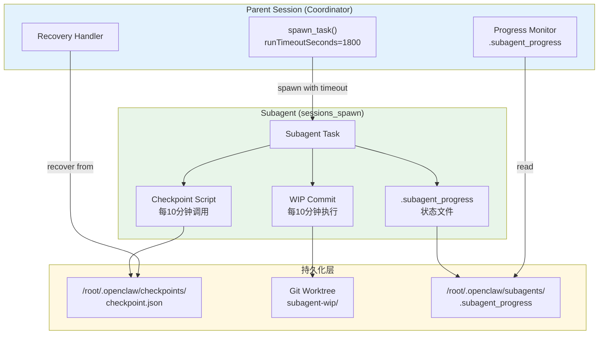
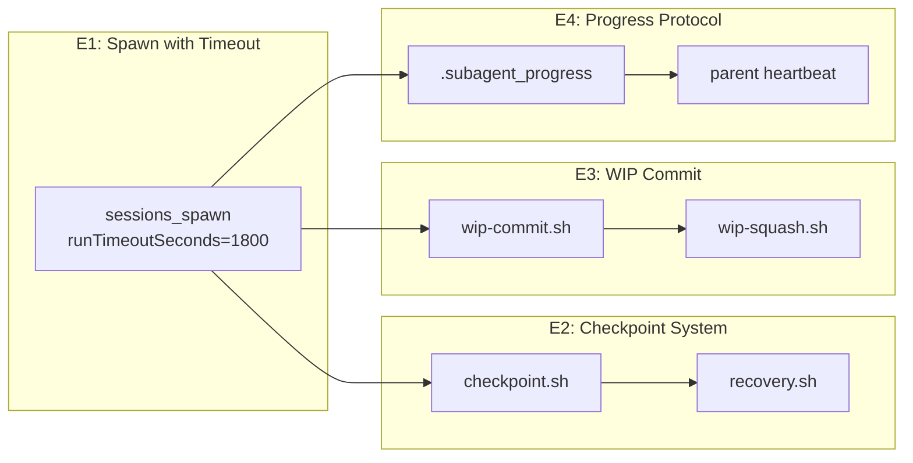

# Architecture: Subagent Timeout Recovery Strategy

> **项目**: subagent-timeout-strategy  
> **Architect**: Architect Agent  
> **日期**: 2026-04-05  
> **版本**: v1.0  
> **状态**: Proposed  
> **仓库**: /root/.openclaw/vibex

---

## 1. 概述

### 1.1 问题陈述

subagent 通过 `sessions_spawn` 启动后，若运行时间超过 OpenClaw 会话超时阈值，已完成的代码会完全丢失。父会话无法感知子代理进度，重新 spawn 会从头开始，造成重复劳动。

**影响**：
- 开发效率：重复执行已完成的工作
- 进度不可靠：无法信任 subagent 的进度报告
- 团队士气：agent 工作成果随时可能归零

### 1.2 技术目标

| 目标 | 描述 | 优先级 |
|------|------|--------|
| AC1 | 超时后工作可恢复 | P0 |
| AC2 | 定期保存进度 | P0 |
| AC3 | 父会话感知子代理进度 | P1 |
| AC4 | WIP commit 不污染主分支 | P1 |

### 1.3 约束条件

- 不破坏现有 heartbeat 脚本
- 不修改 OpenClaw 核心代码
- checkpoint 操作不影响子代理主流程性能
- 兼容现有 `sessions_spawn` 参数

---

## 2. 系统架构

### 2.1 整体架构图



### 2.2 模块依赖关系



---

## 3. 详细设计

### 3.1 E1: runTimeoutSeconds 配置

#### 3.1.1 设计决策

| 决策点 | 选择 | 理由 |
|--------|------|------|
| 默认超时时间 | 1800s (30分钟) | 足够完成大多数子任务 |
| 超时触发后 | 任务状态重置为 ready | 让 Coord 可以重新派发 |
| 任务类型差异 | 通过参数覆盖默认超时 | 长时间任务可用 3600s |

#### 3.1.2 sessions_spawn 调用规范

```typescript
// 标准调用（30分钟超时）
sessions_spawn({
  task: "<task_message>",
  runtime: "subagent",
  mode: "run",
  runTimeoutSeconds: 1800,  // ← 新增参数
  cleanup: "delete"
});

// 长时间任务（60分钟超时）
sessions_spawn({
  task: "<long_task_message>",
  runtime: "subagent",
  mode: "run",
  runTimeoutSeconds: 3600,  // ← 覆盖默认值
  cleanup: "delete"
});
```

#### 3.1.3 Coord Spawn Wrapper

**文件**: `/root/.openclaw/scripts/subagent-spawn.sh`

```bash
#!/bin/bash
# subagent-spawn.sh - 标准 spawn 封装（带超时和 checkpoint）

set -e

TASK_MSG="${1:-}"
TIMEOUT="${2:-1800}"  # 默认30分钟
PROJECT="${3:-}"
TASK_ID="${4:-}"

if [ -z "$TASK_MSG" ]; then
  echo "Usage: subagent-spawn.sh <task_message> [timeout] [project] [task_id]"
  exit 1
fi

# 设置 checkpoint 目录
CHECKPOINT_DIR="/root/.openclaw/checkpoints"
mkdir -p "$CHECKPOINT_DIR"

# 生成 checkpoint 文件路径
CHECKPOINT_FILE="$CHECKPOINT_DIR/${PROJECT:-unknown}_${TASK_ID:-$(date +%s)}.json"

# 写入初始 checkpoint
cat > "$CHECKPOINT_FILE" << EOF
{
  "project": "$PROJECT",
  "taskId": "$TASK_ID",
  "startedAt": "$(date -Iseconds)",
  "timeout": $TIMEOUT,
  "status": "spawning",
  "steps": [],
  "lastCheckpoint": null
}
EOF

# 调用 sessions_spawn
echo "[subagent-spawn] Spawning with timeout=${TIMEOUT}s, checkpoint=$CHECKPOINT_FILE"
sessions_spawn \
  --task "$TASK_MSG" \
  --runtime subagent \
  --mode run \
  --runTimeoutSeconds "$TIMEOUT" \
  --cleanup delete \
  2>&1

echo "[subagent-spawn] Spawn completed, checkpoint=$CHECKPOINT_FILE"
```

### 3.2 E2: Checkpoint 系统

#### 3.2.1 Checkpoint 数据模型

```typescript
// checkpoint.json 结构
interface SubagentCheckpoint {
  project: string;
  taskId: string;
  startedAt: string;           // ISO 8601
  timeout: number;             // 秒
  status: 'running' | 'checkpointed' | 'recovered' | 'completed';
  steps: CheckpointStep[];
  lastCheckpoint: string | null;  // ISO 8601
  gitBranch: string;
  lastCommit: string | null;
}

interface CheckpointStep {
  stepId: string;
  description: string;
  completedAt: string | null;
  artifacts: string[];         // 修改的文件列表
  wipCommit: string | null;   // WIP commit hash
}
```

#### 3.2.2 checkpoint.sh

**文件**: `/root/.openclaw/scripts/checkpoint.sh`

```bash
#!/bin/bash
# checkpoint.sh - 子代理定期 checkpoint

set -e

# 从环境变量或参数获取 checkpoint 文件路径
CHECKPOINT_FILE="${SUBAGENT_CHECKPOINT_FILE:-/root/.openclaw/checkpoints/default.json}"
STEP_ID="${1:-step_$(date +%s)}"
STEP_DESC="${2:-}"

echo "[checkpoint] Saving checkpoint to $CHECKPOINT_FILE"

# 确保文件存在
if [ ! -f "$CHECKPOINT_FILE" ]; then
  echo "[checkpoint] ERROR: checkpoint file not found: $CHECKPOINT_FILE"
  exit 1
fi

# 获取当前 git 状态
GIT_BRANCH=$(git rev-parse --abbrev-ref HEAD 2>/dev/null || echo "unknown")
LAST_COMMIT=$(git rev-parse HEAD 2>/dev/null || echo "")

# 获取修改的文件列表
MODIFIED_FILES=$(git status --porcelain 2>/dev/null | awk '{print $2}' | tr '\n' ',')

# 获取未提交的 stash（如果有）
STASH_LIST=$(git stash list 2>/dev/null | wc -l)

# 读取现有 checkpoint
CHECKPOINT_DATA=$(cat "$CHECKPOINT_FILE")
TIMESTAMP=$(date -Iseconds)

# 更新 checkpoint（使用 Python 处理 JSON）
python3 << EOF
import json
import sys

data = json.loads('''$CHECKPOINT_DATA''')
timestamp = '$TIMESTAMP'

# 添加新步骤或更新现有步骤
new_step = {
    "stepId": "$STEP_ID",
    "description": "$STEP_DESC",
    "completedAt": timestamp,
    "artifacts": '$MODIFIED_FILES'.split(',') if '$MODIFIED_FILES' else [],
    "wipCommit": '$LAST_COMMIT' or None
}

# 追加到 steps 数组
data['steps'].append(new_step)
data['lastCheckpoint'] = timestamp
data['status'] = 'checkpointed'
data['gitBranch'] = '$GIT_BRANCH'
data['lastCommit'] = '$LAST_COMMIT'
data['stashedChanges'] = $STASH_LIST > 0

with open('$CHECKPOINT_FILE', 'w') as f:
    json.dump(data, f, indent=2)

print(f"[checkpoint] Saved at {timestamp}")
print(f"[checkpoint] Steps: {len(data['steps'])} total")
EOF

echo "[checkpoint] Done"
```

#### 3.2.3 recovery.sh

**文件**: `/root/.openclaw/scripts/recovery.sh`

```bash
#!/bin/bash
# recovery.sh - 从 checkpoint 恢复子代理状态

set -e

CHECKPOINT_FILE="${1:-}"

if [ -z "$CHECKPOINT_FILE" ] || [ ! -f "$CHECKPOINT_FILE" ]; then
  echo "[recovery] ERROR: checkpoint file not found: $CHECKPOINT_FILE"
  exit 1
fi

echo "[recovery] Loading checkpoint: $CHECKPOINT_FILE"

# 读取 checkpoint
CHECKPOINT_DATA=$(cat "$CHECKPOINT_FILE")

# 解析关键信息
LAST_COMMIT=$(echo "$CHECKPOINT_DATA" | python3 -c "import sys,json; d=json.load(sys.stdin); print(d.get('lastCommit',''))")
GIT_BRANCH=$(echo "$CHECKPOINT_DATA" | python3 -c "import sys,json; d=json.load(sys.stdin); print(d.get('gitBranch',''))")
STATUS=$(echo "$CHECKPOINT_DATA" | python3 -c "import sys,json; d=json.load(sys.stdin); print(d.get('status',''))")
STEPS=$(echo "$CHECKPOINT_DATA" | python3 -c "import sys,json; d=json.load(sys.stdin); print(len(d.get('steps',[])))")

echo "[recovery] Git branch: $GIT_BRANCH"
echo "[recovery] Last commit: $LAST_COMMIT"
echo "[recovery] Status: $STATUS"
echo "[recovery] Completed steps: $STEPS"

# 如果有 WIP stash，弹出
if [ -n "$LAST_COMMIT" ]; then
  echo "[recovery] Restoring git state to commit: $LAST_COMMIT"
  git checkout "$LAST_COMMIT" 2>/dev/null || echo "[recovery] Already on correct commit"

  # 检查是否有 stash
  if git stash list | grep -q .; then
    echo "[recovery] Applying stashed changes"
    git stash pop || echo "[recovery] WARNING: stash apply failed"
  fi
fi

# 更新 checkpoint 状态
python3 << EOF
import json

with open('$CHECKPOINT_FILE', 'r') as f:
    data = json.load(f)

data['status'] = 'recovered'
data['recoveredAt'] = '$(date -Iseconds)'

with open('$CHECKPOINT_FILE', 'w') as f:
    json.dump(data, f, indent=2)

print("[recovery] Checkpoint marked as recovered")
EOF

echo "[recovery] Recovery complete. Ready to resume from last checkpoint."
```

### 3.3 E3: WIP Commit 机制

#### 3.3.1 WIP Commit 策略

| 策略 | 说明 |
|------|------|
| 触发时机 | 每 10 分钟自动执行（子代理内） |
| Commit 格式 | `WIP: <task_id> - <timestamp>` |
| 分支隔离 | 使用独立 worktree 或 `subagent-wip/` 目录 |
| Squash 时机 | 任务完成后自动 squash |

#### 3.3.2 wip-commit.sh

**文件**: `/root/.openclaw/scripts/wip-commit.sh`

```bash
#!/bin/bash
# wip-commit.sh - 自动 WIP commit

set -e

PROJECT="${SUBAGENT_PROJECT:-unknown}"
TASK_ID="${SUBAGENT_TASK_ID:-$(date +%s)}"
WORKDIR="${SUBAGENT_WORKDIR:-.}"

cd "$WORKDIR"

echo "[wip-commit] Starting WIP commit for $PROJECT/$TASK_ID"

# 检查是否有修改
if git status --porcelain | grep -q .; then
  TIMESTAMP=$(date +%Y%m%d-%H%M%S)
  COMMIT_MSG="WIP: $PROJECT/$TASK_ID - $TIMESTAMP

Auto-generated checkpoint commit.
Last checkpoint: $(cat /root/.openclaw/checkpoints/${PROJECT}_${TASK_ID}.json 2>/dev/null | python3 -c "import sys,json; d=json.load(sys.stdin); print(d.get('lastCheckpoint','N/A'))" || echo 'N/A')
Modified files: $(git status --porcelain | awk '{print $2}' | tr '\n' ' ')"

  git add -A
  git commit -m "$COMMIT_MSG" --no-verify

  COMMIT_HASH=$(git rev-parse HEAD)
  echo "[wip-commit] WIP commit created: $COMMIT_HASH"

  # 更新 checkpoint
  if [ -n "$SUBAGENT_CHECKPOINT_FILE" ] && [ -f "$SUBAGENT_CHECKPOINT_FILE" ]; then
    python3 << EOF
import json
with open('$SUBAGENT_CHECKPOINT_FILE', 'r') as f:
    data = json.load(f)
# 更新最后一个步骤的 wipCommit
if data['steps']:
    data['steps'][-1]['wipCommit'] = '$COMMIT_HASH'
with open('$SUBAGENT_CHECKPOINT_FILE', 'w') as f:
    json.dump(data, f, indent=2)
EOF
  fi
else
  echo "[wip-commit] No changes to commit"
fi
```

#### 3.3.3 wip-squash.sh

**文件**: `/root/.openclaw/scripts/wip-squash.sh`

```bash
#!/bin/bash
# wip-squash.sh - 任务完成时 squash WIP commits

set -e

TARGET_BRANCH="${1:-main}"
WORKDIR="${2:-.}"

cd "$WORKDIR"

echo "[wip-squash] Squashing WIP commits into $TARGET_BRANCH"

CURRENT_BRANCH=$(git rev-parse --abbrev-ref HEAD)
echo "[wip-squash] Current branch: $CURRENT_BRANCH"

# 找到 WIP commits
WIP_COMMITS=$(git log --grep="^WIP:" --format="%H" 2>/dev/null | head -10)

if [ -z "$WIP_COMMITS" ]; then
  echo "[wip-squash] No WIP commits found, nothing to squash"
  exit 0
fi

echo "[wip-squash] Found WIP commits:"
echo "$WIP_COMMITS" | while read commit; do
  echo "  - $commit: $(git log -1 --format="%s" $commit)"
done

# 获取第一个 WIP commit 的前一个 commit
FIRST_WIP=$(echo "$WIP_COMMITS" | tail -1)
BASE_COMMIT=$(git log --format="%H" "$FIRST_WIP"^.."$FIRST_WIP" | tail -1)
echo "[wip-squash] Base commit for squash: $BASE_COMMIT"

# Soft reset 到 base
git reset --soft "$BASE_COMMIT"

# 创建 squash commit
git add -A
COMMIT_MSG="Squashed WIP commits

Squashed $(echo "$WIP_COMMITS" | wc -l | tr -d ' ') WIP commits:
$(echo "$WIP_COMMITS" | head -3 | while read c; do echo "- $(git log -1 --format="%s" $c)"; done)
$(echo "$WIP_COMMITS" | tail -2 | while read c; do echo "- $(git log -1 --format="%s" $c)"; done)"

git commit -m "$COMMIT_MSG" --no-verify

echo "[wip-squash] Squash complete: $(git rev-parse HEAD)"
```

### 3.4 E4: 进度报告协议

#### 3.4.1 .subagent_progress 文件格式

**路径**: `/root/.openclaw/subagents/<session_id>/.subagent_progress`

```json
{
  "sessionId": "abc123-def456",
  "project": "subagent-timeout-strategy",
  "taskId": "design-architecture",
  "agent": "architect",
  "startedAt": "2026-04-05T05:30:00+08:00",
  "lastHeartbeat": "2026-04-05T05:35:00+08:00",
  "status": "running",
  "progress": {
    "currentStep": "Creating architecture.md",
    "stepsCompleted": 2,
    "stepsTotal": 4,
    "percentComplete": 50
  },
  "recentActivity": {
    "filesModified": ["architecture.md", "IMPLEMENTATION_PLAN.md"],
    "gitCommit": "a1b2c3d",
    "checkpointsSaved": 1
  }
}
```

#### 3.4.2 父会话 Progress Monitor

```bash
#!/bin/bash
# subagent-progress-monitor.sh - 监控子代理进度

set -e

PROGRESS_DIR="/root/.openclaw/subagents"
CHECK_INTERVAL=60  # 每60秒检查一次

echo "[monitor] Starting subagent progress monitor"

while true; do
  TIMESTAMP=$(date -Iseconds)

  # 遍历所有活跃子代理进度文件
  for progress_file in "$PROGRESS_DIR"/*/.subagent_progress; do
    if [ -f "$progress_file" ]; then
      SESSION_ID=$(basename $(dirname "$progress_file"))

      # 读取进度数据
      DATA=$(cat "$progress_file")
      STATUS=$(echo "$DATA" | python3 -c "import sys,json; d=json.load(sys.stdin); print(d.get('status',''))")
      LAST_HB=$(echo "$DATA" | python3 -c "import sys,json; d=json.load(sys.stdin); print(d.get('lastHeartbeat',''))")
      PERCENT=$(echo "$DATA" | python3 -c "import sys,json; d=json.load(sys.stdin); print(d.get('progress',{}).get('percentComplete',0))")

      # 检查是否超时（超过5分钟无心跳）
      LAST_HB_EPOCH=$(date -d "$LAST_HB" +%s 2>/dev/null || echo 0)
      NOW_EPOCH=$(date +%s)
      IDLE_SECS=$((NOW_EPOCH - LAST_HB_EPOCH))

      if [ "$IDLE_SECS" -gt 300 ] && [ "$STATUS" = "running" ]; then
        echo "[monitor] ⚠️ Subagent $SESSION_ID idle for ${IDLE_SECS}s, status=$STATUS"

        # 检查 checkpoint 是否存在
        CHECKPOINT_FILE="/root/.openclaw/checkpoints/$(echo $DATA | python3 -c "import sys,json; d=json.load(sys.stdin); print(d.get('project','unknown') + '_' + d.get('taskId','unknown'))").json"
        if [ -f "$CHECKPOINT_FILE" ]; then
          echo "[monitor] ✅ Checkpoint available for recovery: $CHECKPOINT_FILE"
        else
          echo "[monitor] ❌ No checkpoint found for $SESSION_ID"
        fi
      fi

      echo "[monitor] $SESSION_ID: status=$STATUS, progress=${PERCENT}%, idle=${IDLE_SECS}s"
    fi
  done

  sleep $CHECK_INTERVAL
done
```

---

## 4. 接口定义

### 4.1 脚本接口

| 脚本 | 路径 | 参数 | 返回值 |
|------|------|------|--------|
| `subagent-spawn.sh` | `/root/.openclaw/scripts/` | `<task_msg> [timeout] [project] [task_id]` | exit code |
| `checkpoint.sh` | `/root/.openclaw/scripts/` | `<step_id> [step_desc]` | exit code |
| `recovery.sh` | `/root/.openclaw/scripts/` | `<checkpoint_file>` | exit code |
| `wip-commit.sh` | `/root/.openclaw/scripts/` | 无 | exit code |
| `wip-squash.sh` | `/root/.openclaw/scripts/` | `[target_branch]` | exit code |

### 4.2 数据文件接口

| 文件 | 路径模板 | 读写方 |
|------|----------|--------|
| `checkpoint.json` | `/root/.openclaw/checkpoints/<project>_<task_id>.json` | 子代理写，父代理读 |
| `.subagent_progress` | `/root/.openclaw/subagents/<session_id>/` | 子代理写，父代理读 |

---

## 5. 性能影响评估

### 5.1 性能开销

| 操作 | 开销 | 频率 | 影响 |
|------|------|------|------|
| checkpoint.sh | ~50ms | 每 10 分钟 | 可忽略 |
| wip-commit.sh | ~200ms | 每 10 分钟 | 可忽略 |
| .subagent_progress 写入 | ~5ms | 每分钟 | 可忽略 |
| recovery.sh | ~500ms | 恢复时 | 仅恢复场景 |

### 5.2 存储估算

| 数据类型 | 单次任务估算 | 100 次任务估算 |
|----------|-------------|----------------|
| checkpoint.json | ~5KB | ~500KB |
| WIP commits | ~50KB avg | ~5MB |
| .subagent_progress | ~1KB | ~100KB |
| **总计** | **~56KB** | **~5.6MB** |

---

## 6. 风险与缓解

| 风险 | 概率 | 影响 | 缓解策略 |
|------|------|------|----------|
| WIP commit 污染主分支历史 | 🟡 中 | 🟠 中 | E3.2 squash 脚本，main 分支保护 |
| checkpoint 文件被误删 | 🟡 中 | 🔴 高 | 多副本备份（.bak 文件） |
| 超时设置过短 | 🟢 低 | 🟠 中 | 提供覆盖参数，默认 30 分钟 |
| 恢复后状态不一致 | 🟡 中 | 🟠 中 | recovery.sh 包含完整 git + stash 恢复 |

---

## 7. 验收标准映射

| Epic | Story | 验收标准 | 测试方法 |
|------|-------|----------|----------|
| E1 | S1.1 | `expect(timeout).toBe(1800)` | 手动验证 sessions_spawn 调用 |
| E2 | S2.1 | `expect(checkpointExists).toBe(true)` | 模拟 30s 后检查文件 |
| E2 | S2.2 | `expect(restoredFrom).toBe('checkpoint')` | 模拟超时-恢复测试 |
| E3 | S3.1 | `expect(gitLog).toContain('WIP:')` | 执行 wip-commit 后检查 git log |
| E3 | S3.2 | `expect(mainBranch).not.toContain('WIP')` | 执行 wip-squash 后检查 main |
| E4 | S4.1 | `expect(progressFile.step).toBeDefined()` | 读取 .subagent_progress 验证 |

---

## 8. 与现有架构的兼容性

### 8.1 现有组件

| 组件 | 兼容性 | 说明 |
|------|--------|------|
| `sessions_spawn` | ✅ 完全兼容 | 新增 `runTimeoutSeconds` 参数 |
| `coord-spawn-inspector.sh` | ✅ 无影响 | 只处理任务派发，不涉及超时 |
| `task_manager.py` | ✅ 无影响 | 只处理任务状态，不涉及超时 |
| `heartbeat` 脚本 | ✅ 无影响 | checkpoint 是独立层 |

### 8.2 迁移策略

1. **Phase 1 (Sprint 1)**: 部署 E1 + E2（无破坏性变更）
2. **Phase 2 (Sprint 2)**: 部署 E3 + E4（需要测试验证）

---

## 9. 技术审查 (Phase 2: Technical Review)

### 9.1 自我审查

#### PRD 验收标准对照

| PRD 目标 | 技术方案覆盖 | 缺口 |
|---------|------------|------|
| AC1: 超时后工作可恢复 | ✅ E2 Checkpoint + E3 WIP Commit | 无 |
| AC2: 定期保存进度 | ✅ E2 checkpoint.sh 每10分钟 | 无 |
| AC3: 父会话感知子代理进度 | ✅ E4 .subagent_progress | 无 |
| AC4: WIP commit 不污染主分支 | ✅ E3.2 wip-squash.sh | 无 |

#### Epic/Story 覆盖检查

| Epic | Story | PRD 验收标准 | 架构覆盖 |
|------|-------|-------------|---------|
| E1 | S1.1 | `expect(timeout).toBe(1800)` | ✅ subagent-spawn.sh |
| E2 | S2.1 | `expect(checkpointExists).toBe(true)` | ✅ checkpoint.sh |
| E2 | S2.2 | `expect(restoredFrom).toBe('checkpoint')` | ✅ recovery.sh |
| E3 | S3.1 | `expect(gitLog).toContain('WIP:')` | ✅ wip-commit.sh |
| E3 | S3.2 | `expect(mainBranch).not.toContain('WIP')` | ✅ wip-squash.sh |
| E4 | S4.1 | `expect(progressFile.step).toBeDefined()` | ✅ .subagent_progress schema |

**结论**: 所有 PRD 验收标准均有技术方案覆盖，无缺口。

### 9.2 架构风险点

| 风险 | 等级 | 描述 | 改进建议 |
|------|------|------|----------|
| R1 | 🟠 中 | `recovery.sh` 使用 `git stash pop` 可能产生冲突 | 增加冲突检测和人工介入流程 |
| R2 | 🟠 中 | checkpoint.json 使用 heredoc 写入，有 JSON 注入风险 | 使用 Python json.dump 替代 heredoc |
| R3 | 🟡 低 | wip-squash.sh 在多人协作时有竞态风险 | 添加锁机制或使用 worktree 隔离 |
| R4 | 🟡 低 | progress monitor 是 while true 循环，可能变成僵尸进程 | 添加定期健康检查和超时退出 |
| R5 | 🟢 低 | `date -Iseconds` 依赖 GNU date，macOS 不兼容 | 改用 `date +%Y-%m-%dT%H:%M:%S%z` |

### 9.3 改进建议

#### R1 改进：recovery.sh 冲突处理

```bash
# 在 recovery.sh 中增加冲突检测
if ! git stash pop 2>&1; then
    echo "[recovery] ⚠️ Stash pop failed, checking for conflicts"
    if git diff --name-only --diff-filter=U | grep -q .; then
        echo "[recovery] ❌ CONFLICTS DETECTED: manual intervention required"
        echo "[recovery] Conflict files:"
        git diff --name-only --diff-filter=U
        exit 1
    fi
fi
```

#### R2 改进：checkpoint.json 写入安全

```python
# checkpoint.sh 中用 Python json.dump 替代 heredoc
python3 << 'PYEOF'
import json
import os
import subprocess
import datetime

# 获取 git 状态
try:
    branch = subprocess.check_output(['git', 'rev-parse', '--abbrev-ref', 'HEAD']).decode().strip()
    commit = subprocess.check_output(['git', 'rev-parse', 'HEAD']).decode().strip()
    modified = subprocess.check_output(['git', 'status', '--porcelain']).decode().strip().split('\n')
    modified = [m.strip() for m in modified if m.strip()]
except:
    branch = commit = "unknown"
    modified = []

# 读取现有 checkpoint
cp_file = os.environ.get('SUBAGENT_CHECKPOINT_FILE', '/tmp/checkpoint.json')
with open(cp_file) as f:
    data = json.load(f)

data['lastCheckpoint'] = datetime.datetime.now().isoformat()
data['status'] = 'checkpointed'
data['gitBranch'] = branch
data['lastCommit'] = commit
data['modifiedFiles'] = modified

with open(cp_file, 'w') as f:
    json.dump(data, f, indent=2)

print(f"[checkpoint] Saved {len(data['steps'])} steps")
PYEOF
```

### 9.4 外部审查建议

> **Note**: `/plan-eng-review` 技能应在此阶段执行，提供独立的外部视角审查。

建议外部审查关注点：
1. **并发安全**: 多个 subagent 同时 checkpoint 是否会相互覆盖？
2. **权限模型**: checkpoint 目录权限是否足够安全？
3. **可观测性**: checkpoint/recovery 操作是否足够可追踪？
4. **失败模式**: 各组件 failure modes 是否清晰？

---

## 10. ADR 决策记录

### ADR-001: checkpoint.json 存储位置

**决策**: `/root/.openclaw/checkpoints/<project>_<task_id>.json`

**选项对比**:
| 选项 | 优点 | 缺点 |
|------|------|------|
| 项目子目录 | 隔离好 | 目录管理复杂 |
| 统一目录 + 命名 | 简单 | 需命名规范 |
| 放在任务 repo 中 | 无需额外存储 | 污染 repo 历史 |

**结论**: 采用统一目录 + 命名规范方案，在 checkpoint 目录按 project_taskId 隔离。

### ADR-002: WIP squash 时机

**决策**: 任务完成时自动 squash（由子代理调用 wip-squash.sh）

**选项对比**:
| 选项 | 优点 | 缺点 |
|------|------|------|
| 手动 squash | 可控 | 易遗忘 |
| 任务完成时自动 | 自动化 | 需调用 |
| 定时 squash | 自动化 | 可能打断工作 |

**结论**: 任务完成时自动调用，确保 main 分支干净。

---

*本文档由 Architect Agent 生成 | 2026-04-05 | v1.0*
*技术审查完成：Phase 1 Technical Design ✅ | Phase 2 Technical Review ✅*
