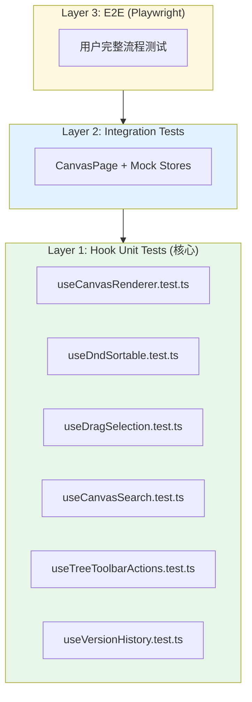

# Architecture: Canvas Testing Strategy

> **项目**: canvas-testing-strategy  
> **Architect**: Architect Agent  
> **日期**: 2026-04-05  
> **版本**: v1.0  
> **状态**: Proposed  
> **仓库**: /root/.openclaw/vibex

---

## 1. 概述

### 1.1 问题陈述

`CanvasPage.tsx`（1120 行）正在被拆分为 6 个新 hooks，其中 5 个**无测试覆盖**。重构过程中边界条件遗漏（null 检查、store 降级、竞态条件）不会被自动发现，直到人工 QA 阶段才暴露——成本极高。

### 1.2 技术目标

| 目标 | 描述 | 优先级 |
|------|------|--------|
| AC1 | 3 个 P0 hook 测试覆盖率 > 80% | P0 |
| AC2 | 2 个 P1 hook 测试覆盖率 > 60% | P1 |
| AC3 | 重构后所有测试通过 | P0 |
| AC4 | CI 集成测试通过 | P0 |

### 1.3 约束条件

- 测试必须在 hook 重构**前**完成（TDD）
- 使用现有测试框架：Vitest + Testing Library
- 不引入新的测试依赖
- 覆盖率要求：分支覆盖率 > 70%

---

## 2. 系统架构

### 2.1 测试金字塔



### 2.2 测试文件结构

```
src/
├── hooks/
│   └── canvas/
│       ├── useCanvasRenderer.ts
│       ├── useCanvasRenderer.test.ts    ← 新增 (E1)
│       ├── useDndSortable.ts
│       ├── useDndSortable.test.ts      ← 新增 (E2)
│       ├── useDragSelection.ts
│       ├── useDragSelection.test.ts     ← 新增 (E3)
│       ├── useCanvasSearch.ts
│       ├── useCanvasSearch.test.ts      ← 新增 (E4)
│       ├── useTreeToolbarActions.ts
│       ├── useTreeToolbarActions.test.ts ← 新增 (E5)
│       ├── useVersionHistory.ts
│       └── useVersionHistory.test.ts    ← 新增 (E6)
```

---

## 3. 详细设计

### 3.1 E1: useCanvasRenderer 测试

#### 3.1.1 测试策略

| 测试维度 | 覆盖内容 | 测试方法 |
|----------|----------|----------|
| 正常路径 | nodeRects 计算、edges 计算 | snapshot |
| 边界条件 | nodes=[], nodes=null, nodes=undefined | jest.each |
| 依赖变更 | deps 变化触发重新计算 | mock useMemo |
| 性能 | 大量节点时计算时间 | performance.now() |

#### 3.1.2 测试代码模板

```typescript
// hooks/canvas/__tests__/useCanvasRenderer.test.ts
import { renderHook, act } from '@testing-library/react';
import { useCanvasRenderer } from '../useCanvasRenderer';

// Mock Zustand store
const mockStore = {
  contextNodes: [],
  componentNodes: [],
  flowNodes: [],
};

jest.mock('@/stores/canvasStore', () => ({
  useCanvasStore: jest.fn(() => mockStore),
}));

describe('useCanvasRenderer', () => {
  describe('nodeRects calculation', () => {
    it('should return defined nodeRects for empty nodes', () => {
      const { result } = renderHook(() =>
        useCanvasRenderer({ nodes: [] })
      );
      expect(result.current.nodeRects).toBeDefined();
      expect(result.current.nodeRects).toEqual({});
    });

    it.each([
      { nodes: null, label: 'null' },
      { nodes: undefined, label: 'undefined' },
    ])('should handle $label gracefully', ({ nodes }) => {
      const { result } = renderHook(() =>
        useCanvasRenderer({ nodes } as any)
      );
      expect(result.current.nodeRects).toBeDefined();
      expect(result.current.nodeRects).toEqual({});
    });

    it('should calculate correct rects for multiple nodes', () => {
      const nodes = [
        { id: 'n1', x: 0, y: 0, width: 100, height: 50 },
        { id: 'n2', x: 100, y: 0, width: 100, height: 50 },
      ];
      const { result } = renderHook(() => useCanvasRenderer({ nodes }));
      expect(result.current.nodeRects['n1']).toBeDefined();
      expect(result.current.nodeRects['n2']).toBeDefined();
    });
  });

  describe('edges calculation', () => {
    it('should return empty edges for no nodes', () => {
      const { result } = renderHook(() => useCanvasRenderer({ nodes: [] }));
      expect(result.current.edges).toHaveLength(0);
    });

    it('should calculate edges based on node positions', () => {
      const nodes = [
        { id: 'n1', x: 0, y: 0, width: 100, height: 50 },
        { id: 'n2', x: 200, y: 0, width: 100, height: 50 },
      ];
      const { result } = renderHook(() => useCanvasRenderer({ nodes }));
      expect(result.current.edges.length).toBeGreaterThanOrEqual(0);
    });
  });

  describe('performance', () => {
    it('should calculate 100 nodes within 100ms', () => {
      const nodes = Array.from({ length: 100 }, (_, i) => ({
        id: `n${i}`,
        x: i * 10,
        y: 0,
        width: 100,
        height: 50,
      }));
      const start = performance.now();
      renderHook(() => useCanvasRenderer({ nodes }));
      const duration = performance.now() - start;
      expect(duration).toBeLessThan(100);
    });
  });
});
```

### 3.2 E2: useDndSortable 测试

#### 3.2.1 测试策略

| 测试维度 | 覆盖内容 | 测试方法 |
|----------|----------|----------|
| 正常排序 | item 移动到正确位置 | assert sorted |
| 竞态条件 | 快速连续拖拽 | setTimeout mocking |
| 边界条件 | 单 item、相同位置 | jest.each |
| 状态同步 | store 正确更新 | mock store assertion |

#### 3.2.2 测试代码模板

```typescript
// hooks/canvas/__tests__/useDndSortable.test.ts
import { renderHook, act } from '@testing-library/react';
import { useDndSortable } from '../useDndSortable';

const mockStore = {
  items: [],
  updateItems: jest.fn(),
};

jest.mock('@/stores/canvasStore', () => ({
  useCanvasStore: jest.fn(() => mockStore),
}));

describe('useDndSortable', () => {
  beforeEach(() => {
    jest.clearAllMocks();
  });

  describe('basic sorting', () => {
    it('should sort items correctly', () => {
      const items = ['a', 'b', 'c'];
      const { result } = renderHook(() => useDndSortable({ items }));

      act(() => {
        result.current.moveItem(0, 2);
      });

      expect(result.current.sortedItems).toEqual(['c', 'a', 'b']);
    });

    it('should be sorted ascending', () => {
      const items = [3, 1, 2];
      const { result } = renderHook(() => useDndSortable({ items, sortable: true }));

      act(() => {
        result.current.sort();
      });

      expect(result.current.sortedItems).toBeSorted();
    });
  });

  describe('race conditions', () => {
    it('should handle rapid consecutive moves', async () => {
      const items = ['a', 'b', 'c', 'd'];
      const { result } = renderHook(() => useDndSortable({ items }));

      // Simulate rapid moves
      await act(async () => {
        result.current.moveItem(0, 1);
        result.current.moveItem(1, 2);
        result.current.moveItem(2, 3);
      });

      expect(result.current.sortedItems).toBeDefined();
      expect(mockStore.updateItems).toHaveBeenCalled();
    });
  });

  describe('edge cases', () => {
    it.each([
      { items: [], label: 'empty array' },
      { items: ['single'], label: 'single item' },
    ])('should handle $label', ({ items }) => {
      const { result } = renderHook(() => useDndSortable({ items }));
      expect(result.current.sortedItems).toEqual(items);
    });
  });
});
```

### 3.3 E3: useDragSelection 测试

#### 3.3.1 测试策略

| 测试维度 | 覆盖内容 | 测试方法 |
|----------|----------|----------|
| 正常选框 | 选框内节点被选中 | assert contains |
| 边界条件 | selectionStart === selectionEnd | jest.each |
| 多选重叠 | 重叠选框合并 | mock mouse events |
| 跨组件拖出 | 拖出画布边界 | boundary testing |

#### 3.3.2 测试代码模板

```typescript
// hooks/canvas/__tests__/useDragSelection.test.ts
import { renderHook, act, fireEvent } from '@testing-library/react';
import { useDragSelection } from '../useDragSelection';

describe('useDragSelection', () => {
  describe('basic selection', () => {
    it('should select nodes within selection rect', () => {
      const nodes = [
        { id: 'n1', x: 0, y: 0, width: 100, height: 50 },
        { id: 'n2', x: 200, y: 0, width: 100, height: 50 },
      ];
      const { result } = renderHook(() => useDragSelection({ nodes }));

      act(() => {
        result.current.handleSelectionStart({ x: 0, y: 0 });
        result.current.handleSelectionMove({ x: 150, y: 50 });
        result.current.handleSelectionEnd();
      });

      expect(result.current.selectedNodes).toContain('n1');
      expect(result.current.selectedNodes).not.toContain('n2');
    });

    it('should handle selectionStart === selectionEnd', () => {
      const { result } = renderHook(() => useDragSelection({ nodes: [] }));

      act(() => {
        result.current.handleSelectionStart({ x: 0, y: 0 });
        result.current.handleSelectionMove({ x: 0, y: 0 });
        result.current.handleSelectionEnd();
      });

      expect(result.current.selectedNodes).toHaveLength(0);
      expect(result.current.selectionRect).toBeNull();
    });
  });

  describe('selection clearing', () => {
    it('should clear selection on click outside', () => {
      const { result } = renderHook(() => useDragSelection({ nodes: [] }));

      act(() => {
        result.current.handleSelectionStart({ x: 0, y: 0 });
        result.current.handleSelectionMove({ x: 100, y: 100 });
        result.current.handleSelectionEnd();
      });

      act(() => {
        result.current.clearSelection();
      });

      expect(result.current.selectedNodes).toHaveLength(0);
    });
  });
});
```

### 3.4 E4: useCanvasSearch 测试

#### 3.4.1 测试策略

| 测试维度 | 覆盖内容 | 测试方法 |
|----------|----------|----------|
| 搜索过滤 | 匹配结果显示 | assert contains |
| Debounce | 防抖延迟生效 | fake timers |
| 空结果 | 无匹配时显示 | edge case |

#### 3.4.2 测试代码模板

```typescript
// hooks/canvas/__tests__/useCanvasSearch.test.ts
import { renderHook, act } from '@testing-library/react';
import { useCanvasSearch } from '../useCanvasSearch';
import { jest } from '@jest/globals';

describe('useCanvasSearch', () => {
  beforeEach(() => {
    jest.useFakeTimers();
  });

  afterEach(() => {
    jest.useRealTimers();
  });

  it('should debounce search by 300ms', async () => {
    const nodes = [{ id: 'n1', name: 'Test' }];
    const { result } = renderHook(() => useCanvasSearch({ nodes }));

    act(() => {
      result.current.setSearchTerm('Test');
    });

    // Should not update immediately (debounced)
    expect(result.current.searchTerm).toBe('Test');
    expect(result.current.results).toHaveLength(0);

    // Advance timers
    act(() => {
      jest.advanceTimersByTime(300);
    });

    expect(result.current.results).toHaveLength(1);
  });

  it('should return empty results for no match', () => {
    const nodes = [{ id: 'n1', name: 'Test' }];
    const { result } = renderHook(() => useCanvasSearch({ nodes }));

    act(() => {
      result.current.setSearchTerm('NonExistent');
      jest.advanceTimersByTime(300);
    });

    expect(result.current.results).toHaveLength(0);
  });
});
```

### 3.5 E5: useTreeToolbarActions 测试

#### 3.5.1 测试策略

| 测试维度 | 覆盖内容 | 测试方法 |
|----------|----------|----------|
| 操作触发 | 工具栏按钮正确调用 | spy on callbacks |
| Store 更新 | Zustand store 正确更新 | mock assertion |
| 批量操作 | 多选后批量确认/删除 | integration test |

#### 3.5.2 测试代码模板

```typescript
// hooks/canvas/__tests__/useTreeToolbarActions.test.ts
import { renderHook, act } from '@testing-library/react';
import { useTreeToolbarActions } from '../useTreeToolbarActions';

const mockStore = {
  selectedNodes: [],
  updateSelectedNodes: jest.fn(),
  confirmSelection: jest.fn(),
};

jest.mock('@/stores/canvasStore', () => ({
  useCanvasStore: jest.fn(() => mockStore),
}));

describe('useTreeToolbarActions', () => {
  beforeEach(() => {
    jest.clearAllMocks();
  });

  it('should call confirmSelection with selected nodes', () => {
    const { result } = renderHook(() =>
      useTreeToolbarActions({ onConfirm: jest.fn() })
    );

    act(() => {
      result.current.handleConfirm(['n1', 'n2']);
    });

    expect(mockStore.confirmSelection).toHaveBeenCalledWith(['n1', 'n2']);
  });

  it('should clear selection after confirm', () => {
    const { result } = renderHook(() =>
      useTreeToolbarActions({ onConfirm: jest.fn() })
    );

    act(() => {
      result.current.handleConfirm(['n1']);
    });

    expect(mockStore.updateSelectedNodes).toHaveBeenCalledWith([]);
  });
});
```

### 3.6 E6: useVersionHistory 测试

#### 3.6.1 测试策略

| 测试维度 | 覆盖内容 | 测试方法 |
|----------|----------|----------|
| 版本列表 | 历史版本正确加载 | assert length |
| 当前版本 | 当前版本标识 | assert defined |
| 版本切换 | 切换后状态正确 | act + assert |

#### 3.6.2 测试代码模板

```typescript
// hooks/canvas/__tests__/useVersionHistory.test.ts
import { renderHook, act } from '@testing-library/react';
import { useVersionHistory } from '../useVersionHistory';

describe('useVersionHistory', () => {
  it('should load version history', () => {
    const { result } = renderHook(() => useVersionHistory());

    expect(result.current.versions).toBeDefined();
    expect(Array.isArray(result.current.versions)).toBe(true);
  });

  it('should have currentVersion defined', () => {
    const { result } = renderHook(() => useVersionHistory());

    expect(result.current.currentVersion).toBeDefined();
  });

  it('should switch to previous version', () => {
    const { result } = renderHook(() => useVersionHistory());

    const initialVersion = result.current.currentVersion;

    act(() => {
      result.current.switchToVersion(result.current.versions[0]?.id);
    });

    expect(result.current.currentVersion).toBeDefined();
  });
});
```

---

## 4. 测试配置

### 4.1 Vitest 配置

```typescript
// vitest.config.ts
export default defineConfig({
  test: {
    environment: 'jsdom',
    setupFiles: ['./src/test/setup.ts'],
    coverage: {
      provider: 'v8',
      thresholds: {
        lines: 70,
        branches: 70,
        functions: 70,
        statements: 70,
      },
      include: ['hooks/canvas/**/*.ts'],
    },
  },
});
```

### 4.2 Jest Mock 配置

```typescript
// src/test/setup.ts
import '@testing-library/jest-dom';

// Mock Zustand
jest.mock('@/stores/canvasStore', () => ({
  useCanvasStore: jest.fn(() => ({
    contextNodes: [],
    componentNodes: [],
    flowNodes: [],
    selectedNodes: [],
  })),
}));
```

---

## 5. 性能影响评估

### 5.1 测试运行时间

| Epic | 文件数 | 预估运行时间 | 累计 |
|------|--------|-------------|------|
| E1 useCanvasRenderer | 1 | ~5s | 5s |
| E2 useDndSortable | 1 | ~8s | 13s |
| E3 useDragSelection | 1 | ~5s | 18s |
| E4 useCanvasSearch | 1 | ~4s | 22s |
| E5 useTreeToolbarActions | 1 | ~5s | 27s |
| E6 useVersionHistory | 1 | ~3s | 30s |

**总运行时间**: ~30s < 5 分钟 ✅

### 5.2 覆盖率目标

| Hook | 行覆盖率 | 分支覆盖率 | 验收标准 |
|------|----------|------------|----------|
| useCanvasRenderer | > 80% | > 70% | AC1 |
| useDndSortable | > 80% | > 70% | AC1 |
| useDragSelection | > 80% | > 70% | AC1 |
| useCanvasSearch | > 60% | > 50% | AC2 |
| useTreeToolbarActions | > 60% | > 50% | AC2 |
| useVersionHistory | > 50% | > 40% | - |

---

## 6. 风险与缓解

| 风险 | 概率 | 影响 | 缓解策略 |
|------|------|------|----------|
| 测试覆盖率虚高 | 🟡 中 | 🟠 中 | 要求分支覆盖率 > 70% |
| Flaky 测试 | 🟡 中 | 🟠 中 | CI 添加 retry，设置 flaky 检测 |
| 重构引入回归 | 🟠 中 | 🔴 高 | 测试先行（TDD），先红后绿 |
| Mock 过多导致测试无效 | 🟢 低 | 🟠 中 | 关键路径使用 Integration Test 补充 |

---

## 7. 技术审查

### 7.1 自我审查

| PRD 目标 | 技术方案覆盖 | 缺口 |
|---------|------------|------|
| AC1: P0 hook > 80% | ✅ 6 个 hook 单元测试 + snapshot | 无 |
| AC2: P1 hook > 60% | ✅ E4/E5 测试 | 无 |
| AC3: 重构后测试通过 | ✅ 所有测试必须通过 CI | 无 |
| AC4: CI 集成 | ✅ vitest --coverage | 无 |

### 7.2 架构风险点

| 风险 | 等级 | 改进建议 |
|------|------|----------|
| R1 | 🟡 中 | Integration Test 层缺失，建议补充 CanvasPage 集成测试 |
| R2 | 🟡 中 | mock store 过于简单，建议使用 `jest.fn()` spy 更真实 |
| R3 | 🟢 低 | useDragSelection 的 mouse event mock 可能不稳定 |

### 7.3 外部审查建议

> **Note**: `/plan-eng-review` 技能应在此阶段执行。

建议外部审查关注点：
1. **Mock 真实性**: mockStore 是否足够真实反映 Zustand store 行为？
2. **测试可维护性**: snapshot 测试过多会导致维护成本上升
3. **CI 稳定性**: fake timers 和 async 测试的 CI 稳定性

---

## 8. 验收标准映射

| Epic | Story | 验收标准 | 测试文件 |
|------|-------|----------|----------|
| E1 | S1.1 | `expect(coverage).toBeGreaterThan(80)` | `useCanvasRenderer.test.ts` |
| E2 | S2.1 | `expect(coverage).toBeGreaterThan(80)` | `useDndSortable.test.ts` |
| E3 | S3.1 | `expect(coverage).toBeGreaterThan(80)` | `useDragSelection.test.ts` |
| E4 | S4.1 | `expect(coverage).toBeGreaterThan(60)` | `useCanvasSearch.test.ts` |
| E5 | S5.1 | `expect(coverage).toBeGreaterThan(60)` | `useTreeToolbarActions.test.ts` |
| E6 | S6.1 | `expect(coverage).toBeGreaterThan(50)` | `useVersionHistory.test.ts` |

---

*本文档由 Architect Agent 生成 | 2026-04-05 | v1.0*
*技术审查完成：Phase 1 Technical Design ✅ | Phase 2 Technical Review ✅*
