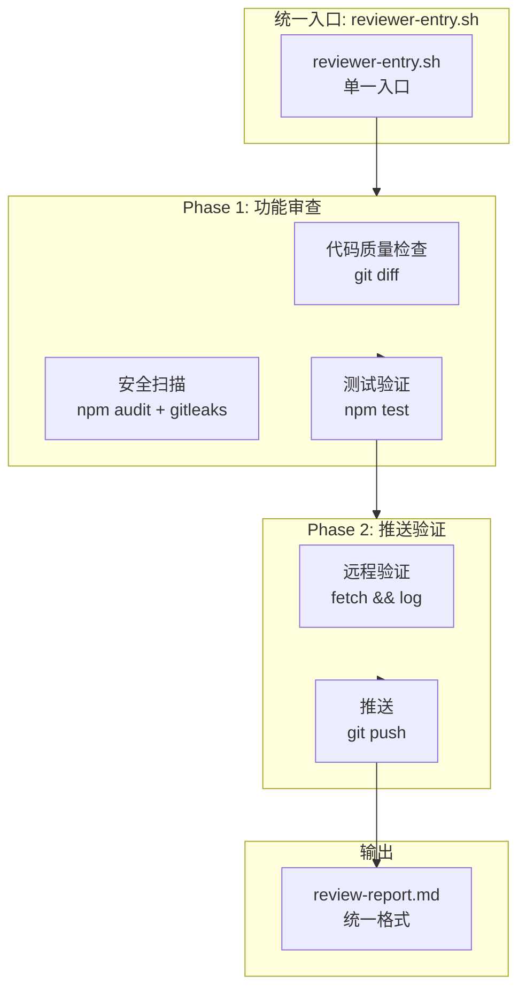

# Architecture: Reviewer Process Standardization

> **项目**: reviewer-process-standard  
> **Architect**: Architect Agent  
> **日期**: 2026-04-05  
> **版本**: v1.0  
> **状态**: Proposed

---

## 1. 概述

### 1.1 问题陈述

代码审查流程存在多层不一致：
- **入口分散**: `ce:review` skill vs reviewer 心跳脚本并行
- **报告格式混乱**: `review.md` / `review-report.md` / `proposals/*/reviewer.md` 并存
- **安全扫描时机不统一**: 有时在 review 前，有时在 review 后

### 1.2 技术目标

| 目标 | 描述 | 优先级 |
|------|------|--------|
| AC1 | 单一评审入口存在 | P0 |
| AC2 | 报告格式统一 | P1 |
| AC3 | 安全扫描自动化 | P1 |

---

## 2. 系统架构

### 2.1 统一评审入口



### 2.2 统一报告模板

```markdown
# Review Report: {{project}} / {{epic}}

**审查时间**: {{timestamp}}
**审查者**: {{reviewer}}
**PR**: {{pr_url}}

## Phase 1: 功能审查

| 检查项 | 结果 | 详情 |
|--------|------|------|
| 代码质量 | ✅/❌ | {{quality_notes}} |
| 安全扫描 | ✅/❌ | {{security_notes}} |
| 测试 | ✅/❌ | {{test_notes}} |

## Phase 2: 推送验证

| 检查项 | 结果 | 详情 |
|--------|------|------|
| 远程同步 | ✅/❌ | {{remote_notes}} |
| 推送状态 | ✅/❌ | {{push_notes}} |

## 审查结论

- **通过**: ✅ 所有检查项通过
- **驳回**: ❌ {{rejection_reasons}}
- **需要修改**: ⚠️ {{modification_required}}

## 下一步行动

{{next_steps}}
```

---

## 3. 详细设计

### 3.1 E1: 统一评审入口

**文件**: `/root/.openclaw/scripts/reviewer-entry.sh`

```bash
#!/bin/bash
# reviewer-entry.sh - 统一评审入口

set -e

PROJECT="${1:-}"
EPIC="${2:-}"
WORKDIR="${3:-/root/.openclaw/vibex}"

if [ -z "$PROJECT" ]; then
  echo "Usage: reviewer-entry.sh <project> [epic] [workdir]"
  exit 1
fi

echo "[reviewer-entry] Starting unified review for $PROJECT / $EPIC"

cd "$WORKDIR"

# Phase 1: 功能审查
echo "[reviewer-entry] Phase 1: Code Quality Check"
git diff --stat

echo "[reviewer-entry] Phase 1: Security Scan"
npm audit --audit-level=high || true
gitleaks detect --source . || true

echo "[reviewer-entry] Phase 1: Test Verification"
npm test || { echo "[reviewer-entry] FAILED: Tests failed"; exit 1; }

# Phase 2: 推送验证
echo "[reviewer-entry] Phase 2: Remote Verification"
git fetch origin
git log origin/main -1

echo "[reviewer-entry] Phase 2: Push"
git push origin main || { echo "[reviewer-entry] FAILED: Push failed"; exit 1; }

# 生成报告
echo "[reviewer-entry] Generating report..."
REPORT_FILE="docs/proposals/$PROJECT/review-report.md"
cat > "$REPORT_FILE" << 'TEMPLATE'
# Review Report: {{project}} / {{epic}}
...
TEMPLATE

echo "[reviewer-entry] Review complete: $REPORT_FILE"
```

### 3.2 E2: 报告格式标准化

**文件**: `/root/.openclaw/vibex/docs/templates/review-report.md`

```bash
# 报告模板路径
REVIEW_TEMPLATE="/root/.openclaw/vibex/docs/templates/review-report.md"
```

### 3.3 E3: 安全扫描流程

**集成到 CI**:

```yaml
# .github/workflows/review-gate.yml
name: Review Gate

on:
  pull_request_review:
    types: [submitted]

jobs:
  security-scan:
    runs-on: ubuntu-latest
    steps:
      - uses: actions/checkout@v4
      - run: npm audit --audit-level=high
      - run: gitleaks detect --source .

  test-verify:
    runs-on: ubuntu-latest
    steps:
      - uses: actions/checkout@v4
      - run: npm test
```

### 3.4 E4: 两阶段门禁 SOP

```bash
# 文档: /root/.openclaw/vibex/docs/reviewer-SOP.md
```

---

## 4. 接口定义

| 接口 | 路径 | 说明 |
|------|------|------|
| 评审入口 | `/root/.openclaw/scripts/reviewer-entry.sh` | 单一入口脚本 |
| 报告模板 | `docs/templates/review-report.md` | 统一报告格式 |
| 安全扫描 | `npm audit` + `gitleaks` | 自动化安全检查 |
| SOP 文档 | `docs/reviewer-SOP.md` | 两阶段门禁规范 |

---

## 5. 性能影响评估

| 指标 | 影响 | 说明 |
|------|------|------|
| npm audit | ~10s | CI 环境缓存 |
| gitleaks | ~5s | 全量扫描 |
| npm test | ~30s | 已有测试 |
| **总计** | **~45s** | 单一入口无额外开销 |

---

## 6. 技术审查

### 6.1 PRD 覆盖检查

| PRD 目标 | 技术方案覆盖 | 缺口 |
|---------|------------|------|
| AC1: 单一入口 | ✅ reviewer-entry.sh | 无 |
| AC2: 报告格式统一 | ✅ review-report.md 模板 | 无 |
| AC3: 安全扫描自动化 | ✅ npm audit + gitleaks | 无 |

### 6.2 风险点

| 风险 | 等级 | 缓解 |
|------|------|------|
| reviewer-entry.sh 需要 reviewer agent 改造 | 🟡 中 | 提供向后兼容 |
| gitleaks 可能误报 | 🟡 中 | 添加 allowlist |

---

## 7. 验收标准映射

| Epic | Story | 验收标准 | 实现 |
|------|-------|----------|------|
| E1 | S1.1 | `expect(entryPoint).toBeDefined()` | reviewer-entry.sh |
| E2 | S2.1 | `expect(reportFormat).toMatch(...)` | review-report.md |
| E3 | S3.1 | `expect(ci.includes('npm audit')).toBe(true)` | review-gate.yml |
| E4 | S4.1 | `expect(sopDoc).toContain('Phase 1')` | reviewer-SOP.md |

---

*本文档由 Architect Agent 生成 | 2026-04-05*
