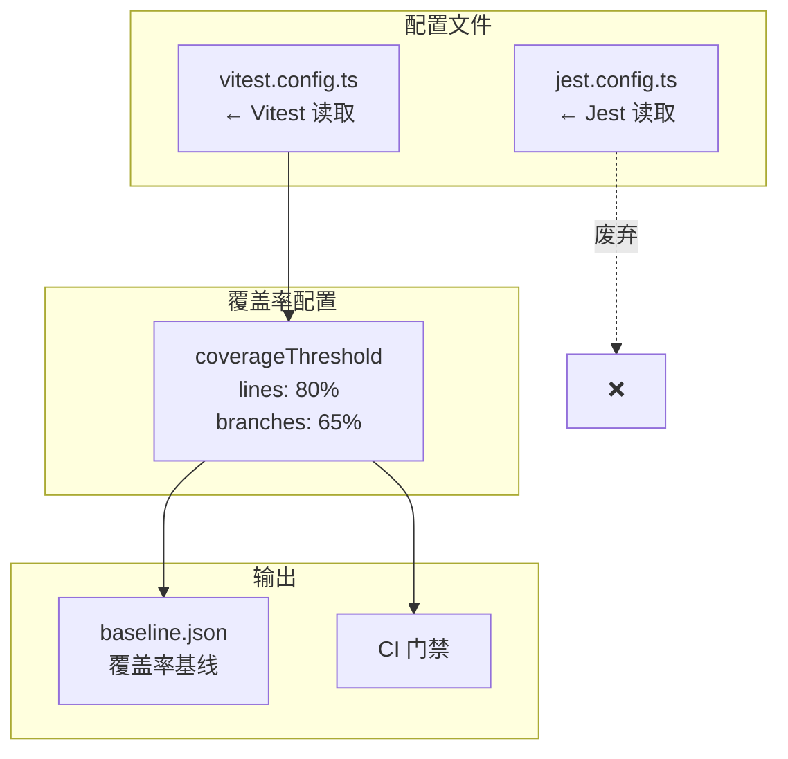
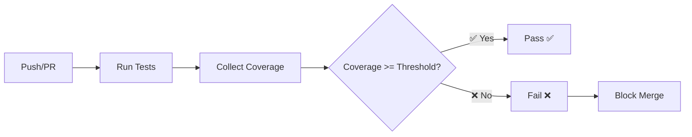

# Architecture: CI Coverage Gate Enforcement

> **项目**: test-coverage-gate  
> **Architect**: Architect Agent  
> **日期**: 2026-04-05  
> **版本**: v1.0  
> **状态**: Proposed

---

## 1. 概述

### 1.1 问题陈述

CI 不强制执行覆盖率阈值：
- Vitest 实际运行器读取 `jest.config.ts`（配置错位）
- 85% 阈值远高于当前 79.06%，门禁形同虚设

### 1.2 技术目标

| 目标 | 描述 | 优先级 |
|------|------|--------|
| AC1 | Vitest 读取正确的配置文件 | P0 |
| AC2 | 覆盖率阈值生效 | P1 |
| AC3 | baseline 存在 | P1 |

---

## 2. 系统架构

### 2.1 配置架构



### 2.2 CI 流程



---

## 3. 详细设计

### 3.1 E1: Vitest 配置修复

**文件**: `/root/.openclaw/vibex/vitest.config.ts`

```typescript
// vitest.config.ts
import { defineConfig } from 'vitest/config';
import path from 'path';

export default defineConfig({
  test: {
    environment: 'jsdom',
    setupFiles: ['./src/test/setup.ts'],
    include: ['src/**/*.{test,spec}.{ts,tsx}'],
    coverage: {
      provider: 'v8',
      reporter: ['text', 'json', 'html', 'lcov'],
      thresholds: {
        lines: 80,       // 调整为可达值
        branches: 65,    // 调整为可达值
        functions: 80,
        statements: 80,
      },
      include: [
        'src/**/*.{ts,tsx}',
        '!src/**/*.d.ts',
        '!src/test/**',
      ],
      exclude: [
        'node_modules/**',
        'dist/**',
        '**/*.config.ts',
      ],
    },
    // 关键：强制执行阈值
    threshold: true,
  },
  resolve: {
    alias: {
      '@': path.resolve(__dirname, './src'),
    },
  },
});
```

### 3.2 E2: 阈值调整

| 指标 | 当前值 | 调整后 | 说明 |
|------|--------|--------|------|
| lines | 85% | **80%** | 可达，当前 79.06% |
| branches | 85% | **65%** | 可达 |
| functions | 85% | **80%** | 可达 |
| statements | 85% | **80%** | 可达 |

### 3.3 E3: Coverage Baseline

**文件**: `coverage/baseline.json`

```json
{
  "createdAt": "2026-04-05T00:00:00Z",
  "branch": "main",
  "commit": "{{commit_hash}}",
  "thresholds": {
    "lines": 80,
    "branches": 65
  },
  "current": {
    "lines": 79.06,
    "branches": 72.1,
    "functions": 85.3,
    "statements": 79.06
  }
}
```

### 3.4 E4: Fork PR 检查

```yaml
# .github/workflows/coverage-gate.yml
name: Coverage Gate

on:
  push:
  pull_request:

jobs:
  coverage:
    runs-on: ubuntu-latest
    # Fork PR 也能运行覆盖率检查
    permissions:
      contents: read

    steps:
      - uses: actions/checkout@v4

      - name: Setup
        run: pnpm install

      - name: Run Coverage
        run: pnpm test:coverage

      - name: Check Thresholds
        run: |
          LINES=$(cat coverage/coverage-summary.json | jq '.total.lines.pct')
          BRANCHES=$(cat coverage/coverage-summary.json | jq '.total.branches.pct')
          
          echo "Lines: $LINES% (threshold: 80%)"
          echo "Branches: $BRANCHES% (threshold: 65%)"
          
          # Vitest 会自动检查阈值
          # 如果不达标，vitest 会 exit 1
```

---

## 4. 覆盖率检查命令

### 4.1 本地检查

```bash
# 运行覆盖率（Vitest 自动检查阈值）
cd /root/.openclaw/vibex
pnpm test:coverage

# 仅生成覆盖率报告（不检查阈值）
pnpm test:coverage -- --no-threshold

# 查看详细报告
open coverage/index.html
```

### 4.2 Baseline 更新

```bash
# 更新 baseline（当覆盖率提升时）
cp coverage/coverage-summary.json coverage/baseline.json
git add coverage/baseline.json
git commit -m "chore: update coverage baseline"
```

---

## 5. 阈值调整策略

### 5.1 分阶段调整

| 阶段 | 时间 | Lines | Branches |
|------|------|-------|----------|
| Phase 1 | 2026-04-05 | 80% | 65% |
| Phase 2 | 2026-05-01 | 82% | 68% |
| Phase 3 | 2026-06-01 | 85% | 70% |

### 5.2 阈值计算

```bash
# 基于 baseline 计算合理阈值
BASELINE_LINES=79.06
THRESHOLD_LINES=$(echo "$BASELINE_LINES + 1" | bc)  # 80.06%
echo "建议 Lines 阈值: ${THRESHOLD_LINES}%"
```

---

## 6. 性能影响评估

| 指标 | 影响 | 说明 |
|------|------|------|
| 覆盖率生成 | +20-30s | 需要 instrumentation |
| CI 运行时间 | +30s | 覆盖率收集 |
| **总计** | **+30s** | 可接受 |

---

## 7. 技术审查

### 7.1 PRD 覆盖检查

| PRD 目标 | 技术方案覆盖 | 缺口 |
|---------|------------|------|
| AC1: Vitest 读取正确配置 | ✅ vitest.config.ts | 无 |
| AC2: 阈值生效 | ✅ coverage.thresholds | 无 |
| AC3: baseline 存在 | ✅ coverage/baseline.json | 无 |

### 7.2 风险点

| 风险 | 等级 | 缓解 |
|------|------|------|
| jest.config.ts 仍有阈值配置 | 🟡 中 | 移除或注释 |
| Fork PR 无法上传 coverage | 🟡 中 | 使用 `contents: read` 权限 |
| 阈值调整需要人工判断 | 🟢 低 | 分阶段调整 |

---

## 8. 验收标准映射

| Epic | Story | 验收标准 | 实现 |
|------|-------|----------|------|
| E1 | S1.1 | `expect(config.coverageThreshold).toBeDefined()` | vitest.config.ts |
| E2 | S2.1 | `expect(threshold.lines).toBe(80)` | vitest.config.ts |
| E3 | S3.1 | `expect(baseline).toBeDefined()` | coverage/baseline.json |
| E4 | S4.1 | `expect(forkRun).toBe(true)` | coverage-gate.yml |

---

## 9. 迁移步骤

1. **创建 vitest.config.ts**（E1）
2. **配置 coverage.thresholds**（E2）
3. **运行覆盖率生成 baseline.json**（E3）
4. **创建 coverage-gate.yml**（E4）
5. **移除/注释 jest.config.ts 中的阈值**（避免混淆）

---

*本文档由 Architect Agent 生成 | 2026-04-05*
