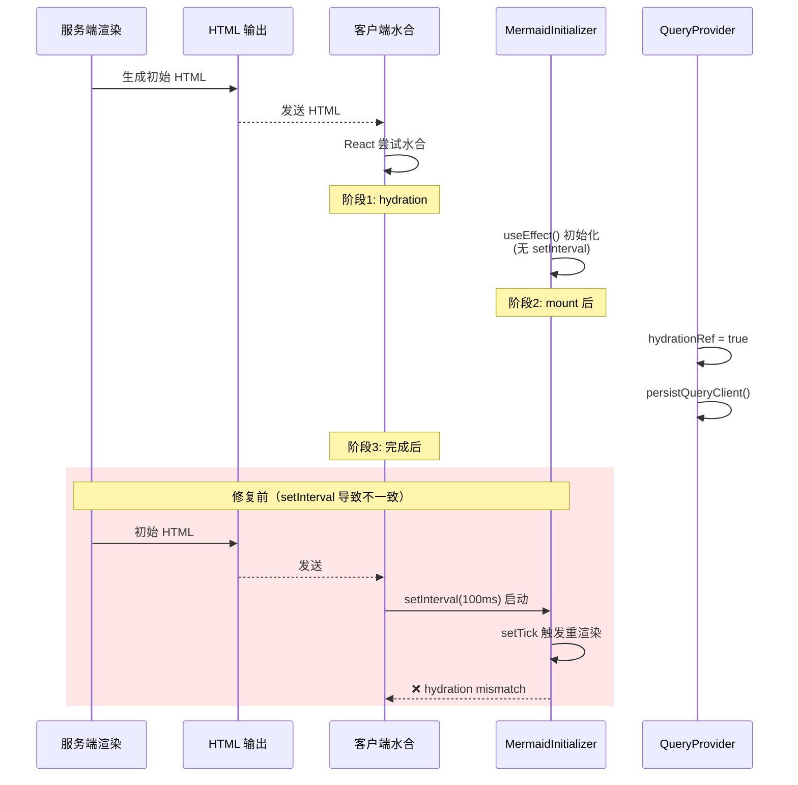

# Architecture — react-hydration-fix

**项目**: react-hydration-fix
**Architect**: Architect Agent
**日期**: 2026-04-04
**仓库**: /root/.openclaw/vibex

---

## 1. 执行摘要

修复 React Error #310 (hydration mismatch) 导致的事件处理器绑定问题，覆盖 2 个 P0 修复 + 2 个 P1 增强。

| Epic | Stories | 影响文件 | 工时 | 风险 |
|------|---------|----------|------|------|
| E1 (P0) | S1-S2 | MermaidInitializer.tsx / QueryProvider.tsx | 1h | 低 |
| E2 (P1) | S1-S2 | format.ts / MermaidRenderer.tsx / MermaidPreview.tsx | 2h | 低 |

**总工时**: 3h

---

## 2. 系统架构图

### 2.1 Hydration 问题与修复映射

```mermaid
graph TD
    subgraph "E1 P0 修复"
        MI[MermaidInitializer.tsx<br/>setInterval 100ms 轮询] -->|移除轮询| MI2[MermaidInitializer.tsx<br/>useEffect 直接初始化]
        QP[QueryProvider.tsx<br/>persistQueryClient 时机] -->|延迟持久化| QP2[QueryProvider.tsx<br/>hydration 后执行]
    end

    subgraph "E2 P1 增强"
        DT[日期 toLocaleDateString<br/>时区差异] -->|固定格式| DT2[formatDate()<br/>toISOString 基准]
        SVG[dangerouslySetInnerHTML<br/>SSR/CSR 差异] -->|suppress flag| SVG2[suppressHydrationWarning<br/>已添加]
    end

    MI2 --> HM[Hydration Mismatch Console Error]
    QP2 --> HM
    DT2 --> HM
    SVG2 --> HM

    style MI fill:#ef4444,color:#fff
    style QP fill:#ef4444,color:#fff
    style DT fill:#f97316,color:#fff
    style SVG fill:#f97316,color:#fff
    style HM fill:#22c55e,color:#fff
```

### 2.2 React SSR Hydration 生命周期



---

## 3. 技术方案

### 3.1 E1-F1: MermaidInitializer — 移除轮询

**文件**: `vibex-fronted/src/components/mermaid/MermaidInitializer.tsx`

```typescript
// 修复后
import { useEffect } from 'react';
import { mermaidManager } from './mermaidManager';
import { preInitialize } from './preInitialize';

export function MermaidInitializer() {
  useEffect(() => {
    // 直接初始化，无轮询
    mermaidManager.initialize().catch(console.error);
    preInitialize().catch(console.error);
  }, []);

  return null; // 无需渲染
}
```

**变更要点**:
- 删除 `useState` + `setTick`
- 删除 `setInterval` + `clearInterval`
- 保留 `useEffect` 直接调用 `initialize()`

### 3.2 E1-F2: QueryProvider — 延迟持久化

**文件**: `vibex-fronted/src/lib/query/QueryProvider.tsx`

```typescript
// 修复后
import { useEffect, useRef } from 'react';

export function QueryProvider({ children }) {
  const hydrationRef = useRef(false);

  useEffect(() => {
    // hydration 完成标记
    hydrationRef.current = true;

    // 延迟持久化
    persistQueryClient({
      queryClient,
      persister,
      maxAge: 24 * 60 * 60 * 1000,
    }).catch(console.error);
  }, [queryClient]);

  return <>{children}</>;
}
```

### 3.3 E2-F1: 日期格式化 — 固定格式

**文件**: `vibex-fronted/src/lib/format.ts`（新建）

```typescript
/**
 * 日期格式化 — SSR 安全的固定格式
 * 不依赖时区和 locale
 */
export function formatDate(isoString: string): string {
  // 统一使用 ISO 8601 格式，截取日期部分
  return isoString.split('T')[0]; // "2026-04-04"
}

export function formatDateTime(isoString: string): string {
  const [date, time] = isoString.split('T');
  const timeOnly = time.split('.')[0]; // "12:00:00"
  return `${date} ${timeOnly}`;
}
```

**替换规则**:
```typescript
// 替换前
const date = new Date(ts).toLocaleDateString('zh-CN');

// 替换后
import { formatDate } from '@/lib/format';
const date = formatDate(ts);
```

### 3.4 E2-F2: suppressHydrationWarning

**文件**: `MermaidRenderer.tsx` / `MermaidPreview.tsx`

```tsx
// 修复后
<div
  ref={containerRef}
  className={styles.mermaidContent}
  dangerouslySetInnerHTML={{ __html: svgContent }}
  suppressHydrationWarning  // ← 新增
/>
```

---

## 4. 接口定义

### 4.1 新增模块

```typescript
// src/lib/format.ts
export function formatDate(isoString: string): string;
export function formatDateTime(isoString: string): string;
```

### 4.2 组件 Props 变更

| 组件 | 变更 | 说明 |
|------|------|------|
| `MermaidInitializer` | 删除 `useState` + `setTick` | 简化为纯 effect |
| `MermaidRenderer` | `suppressHydrationWarning` 属性 | SVG hydration 差异抑制 |
| `MermaidPreview` | `suppressHydrationWarning` 属性 | 同上 |

---

## 5. 测试策略

| Story | 测试方式 | 验收 |
|-------|---------|------|
| E1-S1 | 静态检查 | `setInterval` / `setTick` 不存在 |
| E1-S2 | 静态检查 | `useEffect` 内调用 `persistQueryClient` |
| E2-S1 | 单元测试 | `formatDate` 时区一致性 |
| E2-S2 | Playwright | `suppressHydrationWarning` 存在 |

```typescript
// E1-S1: 静态检查测试
it('MermaidInitializer 无 setInterval', () => {
  const src = fs.readFileSync('MermaidInitializer.tsx', 'utf-8');
  expect(src).not.toMatch(/setInterval/);
  expect(src).not.toMatch(/setTick/);
});

// E2-S1: formatDate 测试
it('formatDate 时区一致', () => {
  const utc = '2026-04-04T12:00:00Z';
  const cst = '2026-04-04T20:00:00+08:00';
  expect(formatDate(utc)).toBe('2026-04-04');
  expect(formatDate(cst)).toBe('2026-04-04');
  expect(formatDate(utc)).toBe(formatDate(cst)); // 一致性
});
```

---

## 6. 性能影响评估

| 变更 | 性能影响 | 评估 |
|------|---------|------|
| 移除 setInterval | **性能提升** | 消除 100ms 定时器 CPU 占用 |
| 延迟 persistQueryClient | 无感知影响 | 仅在 hydration 后执行一次 |
| formatDate 替换 | 无影响 | 纯字符串处理 < 1ms |
| suppressHydrationWarning | 无性能影响 | DOM 属性 |

**结论**: 所有修复均有正面或中性性能影响，无负面性能影响。

---

*本文档由 Architect Agent 生成于 2026-04-04 22:25 GMT+8*
