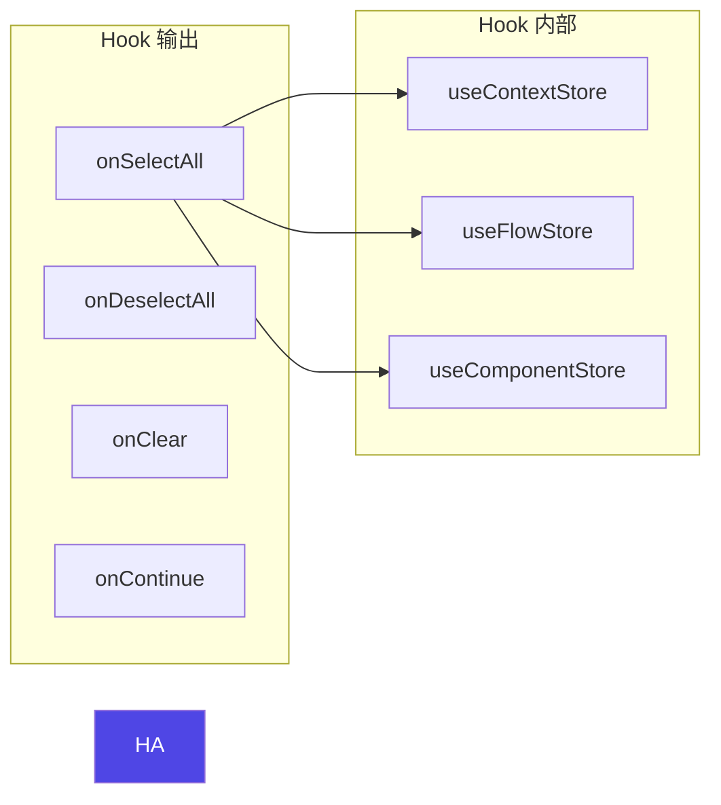

# Architecture — tree-toolbar-consolidation

**项目**: tree-toolbar-consolidation
**Architect**: Architect Agent
**日期**: 2026-04-04
**仓库**: /root/.openclaw/vibex

---

## 1. 执行摘要

将 `TreeToolbar` 从 TreePanel 面板内部迁移到 TreePanel Header 头部，实现操作入口前置，减少用户滚动成本。同时提取 `useTreeToolbarActions` hook 消除三树重复事件绑定代码。

| Epic | Stories | 影响文件 | 工时 | 风险 |
|------|---------|----------|------|------|
| E1 | S1-S4 | TreePanel.tsx / CanvasPage.tsx / CSS | 4h | 中 |

---

## 2. 系统架构图

### 2.1 组件结构变更

```mermaid
graph TD
    subgraph "TreePanel 变更前"
        TPH1[treePanelHeader<br/>折叠/展开图标]
        TPB1[treePanelBody<br/>TreeToolbar (actions prop)]
    end

    subgraph "TreePanel 变更后"
        TPH2[treePanelHeader<br/>treePanelHeader + headerActions slot]
        TPB2[treePanelBody<br/>无 TreeToolbar]
        HA[headerActions<br/>全选/取消/清空/继续]
    end

    TPH1 --> TPB1
    TPH2 --> HA
    TPH2 --> TPB2

    style HA fill:#4f46e5,color:#fff
```

### 2.2 CanvasPage 集成变更

```mermaid
sequenceDiagram
    participant CP as CanvasPage
    participant HA as useTreeToolbarActions<br/>hook
    participant TP as TreePanel
    participant TPB as TreeRenderer

    CP->>HA: useTreeToolbarActions('context')
    HA-->>CP: { onSelectAll, onDeselectAll, onClear, onContinue }

    CP->>TP: &lt;TreePanel<br/>headerActions={...}&quot;
    TP->>TP: 渲染到 header 右侧
    CP->>TPB: &lt;TreeRenderer /&gt;

    Note over TP: headerActions 始终可见<br/>无需滚动
```

### 2.3 useTreeToolbarActions Hook 架构



---

## 3. 接口定义

### 3.1 TreePanel 新增 Props

```typescript
// TreePanel.tsx
interface TreePanelProps {
  // ... existing props
  /** 新增：Header 右侧操作区（替代面板内部的 actions） */
  headerActions?: React.ReactNode;
}

// 渲染位置：Header 右侧（treePanelHeader 内部）
<div className={styles.treePanelHeader}>
  <span className={styles.treePanelTitle}>{title}</span>
  {nodeCount > 0 && (
    <span className={styles.treePanelBadge}>{nodeCount}</span>
  )}
  <button className={styles.treePanelToggle}>...</button>
  {headerActions && (                          // ← 新增
    <div data-testid="tree-panel-header-actions">
      {headerActions}
    </div>
  )}
</div>
```

### 3.2 useTreeToolbarActions Hook

```typescript
// @/hooks/canvas/useTreeToolbarActions.ts
type TreeType = 'context' | 'flow' | 'component';

interface TreeToolbarActions {
  onSelectAll: () => void;
  onDeselectAll: () => void;
  onClear: () => void;
  onContinue: (() => void) | undefined;
}

export function useTreeToolbarActions(treeType: TreeType): TreeToolbarActions {
  // 根据 treeType 选择对应的 store
  const store = treeType === 'context' ? useContextStore :
                treeType === 'flow'    ? useFlowStore :
                useComponentStore;

  const onSelectAll = () => {
    store.getState().setNodes?.(
      store.getState()[`${treeType}Nodes`].map(n => ({ ...n, isActive: true }))
    );
  };

  const onDeselectAll = () => {
    store.getState().setNodes?.(
      store.getState()[`${treeType}Nodes`].map(n => ({ ...n, isActive: false }))
    );
  };

  const onClear = () => {
    store.getState().setNodes?.([]);
  };

  return { onSelectAll, onDeselectAll, onClear, onContinue: undefined };
}
```

### 3.3 CanvasPage 调用方式

```typescript
// CanvasPage.tsx
import { useTreeToolbarActions } from '@/hooks/canvas/useTreeToolbarActions';

// context 树
const contextActions = useTreeToolbarActions('context');
<TreePanel
  title="限界上下文"
  treeType="context"
  headerActions={
    <ToolbarButton onClick={contextActions.onSelectAll}>全选</ToolbarButton>
    <ToolbarButton onClick={contextActions.onDeselectAll}>取消</ToolbarButton>
    <ToolbarButton onClick={contextActions.onClear}>清空</ToolbarButton>
    <ToolbarButton onClick={contextActions.onContinue} disabled={!canContinue}>
      继续
    </ToolbarButton>
  }
>
  <BoundedContextTree />
</TreePanel>

// component 树（无继续按钮）
const componentActions = useTreeToolbarActions('component');
<TreePanel
  title="组件树"
  treeType="component"
  headerActions={
    <ToolbarButton onClick={componentActions.onSelectAll}>全选</ToolbarButton>
    <ToolbarButton onClick={componentActions.onDeselectAll}>取消</ToolbarButton>
    <ToolbarButton onClick={componentActions.onClear}>清空</ToolbarButton>
  }
>
  <ComponentTree />
</TreePanel>
```

---

## 4. CSS 变更

```css
/* canvas.module.css */

/* Header 操作区 */
.treePanelHeader {
  display: flex;
  align-items: center;
  gap: 8px;
  padding: 8px 12px;
  min-height: 44px;
  flex-shrink: 0;
}

/* Header 右侧操作按钮 */
.treePanelHeaderActions {
  display: flex;
  align-items: center;
  gap: 4px;
  margin-left: auto;  /* 推到右侧 */
}

/* Header 工具栏按钮（缩小版） */
.treePanelHeader .toolbarBtn {
  min-height: 32px;
  min-width: 32px;
  padding: 4px 8px;
  font-size: 12px;
}

/* 移动端 */
@media (max-width: 768px) {
  .treePanelHeaderActions {
    gap: 2px;
  }
  .treePanelHeader .toolbarBtn {
    min-height: 36px;
    min-width: 36px;
    padding: 4px 6px;
  }
}
```

---

## 5. 测试策略

| Story | 测试框架 | 验收 |
|-------|---------|------|
| E1-S1 | Vitest | `headerActions` prop 渲染到 header 区域 |
| E1-S2 | Vitest | hook 返回 4 个 action 函数 |
| E1-S3 | Playwright | Header 右侧三树按钮可见 |
| E1-S4 | Playwright + Vitest | 按钮尺寸、折叠菜单 |

```typescript
// E1-S1 验收
it('headerActions 渲染在 Header 右侧', () => {
  render(<TreePanel headerActions={<button>Test</button>} ... />);
  const header = screen.getByTestId('tree-panel-header-context');
  expect(within(header).getByRole('button')).toBeVisible();
});

// E1-S2 验收
it('useTreeToolbarActions 返回 4 个 action', () => {
  const { result } = renderHook(() => useTreeToolbarActions('context'));
  expect(result.current).toHaveProperty('onSelectAll');
  expect(result.current).toHaveProperty('onDeselectAll');
  expect(result.current).toHaveProperty('onClear');
});

// E1-S3 验收（Playwright）
it('context Header 显示全选/继续按钮', async ({ page }) => {
  await page.goto('/canvas');
  const actions = page.locator('[data-testid="tree-panel-header-context"] [data-testid="tree-panel-header-actions"]');
  await expect(actions.getByRole('button', { name: /全选/ })).toBeVisible();
});
```

---

## 6. 性能影响评估

| 变更 | 性能影响 | 评估 |
|------|---------|------|
| TreeToolbar 移至 Header | 减少初始面板滚动成本 | 体验提升 |
| useTreeToolbarActions hook | 每次 render 创建 4 个函数引用 | < 1ms |
| headerActions 作为 ReactNode 传入 | Header 重渲染概率增加 | < 2ms |

**结论**: 无负面性能影响，Header 迁移减少用户操作路径，整体体验提升。

---

*本文档由 Architect Agent 生成于 2026-04-04 20:25 GMT+8*
