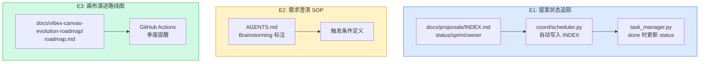

# Architecture: Analyst Proposals — 2026-04-12 Phase 1

**Project**: vibex-analyst-proposals-20260412-phase1
**Stage**: design-architecture
**Architect**: Architect
**Date**: 2026-04-07
**Version**: v1.0
**Status**: Proposed

---

## 执行决策

| 决策 | 状态 | 执行项目 | 执行日期 |
|------|------|----------|----------|
| E1: 提案状态追踪机制 | **待评审** | vibex-analyst-proposals-20260412-phase1 | 待定 |
| E2: 需求澄清 SOP 标准化 | **待评审** | vibex-analyst-proposals-20260412-phase1 | 待定 |
| E3: 画布演进路线图文档化 | **待评审** | vibex-analyst-proposals-20260412-phase1 | 待定 |

---

## 1. Tech Stack

| 组件 | 技术选型 | 说明 |
|------|----------|------|
| **coord** | task_manager.py | 自动更新 INDEX.md |
| **文件系统** | Markdown | INDEX.md + roadmap.md |
| **GitHub Actions** | 定时触发 | 季度更新提醒 |
| **文档** | Mermaid | 演进路线图可视化 |

---

## 2. Architecture Diagram



---

## 3. Module Design

### 3.1 E1: 提案状态追踪机制

#### 3.1.1 INDEX.md 模板

```markdown
# VibeX 提案索引

## 状态说明

| 状态 | 含义 |
|------|------|
| pending | 已提交，待评审 |
| in-progress | 已采纳，实施中 |
| done | 已完成 |
| rejected | 已驳回 |

## 提案列表

| ID | 标题 | Sprint | 状态 | Owner | 创建时间 | 更新时间 |
|----|------|--------|------|-------|----------|----------|
| A-P0-1 | 提案状态追踪机制 | 20260412 | in-progress | Analyst | 2026-04-07 | 2026-04-07 |
```

#### 3.1.2 coord 自动写入机制

```python
# coord/scheduler.py — create_project() 中新增
def create_project(project_data: dict):
    project_id = project_data['id']
    
    # 写入 INDEX.md
    index_entry = f"| {project_id} | {project_data.get('title', '')} | {project_data.get('sprint', '')} | pending | {project_data.get('owner', '')} | {datetime.now().strftime('%Y-%m-%d')} | — |"
    
    with open('docs/proposals/INDEX.md', 'a') as f:
        f.write(index_entry + '\n')
```

#### 3.1.3 task done 时自动更新

```python
# task_manager.py — update() 中新增
def update(project: str, stage: str, status: str):
    # ... existing logic ...
    
    if status == 'done':
        # 自动更新 INDEX.md status
        update_index_status(project, 'done')
        # 记录完成时间
        update_index_timestamp(project, datetime.now().strftime('%Y-%m-%d'))
```

### 3.2 E2: 需求澄清 SOP

#### 3.2.1 AGENTS.md 更新

```markdown
## 需求澄清 SOP

### 何时使用 Brainstorming

当遇到以下情况时，必须使用 Brainstorming 技能：
1. 需求描述包含歧义（如"优化体验"无具体指标）
2. 涉及多个方案权衡，无明显最优解
3. 涉及新领域，团队缺乏上下文
4. PRD 中存在"待确认"项

### Brainstorming 流程

1. 触发: 在 #vibex 或对应频道 @analyst "需要 brainstorm: <需求描述>"
2. 分析: Analyst 使用 gstack browse 验证问题真实性
3. 提案: 生成 2-3 个方案选项 + 权衡分析
4. 决策: PM 选择方案，更新 PRD
5. 记录: 将决策记录到对应提案的 ANALYSIS.md
```

### 3.3 E3: 画布演进路线图

#### 3.3.1 roadmap.md 结构

```markdown
# VibeX 画布演进路线图

## 当前状态 (2026-Q1)

### 产品定位
- AI驱动的页面原型生成工具
- 目标用户：产品经理、设计师

### 核心功能
- 三树并行（Context / Flow / Component）
- DDD 领域建模
- AI 原型生成

## 目标状态 (2026-Q4)

### 新增功能
- 多人协作
- 版本历史
- 组件市场

## 演进路径

### Q2: 稳定性优先
- 修复现有 bug
- 提升测试覆盖率
- 优化性能

### Q3: 协作功能
- 实时协作
- 评论功能

### Q4: 生态扩展
- 组件市场
- 第三方集成
```

#### 3.3.2 季度更新提醒

```yaml
# .github/workflows/quarterly-reminder.yml
name: Quarterly Roadmap Update Reminder

on:
  schedule:
    # 每季度第一天 09:00 UTC
    - cron: '0 9 1 1,4,7,10 *'
  workflow_dispatch:

jobs:
  reminder:
    runs-on: ubuntu-latest
    steps:
      - name: Create reminder issue
        uses: actions/github-script@v6
        with:
          script: |
            github.rest.issues.create({
              owner: context.repo.owner,
              repo: context.repo.repo,
              title: '[Reminder] Quarterly Roadmap Update',
              body: '季度提醒：请更新 docs/vibex-canvas-evolution-roadmap/roadmap.md'
            })
```

---

## 4. Data Model

### 4.1 INDEX.md Entry

```typescript
interface ProposalIndexEntry {
  id: string;           // e.g., "A-P0-1"
  title: string;
  sprint: string;        // e.g., "20260412"
  status: 'pending' | 'in-progress' | 'done' | 'rejected';
  owner: string;
  createdAt: string;     // YYYY-MM-DD
  updatedAt: string;     // YYYY-MM-DD
}
```

---

## 5. Performance Impact

| Epic | 影响 | 说明 |
|------|------|------|
| E1 INDEX | < 10ms | 文件追加操作 |
| E2 SOP | 无 | 文档更新 |
| E3 roadmap | < 100ms | 文档渲染 |
| **总计** | **无性能影响** | 纯文档变更 |

---

## 6. Risk Assessment

| # | 风险 | 概率 | 影响 | 缓解 |
|---|------|------|------|------|
| R1 | INDEX.md 并发写入冲突 | 低 | 低 | coord 单点写入，无并发 |
| R2 | 季度提醒被忽略 | 中 | 低 | Slack 通知双重提醒 |
| R3 | roadmap 内容过期 | 中 | 低 | 季度提醒机制 |

---

## 7. Testing Strategy

| Epic | 验证方式 |
|------|----------|
| E1 INDEX | 模拟 create_project，验证 INDEX.md 条目存在 |
| E2 SOP | AGENTS.md grep 验证 |
| E3 roadmap | docs 存在性检查 |

---

## 8. Implementation Phases

| Phase | Epic | 工时 | 产出 |
|-------|------|------|------|
| 1 | E1 INDEX 模板 + coord 集成 | 1h | INDEX.md + scheduler.py |
| 2 | E2 AGENTS.md SOP 标注 | 1h | AGENTS.md 更新 |
| 3 | E3 roadmap.md + CI reminder | 2h | roadmap.md + quarterly.yml |
| **Total** | | **4h** | |

---

## 9. PRD AC 覆盖

| AC | 技术方案 | 状态 |
|----|---------|------|
| AC1: INDEX.md 自动添加条目 | coord create_project 自动写入 | ✅ |
| AC2: INDEX.md status 自动更新 | task_manager.py done 时更新 | ✅ |
| AC3: INDEX.md 100% 覆盖 | 模板 + 自动写入机制 | ✅ |
| AC4: Brainstorming 技能标注 | AGENTS.md SOP 章节 | ✅ |
| AC5: roadmap.md 内容完整 | Mermaid 路线图 + 当前/目标/演进 | ✅ |
| AC6: 季度提醒机制 | GitHub Actions cron | ✅ |
