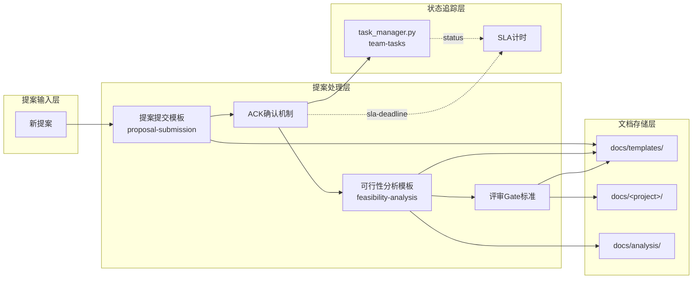

# Architecture: Analyst 提案可行性分析框架标准化

> **类型**: Meta-tooling / Process Infrastructure  
> **状态**: v1.0  
> **日期**: 2026-04-14  
> **依据**: prd.md (vibex-analyst-proposals-20260414_143000)

---

## 1. Problem Frame

VibeX 当前提案流程缺乏标准化输入/输出格式。Analyst 的可行性评估质量依赖个人经验，没有统一的风险矩阵框架和验收标准模板。导致：评估结论不一致、工时估算偏差大、好提案被误驳回。

**目标**: 建立 Analyst 提案可行性分析的标准框架，包括：提案提交模板、可行性分析模板（含三维风险矩阵）、工时估算标准、评审 gate 标准。

---

## 2. System Architecture

### 2.1 Architecture Diagram



### 2.2 核心组件

| 组件 | 类型 | 路径 | 职责 |
|------|------|------|------|
| `proposal-submission-template.md` | 文档模板 | `docs/templates/` | 统一提案格式 |
| `feasibility-analysis-template.md` | 文档模板 | `docs/templates/` | 可行性分析框架 |
| `risk-matrix-template.md` | 文档片段 | `docs/templates/` | 风险矩阵格式 |
| `estimate-standard.md` | 文档片段 | `docs/templates/` | 工时估算标准 |
| `gate-criteria.md` | 文档片段 | `docs/templates/` | 评审决策标准 |
| `task_manager.py` | 脚本 | `skills/team-tasks/scripts/` | 状态管理和 SLA 追踪 |

---

## 3. Technical Decisions

### 3.1 存储架构: 纯 Markdown 文档

**决策**: 所有分析产物存储为 Markdown 文件，不引入数据库。

**理由**:
- 低门槛：任何成员都能直接编辑
- 版本化：Git 天然追踪历史
- 可被 subagent 批量处理
- 符合 VibeX 团队现有的文档实践

**Trade-off**: 分散在多个目录，检索需要 grep。初期规模下可接受；未来规模扩大可评估 D1 数据库方案。

### 3.2 模板位置: `docs/templates/`

**决策**: 所有模板文件放在 `docs/templates/` 目录。

**理由**:
- 与现有 `templates/` (dev checklist, story template) 分离
- `docs/` 是团队文档主目录，Analyst 可直接引用
- 路径短，模板引用稳定

### 3.3 提案 ID 格式: `proposal-YYYYMMDD-NNN`

**决策**: 提案 ID 格式为 `proposal-YYYYMMDD-NNN`，如 `proposal-20260414-001`。

**理由**:
- 日期可追溯
- NNN 三位序号确保同一天多提案不冲突
- 符合团队现有 ID 命名习惯

**Trade-off**: 序号需要协调（同一天多人创建）。缓解：team-tasks 在 claim 时自动分配序号。

### 3.4 SLA 机制: `sla-deadline` 字段 + 自动通知

**决策**: 每个 analysis.md 包含 `sla-deadline` 字段；team-tasks 负责计时；超时通过 Slack 通知 Coord。

**理由**:
- 复用现有 team-tasks 基础设施
- 不引入新的计时服务
- 通知在现有 Slack 频道推送，团队已习惯

**Trade-off**: team-tasks 的 SLA 追踪是轻量级的（无独立告警服务），依赖心跳脚本检查超时。初期够用，未来可升级为独立计时服务。

### 3.5 状态追踪: 复用 team-tasks + docs/learnings/

**决策**: 复用 `task_manager.py` 管理状态，采纳追踪存 `docs/learnings/`。

**注意**: PRD DoD 中提到的 "INDEX.md 状态自动更新" 指的是 team-tasks 的 project-level status（通过 task update 命令更新），**不是新建一个 `docs/proposals/INDEX.md`** 文件。`docs/proposals/INDEX.md` 是历史遗留文件，本项目不依赖它。

**理由**:
- team-tasks 已有 claim/update/done/failed 流程
- 误判复盘存入 `docs/learnings/`（已有目录）
- 多系统状态同步成本高

**Trade-off**: team-tasks 是项目维度的，Analyst 的提案分析在 project 内是 stage。已有良好的 DAG 模式支持。task_manager.py 的 E4 虚假完成检测可辅助 SLA 验证。

---

## 4. API / 数据契约

### 4.1 提案提交模板契约

```markdown
## 执行决策
- **决策**: [待评审/已采纳/已拒绝]
- **执行项目**: [team-tasks 项目 ID 或 "无"]
- **执行日期**: [YYYY-MM-DD 或 "待定"]

## 提案元信息
- **提案ID**: proposal-YYYYMMDD-NNN
- **提案者**: [名称]
- **日期**: YYYY-MM-DD
- **sla-deadline**: YYYY-MM-DD HH:MM
- **来源**: [原始提案链接或描述]
```

### 4.2 可行性分析文档契约

```markdown
## 执行决策
- **决策**: [推荐/不推荐/有条件推荐]
- **决策理由**: [具体原因，不接受"综合考虑"]
- **Coord采纳**: [是/否]
- **Coord理由**: [如果被推翻，记录原因]

## 可行性评估
### 技术可行性
| 维度 | 评估 | 说明 |
|------|------|------|

### 业务可行性
| 维度 | 评估 | 说明 |
|------|------|------|

### 依赖可行性
| 维度 | 评估 | 说明 |
|------|------|------|

## 风险矩阵
| 风险 | 等级 | 缓解措施 | 残余风险 |
|------|------|---------|---------|
| [描述] | 🔴高/🟠中/🟡低 | [措施] | [残余] |

## 工时估算
| 估算值 | 乐观 | 悲观 | 依据 |
|--------|------|------|------|
| [Nh] | [Nh] | [Nh] | [依据] |

## 结论
[推荐/不推荐/有条件推荐] + 具体理由
```

---

## 5. Module Design

### 5.1 模板模块 (docs/templates/)

```
docs/templates/
├── proposal-submission-template.md   # 提案提交标准模板
├── feasibility-analysis-template.md  # 可行性分析模板
├── risk-matrix.md                    # 风险矩阵格式定义
├── estimate-standard.md              # 工时估算标准
└── gate-criteria.md                 # 评审决策标准
```

**proposal-submission-template.md** 强制字段:
- 背景 (Background)
- 目标 (Goals)
- 约束 (Constraints)
- 成功指标 (Success Metrics)
- 影响范围 (Impact Scope)
- 时间线 (Timeline)
- 提案者 (Proposer)

**feasibility-analysis-template.md** 强制章节:
- 执行决策 (Decision)
- 可行性评估 (三维: 技术/业务/依赖)
- 风险矩阵 (至少 3 项: 技术/业务/依赖各 1)
- 工时估算 (含乐观/悲观范围和估算依据)
- 结论 (推荐/不推荐/有条件推荐 + 具体理由)

### 5.2 脚本模块 (skills/team-tasks/scripts/)

无需新增脚本。`task_manager.py` 现有功能覆盖:
- `claim`: 分配提案 ID，自动记录 sla-deadline (+24h)
- `update`: 状态更新触发 SLA 检查
- `status`: 查看所有提案 SLA 状态

### 5.3 通知模块

复用现有 Slack 通知机制:
- SLA 超时 → 心跳脚本检测 → 通知 #coord
- 提案完成 → Analyst 发送 Slack 报告

---

## 6. Performance & Scale

| 维度 | 当前评估 | 说明 |
|------|---------|------|
| 存储 | 低 | 每个分析 ~5-10KB，Git 存储无压力 |
| 查询 | 低 | 少量文档，grep 足够 |
| 并发 | 无限制 | Git + Markdown，无锁冲突 |
| 通知延迟 | < 1min | 心跳脚本每分钟检查 |

**扩展路径**: 当分析文档超过 100 份时，评估 D1 数据库方案。

---

## 7. Security & Permissions

- 所有模板和产物的写权限: Architect + PM + Analyst Agent (通过 team-tasks 控制)
- 读权限: 所有团队成员
- 无敏感数据存储

---

## 8. Review Findings Integration

### Blocking Issues (已修正)
1. **INDEX.md 矛盾**: PRD DoD 提到 "INDEX.md 自动更新"，与 architecture §3.5 "不新建 INDEX.md" 矛盾。**结论**: INDEX.md 指的是 team-tasks 状态更新，docs/proposals/INDEX.md 是历史文件不依赖。
2. **Unit 4 SLA 实现不完整**: task_manager.py 当前无 sla_deadline 字段。**结论**: Unit 4 明确为代码修改任务，需修改 claim 命令和 status 输出。
3. **Proposal ID 自动分配未定义**: ACK 需 proposal-YYYYMMDD-NNN。**结论**: Unit 7 新增，统一在 task_manager.py claim 时自动生成。

### Non-Blocking Recommendations (已纳入)
1. Gate criteria "业务价值 > 0" 和 "工时合理" 主观 → 在 gate-criteria.md 添加 FAQ 和边界案例说明
2. 两模板关系不清 → 在 AGENTS.md 添加 "何时用哪个模板" 指引
3. 无强制验证机制 → Unit 8 新增 post-completion lint 脚本

## 9. Open Questions

| 问题 | 状态 | 处理方式 |
|------|------|---------|
| 同一天多人创建提案序号冲突 | 已解决 | task_manager.py claim 时自动分配最大序号 |
| SLA 超时后是否自动 reassign | 待定 | 初期由 Coord 手动处理 |
| 误判复盘 learnings 存储位置 | 已解决 | 存储到 `docs/learnings/`（已有目录）|
| 采纳率统计实现方式 | 已解决 | 通过 git log + analysis.md 元信息计算 |
| SLA 超时通知具体格式 | 待细化 | Unit 4b 心跳脚本 |
| Gate criteria 边界案例 | 已解决 | gate-criteria.md 添加边界案例 |
| 两模板关系指引 | 已解决 | AGENTS.md 添加使用指引 |
| 无强制验证 | 已解决 | Unit 8 post-completion lint |

**参考**: `docs/proposals/INDEX.md` 已有提案追踪表格格式，可参考采纳率统计的实现方式。

---

## 9. Verification

- [ ] 模板文件可通过 `cp docs/templates/feasibility-analysis-template.md docs/<project>/analysis.md` 正确复制
- [ ] 每个 analysis.md 包含所有强制字段（proposal ID, sla-deadline, 三维评估, 风险矩阵, 工时估算, 结论）
- [ ] team-tasks claim 自动设置 sla-deadline = now + 24h
- [ ] SLA 超时通知通过现有心跳脚本推送到 #coord

---

*Architect Agent | 2026-04-14*
