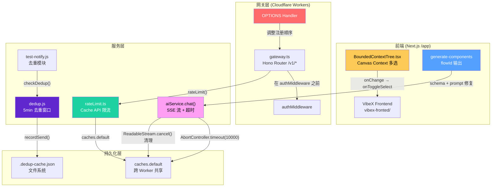
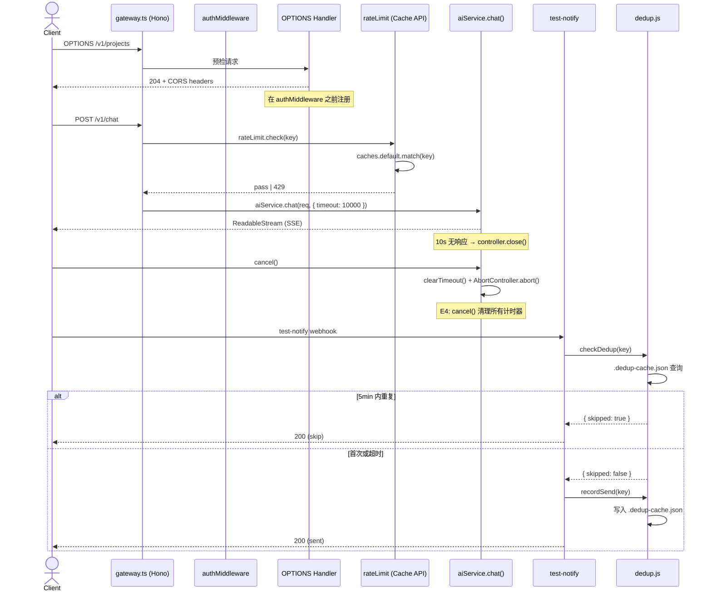

# VibeX P0/P1 修复架构文档

> **项目**: vibex-analyst-proposals-vibex-proposals-20260406  
> **作者**: architect  
> **日期**: 2026-04-06  
> **版本**: v1.0

---

## 执行决策

- **决策**: 已采纳
- **执行项目**: vibex-analyst-proposals-vibex-proposals-20260406
- **执行日期**: 2026-04-06

---

## 问题背景

2026-04-05 完成 5 个 Bug 修复任务后，6 个 Agent（analyst、architect、pm、tester、reviewer）共提交 23 个提案，其中 P0 修复项 13 个、P1 修复项 10 个。经评审汇总为 6 个 Epic，聚焦阻塞性 Bug（P0）和稳定性改进（P1）。

| Epic | 名称 | 优先级 | 工时 | 提案来源 |
|------|------|--------|------|----------|
| E1 | OPTIONS 预检路由修复 | P0 | 0.5h | A-P0-1, P001, T-P0-1, R-P0-1 |
| E2 | Canvas Context 多选修复 | P0 | 0.3h | A-P0-2, P002, T-P0-2, R-P0-2 |
| E3 | generate-components flowId | P0 | 0.3h | A-P0-3, P003, T-P0-3 |
| E4 | SSE 超时 + 连接清理 | P1 | 1.5h | A-P1-1, A-P0-2, P005 |
| E5 | 分布式限流 | P1 | 1.5h | A-P1-2, P005 |
| E6 | test-notify 去重 | P1 | 1h | A-P1-3, P004, T-P1-1 |
| **合计** | | | **5.1h** | |

---

## Tech Stack

| 层级 | 技术 | 版本 | 选型理由 |
|------|------|------|----------|
| 前端框架 | Next.js 15 (App Router) | ^15.0 | React Server Components，生产可用 |
| 状态管理 | Zustand | ^5.0 | 轻量、无 Boilerplate，Canvas 子 store 现状 |
| 数据获取 | TanStack Query | ^5.0 | API 缓存与背景刷新 |
| 样式 | CSS Modules + CSS Variables | - | 组件隔离 + 主题支持 |
| 后端 | Cloudflare Workers | stable | 边缘计算，VibeX 线上环境 |
| API 框架 | Hono | ^4.0 | `/v1/*` 新路由系统，轻量高性能 |
| 数据库 | Cloudflare D1 | - | SQLite at edge |
| 部署 | Cloudflare Pages | - | 前端静态部署 |
| 测试 | Jest + Playwright | latest | E2E 不可运行问题待修复 |
| 限流存储 | Cache API (caches.default) | - | 跨 Worker 共享，替代内存 Map |
| 去重存储 | 文件系统 (.dedup-cache.json) | - | 轻量、无外部依赖 |

---

## 架构图

### Epic 关系与数据流



### 数据流序列图



---

## Epic 接口与数据流定义

### E1: OPTIONS 预检路由修复

**根因**: `protected_.options` 在 `authMiddleware` 之后注册，预检被 401 拦截。

**涉及文件**:
- `gateway.ts` — 路由注册顺序

**数据流**:
```
OPTIONS /v1/projects
  → gateway.ts 路由匹配
  → OPTIONS Handler (返回 204 + CORS headers)
  → 不经过 authMiddleware
```

**接口定义**:
```typescript
// gateway.ts 路由注册顺序（修复后）
app.options('/v1/*', optionsHandler)   // ← 在 authMiddleware 之前
app.use('/v1/*', authMiddleware)        // ← 鉴权中间件
app.post('/v1/*', protectedHandler)
```

**验收标准**:
- `OPTIONS /v1/projects` → `status: 204`
- `Access-Control-Allow-Origin: *`
- `Access-Control-Allow-Methods: GET, POST, PUT, DELETE, OPTIONS`
- GET/POST 请求不受影响

---

### E2: Canvas Context 多选修复

**根因**: `BoundedContextTree.tsx` checkbox `onChange` 调用了 `toggleContextNode` 而非 `onToggleSelect`。

**涉及文件**:
- `BoundedContextTree.tsx` — Canvas 上下文树组件

**数据流**:
```
用户点击 checkbox
  → onChange 触发
  → 调用 onToggleSelect(nodeId)  ← 修复点
  → 更新 selectedNodeIds
```

**接口定义**:
```typescript
// BoundedContextTree.tsx (修复前 → 修复后)
Checkbox
  onChange={toggleContextNode}    // ❌ 错误
  onChange={() => onToggleSelect(node.id)}  // ✅ 正确
```

**验收标准**:
- `expect(onToggleSelect).toHaveBeenCalledWith(nodeId)` ✓
- 点击 checkbox → `selectedNodeIds` 正确更新 ✓
- `toggleContextNode` 保持独立功能，不受 checkbox 影响 ✓

---

### E3: generate-components flowId

**根因**: AI schema 缺少 `flowId` 字段，prompt 未要求输出。

**涉及文件**:
- `generate-components` 相关 schema 文件
- AI prompt 定义文件

**数据流**:
```
用户触发组件生成
  → 调用 aiService.chat() with schema + prompt
  → prompt 明确要求输出 flowId
  → schema 包含 flowId: string
  → AI 返回包含 flowId 的 component 对象
  → flowId 写入数据库或内存
```

**接口定义**:
```typescript
// Component schema (修复后)
interface GeneratedComponent {
  id: string
  name: string
  type: string
  flowId: string   // ✅ 新增字段，格式 /^flow-/
  // ...
}

// Prompt 模板（修复后）
// "Output a JSON object with: id, name, type, flowId (format: flow-xxx)"
```

**验收标准**:
- `expect(component.flowId).toMatch(/^flow-/)` ✓
- `expect(flowId).not.toBe('unknown')` ✓

---

### E4: SSE 超时 + 连接清理

**根因**: `aiService.chat()` 无超时控制，`setTimeout` 未在 `cancel()` 中清理。

**涉及文件**:
- `aiService.ts` — AI 服务封装

**数据流**:
```
请求进入 aiService.chat()
  → 创建 AbortController.timeout(10000)
  → 调用底层 AI API
  → 超时或主动 cancel 时：
     1. controller.abort()
     2. clearTimeout() 清理所有计时器  ← 修复点
     3. 关闭 ReadableStream
  → Worker 不挂死，资源释放
```

**接口定义**:
```typescript
// aiService.ts (修复后)
async function chat(req: ChatRequest): Promise<ReadableStream> {
  const controller = new AbortController()

  // 超时包装
  const timeoutMs = 10000
  const timer = setTimeout(() => controller.abort(), timeoutMs)

  try {
    const stream = await aiProvider.chat(req, {
      signal: controller.signal
    })

    // 可读流 cancel 时清理
    return new ReadableStream({
      cancel() {
        clearTimeout(timer)   // ✅ 清理计时器
        controller.abort()
      }
    })
  } catch (err) {
    clearTimeout(timer)
    throw err
  }
}
```

**验收标准**:
- `expect(stream).toBeInstanceOf(ReadableStream)` ✓
- 10s 无响应 → `controller.close()` ✓
- `ReadableStream.cancel()` → `clearTimeout` 被调用 ✓

---

### E5: 分布式限流

**根因**: 内存 Map 跨 Worker 不共享，限流失效。

**涉及文件**:
- `rateLimit.ts` — 限流模块
- `wrangler.toml` — Cloudflare Workers 配置

**数据流**:
```
请求进入 /v1/* 路由
  → rateLimit.check(identifier)
  → 查询 caches.default.get(key)
  → 存在 → 计数 +1 → 超限返回 429
  → 不存在 → 创建条目 → 允许通过
  → TTL 到期自动过期
```

**接口定义**:
```typescript
// rateLimit.ts (修复后)
import { caches } from '__STATIC_CONTENT_MANIFEST'

interface RateLimitOptions {
  limit: number       // 请求上限
  windowMs: number    // 时间窗口（ms）
}

async function checkRateLimit(
  identifier: string,
  options: RateLimitOptions
): Promise<{ allowed: boolean; remaining: number }> {
  const key = `rate:${identifier}`
  const cache = caches.default

  const cached = await cache.match(key)
  const count = cached ? parseInt(await cached.text()) : 0

  if (count >= options.limit) {
    return { allowed: false, remaining: 0 }
  }

  const newCount = count + 1
  await cache.put(key, new Response(String(newCount)), {
    expirationTtl: Math.ceil(options.windowMs / 1000)
  })

  return { allowed: true, remaining: options.limit - newCount }
}
```

**验收标准**:
- `expect(caches.default).toBeDefined()` ✓
- 100 并发请求 → 限流计数一致，后续返回 429 ✓
- 多 Worker 环境下限流一致 ✓

---

### E6: test-notify 去重

**根因**: JS 版 test-notify 缺少 5 分钟去重窗口，Python 版已有实现。

**涉及文件**:
- `dedup.js` — 新建去重模块
- `test-notify.js` — Webhook 通知

**数据流**:
```
test-notify 收到 webhook
  → checkDedup(cacheKey)
  → 读取 .dedup-cache.json
  → 5min 内有记录 → skipped: true → 直接返回
  → 首次或超期 → recordSend(cacheKey)
  → 写入 .dedup-cache.json (TTL: 5min)
  → 发送 webhook
```

**接口定义**:
```typescript
// dedup.js (新建)
import { readFileSync, writeFileSync } from 'fs'

const CACHE_FILE = '.dedup-cache.json'
const DEDUP_WINDOW_MS = 5 * 60 * 1000  // 5 分钟

interface DedupEntry {
  timestamp: number
}

function loadCache(): Record<string, DedupEntry> {
  try {
    return JSON.parse(readFileSync(CACHE_FILE, 'utf-8'))
  } catch {
    return {}
  }
}

function saveCache(cache: Record<string, DedupEntry>) {
  writeFileSync(CACHE_FILE, JSON.stringify(cache, null, 2))
}

export function checkDedup(key: string): { skipped: boolean } {
  const cache = loadCache()
  const entry = cache[key]
  const now = Date.now()

  if (entry && now - entry.timestamp < DEDUP_WINDOW_MS) {
    return { skipped: true }  // 重复，跳过
  }
  return { skipped: false }
}

export function recordSend(key: string): void {
  const cache = loadCache()
  cache[key] = { timestamp: Date.now() }
  saveCache(cache)
}
```

**验收标准**:
- `expect(checkDedup(key).skipped).toBe(true)` 5min 内重复 ✓
- 状态持久化到 `.dedup-cache.json` ✓
- 重复调用 → `expect(webhookCalls).toBe(1)` ✓

---

## 技术审查（风险评估）

| 风险 | 级别 | 描述 | 缓解措施 |
|------|------|------|----------|
| E1 修改破坏其他中间件 | 中 | 调整路由顺序可能影响中间件链 | 仅调整 OPTIONS 顺序，完整回归测试 |
| E2 修复影响 toggleContextNode | 低 | checkbox 和 tree-node 是不同操作路径 | checkbox 仅绑定 onToggleSelect，toggleContextNode 独立存在 |
| E3 flowId 格式兼容性 | 低 | AI 输出 flowId 格式可能不一致 | prompt 明确格式要求，正则验证 |
| E4 SSE 超时破坏事件顺序 | 中 | AbortController 中断可能导致事件乱序 | 外层 try-catch，不影响内部已发送事件 |
| E5 Cache API 部署配置 | 中 | Cloudflare Workers Cache API 默认关闭 | wrangler.toml 配置 `node_compat = true`，部署验证 |
| E6 去重文件竞争 | 低 | 多 Worker 并发写 .dedup-cache.json | 文件锁或原子写操作，暂使用同步写入（单 Worker 场景） |

---

## 测试策略

### 测试框架

| 测试类型 | 框架 | 覆盖目标 |
|----------|------|----------|
| 单元测试 | Jest | 每个 Epic 核心逻辑 |
| API 测试 | Jest + supertest | E1 OPTIONS 路由 |
| 前端组件测试 | Jest + React Testing Library | E2 Canvas checkbox |
| E2E 测试 | Playwright | 全流程回归（E1-E6 集成）|

### 覆盖率要求

- 核心逻辑覆盖率 > 80%
- 每个 Epic 至少 2 个正向用例 + 1 个负向用例

### 核心测试用例

#### E1: OPTIONS 预检
```typescript
describe('OPTIONS preflight', () => {
  it('returns 204 with CORS headers', async () => {
    const res = await request(app)
      .options('/v1/projects')
      .expect(204)
    expect(res.headers['access-control-allow-origin']).toBe('*')
  })

  it('OPTIONS does not return 401', async () => {
    const res = await request(app)
      .options('/v1/projects')
    expect(res.status).not.toBe(401)
  })

  it('GET request unaffected', async () => {
    await request(app)
      .get('/v1/projects')
      .expect(200)
  })
})
```

#### E4: SSE 超时
```typescript
describe('SSE timeout', () => {
  it('timeout is 10000ms', async () => {
    const controller = new AbortController()
    const timer = setTimeout(() => controller.abort(), 10000)
    expect(timer).toBeDefined()
  })

  it('cancel() calls clearTimeout', async () => {
    const clearSpy = jest.spyOn(global, 'clearTimeout')
    const stream = new ReadableStream({ cancel() { clearTimeout(timer) } })
    await stream.cancel()
    expect(clearSpy).toHaveBeenCalled()
  })
})
```

#### E5: 分布式限流
```typescript
describe('rate limit with Cache API', () => {
  it('caches.default is available', () => {
    expect(caches.default).toBeDefined()
  })

  it('100 concurrent requests → consistent count', async () => {
    const promises = Array(100).fill(null).map(() => checkRateLimit('test-key', { limit: 50, windowMs: 60000 }))
    const results = await Promise.all(promises)
    const allowed = results.filter(r => r.allowed).length
    expect(allowed).toBeLessThanOrEqual(50)
  })
})
```

---

## 实施计划

### Sprint 1 — P0 修复（1.1h）

**目标**: 消除阻塞性 Bug，不破坏现有功能。

#### E1: OPTIONS 预检路由修复（0.5h）
| 步骤 | 内容 | 产出物 |
|------|------|--------|
| 1.1 | 定位 `gateway.ts` 中 OPTIONS handler 位置 | 确认当前注册顺序 |
| 1.2 | 将 `protected_.options` 移至 `authMiddleware` 之前 | 修改后 gateway.ts |
| 1.3 | curl 验证 `OPTIONS /v1/projects` 返回 204 | 手动测试通过 |
| 1.4 | 回归测试：GET/POST 不受影响 | Jest 测试通过 |

**依赖**: 无

#### E2: Canvas Context 多选修复（0.3h）
| 步骤 | 内容 | 产出物 |
|------|------|--------|
| 2.1 | 定位 `BoundedContextTree.tsx` 中 checkbox onChange | 确认调用路径 |
| 2.2 | 将 onChange 改为 `() => onToggleSelect(node.id)` | 修改后组件 |
| 2.3 | 添加 onToggleSelect 调用断言测试 | Jest 测试 |
| 2.4 | 手动测试 checkbox 选择功能 | 验证通过 |

**依赖**: 无（E1 可并行）

#### E3: generate-components flowId（0.3h）
| 步骤 | 内容 | 产出物 |
|------|------|--------|
| 3.1 | 在 schema 中添加 `flowId: string` | 更新 schema 文件 |
| 3.2 | 修改 prompt 明确要求输出 flowId | 更新 prompt 模板 |
| 3.3 | 添加 flowId 格式验证正则 `/^flow-/` | Jest 测试 |

**依赖**: 无（可并行）

### Sprint 2 — P1 改进（4h）

**目标**: 提升系统稳定性和可靠性。

#### E4: SSE 超时 + 连接清理（1.5h）
| 步骤 | 内容 | 产出物 |
|------|------|--------|
| 4.1 | 在 `aiService.chat()` 中添加 `AbortController.timeout(10000)` | 更新 aiService.ts |
| 4.2 | 实现 `ReadableStream.cancel()` 中的 `clearTimeout()` | cancel 处理器 |
| 4.3 | Jest 测试覆盖超时和清理逻辑 | 测试通过 |

**依赖**: E1 完成后集成测试

#### E5: 分布式限流（1.5h）
| 步骤 | 内容 | 产出物 |
|------|------|--------|
| 5.1 | 将 `rateLimit.ts` 中内存 Map 替换为 `caches.default` | 更新 rateLimit.ts |
| 5.2 | 配置 wrangler.toml 支持 Cache API | wrangler.toml |
| 5.3 | 100 并发测试验证限流一致性 | 集成测试通过 |

**依赖**: E4 完成后端到端测试

#### E6: test-notify 去重（1h）
| 步骤 | 内容 | 产出物 |
|------|------|--------|
| 6.1 | 实现 `dedup.js` 模块（checkDedup + recordSend） | dedup.js |
| 6.2 | 与 `test-notify.js` 集成 | test-notify.js 更新 |
| 6.3 | Jest 测试 5 分钟去重窗口 | 测试通过 |

**依赖**: 可并行于 E4/E5

### 实施顺序与依赖图

```mermaid
gantt
    dateFormat  HHmm
    axisFormat  %H:%M

    section Sprint 1
    E1: OPTIONS 预检修复    :done, e1, 0000, 30m
    E2: Canvas 多选修复      :done, e2, 0000, 30m
    E3: flowId 修复          :done, e3, 0000, 30m
    回归测试                 :done, reg1, 0030, 30m

    section Sprint 2
    E4: SSE 超时清理        :active, e4, 0100, 90m
    E5: 分布式限流          :e5, 0100, 90m
    E6: test-notify 去重    :e6, 0100, 60m
    集成测试                :e7, 0200, 60m
    部署验证                :deploy, 0300, 30m
```

**关键路径**: E1 → 回归测试 → E4 集成测试 → 部署验证

---

## 验收标准汇总

| ID | Given | When | Then |
|----|-------|------|------|
| AC1 | OPTIONS 请求 | `/v1/projects` | 204 + CORS headers |
| AC2 | Canvas checkbox | 点击 | `selectedNodeIds` 更新 |
| AC3 | generate-components | AI 输出 | `flowId` 不是 `unknown` |
| AC4 | SSE 流 | 10s 无响应 | 流关闭，Worker 不挂死 |
| AC5 | 限流 | 100 并发 | 计数一致，后续 429 |
| AC6 | test-notify | 5min 内重复 | 跳过发送 |
